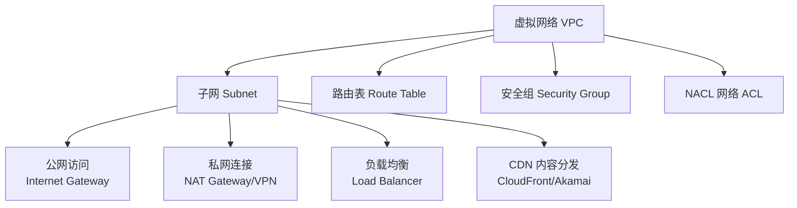
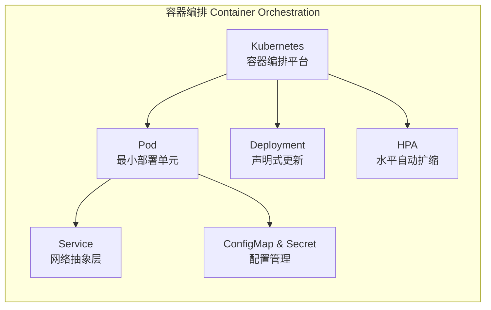

---
aliases: [CloudServices, CloudServiceModels]
tags: ['05_ComputerScience', 'CloudComputing']
created: 2026-05-17
updated: 2026-05-17
---

# 云服务 Cloud Services

## 服务模型详解

### 基础设施即服务 IaaS

IaaS（Infrastructure as a Service）提供虚拟化的计算、存储和网络资源。用户拥有对操作系统、存储和应用程序的完全控制权。

#### 计算服务

| 服务类型 | 描述 | AWS 产品 | Azure 产品 | GCP 产品 |
|---------|------|---------|-----------|---------|
| 虚拟机 | 可配置的虚拟服务器 | EC2 | Azure VM | Compute Engine |
| 预留实例 | 预付费获得折扣 | Reserved Instances | Reserved VM Instances | Committed Use Discounts |
| 竞价实例 | 利用空闲容量，低成本 | Spot Instances | Spot VMs | Preemptible VMs |
| 裸金属 | 不经过虚拟化的物理机 | Bare Metal | Azure VMware Solution | Bare Metal Solution |
| GPU 实例 | 图形处理和高性能计算 | P4/P100/A100 | NC/ND 系列 | A2/T4/L4 |

#### 存储服务

| 存储类型 | 特点 | AWS | Azure | GCP |
|---------|------|-----|-------|-----|
| 对象存储 | 无限扩展，HTTP 访问 | S3 | Blob Storage | Cloud Storage |
| 块存储 | 低延迟，挂载到虚拟机 | EBS | Managed Disks | Persistent Disk |
| 文件存储 | 共享文件系统 | EFS | Azure Files | Filestore |
| 归档存储 | 低成本冷存储 | S3 Glacier | Archive Storage | Archive Storage |
| 缓存存储 | 超低延迟内存缓存 | ElastiCache | Azure Cache for Redis | Memorystore |

#### 网络服务

### 平台即服务 PaaS

PaaS 提供托管式运行时环境，免除开发者管理底层基础设施的负担。

| 服务类别 | AWS | Azure | GCP |
|---------|-----|-------|-----|
| 容器编排 | ECS/EKS | AKS | GKE |
| 无服务器计算 | Lambda | Azure Functions | Cloud Functions |
| 托管数据库 | RDS, Aurora | Azure SQL | Cloud SQL, Spanner |
| 消息队列 | SQS | Service Bus | Pub/Sub |
| 应用托管 | Elastic Beanstalk | App Service | App Engine |
| API 管理 | API Gateway | API Management | Apigee |
| 大数据 | EMR | HDInsight | Dataproc |

### 软件即服务 SaaS

SaaS 提供开箱即用的完整应用程序。典型示例包括 Google Workspace（生产力套件）、Office 365（企业办公）、Salesforce（客户关系管理）、Slack（团队协作）和 Zoom（视频会议）。

SaaS 的核心价值在于零运维、快速部署和按需付费模式，但数据安全性和厂商锁定是需要重点评估的风险。

## 无服务器计算 Serverless

### 函数即服务 FaaS

函数即服务（Function as a Service）允许开发者以函数粒度部署代码，平台自动处理伸缩和计费。

$$ \text{FaaS Billing} = \text{Invocations} \times \text{Cost}_{\text{invocation}} + \text{Execution Time} \times \text{Memory} \times \text{Cost}_{\text{GB-second}} $$

### Serverless 架构优势

- **零服务器管理**：完全由云提供商管理
- **自动扩缩容**：从零到数千并发，无需人工介入
- **按需付费**：只在函数执行时计费
- **事件驱动**：与生态系统事件（HTTP 请求、文件上传、消息队列）紧密集成

## 容器化服务 Containers

容器（Container）将应用及其依赖打包为一个独立单元，保证环境一致性。

## 定价模型

### 按需定价 (On-Demand)

按实际使用量计费，无预付承诺，按小时或秒计费。适合短期、不可预测的工作负载。

### 预留实例 (Reserved Instances)

预付 1 至 3 年使用承诺，获得显著折扣（通常 30%~70%）。适合稳定的生产环境负载。

### 竞价实例 (Spot/Preemptible)

利用云提供商闲置容量，折扣可达 90%。实例可能随时被回收，适合容错性强的工作负载。

### 节省计划 (Savings Plans)

承诺固定使用量（以美元/小时计），覆盖多种计算服务。灵活性优于传统预留实例。

## 成本优化策略

| 策略 | 做法 | 节省比例 |
|------|------|---------|
| 合理选择实例大小 | 使用 Rightsizing 工具分析 | 20%~40% |
| 使用 Spot 实例 | 非关键任务使用竞价实例 | 50%~90% |
| 预留容量 | 稳定负载使用预留实例 | 30%~70% |
| 自动伸缩 | 根据负载动态调整资源 | 20%~50% |
| 分层存储 | 冷数据自动迁移至低成本存储 | 40%~60% |
| 删除闲置资源 | 关闭未使用的实例和卷 | 10%~30% |

## 云服务选型决策

选择云服务时需综合考虑以下因素：
- 工作负载特性（CPU 密集、内存密集、I/O 密集）
- 数据合规要求（数据驻留、行业认证）
- 团队技术栈（语言、框架、平台偏好）
- 成本预算（初始投入和持续运营成本）
- 迁移路径（逐步迁移、重新架构、替换）
- 生态兼容性（第三方工具和集成方案）

## 多云管理 Multi-Cloud Management

多云策略使用多个云提供商的服务来避免供应商锁定并优化成本。多云管理面临跨云网络互通、统一身份管理、成本聚合分析和运维工具差异等挑战。

### 多云管理工具

| 类别 | 工具 | 功能 |
|------|------|------|
| 基础设施编排 | Terraform, Pulumi | 跨云资源声明式管理 |
| 成本管理 | CloudHealth, Spot by NetApp | 跨云成本可视化与优化 |
| 安全合规 | Prisma Cloud, Dome9 | 跨云安全策略统一管理 |
| 监控告警 | Datadog, Grafana | 统一监控和告警聚合 |

### 云原生服务

云原生（Cloud Native）是在云环境中构建和运行应用的方法论，充分利用云的弹性、分布式和按需特性。云原生计算基金会（CNCF）定义了云原生的技术生态。

云原生应用通常基于以下技术栈构建：
- **容器化**：Docker 打包应用和依赖
- **服务网格**：Istio, Linkerd 管理服务间通信
- **声明式 API**：Kubernetes CRD 扩展平台能力
- **不可变基础设施**：每次部署创建全新环境

## 边缘计算 Edge Computing

边缘计算将数据处理和计算能力从中心云扩展到网络边缘，靠近数据源。边缘计算与云服务形成互补关系。

| 维度 | 中心云 | 边缘计算 |
|------|-------|---------|
| 延迟 | 几十毫秒 | 毫秒级 |
| 带宽 | 高 | 低（本地预处理） |
| 位置 | 集中式数据中心 | 靠近终端设备 |
| 典型场景 | 大数据分析 | IoT、自动驾驶 |

## 服务等级协议 SLA

SLA（Service Level Agreement）是云提供商承诺的服务可用性标准。不同服务有不同 SLA 承诺：

- 计算服务（EC2/VM）：99.9% 单实例，99.99% 多可用区
- 存储服务（S3/Blob）：99.99%（标准），99.999999999%（持久性）
- 数据库服务（RDS/Azure SQL）：99.95% 单实例，99.99% 多可用区

SLA 补偿通常以服务额度（Service Credit）形式发放，不提供现金退款。了解 SLA 条款对制定可靠性策略至关重要。

## 灾难恢复即服务 DRaaS

灾难恢复即服务（Disaster Recovery as a Service）是云服务商提供的托管灾难恢复解决方案。用户将生产环境复制到云中，在灾难发生时快速恢复。

DRaaS 的核心指标包括 RPO（Recovery Point Objective）和 RTO（Recovery Time Objective）。云端的弹性资源使 DR 成本相比传统自建方案显著降低。

## 云数据库服务

云数据库是数据库即服务（DBaaS）的体现，消除了硬件管理、补丁更新和备份等运维负担。

### 关系型云数据库

| 服务 | AWS | Azure | GCP | 特点 |
|------|-----|-------|-----|------|
| 托管 MySQL | RDS MySQL | Azure Database for MySQL | Cloud SQL MySQL | 兼容开源协议 |
| 托管 PostgreSQL | RDS PostgreSQL, Aurora | Azure Database for PostgreSQL | Cloud SQL PostgreSQL, AlloyDB | 高级功能丰富 |
| 托管 SQL Server | RDS SQL Server | Azure SQL Database | Cloud SQL SQL Server | Windows 生态 |
| 分布式 SQL | Aurora | Azure SQL Hyperscale | Cloud Spanner | 全球横向扩展 |

### NoSQL 云数据库

| 数据库类型 | AWS | Azure | GCP | 主要特性 |
|-----------|-----|-------|-----|---------|
| 键值存储 | DynamoDB | Cosmos DB | Bigtable | 自动扩缩容 |
| 文档数据库 | DocumentDB | Cosmos DB | Firestore | JSON 原生支持 |
| 内存缓存 | ElastiCache Redis | Cache for Redis | Memorystore Redis | 微秒级延迟 |
| 图数据库 | Neptune | Cosmos DB Gremlin | — | 关系查询优化 |

## 内容分发网络 CDN

CDN（Content Delivery Network）将静态内容缓存到全球边缘节点，降低用户获取内容的延迟。

CDN 的核心流程：用户请求 → DNS 解析到最近边缘节点 → 边缘节点缓存命中返回内容 / 缓存未命中回源拉取。

## 云服务监控与可观测性

可观测性（Observability）通过三大支柱实现：

- **指标 (Metrics)**：CPU 使用率、内存、请求量等数值时间序列数据
- **日志 (Logging)**：应用和系统运行时的结构化/非结构化记录
- **追踪 (Tracing)**：追踪请求在分布式系统中的完整调用链

## 相关条目

- [[CloudComputing]]
- [[CloudArchitecture]]
- [[CloudSecurity]]
- [[Serverless]]
- [[Containerization]]

