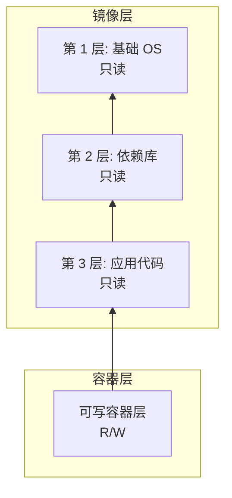
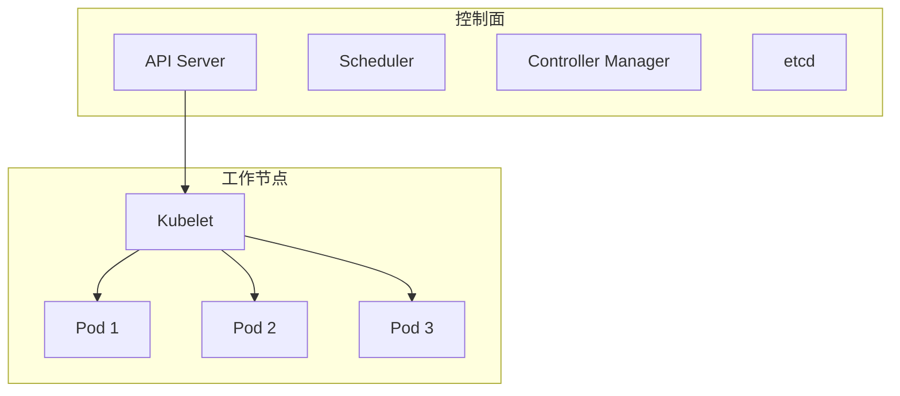
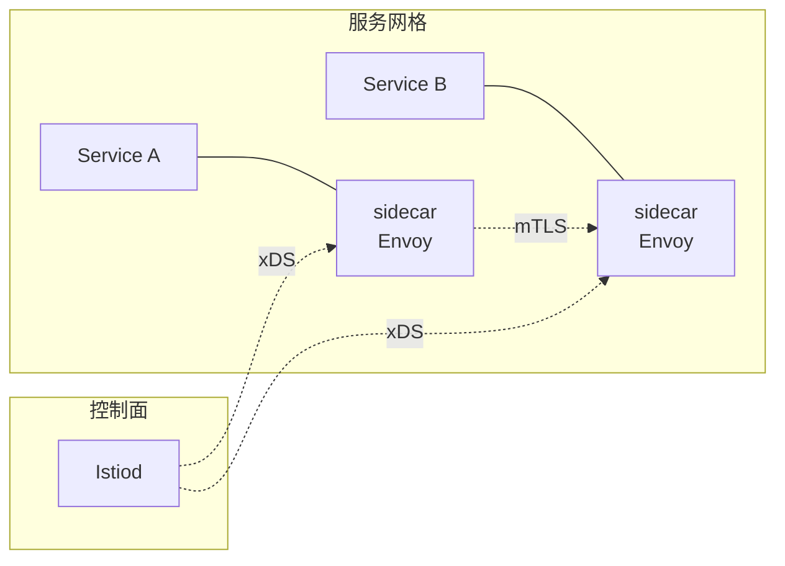

---
aliases: [Containerization]
tags: ['CloudComputing', 'Containerization']
created: 2026-05-17
updated: 2026-05-17
---

# 容器化 (Containerization)

> 容器化是一种轻量级的虚拟化技术，将应用及其依赖打包在一起，确保在任何环境中一致运行。

## 容器 vs 虚拟机

| 特性 | 容器 | 虚拟机 |
|------|------|--------|
| 启动时间 | 秒级 | 分钟级 |
| 资源开销 | 低（共享宿主机内核）| 高（每个 VM 有完整 OS）|
| 镜像大小 | MB 级 | GB 级 |
| 隔离性 | 进程级隔离 | 硬件级隔离 |

## 一、Docker

### 1.1 核心概念

- **镜像 (Image)**：只读模板，包含应用和依赖
- **容器 (Container)**：镜像的运行实例
- **Dockerfile**：描述镜像构建过程的脚本
- **Docker Compose**：多容器应用编排
- **Docker Hub**：公共镜像仓库

### 1.2 Dockerfile 示例

```dockerfile
FROM node:18-alpine AS builder
WORKDIR /app
COPY package*.json ./
RUN npm ci --only=production
COPY . .
RUN npm run build

FROM nginx:alpine
COPY --from=builder /app/dist /usr/share/nginx/html
EXPOSE 80
CMD ["nginx", "-g", "daemon off;"]
```

### 1.3 多阶段构建 (Multi-stage Build)

多阶段构建可显著减小最终镜像大小。上面的 Dockerfile 分两个阶段：
- 构建阶段：使用完整的 Node.js 环境编译和打包
- 运行阶段：仅将构建产物复制到轻量级 nginx 镜像

最终镜像大小从 1GB+ 降至约 50MB。

### 1.4 Docker Compose

```yaml
version: "3.8"
services:
  web:
    build: .
    ports:
      - "80:80"
    depends_on:
      - db
  db:
    image: postgres:15-alpine
    environment:
      POSTGRES_PASSWORD: ${DB_PASSWORD}
    volumes:
      - pgdata:/var/lib/postgresql/data
volumes:
  pgdata:
```

## 二、容器运行时机制

### 2.1 命名空间 (Namespaces)

Linux 命名空间提供资源隔离：

| 命名空间 | 隔离内容 | 作用 |
|----------|----------|------|
| PID | 进程 ID | 容器内只能看到自己的进程 |
| Network | 网络设备、IP、端口 | 容器有独立网络栈 |
| Mount | 挂载点 | 容器独立文件系统视图 |
| UTS | 主机名和域名 | 容器可设置独立主机名 |
| User | 用户 ID | 容器内 root ≠ 宿主机 root |
| IPC | 进程间通信 | 隔离 System V IPC 和 POSIX 消息队列 |

### 2.2 控制组 (Cgroups)

Cgroups 限制和监控资源使用：

```
CPU 限制: --cpus=1.5    (使用 1.5 核)
内存限制: --memory=512m (最多 512MB)
磁盘 I/O: --device-read-bps, --device-write-bps
网络带宽: tc (traffic control)
```

### 2.3 联合文件系统 (Union Filesystem)

容器镜像分层结构：



写时复制 (Copy-on-Write)：修改文件时，将文件从只读层复制到可写层再修改，镜像本身不变。

## 三、Kubernetes (K8s)

### 3.1 核心资源



| 资源 | 说明 | YAML 关键字段 |
|------|------|---------------|
| **Pod** | 最小部署单元，包含一个或多个容器 | apiVersion, kind: Pod, spec.containers |
| **Service** | 提供稳定的网络端点 | spec.selector, spec.ports |
| **Deployment** | 声明式更新和回滚 | spec.replicas, spec.strategy |
| **ConfigMap** | 非敏感配置管理 | data (键值对) |
| **Secret** | 敏感信息管理 | data (base64 编码) |
| **Ingress** | 外部流量路由到集群内部 | spec.rules, spec.tls |

### 3.2 Deployment 示例

```yaml
apiVersion: apps/v1
kind: Deployment
metadata:
  name: nginx-deployment
spec:
  replicas: 3
  selector:
    matchLabels:
      app: nginx
  template:
    metadata:
      labels:
        app: nginx
    spec:
      containers:
      - name: nginx
        image: nginx:1.25
        ports:
        - containerPort: 80
        resources:
          requests:
            memory: "64Mi"
            cpu: "250m"
          limits:
            memory: "128Mi"
            cpu: "500m"
```

### 3.3 K8s 网络模型

- 每个 Pod 有独立 IP（扁平网络，无需 NAT）
- 容器间通信：localhost + 端口
- Pod 间通信：直接通过 Pod IP
- Service 提供稳定虚拟 IP (ClusterIP)

```
Pod 网络插件:
  Calico:   基于 BGP，网络策略强大
  Flannel:  简单 overlay 网络 (VXLAN)
  Cilium:   基于 eBPF，高性能
  Weave:    mesh 网络，自动发现
```

## 四、编排工具对比

| 工具 | 特点 | 适用场景 |
|------|------|---------|
| Kubernetes | 功能强大，生态系统丰富 | 大规模生产环境 |
| Docker Swarm | 简单易用，与 Docker 集成 | 中小规模部署 |
| Nomad | 轻量级，支持容器和非容器 | 多类型工作负载 |

## 五、服务网格 (Service Mesh)



服务网格将通信逻辑从应用代码中剥离，由 sidecar 代理处理：
- 流量管理：灰度发布、金丝雀部署
- 安全性：mTLS、RBAC
- 可观测性：指标、日志、追踪

| 实现 | 特点 | 控制面 |
|------|------|--------|
| Istio | 功能丰富，社区活跃 | Istiod (Pilot + Mixer + Citadel) |
| Linkerd | 轻量，Kubernetes 原生 | control-plane |
| Consul Connect | 与 Consul 集成 | Consul Server |

## 六、容器安全最佳实践

| 实践 | 说明 | 风险等级 |
|------|------|----------|
| 使用非 root 用户运行 | USER 指令指定普通用户 | 高 |
| 镜像漏洞扫描 | Trivy, Clair, Snyk | 高 |
| 最小化基础镜像 | Alpine, distroless | 中 |
| 只读根文件系统 | readOnlyRootFilesystem: true | 中 |
| 资源限制 | requests/limits 防止 DoS | 中 |
| 镜像签名验证 | Docker Content Trust, cosign | 中 |
| 禁止特权容器 | securityContext.privileged: false | 高 |
| 网络策略 | NetworkPolicy 限制流量 | 中 |
| Seccomp/AppArmor | 限制系统调用 | 低 |

```dockerfile
# 安全 Dockerfile 示例
FROM golang:1.21-alpine AS builder
RUN adduser -D appuser
COPY . .
RUN CGO_ENABLED=0 go build -o /app/server

FROM scratch
COPY --from=builder /etc/passwd /etc/passwd
COPY --from=builder /app/server /server
USER appuser
EXPOSE 8080
CMD ["/server"]
```

## 七、CI/CD 流水线

```yaml
# GitHub Actions 示例
name: Build and Deploy
on:
  push:
    branches: [main]
jobs:
  build:
    runs-on: ubuntu-latest
    steps:
    - uses: actions/checkout@v4
    - name: Build and push
      uses: docker/build-push-action@v5
      with:
        push: true
        tags: registry.example.com/app:latest
    - name: Deploy to K8s
      run: |
        kubectl set image deployment/app \
          app=registry.example.com/app:latest
```

## 相关条目
- [[Kubernetes]]
- [[05_ComputerScience/SoftwareEngineering/Microservices|Microservices]]
- [[CI_CD]]
- [[Virtualization]]
- [[05_ComputerScience/SoftwareEngineering/DevOpsAndCICD/DevOps|DevOps]]
- [[INDEX|当前目录索引]]


