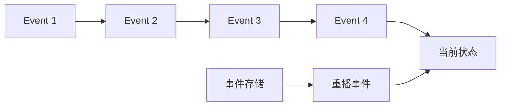
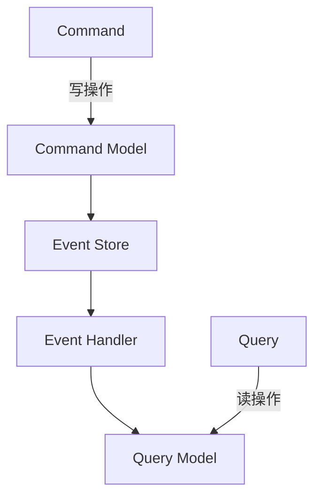

# 事件驱动架构 (Event-Driven Architecture)

## 一、概述

事件驱动架构（EDA）是一种软件设计模式，其中组件通过生产和消费事件进行通信。事件是系统中发生的状态变化通知。

### 1.1 核心概念

| 概念 | 描述 |
|------|------|
| **事件（Event）** | 系统中发生的动作或状态变化 |
| **事件生产者** | 产生事件的组件 |
| **事件消费者** | 监听并处理事件的组件 |
| **事件通道** | 传输事件的中间件（消息队列） |
| **事件存储** | 持久化事件的存储 |

### 1.2 事件类型

| 类型 | 描述 | 示例 |
|------|------|------|
| **领域事件** | 业务领域的状态变化 | 订单已创建、用户已注册 |
| **集成事件** | 跨系统通信的事件 | 支付完成通知 |
| **命令事件** | 触发动作的事件 | 发送邮件、更新库存 |

---

## 二、事件溯源 (Event Sourcing)

### 2.1 核心思想

事件溯源不是存储实体的当前状态，而是存储所有导致当前状态的事件序列。



### 2.2 事件溯源实现

```python
from dataclasses import dataclass
from typing import List, Dict, Any
from datetime import datetime
import json

# 事件基类
@dataclass
class Event:
    aggregate_id: str
    event_type: str
    data: Dict[str, Any]
    timestamp: datetime
    version: int

# 聚合根基类
class AggregateRoot:
    def __init__(self, aggregate_id: str):
        self.aggregate_id = aggregate_id
        self.version = 0
        self.pending_events: List[Event] = []
    
    def apply_event(self, event: Event):
        """应用事件到聚合"""
        self._apply(event)
        self.version = event.version
    
    def raise_event(self, event_type: str, data: Dict[str, Any]):
        """产生新事件"""
        event = Event(
            aggregate_id=self.aggregate_id,
            event_type=event_type,
            data=data,
            timestamp=datetime.now(),
            version=self.version + 1
        )
        self.pending_events.append(event)
        self.apply_event(event)
    
    def _apply(self, event: Event):
        """子类实现具体的事件应用逻辑"""
        raise NotImplementedError

# 订单聚合
class Order(AggregateRoot):
    def __init__(self, order_id: str):
        super().__init__(order_id)
        self.status = "draft"
        self.items = []
        self.total = 0
    
    def add_item(self, product_id: str, quantity: int, price: float):
        self.raise_event("ItemAdded", {
            "product_id": product_id,
            "quantity": quantity,
            "price": price
        })
    
    def confirm(self):
        if not self.items:
            raise ValueError("Cannot confirm empty order")
        self.raise_event("OrderConfirmed", {
            "total": self.total
        })
    
    def _apply(self, event: Event):
        if event.event_type == "ItemAdded":
            self.items.append(event.data)
            self.total += event.data["quantity"] * event.data["price"]
        elif event.event_type == "OrderConfirmed":
            self.status = "confirmed"

# 事件存储
class EventStore:
    def __init__(self):
        self.events: Dict[str, List[Event]] = {}
    
    def append(self, event: Event):
        if event.aggregate_id not in self.events:
            self.events[event.aggregate_id] = []
        self.events[event.aggregate_id].append(event)
    
    def get_events(self, aggregate_id: str) -> List[Event]:
        return self.events.get(aggregate_id, [])
    
    def get_all_events(self) -> List[Event]:
        all_events = []
        for events in self.events.values():
            all_events.extend(events)
        return sorted(all_events, key=lambda e: e.timestamp)

# 事件重播
def rebuild_aggregate(aggregate_id: str, event_store: EventStore) -> Order:
    order = Order(aggregate_id)
    events = event_store.get_events(aggregate_id)
    for event in events:
        order.apply_event(event)
    return order
```

### 2.3 事件存储

```python
# 使用数据库存储事件
import sqlite3

class SQLEventStore:
    def __init__(self, db_path: str):
        self.conn = sqlite3.connect(db_path)
        self._create_table()
    
    def _create_table(self):
        self.conn.execute("""
            CREATE TABLE IF NOT EXISTS events (
                id INTEGER PRIMARY KEY AUTOINCREMENT,
                aggregate_id TEXT NOT NULL,
                event_type TEXT NOT NULL,
                data TEXT NOT NULL,
                timestamp TEXT NOT NULL,
                version INTEGER NOT NULL
            )
        """)
        self.conn.execute("""
            CREATE INDEX IF NOT EXISTS idx_aggregate_id 
            ON events(aggregate_id)
        """)
    
    def append(self, event: Event):
        self.conn.execute(
            "INSERT INTO events (aggregate_id, event_type, data, timestamp, version) VALUES (?, ?, ?, ?, ?)",
            (event.aggregate_id, event.event_type, json.dumps(event.data), event.timestamp.isoformat(), event.version)
        )
        self.conn.commit()
    
    def get_events(self, aggregate_id: str) -> List[Event]:
        cursor = self.conn.execute(
            "SELECT aggregate_id, event_type, data, timestamp, version FROM events WHERE aggregate_id = ? ORDER BY version",
            (aggregate_id,)
        )
        events = []
        for row in cursor:
            events.append(Event(
                aggregate_id=row[0],
                event_type=row[1],
                data=json.loads(row[2]),
                timestamp=datetime.fromisoformat(row[3]),
                version=row[4]
            ))
        return events
```

---

## 三、CQRS (Command Query Responsibility Segregation)

### 3.1 核心思想

CQRS 将读写操作分离到不同的模型中：



### 3.2 CQRS 实现

```python
from abc import ABC, abstractmethod

# 命令
class Command(ABC):
    pass

@dataclass
class CreateOrderCommand(Command):
    order_id: str
    customer_id: str

@dataclass
class AddItemCommand(Command):
    order_id: str
    product_id: str
    quantity: int
    price: float

# 查询
class Query(ABC):
    pass

@dataclass
class GetOrderQuery(Query):
    order_id: str

# 命令处理器
class CommandHandler(ABC):
    @abstractmethod
    def handle(self, command: Command):
        pass

class OrderCommandHandler(CommandHandler):
    def __init__(self, event_store: EventStore):
        self.event_store = event_store
    
    def handle(self, command: Command):
        if isinstance(command, CreateOrderCommand):
            order = Order(command.order_id)
            order.raise_event("OrderCreated", {"customer_id": command.customer_id})
            self._save_events(order)
        elif isinstance(command, AddItemCommand):
            order = rebuild_aggregate(command.order_id, self.event_store)
            order.add_item(command.product_id, command.quantity, command.price)
            self._save_events(order)
    
    def _save_events(self, order: Order):
        for event in order.pending_events:
            self.event_store.append(event)
        order.pending_events.clear()

# 查询处理器
class QueryHandler(ABC):
    @abstractmethod
    def handle(self, query: Query):
        pass

class OrderQueryHandler(QueryHandler):
    def __init__(self, read_model: 'OrderReadModel'):
        self.read_model = read_model
    
    def handle(self, query: Query):
        if isinstance(query, GetOrderQuery):
            return self.read_model.get_order(query.order_id)

# 读模型
class OrderReadModel:
    def __init__(self):
        self.orders = {}
    
    def update(self, event: Event):
        if event.event_type == "OrderCreated":
            self.orders[event.aggregate_id] = {
                "order_id": event.aggregate_id,
                "status": "draft",
                "items": [],
                "total": 0
            }
        elif event.event_type == "ItemAdded":
            order = self.orders[event.aggregate_id]
            order["items"].append(event.data)
            order["total"] += event.data["quantity"] * event.data["price"]
        elif event.event_type == "OrderConfirmed":
            self.orders[event.aggregate_id]["status"] = "confirmed"
    
    def get_order(self, order_id: str):
        return self.orders.get(order_id)

# 事件处理器（投影）
class OrderProjection:
    def __init__(self, read_model: OrderReadModel):
        self.read_model = read_model
    
    def handle_event(self, event: Event):
        self.read_model.update(event)
```

---

## 四、Saga 模式

### 4.1 编排式 Saga (Orchestration)

```python
class OrderSaga:
    def __init__(self, order_service, payment_service, inventory_service):
        self.order_service = order_service
        self.payment_service = payment_service
        self.inventory_service = inventory_service
    
    async def execute(self, order_id: str, items: list, total: float):
        try:
            # 步骤1：创建订单
            await self.order_service.create_order(order_id, items)
            
            # 步骤2：预留库存
            await self.inventory_service.reserve_items(items)
            
            # 步骤3：处理支付
            await self.payment_service.process_payment(order_id, total)
            
            # 步骤4：确认订单
            await self.order_service.confirm_order(order_id)
            
        except Exception as e:
            # 补偿操作
            await self.compensate(order_id, items)
            raise
    
    async def compensate(self, order_id: str, items: list):
        # 逆序执行补偿
        try:
            await self.payment_service.refund(order_id)
        except:
            pass
        
        try:
            await self.inventory_service.release_items(items)
        except:
            pass
        
        try:
            await self.order_service.cancel_order(order_id)
        except:
            pass
```

### 4.2 编舞式 Saga (Choreography)

```python
# 每个服务监听事件并发布新事件
class OrderService:
    def __init__(self, event_bus):
        self.event_bus = event_bus
        self.event_bus.subscribe("PaymentCompleted", self.on_payment_completed)
        self.event_bus.subscribe("InventoryReserved", self.on_inventory_reserved)
    
    async def create_order(self, order_id: str, items: list):
        # 创建订单逻辑
        await self.event_bus.publish("OrderCreated", {
            "order_id": order_id,
            "items": items
        })
    
    async def on_payment_completed(self, event):
        # 支付完成，确认订单
        await self.event_bus.publish("OrderConfirmed", event.data)
    
    async def on_inventory_reserved(self, event):
        # 库存预留成功
        pass

class PaymentService:
    def __init__(self, event_bus):
        self.event_bus = event_bus
        self.event_bus.subscribe("OrderCreated", self.on_order_created)
    
    async def on_order_created(self, event):
        # 处理支付
        await self.event_bus.publish("PaymentCompleted", event.data)

class InventoryService:
    def __init__(self, event_bus):
        self.event_bus = event_bus
        self.event_bus.subscribe("OrderCreated", self.on_order_created)
    
    async def on_order_created(self, event):
        # 预留库存
        await self.event_bus.publish("InventoryReserved", event.data)
```

---

## 五、事件总线

### 5.1 事件总线实现

```python
from typing import Callable, Dict, List
import asyncio

class EventBus:
    def __init__(self):
        self._handlers: Dict[str, List[Callable]] = {}
    
    def subscribe(self, event_type: str, handler: Callable):
        if event_type not in self._handlers:
            self._handlers[event_type] = []
        self._handlers[event_type].append(handler)
    
    def unsubscribe(self, event_type: str, handler: Callable):
        if event_type in self._handlers:
            self._handlers[event_type].remove(handler)
    
    async def publish(self, event_type: str, data: dict):
        if event_type in self._handlers:
            tasks = []
            for handler in self._handlers[event_type]:
                if asyncio.iscoroutinefunction(handler):
                    tasks.append(handler(data))
                else:
                    handler(data)
            
            if tasks:
                await asyncio.gather(*tasks)

# 使用
event_bus = EventBus()

async def handle_order_created(data):
    print(f"Order created: {data}")

event_bus.subscribe("OrderCreated", handle_order_created)
await event_bus.publish("OrderCreated", {"order_id": "123"})
```

---

## 六、事件驱动架构最佳实践

### 6.1 事件设计原则

| 原则 | 描述 |
|------|------|
| **不可变性** | 事件一旦发布不能修改 |
| **自描述性** | 事件包含足够的上下文信息 |
| **版本化** | 事件结构需要版本管理 |
| **幂等性** | 事件处理应具有幂等性 |

### 6.2 事件版本管理

```python
class EventMigrator:
    def __init__(self):
        self.migrations = {}
    
    def register_migration(self, from_version: int, to_version: int, migration_func: Callable):
        self.migrations[(from_version, to_version)] = migration_func
    
    def migrate(self, event: Event, target_version: int) -> Event:
        current_version = event.version
        
        while current_version < target_version:
            migration_key = (current_version, current_version + 1)
            if migration_key in self.migrations:
                event = self.migrations[migration_key](event)
                current_version += 1
            else:
                break
        
        return event
```

---

## 相关条目

- [[MessageQueues]]
- [[DistributedStorage]]
- [[CloudComputingAndDistributedSystems]]

## 参考资源

1. Martin Fowler. "Event Sourcing." martinfowler.com
2. Vaughn Vernon. "Implementing Domain-Driven Design." 2013
3. Chris Richardson. "Microservices Patterns." 2018
