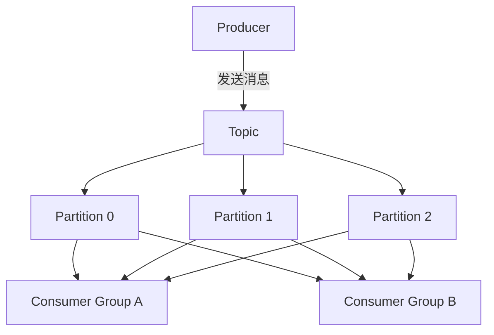
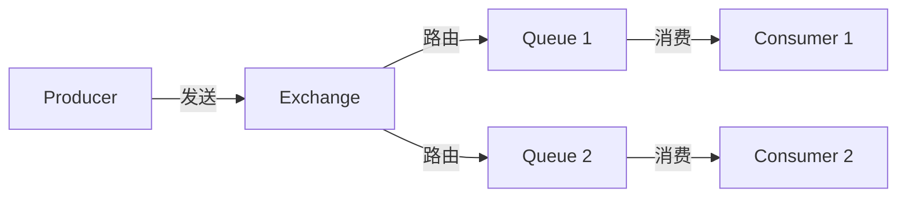

# 消息队列 (Message Queues)

## 一、概述

消息队列是分布式系统中实现异步通信、解耦和流量削峰的核心组件。生产者将消息发送到队列，消费者从队列中获取消息进行处理。

### 1.1 消息队列的作用

| 作用 | 描述 | 场景 |
|------|------|------|
| **异步处理** | 将同步操作转为异步 | 发送邮件、生成报告 |
| **系统解耦** | 生产者和消费者独立 | 微服务通信 |
| **流量削峰** | 平滑突发流量 | 秒杀活动 |
| **广播通知** | 一对多消息分发 | 事件通知 |
| **可靠投递** | 消息持久化保证 | 订单处理 |

### 1.2 主流消息队列对比

| 特性 | Kafka | RabbitMQ | RocketMQ | Pulsar |
|------|-------|----------|----------|--------|
| 开发语言 | Scala/Java | Erlang | Java | Java |
| 吞吐量 | 百万级/s | 万级/s | 十万级/s | 百万级/s |
| 延迟 | ms级 | μs级 | ms级 | ms级 |
| 消息可靠性 | 高 | 高 | 高 | 高 |
| 消息顺序 | 分区有序 | 队列有序 | 队列有序 | 分区有序 |
| 事务消息 | 支持 | 不支持 | 支持 | 支持 |
| 消息回溯 | 支持 | 不支持 | 支持 | 支持 |
| 适用场景 | 日志、流处理 | 业务消息 | 电商、金融 | 多租户 |

---

## 二、Kafka

### 2.1 核心概念



| 概念 | 描述 |
|------|------|
| **Topic** | 消息的逻辑分类 |
| **Partition** | Topic 的物理分区，保证分区内有序 |
| **Broker** | Kafka 服务器节点 |
| **Producer** | 消息生产者 |
| **Consumer** | 消息消费者 |
| **Consumer Group** | 消费者组，组内负载均衡 |
| **Offset** | 消费位移，记录消费进度 |
| **Replication** | 副本机制，保证高可用 |

### 2.2 Kafka 架构

```python
# Kafka 生产者配置
from kafka import KafkaProducer

producer = KafkaProducer(
    bootstrap_servers=['broker1:9092', 'broker2:9092'],
    key_serializer=lambda k: k.encode('utf-8'),
    value_serializer=lambda v: v.encode('utf-8'),
    acks='all',  # 等待所有副本确认
    retries=3,
    batch_size=16384,
    linger_ms=10
)

# 发送消息
producer.send('my-topic', key='key1', value='message1')
producer.flush()
```

```python
# Kafka 消费者配置
from kafka import KafkaConsumer

consumer = KafkaConsumer(
    'my-topic',
    bootstrap_servers=['broker1:9092', 'broker2:9092'],
    group_id='my-group',
    auto_offset_reset='earliest',  # 从最早消息开始
    enable_auto_commit=True,
    auto_commit_interval_ms=1000
)

# 消费消息
for message in consumer:
    print(f"Topic: {message.topic}")
    print(f"Partition: {message.partition}")
    print(f"Offset: {message.offset}")
    print(f"Key: {message.key}")
    print(f"Value: {message.value}")
```

### 2.3 Kafka 生产者配置

```python
producer_config = {
    # 基础配置
    'bootstrap_servers': ['broker1:9092', 'broker2:9092'],
    
    # 序列化
    'key_serializer': lambda k: k.encode('utf-8'),
    'value_serializer': lambda v: v.encode('utf-8'),
    
    # 可靠性配置
    'acks': 'all',  # 0, 1, all
    'retries': 3,
    'retry_backoff_ms': 100,
    
    # 性能配置
    'batch_size': 16384,
    'linger_ms': 10,
    'buffer_memory': 33554432,
    'compression_type': 'gzip',  # none, gzip, snappy, lz4, zstd
    
    # 幂等性
    'enable_idempotence': True,
    'max_in_flight_requests_per_connection': 5,
    
    # 事务
    'transactional_id': 'my-transactional-id'
}
```

### 2.4 Kafka 消费者配置

```python
consumer_config = {
    # 基础配置
    'bootstrap_servers': ['broker1:9092', 'broker2:9092'],
    'group_id': 'my-group',
    
    # 消费位移
    'auto_offset_reset': 'earliest',  # earliest, latest, none
    'enable_auto_commit': True,
    'auto_commit_interval_ms': 1000,
    
    # 反序列化
    'key_deserializer': lambda k: k.decode('utf-8'),
    'value_deserializer': lambda v: v.decode('utf-8'),
    
    # 性能配置
    'fetch_min_bytes': 1,
    'fetch_max_wait_ms': 500,
    'max_partition_fetch_bytes': 1048576,
    
    # 会话配置
    'session_timeout_ms': 30000,
    'heartbeat_interval_ms': 10000
}
```

### 2.5 Kafka 分区策略

```python
# 自定义分区器
class CustomPartitioner:
    def __init__(self, num_partitions):
        self.num_partitions = num_partitions
    
    def __call__(self, key_bytes, all_partitions, available_partitions):
        if key_bytes is None:
            # 无 key 时轮询
            return random.choice(available_partitions)
        
        # 基于 key 的 hash
        key_hash = int.from_bytes(key_bytes, byteorder='big')
        return key_hash % self.num_partitions

# 使用
producer = KafkaProducer(
    partitioner=CustomPartitioner(num_partitions=3)
)
```

### 2.6 Kafka 消费者组

```python
# 消费者组内的负载均衡
# Consumer Group A:
#   Consumer 1: Partition 0, Partition 1
#   Consumer 2: Partition 2, Partition 3

# Consumer Group B:
#   Consumer 1: Partition 0, Partition 2
#   Consumer 2: Partition 1, Partition 3

# 重平衡（Rebalance）
# 当消费者加入或离开组时，Kafka 自动重新分配分区
```

### 2.7 Kafka 可靠性保证

```python
# 生产者：acks=all + 幂等性
producer = KafkaProducer(
    acks='all',
    enable_idempotence=True,
    max_in_flight_requests_per_connection=5
)

# 消费者：手动提交 offset
consumer = KafkaConsumer(
    enable_auto_commit=False
)

for message in consumer:
    # 处理消息
    process(message)
    
    # 手动提交
    consumer.commit()
```

### 2.8 Kafka Streams

```python
# Kafka Streams 示例（Java）
# 实时计算每个用户的订单数量

KStream<String, Order> orders = builder.stream("orders");

KTable<String, Long> orderCounts = orders
    .groupBy((key, order) -> order.getUserId())
    .count();

orderCounts.toStream().to("order-counts");
```

---

## 三、RabbitMQ

### 3.1 核心概念



| 概念 | 描述 |
|------|------|
| **Producer** | 消息生产者 |
| **Exchange** | 交换机，路由消息到队列 |
| **Queue** | 消息队列 |
| **Binding** | 绑定关系，连接 Exchange 和 Queue |
| **Consumer** | 消息消费者 |
| **Virtual Host** | 虚拟主机，逻辑隔离 |

### 3.2 Exchange 类型

| 类型 | 路由规则 | 适用场景 |
|------|---------|---------|
| **Direct** | 精确匹配 routing_key | 点对点 |
| **Fanout** | 广播到所有绑定队列 | 广播 |
| **Topic** | 模式匹配 routing_key | 发布订阅 |
| **Headers** | 基于消息头匹配 | 复杂路由 |

### 3.3 RabbitMQ 基础使用

```python
import pika

# 建立连接
connection = pika.BlockingConnection(
    pika.ConnectionParameters('localhost')
)
channel = connection.channel()

# 声明队列
channel.queue_declare(queue='hello', durable=True)

# 发送消息
channel.basic_publish(
    exchange='',
    routing_key='hello',
    body='Hello World!',
    properties=pika.BasicProperties(
        delivery_mode=2,  # 消息持久化
        content_type='application/json'
    )
)

# 消费消息
def callback(ch, method, properties, body):
    print(f"Received: {body}")
    ch.basic_ack(delivery_tag=method.delivery_tag)

channel.basic_consume(
    queue='hello',
    on_message_callback=callback
)

channel.start_consuming()
```

### 3.4 RabbitMQ Exchange 使用

```python
# Direct Exchange
channel.exchange_declare(exchange='direct_logs', exchange_type='direct')

channel.basic_publish(
    exchange='direct_logs',
    routing_key='error',
    body='Error message'
)

# Topic Exchange
channel.exchange_declare(exchange='topic_logs', exchange_type='topic')

channel.basic_publish(
    exchange='topic_logs',
    routing_key='user.created',
    body='User created event'
)

# Fanout Exchange
channel.exchange_declare(exchange='fanout_logs', exchange_type='fanout')

channel.basic_publish(
    exchange='fanout_logs',
    routing_key='',
    body='Broadcast message'
)
```

### 3.5 RabbitMQ 消息确认

```python
# 生产者确认
channel.confirm_delivery()

try:
    channel.basic_publish(
        exchange='',
        routing_key='hello',
        body='Hello World!',
        properties=pika.BasicProperties(delivery_mode=2)
    )
    print("Message published")
except pika.exceptions.UnroutableError:
    print("Message could not be routed")

# 消费者确认
def callback(ch, method, properties, body):
    try:
        process_message(body)
        ch.basic_ack(delivery_tag=method.delivery_tag)
    except Exception:
        ch.basic_nack(delivery_tag=method.delivery_tag, requeue=True)

channel.basic_consume(queue='hello', on_message_callback=callback)
```

### 3.6 RabbitMQ 死信队列

```python
# 声明死信交换机
channel.exchange_declare(
    exchange='dlx',
    exchange_type='direct'
)

# 声明死信队列
channel.queue_declare(queue='dlq', durable=True)
channel.queue_bind(queue='dlq', exchange='dlx', routing_key='dlq')

# 声明主队列，配置死信
channel.queue_declare(
    queue='main_queue',
    durable=True,
    arguments={
        'x-dead-letter-exchange': 'dlx',
        'x-dead-letter-routing-key': 'dlq',
        'x-message-ttl': 60000,  # 消息 TTL
        'x-max-length': 1000  # 队列最大长度
    }
)
```

---

## 四、消息队列模式

### 4.1 点对点模式

```python
# Producer
producer.send('queue', 'message')

# Consumer
for msg in consumer.subscribe('queue'):
    process(msg)
    ack(msg)
```

### 4.2 发布订阅模式

```python
# Producer
producer.publish('topic', 'event')

# Consumer 1
for msg in consumer.subscribe('topic', group='group1'):
    process(msg)

# Consumer 2
for msg in consumer.subscribe('topic', group='group2'):
    process(msg)
```

### 4.3 请求-响应模式

```python
# Producer
response = producer.request('queue', 'request_message')

# Consumer
for msg in consumer.subscribe('queue'):
    response = process(msg)
    producer.send(msg.reply_to, response)
```

### 4.4 事务消息

```python
# Kafka 事务消息
producer.init_transactions()

try:
    producer.begin_transaction()
    
    producer.send('topic1', 'message1')
    producer.send('topic2', 'message2')
    
    producer.commit_transaction()
except Exception:
    producer.abort_transaction()
```

---

## 五、消息队列最佳实践

### 5.1 消息可靠性

| 环节 | 措施 |
|------|------|
| **生产端** | 同步发送、重试机制、事务消息 |
| **存储端** | 消息持久化、副本同步 |
| **消费端** | 手动确认、幂等消费 |

### 5.2 消息幂等性

```python
# 基于消息 ID 的幂等消费
class IdempotentConsumer:
    def __init__(self, redis_client):
        self.redis = redis_client
    
    def consume(self, message):
        message_id = message.headers['message_id']
        
        # 检查是否已消费
        if self.redis.exists(f"consumed:{message_id}"):
            print(f"Message {message_id} already consumed")
            return
        
        # 处理消息
        process(message)
        
        # 标记为已消费
        self.redis.setex(f"consumed:{message_id}", 86400, "1")
```

### 5.3 消息顺序性

```python
# Kafka：同一分区内保证顺序
# Producer：相同 key 的消息发送到同一分区
producer.send('topic', key='order_123', value='event1')
producer.send('topic', key='order_123', value='event2')

# Consumer：单线程消费同一分区
```

### 5.4 流量控制

```python
# 生产者限流
producer = KafkaProducer(
    max_block_ms=5000,  # 发送缓冲区满时阻塞时间
    buffer_memory=33554432  # 发送缓冲区大小
)

# 消费者限流
consumer = KafkaConsumer(
    max_poll_records=100,  # 每次 poll 最大记录数
    max_poll_interval_ms=300000  # poll 最大间隔
)
```

### 5.5 监控指标

| 指标 | 描述 | 告警阈值 |
|------|------|---------|
| **消息积压** | 未消费消息数 | > 10000 |
| **消费延迟** | 消费位移落后 | > 10000 |
| **生产速率** | 每秒消息数 | 根据业务 |
| **消费速率** | 每秒消费数 | 根据业务 |
| **错误率** | 消息处理失败率 | > 1% |

---

## 六、消息队列选型

### 6.1 选型指南

| 场景 | 推荐 | 原因 |
|------|------|------|
| 日志收集 | Kafka | 高吞吐、可回溯 |
| 业务消息 | RabbitMQ | 功能丰富、可靠 |
| 电商订单 | RocketMQ | 事务消息、顺序消息 |
| 流处理 | Kafka/Pulsar | 高吞吐、流式计算 |
| 微服务 | RabbitMQ/Nacos | 灵活路由、轻量级 |

### 6.2 容量规划

```python
# 容量计算公式
# 消息大小 × 每秒消息数 × 保留时间 = 存储需求

message_size_kb = 1  # 每条消息大小
messages_per_second = 10000  # 每秒消息数
retention_hours = 24  # 保留时间

storage_gb = (message_size_kb * messages_per_second * retention_hours * 3600) / (1024 * 1024)
print(f"Storage needed: {storage_gb:.2f} GB")
```

---

## 相关条目

- [[CloudComputingAndDistributedSystems]]
- [[DistributedStorage]]
- [[EventDrivenArchitecture]]

## 参考资源

1. Apache Kafka. "Documentation." kafka.apache.org
2. RabbitMQ. "Documentation." rabbitmq.com
3. Apache RocketMQ. "Documentation." rocketmq.apache.org
4. Apache Pulsar. "Documentation." pulsar.apache.org
