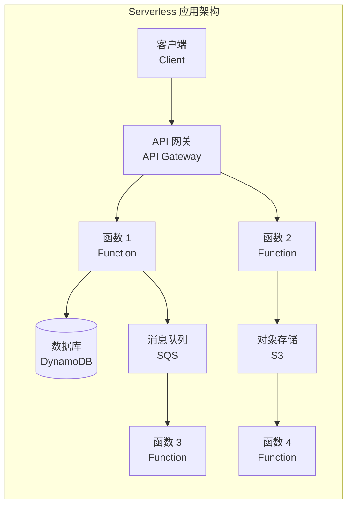
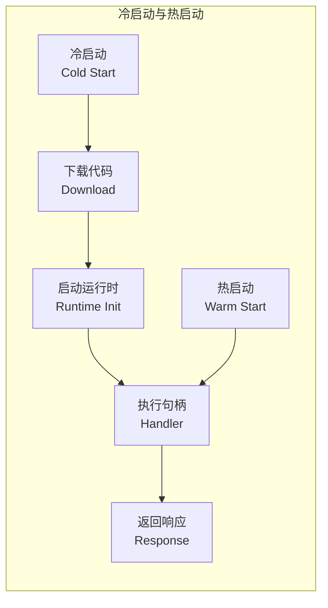

---
aliases:
  - ServerlessComputing
  - Serverless
  - 无服务器计算
  - FaaS
  - FunctionAsAService
tags:
created: 2026-05-17
updated: 2026-05-13
  - '05_ComputerScience'
  - 'CloudComputing'
  - 'ServerlessComputing'
  - 'Architecture'
---

# 无服务器计算 Serverless Computing

无服务器计算（Serverless Computing）是一种云执行模型，云提供商（Cloud Provider）动态管理服务器资源的分配和扩缩，开发者只需编写和部署代码，无需关心底层基础设施。尽管名为"无服务器"，实际仍然存在服务器，只是其管理对开发者完全透明。

## 核心模型 Core Models

### 函数即服务 Function as a Service (FaaS)

FaaS 允许开发者以函数（Function）为粒度部署代码，按需触发执行。

| 特性 | 传统服务器 | 容器化 | Serverless FaaS |
|------|-----------|--------|-----------------|
| 基础设施管理 | 手动 | 半自动 | 完全托管 |
| 计费粒度 | 按小时/月 | 按容器运行时间 | 按函数执行次数+时长 |
| 扩缩 | 手动/预定 | 自动但需配置 | 全自动从零到无限 |
| 启动时间 | 分钟级 | 秒级 | 毫秒到秒级 |
| 闲置成本 | 高 | 中 | 零（不执行不计费） |

### 后端即服务 Backend as a Service (BaaS)

BaaS 提供即用型后端服务：

- **认证**（Authentication）：Auth0, Amazon Cognito
- **数据库**（Database）：Firebase Firestore, DynamoDB
- **存储**（Storage）：AWS S3, Cloud Storage
- **消息队列**（Messaging）：SQS, Pub/Sub

## 架构模式 Architecture Patterns

## 主流平台对比 Platform Comparison

| 平台 | 运行时支持 | 内存范围 | 最大超时 | 并发限制 |
|------|-----------|---------|---------|----------|
| AWS Lambda | Node.js, Python, Java, Go, .NET, Ruby | 128 MB - 10 GB | 15 min | 1000 (可调) |
| Azure Functions | C#, Java, JavaScript, Python, PowerShell | 128 MB - 1.5 GB | 10 min | 200/实例 |
| Google Cloud Functions | Node.js, Python, Go, Java, .NET | 128 MB - 8 GB | 60 min | 1000/region |
| Cloudflare Workers | JavaScript, WASM | 128 MB | 30s | 不限 |
| 阿里云函数计算 | Node.js, Python, Java, PHP, .NET | 128 MB - 3 GB | 10 min | 100/region |

## 触发方式 Trigger Mechanisms

- **HTTP 触发**（HTTP Trigger）：API Gateway / ALB 路由到函数
- **对象存储事件**（Storage Event）：文件上传到 S3 触发处理
- **数据库变更**（Database Stream）：DynamoDB Streams / Firestore 变更
- **消息队列**（Message Queue）：SQS, Kafka, Pub/Sub 消息触发
- **定时触发**（Scheduled）：CloudWatch Events / Cloud Scheduler 定时执行
- **异步事件**（Async Events）：EventBridge 事件总线分发

## 冷启动 Cold Starts

冷启动（Cold Start）是 FaaS 的固有特性，指函数实例首次被调用时需初始化运行时的延迟。

冷启动优化策略：

| 策略 | 描述 | 效果 |
|------|------|------|
| 预热预留 | 保持固定数量的常热实例 | 消除冷启动但增加成本 |
| 精简依赖 | 减少部署包体积 | 加快代码下载 |
| 层 Lazyloading | 将重依赖延迟加载 | 降低冷启动峰值 |
| 自定义运行时 | 使用自定义 Runtime (provided.al2) | 减少运行时初始化开销 |
| SnapStart | AWS Lambda 快照恢复 | 冷启动降至亚秒级 |

## 适用场景 Use Cases

### 适合 Serverless 的场景 ✅

- **轻量级 Web API**：结合 API Gateway 构建 RESTful 接口
- **数据处理管道**：图片/视频转码、文件格式转换、ETL 作业
- **事件驱动工作流**：订单处理、通知发送、审批流
- **定时任务调度**：定时备份、报表生成、Cron 作业
- **Chatbot 与 Webhook**：Slack 机器人、GitHub Webhook 处理
- **流式数据处理器**：实时日志分析、IoT 数据过滤

### 不适合 Serverless 的场景 ❌

- **长时间运行的计算任务**：超出函数超时限制
- **有状态应用**：函数无状态，需外部状态管理
- **低延迟要求极高的系统**：冷启动导致延迟波动
- **GPU/TPU 密集型任务**：大多数 FaaS 平台不支持 GPU
- **高吞吐量稳定工作负载**：预留实例成本可能低于 Serverless

## 监控与可观测性 Observability

Serverless 应用的可观测性工具：

- **日志**：CloudWatch Logs, Azure Monitor, Google Cloud Logging
- **指标**：调用次数、错误率、耗时分布、并发量
- **链路追踪**：AWS X-Ray, OpenTelemetry, Azure Application Insights
- **分布式追踪**：冷启动标记、冷热路径分析

Serverless 成本模型：

$$ \text{总成本} = \sum (\text{调用次数} \times \text{价格/次}) + \sum (\text{执行时间} \times \text{内存配置} \times \text{价格/GB-s}) + \text{额外服务费用} $$

## 相关条目

- [[CloudComputing]]
- [[DevOps]]
- [[SoftwareArchitecture]]
- [[DistributedSystems]]
- [[Virtualization]]
