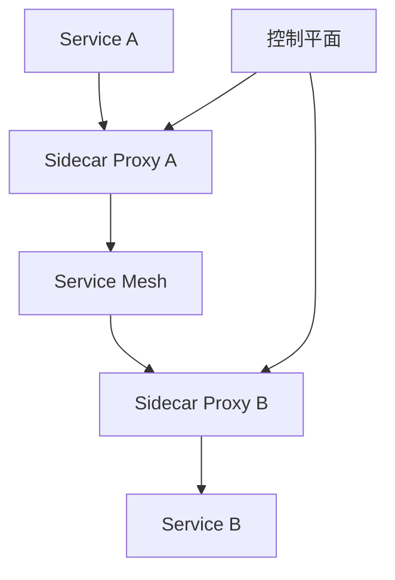
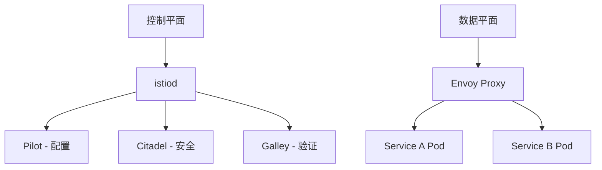

---
aliases: [ServiceMesh, 服务网格, Istio, Envoy, Sidecar]
tags: ['05_ComputerScience', 'CloudComputing', 'ServiceMesh', 'Microservices']
created: 2026-06-27
updated: 2026-06-27
---

# 服务网格 (Service Mesh)

## 一、概述

服务网格是一种基础设施层，用于处理服务间通信。它负责服务发现、负载均衡、故障恢复、度量收集和安全相关的功能。

### 1.1 核心概念



| 概念 | 描述 |
|------|------|
| **数据平面** | Sidecar 代理，处理实际流量 |
| **控制平面** | 配置和管理代理 |
| **Sidecar** | 与应用一起部署的代理容器 |
| **Ingress Gateway** | 入口流量管理 |
| **Egress Gateway** | 出口流量管理 |

### 1.2 服务网格 vs 传统方式

| 特性 | 传统方式 | 服务网格 |
|------|---------|---------|
| 服务发现 | 客户端SDK | Sidecar代理 |
| 负载均衡 | 应用代码 | 基础设施层 |
| 重试熔断 | 应用代码 | 配置化 |
| 安全 | 应用代码 | mTLS自动注入 |
| 可观测性 | 应用埋点 | 自动收集 |

---

## 二、Istio

### 2.1 架构组件



### 2.2 安装 Istio

```bash
# 下载 Istio
curl -L https://istio.io/downloadIstio | sh -
cd istio-*
export PATH=$PWD/bin:$PATH

# 安装
istioctl install --set profile=demo -y

# 启用自动注入
kubectl label namespace default istio-injection=enabled

# 验证安装
istioctl verify-install
```

### 2.3 流量管理

#### VirtualService

```yaml
apiVersion: networking.istio.io/v1alpha3
kind: VirtualService
metadata:
  name: my-service
spec:
  hosts:
    - my-service
  http:
    # 路由规则
    - match:
        - headers:
            x-version:
              exact: v2
      route:
        - destination:
            host: my-service
            subset: v2
    
    # 默认路由
    - route:
        - destination:
            host: my-service
            subset: v1
          weight: 90
        - destination:
            host: my-service
            subset: v2
          weight: 10
    
    # 超时
    timeout: 5s
    
    # 重试
    retries:
      attempts: 3
      perTryTimeout: 2s
      retryOn: gateway-error,connect-failure,refused-stream
    
    # 故障注入
    fault:
      delay:
        percentage:
          value: 10
        fixedDelay: 5s
      abort:
        percentage:
          value: 5
        httpStatus: 500
```

#### DestinationRule

```yaml
apiVersion: networking.istio.io/v1alpha3
kind: DestinationRule
metadata:
  name: my-service
spec:
  host: my-service
  
  # 流量策略
  trafficPolicy:
    connectionPool:
      tcp:
        maxConnections: 100
      http:
        h2UpgradePolicy: DEFAULT
        http1MaxPendingRequests: 100
        http2MaxRequests: 1000
    
    loadBalancer:
      simple: LEAST_CONN
    
    outlierDetection:
      consecutive5xxErrors: 5
      interval: 10s
      baseEjectionTime: 30s
      maxEjectionPercent: 50
  
  # 子集定义
  subsets:
    - name: v1
      labels:
        version: v1
    
    - name: v2
      labels:
        version: v2
      trafficPolicy:
        connectionPool:
          http:
            http2MaxRequests: 500
```

### 2.4 金丝雀发布

```yaml
# 逐步将流量从 v1 迁移到 v2
apiVersion: networking.istio.io/v1alpha3
kind: VirtualService
metadata:
  name: canary-release
spec:
  hosts:
    - my-service
  http:
    - route:
        - destination:
            host: my-service
            subset: v1
          weight: 90
        - destination:
            host: my-service
            subset: v2
          weight: 10
```

### 2.5 A/B 测试

```yaml
apiVersion: networking.istio.io/v1alpha3
kind: VirtualService
metadata:
  name: ab-test
spec:
  hosts:
    - my-service
  http:
    # 基于 Header 路由
    - match:
        - headers:
            x-user-group:
              exact: beta
      route:
        - destination:
            host: my-service
            subset: v2
    
    # 默认路由
    - route:
        - destination:
            host: my-service
            subset: v1
```

---

## 三、安全

### 3.1 mTLS 配置

```yaml
# 启用严格 mTLS
apiVersion: security.istio.io/v1beta1
kind: PeerAuthentication
metadata:
  name: default
  namespace: istio-system
spec:
  mtls:
    mode: STRICT
```

### 3.2 授权策略

```yaml
# 基于角色的访问控制
apiVersion: security.istio.io/v1beta1
kind: AuthorizationPolicy
metadata:
  name: api-access
spec:
  selector:
    matchLabels:
      app: api
  rules:
    - from:
        - source:
            principals: ["cluster.local/ns/default/sa/frontend"]
      to:
        - operation:
            methods: ["GET"]
            paths: ["/api/*"]
    
    - from:
        - source:
            principals: ["cluster.local/ns/default/sa/admin"]
      to:
        - operation:
            methods: ["GET", "POST", "PUT", "DELETE"]
```

### 3.3 JWT 认证

```yaml
apiVersion: security.istio.io/v1beta1
kind: RequestAuthentication
metadata:
  name: jwt-auth
spec:
  selector:
    matchLabels:
      app: api
  jwtRules:
    - issuer: "https://auth.example.com"
      jwksUri: "https://auth.example.com/.well-known/jwks.json"
      audiences:
        - "api.example.com"

---
apiVersion: security.istio.io/v1beta1
kind: AuthorizationPolicy
metadata:
  name: require-jwt
spec:
  selector:
    matchLabels:
      app: api
  rules:
    - from:
        - source:
            requestPrincipals: ["*"]
```

---

## 四、可观测性

### 4.1 指标收集

```yaml
# Prometheus 配置
apiVersion: install.istio.io/v1alpha1
kind: IstioOperator
spec:
  meshConfig:
    enablePrometheusMerge: true
  
  values:
    prometheus:
      enabled: true
```

### 4.2 分布式追踪

```yaml
apiVersion: install.istio.io/v1alpha1
kind: IstioOperator
spec:
  meshConfig:
    enableTracing: true
    defaultConfig:
      tracing:
        sampling: 100
        zipkin:
          address: zipkin.istio-system:9411
```

### 4.3 Kiali 可视化

```bash
# 安装 Kiali
kubectl apply -f https://raw.githubusercontent.com/istio/istio/release-1.20/samples/addons/kiali.yaml

# 访问 Kiali
istioctl dashboard kiali
```

---

## 五、Envoy 代理

### 5.1 Envoy 配置

```yaml
# envoy.yaml
static_resources:
  listeners:
    - name: listener_0
      address:
        socket_address:
          address: 0.0.0.0
          port_value: 8080
      filter_chains:
        - filters:
            - name: envoy.filters.network.http_connection_manager
              typed_config:
                "@type": type.googleapis.com/envoy.extensions.filters.network.http_connection_manager.v3.HttpConnectionManager
                stat_prefix: ingress_http
                route_config:
                  name: local_route
                  virtual_hosts:
                    - name: local_service
                      domains: ["*"]
                      routes:
                        - match:
                            prefix: "/"
                          route:
                            cluster: service_cluster
                http_filters:
                  - name: envoy.filters.http.router
                    typed_config:
                      "@type": type.googleapis.com/envoy.extensions.filters.http.router.v3.Router
  
  clusters:
    - name: service_cluster
      type: STRICT_DNS
      lb_policy: ROUND_ROBIN
      load_assignment:
        cluster_name: service_cluster
        endpoints:
          - lb_endpoints:
              - endpoint:
                  address:
                    socket_address:
                      address: 127.0.0.1
                      port_value: 8081
```

### 5.2 Envoy Filter

```yaml
# 自定义 Envoy Filter
apiVersion: networking.istio.io/v1alpha3
kind: EnvoyFilter
metadata:
  name: custom-filter
spec:
  workloadSelector:
    labels:
      app: my-service
  configPatches:
    - applyTo: HTTP_FILTER
      match:
        context: SIDECAR_INBOUND
        listener:
          filterChain:
            filter:
              name: envoy.filters.network.http_connection_manager
      patch:
        operation: INSERT_BEFORE
        value:
          name: envoy.filters.http.cors
          typed_config:
            "@type": type.googleapis.com/envoy.extensions.filters.http.cors.v3.Cors
```

---

## 六、Linkerd

### 6.1 Linkerd 安装

```bash
# 安装 CLI
curl -fsL https://run.linkerd.io/install | sh
export PATH=$PATH:$HOME/.linkerd2/bin

# 安装 Linkerd
linkerd install --crds | kubectl apply -f -
linkerd install | kubectl apply -f -

# 验证安装
linkerd check

# 注入 Sidecar
kubectl get deploy -o yaml | linkerd inject - | kubectl apply -f -
```

### 6.2 Linkerd 流量拆分

```yaml
# TrafficSplit (SMI)
apiVersion: split.smi-spec.io/v1alpha4
kind: TrafficSplit
metadata:
  name: my-service
spec:
  service: my-service
  backends:
    - service: my-service-stable
      weight: 900m
    - service: my-service-canary
      weight: 100m
```

---

## 七、Gateway API

### 7.1 Gateway API 资源

```yaml
# GatewayClass
apiVersion: gateway.networking.k8s.io/v1
kind: GatewayClass
metadata:
  name: istio
spec:
  controllerName: istio.io/gateway-controller

---
# Gateway
apiVersion: gateway.networking.k8s.io/v1
kind: Gateway
metadata:
  name: my-gateway
  namespace: istio-system
spec:
  gatewayClassName: istio
  listeners:
    - name: http
      port: 80
      protocol: HTTP
      allowedRoutes:
        namespaces:
          from: All
    - name: https
      port: 443
      protocol: HTTPS
      tls:
        mode: Terminate
        certificateRefs:
          - name: tls-secret
      allowedRoutes:
        namespaces:
          from: All

---
# HTTPRoute
apiVersion: gateway.networking.k8s.io/v1
kind: HTTPRoute
metadata:
  name: my-route
spec:
  parentRefs:
    - name: my-gateway
  hostnames:
    - "example.com"
  rules:
    - matches:
        - path:
            type: PathPrefix
            value: /api
      backendRefs:
        - name: api-service
          port: 80
    - matches:
        - path:
            type: PathPrefix
            value: /
      backendRefs:
        - name: web-service
          port: 80
```

---

## 八、最佳实践

### 8.1 渐进式采用

| 阶段 | 内容 | 风险 |
|------|------|------|
| **1. 可观测性** | 启用追踪和指标 | 低 |
| **2. 流量管理** | 路由、重试、超时 | 中 |
| **3. 安全** | mTLS、授权策略 | 中 |
| **4. 高级功能** | 故障注入、镜像 | 高 |

### 8.2 性能优化

```yaml
# Envoy 资源限制
apiVersion: install.istio.io/v1alpha1
kind: IstioOperator
spec:
  values:
    global:
      proxy:
        resources:
          requests:
            cpu: 100m
            memory: 128Mi
          limits:
            cpu: 500m
            memory: 512Mi
```

### 8.3 多集群服务网格

```yaml
# 多集群配置
apiVersion: install.istio.io/v1alpha1
kind: IstioOperator
spec:
  profile: remote
  values:
    global:
      remotePilotAddress: <central-istiod-ip>
```

---

## 相关条目

- [[05_ComputerScience/SoftwareEngineering/Microservices|Microservices]]
- [[05_ComputerScience/SoftwareEngineering/KubernetesDeep|KubernetesDeep]]
- [[LoadBalancing]]
- [[05_ComputerScience/SoftwareEngineering/Observability|Observability]]

## 参考资源

1. Istio. "Official Documentation." istio.io
2. Linkerd. "Official Documentation." linkerd.io
3. Envoy. "Official Documentation." envoyproxy.io
4. Gateway API. "Specification." gateway-api.sigs.k8s.io

