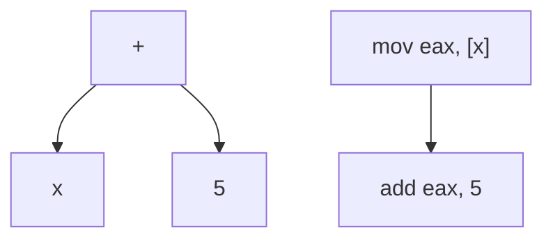
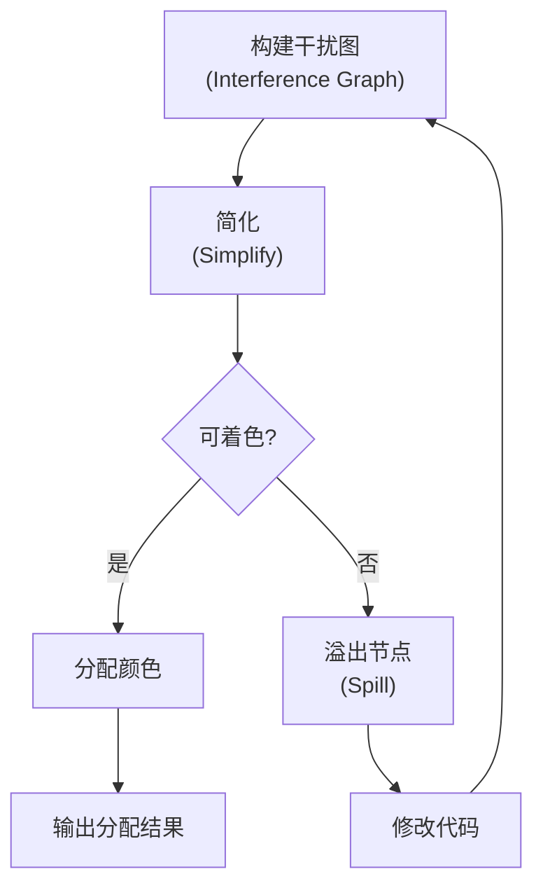

# 代码生成 (Code Generation)

## 一、概述

代码生成是编译器的后端阶段，将中间表示 (Intermediate Representation, IR) 转换为目标机器的汇编代码或机器码，同时进行目标平台相关的优化。

### 1.1 编译器后端流程


### 1.2 代码生成的关键挑战

| 挑战 | 说明 |
|------|------|
| 覆盖所有 IR 结构 | 每条 IR 需映射到目标指令 |
| 寄存器有限 | 合理分配避免溢出 |
| 目标多样性 | x86, ARM, RISC-V 等差异大 |
| 性能要求 | 生成代码需高效执行 |

## 二、指令选择 (Instruction Selection)

### 2.1 树覆盖 (Tree Covering)

将 IR 的树结构用目标指令模式覆盖：

```
IR 树:          ADD(LOAD(x), CONST(5))
目标指令:      mov eax, [x]  (LOAD)
                add eax, 5   (ADD + CONST)
```



### 2.2 指令选择算法

| 方法 | 描述 | 特点 |
|------|------|------|
| 树重写 | 模式匹配 IR 树 | 易于实现，覆盖率不错 |
| 动态规划 | 基于成本的树覆盖 | 最优解，但较慢 |
| DAG 覆盖 | 处理共享子表达式 | 更精确但更复杂 |

### 2.3 寻址模式利用

不同寻址模式可以有效利用寄存器：
$$mem[base + offset] \quad \text{(基址+偏移)}$$
$$mem[base + index \times scale] \quad \text{(基址+索引)}$$

## 三、寄存器分配 (Register Allocation)

### 3.1 寄存器分配问题

给定 $K$ 个物理寄存器，将无限数量的虚拟寄存器映射到物理寄存器，当虚拟寄存器数量超过 $K$ 时，需要溢出 (Spill) 到内存。

### 3.2 图着色算法 (Graph Coloring)



干扰图的构造：
- 节点：虚拟寄存器
- 边：两个寄存器同时活跃 (Live) 则相连
- 颜色数：物理寄存器数量 $K$

### 3.3 线性扫描 (Linear Scan)

对简单架构（如 JIT 编译器）更高效的算法：

| 对比 | 图着色 | 线性扫描 |
|------|--------|---------|
| 复杂度 | $O(n^2)$ | $O(n \log n)$ |
| 质量 | 较好 | 可接受 |
| 适用 | AOT 编译器 | JIT 编译器 |

### 3.4 寄存器分配的挑战

- **函数调用约定**：Callee/Caller 保存寄存器
- **浮点寄存器**：与整数寄存器分离
- **特殊寄存器**：栈指针 SP、基址指针 BP、程序计数器 PC
- **多寄存器指令**：乘法的结果需要 EDX:EAX

## 四、指令调度 (Instruction Scheduling)

### 4.1 流水线优化

现代 CPU 采用流水线执行，指令调度需避免停顿：

| 冒险类型 | 原因 | 解决方法 |
|----------|------|---------|
| 结构冒险 | 硬件资源冲突 | 调度不同功能单元 |
| 数据冒险 | 指令间数据依赖 | 插入独立指令 |
| 控制冒险 | 分支预测失败 | 分支预测+延迟槽 |

### 4.2 基本块内的调度

```
原始代码：
add r1, r2, r3
sub r4, r1, r5   // 数据依赖，等待 r1

优化后：
add r1, r2, r3
load r6, [r7]    // 独立指令，无等待
sub r4, r1, r5
```

## 五、窥孔优化 (Peephole Optimization)

### 5.1 常见模式

| 优化模式 | 优化前 | 优化后 |
|----------|--------|--------|
| 冗余加载 | mov r1, r2; mov r2, r1 | mov r1, r2 |
| 死代码消除 | mov r1, r2; ... r1 未使用 | 删除 |
| 常量折叠 | add r1, r2, #0 | mov r1, r2 |
| 强度削弱 | mul r1, r2, #4 | shl r1, r2, #2 |
| 跳转规范 | jmp L; L: | nop（删除跳转）|

### 5.2 代数简化

$$x + 0 = x$$
$$x \times 1 = x$$
$$x \times 2^n = x \ll n$$
$$x / 2^n = x \gg n$$

## 六、目标代码优化

### 6.1 循环优化

| 优化技术 | 效果 |
|----------|------|
| 循环不变量外提 | 将常量计算移出循环 |
| 循环展开 | 减少分支开销 |
| 软件流水 (Software Pipelining) | 重叠不同迭代的执行 |
| 强度削弱 | 将乘法替换为加法 |

### 6.2 强度削弱示例

```
原始循环（每次迭代乘法）：
for (i = 0; i < n; i++) {
    addr = base + i * 4;
    load addr;
}

优化后（增量加法）：
addr = base;
for (i = 0; i < n; i++) {
    load addr;
    addr += 4;
}
```

## 七、现代体系结构适配

### 7.1 x86-64

| 特性 | 说明 |
|------|------|
| 16 个通用寄存器 | 较多寄存器可用 |
| 变长指令 | 1-15 字节 |
| 复杂寻址 | 支持 base+index*scale+offset |
| 标志寄存器 | 条件码用于分支 |

### 7.2 ARM

| 特性 | 说明 |
|------|------|
| 条件执行 | 指令可带条件码 |
| 桶形移位器 | 单周期移位+运算 |
| 32 个寄存器 | 丰富的寄存器资源 |
| 定长指令 | 4 字节（ARM模式）|

### 7.3 RISC-V

| 特性 | 说明 |
|------|------|
| 规整指令格式 | 6 种基本格式 |
| 32 个整数+32 个浮点寄存器 | 统一设计 |
| 模块化扩展 | M/A/F/D/C 扩展 |
| 简洁设计 | 适合教学和工业 |

## 八、JIT 编译 (Just-In-Time Compilation)

JIT 编译器运行时编译热点代码：

1. **解释执行**：初始阶段解释执行收集性能数据
2. **热点检测**：识别频繁执行的方法/循环
3. **编译优化**：高级优化编译为目标代码
4. **代码替换**：将解释器入口替换为编译后代码

| 对比 | AOT | JIT |
|------|-----|-----|
| 启动速度 | 快 | 慢（需预热）|
| 峰值性能 | 较慢 | 更快（利用运行时信息）|
| 移植性 | 需交叉编译 | 一次编译到处运行 |
