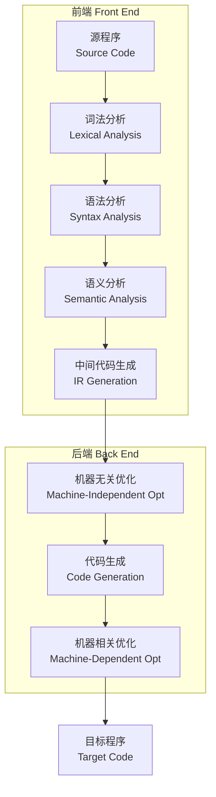
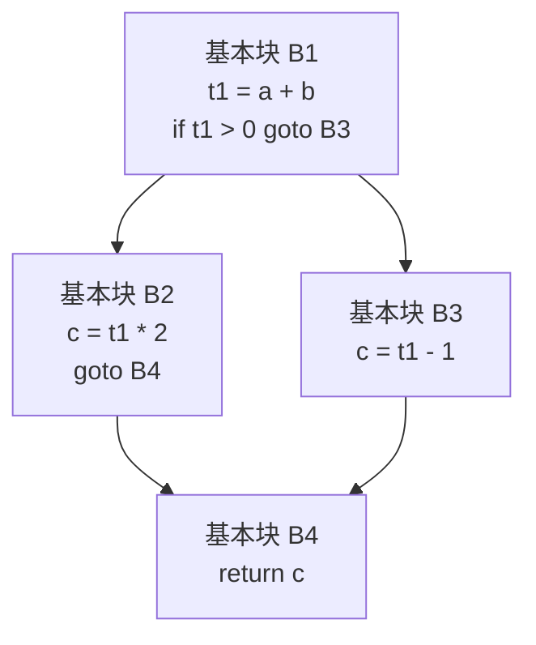
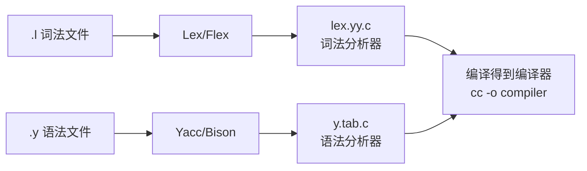

# 编译原理 (Compiler Principles)

> 编译原理研究如何将高级编程语言翻译为机器可执行代码，涵盖词法分析、语法分析、语义分析、中间代码生成、优化以及目标代码生成等核心阶段。

## 编译器概述 (Compiler Overview)

### 编译器架构
编译器（Compiler）将源程序（Source Program）翻译为目标程序（Target Program），通常分为前端（Front End）和后端（Back End）。



### 编译器 vs 解释器

| 特性 | 编译器 (Compiler) | 解释器 (Interpreter) |
|------|------------------|-------------------|
| 执行方式 | 整体翻译后执行 | 逐行翻译执行 |
| 执行速度 | 较快 | 较慢 |
| 错误报告 | 编译时报错 | 运行时报错 |
| 典型代表 | GCC、Clang、javac | Python、Ruby、JavaScript |

---

## 词法分析 (Lexical Analysis)

### 功能与输出
词法分析器（Lexer/Scanner）将源代码字符流转换为**词法单元序列**（Token Sequence）：

```
if (x > 0) { y = 1; }
→ IF LPAREN ID(x) GT INT(0) RPAREN LBRACE ID(y) ASSIGN INT(1) SEMI RBRACE
```

### 正则表达式与有限自动机

词法分析的理论基础是正则语言：

| 正则操作 | 符号 | 示例 |
|---------|------|------|
| 连接 (Concatenation) | $ab$ | `if` |
| 选择 (Union) | $a \mid b$ | `int | float` |
| 闭包 (Kleene Star) | $a^*$ | `[a-zA-Z]*` |
| 正闭包 (Positive Closure) | $a^+$ | `[0-9]+` |

### 有限自动机 (Finite Automata)

- **NFA**（非确定有限自动机）：同一输入可能有多个状态转移
- **DFA**（确定有限自动机）：每个状态每个输入有唯一转移
- **NFA → DFA 转化**：子集构造法（Subset Construction）
- **DFA 最小化**：Hopcroft 算法

### 工具
- **Lex / Flex**：基于正则表达式的词法分析器生成器
- 输入 `.l` 文件 → 输出 C 语言词法分析器

---

## 语法分析 (Syntax Analysis)

### 上下文无关文法 (Context-Free Grammar, CFG)

CFG 由四元组 $(V, T, P, S)$ 定义：

- $V$：非终结符集合（Non-terminals）
- $T$：终结符集合（Terminals，即 Token）
- $P$：产生式集合（Productions）
- $S$：起始符号（Start Symbol）

**示例** —— 表达式文法：

```
expr → expr + term | term
term → term * factor | factor
factor → ( expr ) | NUM
```

### 推导与语法树 (Derivation & Parse Tree)

- **最左推导** (Leftmost Derivation)：每次替换最左非终结符
- **最右推导** (Rightmost Derivation)：每次替换最右非终结符
- **二义性** (Ambiguity)：同一句子存在多棵语法树

### 自顶向下分析 (Top-Down Parsing)

- **递归下降** (Recursive Descent)：手工编写，直观高效
- **LL(1) 文法**：无左递归，FIRST 和 FOLLOW 集交集为空
- **预测分析表**：利用 FIRST 和 FOLLOW 构造

**左递归消除**：

$$
A \to A\alpha \mid \beta \quad \Rightarrow \quad A \to \beta A', \; A' \to \alpha A' \mid \varepsilon
$$

### 自底向上分析 (Bottom-Up Parsing)

- **移进-归约** (Shift-Reduce)：使用栈维护已分析部分
- **LR(0)、SLR(1)、LR(1)、LALR(1)**：能力逐步增强
- **算符优先分析** (Operator Precedence)：用于表达式

| 分析器类型 | 能力 | 表大小 | 应用 |
|-----------|------|-------|------|
| LL(1) | 较弱 | 小型 | 手工编写 |
| LR(0) | 中等 | 中型 | 较少使用 |
| SLR(1) | 中强 | 中型 | 教学用途 |
| LALR(1) | 强 | 中型 | Yacc/Bison |
| LR(1) | 最强 | 大型 | 全能力 |

### 工具
- **Yacc / Bison**：LALR(1) 语法分析器生成器
- **ANTLR**：LL(*) 分析器生成器，支持多语言

---

## 语义分析 (Semantic Analysis)

### 类型检查 (Type Checking)

- **静态类型** (Static Typing)：编译时检查 —— C、Java、Rust
- **动态类型** (Dynamic Typing)：运行时检查 —— Python、JavaScript
- **类型推导** (Type Inference)：Hindley-Milner 算法 —— Haskell、OCaml

### 符号表 (Symbol Table)

符号表存储程序中各标识符的属性信息：

| 属性 | 说明 |
|------|------|
| 名称 (Name) | 标识符字符串 |
| 类型 (Type) | int、float、struct、function |
| 作用域 (Scope) | 全局/局部/块级 |
| 存储位置 (Address) | 栈偏移/全局地址 |
| 行号 (Line Number) | 声明位置 |

### 属性文法 (Attribute Grammar)

属性文法在 CFG 基础上附加语义规则：

```
expr → expr1 + term
    { expr.val = expr1.val + term.val }
```

- **综合属性** (Synthesized Attribute)：子节点 → 父节点
- **继承属性** (Inherited Attribute)：父节点 → 子节点

---

## 中间代码 (Intermediate Representation, IR)

### IR 形式

| IR 类型 | 特点 | 示例 |
|---------|------|------|
| 三地址码 (TAC) | 最多一个运算符 | `t1 = a + b` |
| 静态单赋值 (SSA) | 每个变量只赋值一次 | `v1 = φ(v0, v2)` |
| 控制流图 (CFG) | 基本块 + 控制边 | 优化阶段的基础 |
| 抽象语法树 (AST) | 树结构 | 前端输出 |

### 控制流图 (Control Flow Graph, CFG)



---

## 代码优化 (Code Optimization)

### 机器无关优化

| 优化技术 | 描述 | 效果 |
|---------|------|------|
| 常量折叠 (Constant Folding) | `2 + 3 → 5` | 减少计算 |
| 常量传播 (Constant Propagation) | `x = 5; y = x + 1 → y = 6` | 消除变量 |
| 死代码消除 (Dead Code Elimination) | 删除无用赋值 | 减小代码 |
| 公共子表达式消除 (CSE) | `a + b` 重复出现时复用 | 减少计算 |
| 循环不变式外提 (LICM) | 将不变量移出循环 | 提升效率 |
| 强度消减 (Strength Reduction) | `x * 2 → x << 1` | 用廉价操作替代 |

### 机器相关优化

- **寄存器分配** (Register Allocation) —— 图着色算法 (Graph Coloring)
- **指令调度** (Instruction Scheduling) —— 重排指令减少流水线停顿
- **窥孔优化** (Peephole Optimization) —— 滑动窗口局部模式替换

### 数据流分析 (Data Flow Analysis)

- **到达定值** (Reaching Definitions)
- **活跃变量分析** (Live Variable Analysis)
- **可用表达式** (Available Expressions)
- **支配树** (Dominator Tree) —— 用于循环检测

---

## 代码生成 (Code Generation)

### 指令选择 (Instruction Selection)

- **树覆盖** (Tree Coverage)：用目标指令树覆盖 IR 树
- **模式匹配**：通过 Tiling 算法选出最优指令序列

### 寄存器分配 (Register Allocation)

寄存器分配将大量虚拟寄存器映射到有限物理寄存器：

- **图着色算法** (Chaitin's Algorithm)：
  1. 构建冲突图（Interference Graph）
  2. 简化（Simplify）—— 移除度数 < K 的节点
  3. 溢出（Spill）—— 若无法继续简化，选择代价最小的节点溢出
  4. 着色（Assign）—— 为节点分配寄存器

### 指令调度 (Instruction Scheduling)

- **乱序执行** —— 允许后续不依赖当前指令的指令提前执行
- **列表调度** (List Scheduling)：基于依赖关系的贪心算法

---

## 现代编译技术 (Modern Compilation Techniques)

### JIT 编译 (Just-In-Time Compilation)

- **热点检测** (Hotspot Detection)：识别频繁执行的代码路径
- **分层编译** (Tiered Compilation)：先快速解释/简单编译，热点再深度优化
- **内联缓存** (Inline Caching)：动态类型语言的方法查找优化

### 向量化与并行化

- **自动向量化** (Auto-vectorization)：将标量循环转换为 SIMD 指令
- **自动并行化** (Auto-parallelization)：将循环分配到多核执行
- **OpenMP**：通过 `#pragma` 指导编译器并行化

### 链接与加载 (Linking & Loading)

| 阶段 | 操作 |
|------|------|
| 静态链接 (Static Linking) | 编译时将所有依赖合并到可执行文件 |
| 动态链接 (Dynamic Linking) | 运行时加载共享库 (.so / .dll) |
| 加载时重定位 | 修正符号地址 |
| 位置无关代码 (PIC) | 共享库的重定位优化 |

---

## 编译器自动化工具 (Compiler Automation Tools)

### 词法分析器生成器
- **Lex / Flex**：输入 `.l` 文件，包含正则规则与对应动作；输出 C 词法分析器
- **手工 vs 自动**：手工递归下降更快更可控；自动生成更便于维护和修改

### 语法分析器生成器
- **Yacc / Bison**：LALR(1) 分析，与 Lex/Flex 配合形成经典编译器前端工具链
- **ANTLR**：LL(*) 分析，生成 Java/Python/C# 等多语言分析器
- **手工递归下降**：广泛应用于生产编译器（GCC、Clang、Rustc）



---

## 高级编译话题 (Advanced Topics)

### 部分求值 (Partial Evaluation)
将程序分为静态部分（已知输入）和动态部分（运行时输入），预处理静态部分以生成高效专用代码。

### 超级优化 (Superoptimization)
通过穷举搜索找到给定指令序列的最短等价序列，用于关键代码段的极致优化。

### 二进制翻译与重编译
- **QEMU**：动态二进制翻译，将 x86 指令翻译为 ARM 指令
- **静态二进制重写**：修改已编译二进制文件以实现插入插桩、安全加固

### 编译时元编程 (Compile-time Metaprogramming)
- **C++ Templates**：图灵完备的模板元编程，编译期计算
- **Rust Macros**：声明宏与过程宏，代码生成
- **Zig comptime**：编译期执行任意代码

### 形式化验证的编译器
- **CompCert**：经过 Coq 定理证明器形式化验证的 C 编译器，保证语义保留
- **CakeML**：形式化验证的 ML 函数式语言编译器

---

## 内存管理与优化 (Memory Management & Optimization)

### 逃逸分析 (Escape Analysis)
确定对象是否在函数外部被引用，决定是否在栈上分配而非堆上分配。

### 标量替换 (Scalar Replacement)
将未逃逸的对象拆解为标量进行寄存器分配，消除对象分配开销。

### 锁消除与锁粗化 (Lock Elision & Lock Coarsening)
- **锁消除**：检测到锁对象不共享时移除同步
- **锁粗化**：合并相邻的锁/解锁操作以减少同步开销

### 自动向量化 (Auto-Vectorization)
编译器自动将标量循环转换为 SIMD 向量指令：

```c
// 原始标量循环
for (i = 0; i < N; i++) {
    c[i] = a[i] + b[i];
}
// 自动向量化后 (假设 256-bit SIMD)
for (i = 0; i < N; i += 8) {
    __m256 va = _mm256_loadu_ps(&a[i]);
    __m256 vb = _mm256_loadu_ps(&b[i]);
    _mm256_storeu_ps(&c[i], _mm256_add_ps(va, vb));
}
```

---

### 相关条目
- [[05_ComputerScience/CompilerPrinciples/INDEX|05_ComputerScience/CompilerPrinciples 索引]]
- [[05_ComputerScience/ProgrammingLanguages/ProgrammingLanguages|编程语言理论]]
- [[05_ComputerScience/ComputerArchitecture/ComputerArchitecture|计算机体系结构]]
- [[05_ComputerScience/OperatingSystems/OperatingSystems|操作系统]]
- [[05_ComputerScience/TheoryOfComputation/TheoryOfComputation|计算理论]]
- [[INDEX|当前目录索引]]
