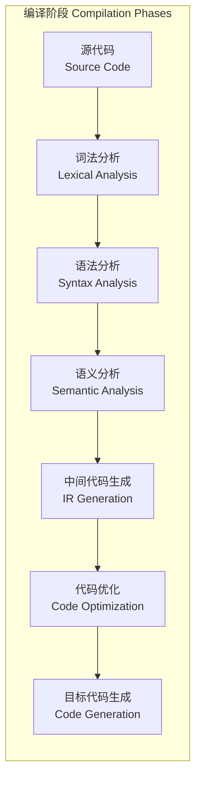

---
aliases:
  - CompilerPrinciples
  - 编译原理
  - Compiler
  - CompilerDesign
tags:
  - '05_ComputerScience'
  - 'CompilerPrinciples'
  - 'CoreCourses'
  - 'ProgrammingLanguages'
---

# 编译原理概述 Compiler Principles Overview

编译原理（Compiler Principles）研究如何将高级编程语言源代码转换为目标机器代码（或中间表示）的过程。编译器是复杂的软件系统，涉及形式语言理论、自动机理论、计算机体系结构和算法设计等多个领域的知识。

## 编译过程 Compilation Process



## 词法分析 Lexical Analysis

词法分析器（Lexer/Scanner）将源代码字符流转换为记号（Token）序列。

```
int a = 10 + 20;
→ Token序列: <KEYWORD, int> <IDENTIFIER, a> <OPERATOR, => <INTEGER, 10> <OPERATOR, +> <INTEGER, 20> <DELIMITER, ;>
```

| 概念 | 定义 | 示例 |
|------|------|------|
| 正则表达式 Regular Expression | 描述词法模式 | `[a-zA-Z_][a-zA-Z0-9_]*` 匹配标识符 |
| 有限自动机 Finite Automaton | 识别正则语言的抽象机器 | DFA, NFA |
| 记号 Token | 词法单元 | 关键字、标识符、字面量 |
| 模式 Pattern | 记号的描述规则 | 正则表达式 |
| 词素 Lexeme | 源代码中的字符序列 | `int`, `a` |

词法分析器的构建通常使用工具如 Lex、Flex，或手写递归下降词法分析器。

## 语法分析 Syntax Analysis

语法分析器（Parser）根据文法规则构建语法树（Parse Tree / AST）。

### 文法 Grammar

上下文无关文法（Context-Free Grammar, CFG）由四元组 $G = (N, T, P, S)$ 定义：

- $N$：非终结符集合
- $T$：终结符集合
- $P$：产生式规则集合
- $S$：起始符号

算术表达式的文法示例：
$$
\begin{aligned}
E &\to E + T \mid T \\
T &\to T \times F \mid F \\
F &\to (E) \mid \text{id}
\end{aligned}
$$

### 语法分析技术

| 技术 | 方向 | 适用文法 | 工具 |
|------|------|---------|------|
| 递归下降 Recursive Descent | 自顶向下 | LL(1) | 手写 |
| LL 分析 | 自顶向下 | LL(k) | ANTLR |
| LR 分析 | 自底向上 | LR(k) | Yacc, Bison |
| LALR 分析 | 自底向上 | LALR(1) | Yacc, Bison |

```mermaid
graph TD
  subgraph 抽象语法树 AST for "3 + 4 * 5"
    PLUS[+] --> NUM1[3]
    PLUS --> MUL[*]
    MUL --> NUM2[4]
    MUL --> NUM3[5]
  end
```

## 语义分析 Semantic Analysis

语义分析检查程序的语义正确性，主要任务包括：

- **类型检查**（Type Checking）：验证操作数类型与操作符兼容
- **类型推导**（Type Inference）：自动推断表达式类型
- **符号表管理**（Symbol Table）：记录标识符的类型、作用域和存储位置
- **作用域解析**（Scope Resolution）：确定标识符引用的声明位置

类型系统的形式化表示：

$$ \frac{\Gamma \vdash e_1 : \text{int} \quad \Gamma \vdash e_2 : \text{int}}{\Gamma \vdash e_1 + e_2 : \text{int}} $$

## 中间代码生成 IR Generation

中间表示（Intermediate Representation, IR）是与机器无关的代码表示形式。

常见 IR 形式：

| IR 类型 | 特点 | 代表 |
|---------|------|------|
| 三地址码 Three-Address Code | 每条指令最多三地址 | LLVM IR |
| 静态单赋值 SSA | 每个变量只赋值一次 | LLVM SSA, GCC GIMPLE |
| 栈式字节码 Stack-Based | 操作数在栈上 | Java Bytecode |
| 抽象语法树 AST | 树形结构 | 前端传递 |

三地址码示例：`t1 = a + b; t2 = t1 * c;`

## 代码优化 Code Optimization

优化阶段改进中间代码的质量。

| 优化技术 | 描述 | 效果 |
|----------|------|------|
| 常量折叠 Constant Folding | 编译期计算常量表达式 | 减少运行时计算 |
| 死代码消除 Dead Code Elimination | 删除不可达代码 | 减小代码体积 |
| 循环优化 Loop Optimization | 循环展开、循环不动式外提 | 大幅提升性能 |
| 内联展开 Inline Expansion | 用函数体替代调用 | 消除调用开销 |
| 公共子表达式消除 CSE | 复用已计算的值 | 减少重复计算 |

## 目标代码生成 Code Generation

将优化后的 IR 映射为目标机器指令。关键问题：

- **寄存器分配**（Register Allocation）：图着色算法
- **指令选择**（Instruction Selection）：树模式匹配
- **指令调度**（Instruction Scheduling）：利用流水线并行性

## 相关条目

- [[OperatingSystems]]
- [[ProgrammingLanguages]]
- [[ComputerArchitecture]]
- [[FormalLanguages]]
- [[SoftwareEngineering]]
