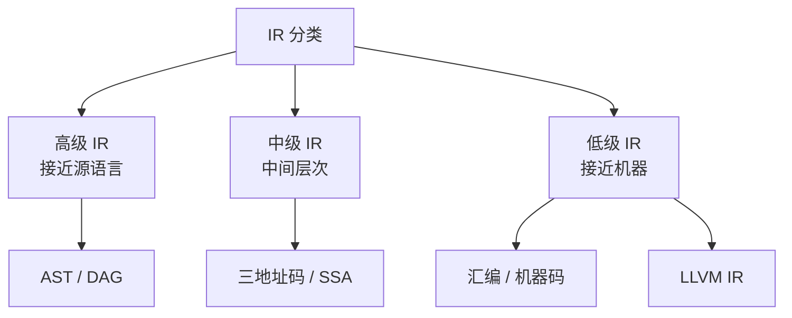
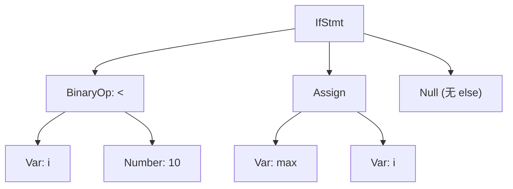
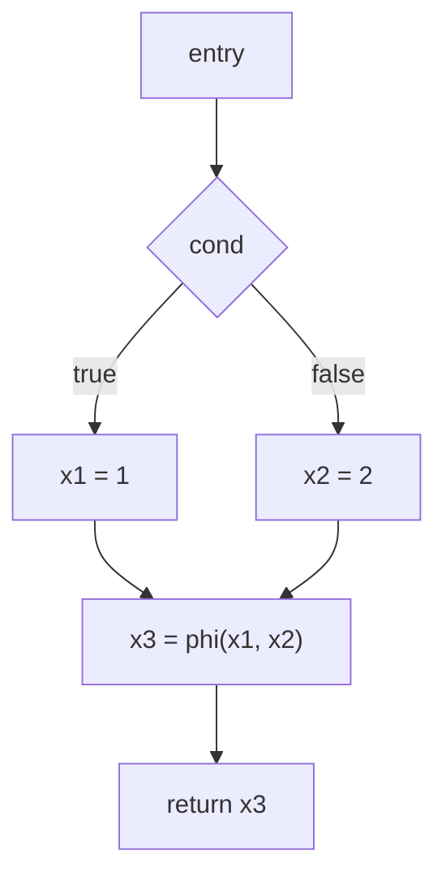
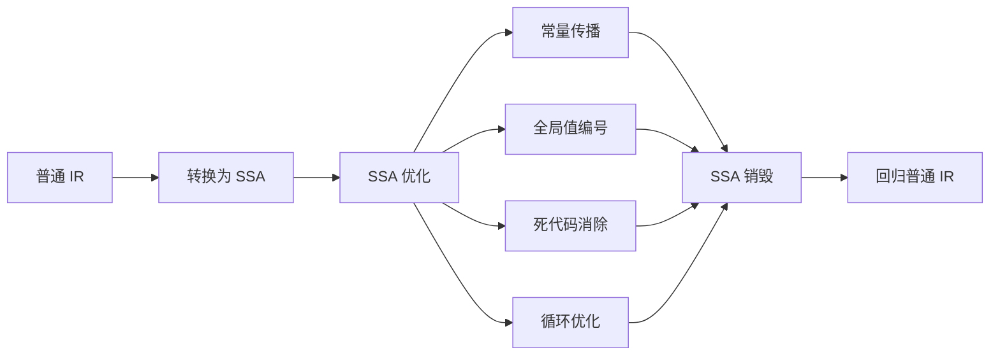
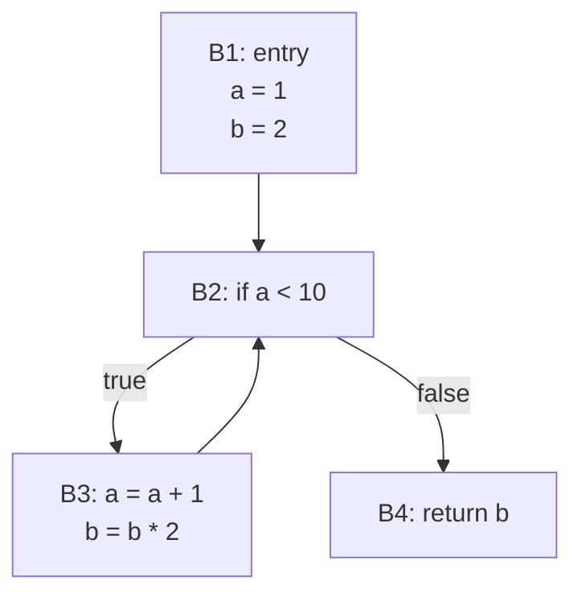
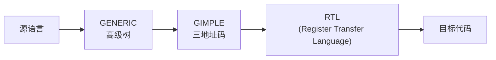

# 中间表示 (Intermediate Representation)

## 一、概述

中间表示 (Intermediate Representation, IR) 是编译器中连接前端（词法/语法/语义分析）和后端（代码生成/优化）的桥梁。IR 独立于源语言和目标机器，便于优化和代码生成。

### IR 的设计目标

1. **易于生成**：从语法树翻译简单
2. **易于优化**：支持数据流分析、控制流分析
3. **长度适** 中：比高级语言更底层，比汇编更高级
4. **与机器无关**：可在不同目标架构间复用

### IR 的分类



## 二、抽象语法树 (AST)

### 2.1 AST 结构

AST 是语法分析的结果，省略了不重要的语法细节（如分号、括号）。

```
表达式： (a + b) * 3

AST:
      (*)
     /   \
   (+)    3
  /   \
 a     b
```

### 2.2 AST 的节点类型

| 节点类型 | 示例 | 子节点 |
|----------|------|--------|
| BinaryOp | +, -, *, / | left, right |
| UnaryOp | -, !, ~ | operand |
| Number | 42, 3.14 | value |
| Variable | a, b | name, symbol |
| Assign | = | target, value |
| IfStmt | if-else | cond, then, else |
| WhileStmt | while | cond, body |

### 2.3 AST 树结构示例



## 三、三地址码 (Three-Address Code, TAC)

### 3.1 基本形式

每条指令最多包含三个操作数（一个目标、两个源）：
$$x = y \;\text{op}\; z$$

### 3.2 指令类型

| 指令 | 形式 | 示例 |
|------|------|------|
| 赋值 | x = y | t1 = a |
| 二元运算 | x = y op z | t2 = t1 + b |
| 一元运算 | x = op y | t3 = -t2 |
| 数组访问 | x = y[i] | t4 = a[i] |
| 数组写入 | x[i] = y | a[i] = t4 |
| 指针访问 | x = *y | t5 = *ptr |
| 指针写入 | *x = y | *ptr = t5 |
| 条件跳转 | if x relop y goto L | if t1 < 10 goto L1 |
| 无条件跳转 | goto L | goto L2 |
| 函数调用 | call f, args | call foo(a, b) |
| 函数返回 | return x | return t6 |

### 3.3 三地址码的表示方式

| 表示法 | 四元组 | 三元组 | 间接三元组 |
|--------|--------|--------|-----------|
| 存储 | (op, arg1, arg2, result) | (op, arg1, arg2) | 指针表+三元组 |
| 灵活性 | 易于修改 | 引用复杂 | 易于优化 |
| 空间 | 较大 | 紧凑 | 较紧凑 |

四元组示例：
```
(+, a, b, t1)
(*, t1, c, t2)
(=, t2, , result)
```

## 四、静态单赋值形式 (SSA)

### 4.1 SSA 核心思想

SSA 形式要求每个变量只赋值一次，通过 $\phi$ 函数 (Phi Function) 处理控制流合并点。



### 4.2 转换为 SSA

SSA 构建算法：

1. **计算支配边界** (Dominance Frontier)
2. **插入 $\phi$ 函数**：在支配边界处
3. **变量重命名**：每次赋值生成新版本

支配关系定义：
$$d \text{ dominates } n \iff \text{所有从入口到 } n \text{ 的路径都经过 } d$$

### 4.3 SSA 的优势

| 优势 | 说明 |
|------|------|
| 明确的定值-使用链 | 每个使用点可直接定位到唯一定义 |
| 简化数据流分析 | 无需到达定值分析 |
| 优化效率提升 | 常量传播、死代码消除更简单 |
| 便于增量更新 | $\phi$ 函数隔离控制流影响 |

### 4.4 SSA 上的优化



SSA 销毁：将 $\phi$ 函数转换为拷贝指令。

## 五、控制流图 (Control Flow Graph, CFG)

### 5.1 基本块 (Basic Block)

基本块是满足以下条件的最大指令序列：
1. **单入口**：只能从第一条指令进入
2. **单出口**：只能在最后一条指令退出
3. **连续执行**：内部无跳转/分支

### 5.2 CFG 的构造



### 5.3 支配树 (Dominator Tree)

```
CFG 中节点 d 支配 n:
- d 在从 entry 到 n 的所有路径上
- 直接支配者：最接近的支配者
- 支配树：直接支配关系构成的树
```

### 5.4 循环检测

基于 CFG 的自然循环：
- 存在回边 (Back Edge) $m \to n$，其中 $n$ 支配 $m$
- 循环头 (Loop Header)：回边目标 $n$
- 循环体：所有能被 $n$ 到达且不经过 $n$ 退出

## 六、现代 IR 系统

### 6.1 LLVM IR

LLVM IR 同时是 SSA 形式和低级 IR：

```
define i32 @add(i32 %a, i32 %b) {
entry:
  %sum = add i32 %a, %b
  ret i32 %sum
}
```

| 特性 | LLVM IR |
|------|---------|
| 类型系统 | 强类型，支持指针、向量 |
| 内存模型 | load/store 模型 |
| SSA | 函数内 SSA |
| 元数据 | 调试信息、优化提示 |

### 6.2 GCC GIMPLE

GCC 使用 GENERIC → GIMPLE → RTL 三级 IR：



GIMPLE 特点：
- 不超过 3 个操作数
- 无复杂的嵌套表达式
- 显式的控制流
- 支持 SSA 形式

### 6.3 Java Bytecode / .NET IL

字节码是面向栈的 IR，适合跨平台：

```
iload_1     // 加载局部变量 1
iload_2     // 加载局部变量 2
iadd        // 栈顶两数相加
ireturn     // 返回结果
```

## 七、IR 设计实践

1. **选择合适粒度**：高级 IR 更适合前端优化，低级 IR 更适合后端
2. **SSA 优先**：现代编译器普遍采用 SSA 作为核心 IR
3. **可扩展性**：IR 应支持添加新的优化 pass
4. **内存效率**：紧凑的 IR 表示减少内存占用
5. **调试支持**：保留源位置信息便于调试
6. **增量编译**：支持模块化和增量重构
