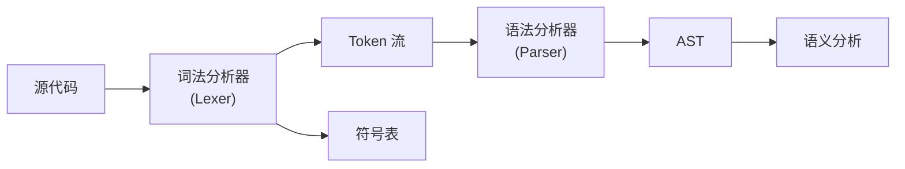
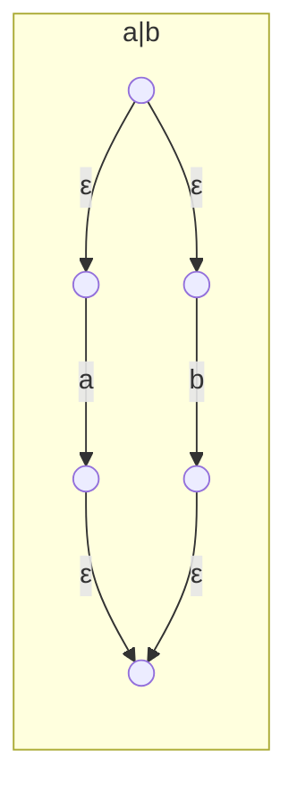

# 词法分析 (Lexical Analysis)

## 一、概述

词法分析 (Lexical Analysis) 是编译器的第一阶段，将源程序的字符序列转换为有意义的词素序列 (Token Stream)。输入是源代码字符串，输出是供语法分析使用的 Token 序列。

### 1.1 词法分析器位置



### 1.2 Token 的组成

每个 Token 包含：
$$Token = (type, value, position)$$

| 属性 | 说明 | 示例 |
|------|------|------|
| type | Token 类型 | KEYWORD, IDENTIFIER, NUMBER |
| value | 具体词素 | "int", "count", "42" |
| position | 源代码位置 | (行号, 列号) |

## 二、词法单元分类

### 2.1 常见 Token 类型

| 类别 | 示例 | 正则表达式 |
|------|------|-----------|
| 关键字 (Keywords) | if, else, while, int | `if|else|while|int` |
| 标识符 (Identifiers) | count, sum, _tmp | `[a-zA-Z_]\w*` |
| 字面量 (Literals) | 42, 3.14, "hello" | `\d+`, `"[^"]*"` |
| 运算符 (Operators) | +, -, *, =, == | `\+|-|\*|=|==` |
| 分隔符 (Delimiters) | ;, {, }, (, ) | `;|{|}|\(|\)` |
| 注释 (Comments) | // ..., /* ... */ | `//.*` |
| 空白 (Whitespace) | 空格, 制表符, 换行 | `[ \t\n]+` |

### 2.2 Token 与词素的关系

- **词素** (Lexeme)：源代码中匹配模式的字符序列
- **Token**：词素的抽象分类（可能带有属性值）
- **模式** (Pattern)：描述词素形式的规则（通常用正则表达式）

```
词素:   "while"   "i"    " "   "<"   " "   "10"
Token:  while     id           op           num
        (KEYWORD) (IDENT)     (OP)          (NUM)
```

## 三、正则表达式与有限自动机

### 3.1 正则表达式基础

| 运算 | 符号 | 含义 |
|------|------|------|
| 连接 | $ab$ | a 后跟 b |
| 选择 | $a\|b$ | a 或 b |
| Kleene 星 | $a^*$ | 零个或多个 a |
| Kleene 加 | $a^+$ | 一个或多个 a |
| 可选 | $a?$ | 零个或一个 a |

### 3.2 从正则到 NFA

Thompson 构造法将正则表达式转换为 NFA：



### 3.3 从 NFA 到 DFA

子集构造法 (Subset Construction)：

1. DFA 的每个状态对应 NFA 的状态集合
2. 初态：$N_0$ 的 $\epsilon$-闭包
3. 转移：对每个字符 $c$，计算 $\epsilon \text{-closure}(move(S, c))$
4. 接受态：包含 NFA 接受状态的集合

### 3.4 DFA 最小化

Hopcroft 算法通过划分合并等价状态，得到最小 DFA。

## 四、词法分析器生成器

### 4.1 Lex / Flex

Lex 定义格式：
```
%{
/* C 头文件和声明 */
%}
%%
/* 模式-动作规则 */
[0-9]+      { return NUMBER; }
[a-zA-Z]+   { return ID; }
[ \t\n]     { /* 忽略空白 */ }
.           { return ERROR; }
%%
/* 辅助函数 */
```

### 4.2 冲突解决规则

| 规则 | 说明 |
|------|------|
| 最长匹配 (Longest Match) | 取能匹配的最长输入 |
| 规则优先级 | 先出现的模式优先级更高 |

## 五、错误处理

### 5.1 词法错误类型

| 错误类型 | 示例 | 处理策略 |
|----------|------|---------|
| 非法字符 | `@` 在 C 中 | 报告错误并继续扫描 |
| 字符串未结束 | `"hello` | 报告并在行尾自动终止 |
| 数字格式错误 | `0xGG` | 报告并尝试恢复 |

### 5.2 错误恢复策略

1. **恐慌模式** (Panic Mode)：跳过字符直到找到分隔符
2. **删除字符**：尝试删除非法字符
3. **插入字符**：尝试插入缺失字符
4. **替换字符**：尝试替换为合法字符

## 六、手写词法分析器

### 6.1 基于状态机的实现

```mermaid
flowchart TD
    S0["START"] -->|"字母/_"| S1["IN_ID"]
    S0 -->|"数字"| S2["IN_NUM"]
    S0 -->|'"'| S3["IN_STRING"]
    S0 -->|"/"| S4["AFTER_SLASH"]
    S0 -->|"其他"| S5["SINGLE_CHAR"]
    S1 -->|"字母/数字/_"| S1
    S1 -->|"其他"| S6["返回ID"]
    S2 -->|"数字"| S2
    S2 -->|"其他"| S7["返回NUM"]
    S3 -->|'"'| S8["返回STRING"]
    S3 -->|"\\"| S9["ESCAPE"]
    S4 -->|"/"| S10["LINE_COMMENT"]
    S4 -->|"*"| S11["BLOCK_COMMENT"]
```

### 6.2 关键字处理

关键字与标识符的区分策略：

| 策略 | 说明 | 复杂度 |
|------|------|--------|
| 直接比较 | 识别出标识符后查表 | $O(\text{len})$ |
| 哈希表 | 关键字表快速查找 | $O(1)$ 平均 |
| Trie 树 | 前缀树匹配 | $O(\text{len})$ |

## 七、现代扩展

### 7.1 Unicode 支持

- UTF-8 编码的灵活字符处理
- Unicode 标识符（如中文变量名）
- 多字节字符边界的正确处理

### 7.2 增量词法分析

| 优势 | 实现方式 |
|------|---------|
| IDE 语法高亮 | 仅重新扫描修改部分 |
| 重构工具 | 维护 Token 缓存 |
| 实时检查 | 后台持续增量分析 |

### 7.3 上下文相关的词法分析

某些语言中，词法分析依赖上下文信息：
- C/C++ 的 `<<` 或 `>>` 作为流运算符而非移位
- Python 的缩进产生 INDENT/DEDENT Token
- Template 中的 `<` 与泛型参数符号

## 八、性能优化

1. **缓冲读取** (Buffered I/O)：减少系统调用
2. **字符分类表**：预计算字符类别（字母、数字、空白）
3. **直接编码 DFA**：状态转移用 table-driven 或直接代码
4. **回退最小化**：减少 ungetc 操作
5. **并行词法分析**：利用多核分段扫描（处理边界重叠）
6. **惰性计算** (Lazy Evaluation)：按需获取 Token，避免一次性全部扫描
