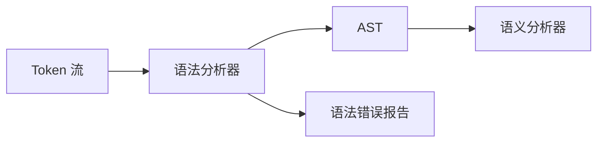
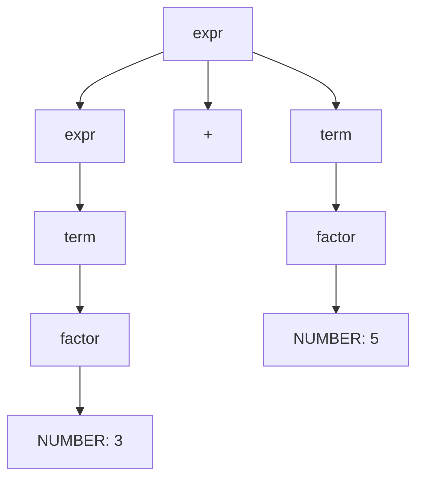

---
aliases: [Parsing]
tags: ['05_ComputerScience', 'CompilerPrinciples']
created: 2026-05-17
updated: 2026-05-17
---

# 语法分析 (Parsing)

## 一、概述

语法分析 (Parsing) 是编译器的第二阶段，接收词法分析输出的 Token 序列，根据文法规则构造语法分析树 (Parse Tree) 或抽象语法树 (AST)。

### 1.1 编译器中的定位



### 1.2 语法分析器的要求

| 要求 | 说明 |
|------|------|
| 正确性 | 准确识别合法/非法程序 |
| 效率 | 线性时间复杂度 $O(n)$ |
| 错误恢复 | 报告语法错误并继续分析 |
| 健壮性 | 处理各类边界情况 |

## 二、上下文无关文法 (CFG)

### 2.1 形式化定义

文法 $G = (V, T, P, S)$：
- $V$：非终结符 (Non-terminal) 集合
- $T$：终结符 (Terminal) 集合，$V \cap T = \emptyset$
- $P$：产生式 (Production) 集合，形式 $A \to \alpha$，其中 $A \in V, \alpha \in (V \cup T)^*$
- $S \in V$：起始符号 (Start Symbol)

### 2.2 BNF 与 EBNF

**BNF (Backus-Naur Form)**：
```
expr    → expr '+' term | term
term    → term '*' factor | factor
factor  → '(' expr ')' | NUMBER
```

**EBNF** 扩展：使用 `*`、`+`、`?`、`(...)` 等元符号：
```
expr   → term ('+' term)*
term   → factor ('*' factor)*
factor → NUMBER | '(' expr ')'
```

### 2.3 推导 (Derivation)

- **最左推导** (Leftmost Derivation)：每次替换最左非终结符
- **最右推导** (Rightmost Derivation)：每次替换最右非终结符

$$expr \Rightarrow_{lm} expr + term \Rightarrow_{lm} term + term \Rightarrow_{lm} factor + term \Rightarrow_{lm} NUMBER + term$$

### 2.4 语法分析树 (Parse Tree)



AST 省略了推导中的中间节点，仅保留核心语法结构。

## 三、自顶向下分析 (Top-Down Parsing)

### 3.1 递归下降分析 (Recursive Descent)

每个非终结符对应一个函数，函数间相互递归调用：

```python
def parse_expr():
    parse_term()
    while token == '+':
        consume('+')
        parse_term()

def parse_term():
    parse_factor()
    while token == '*':
        consume('*')
        parse_factor()

def parse_factor():
    if token == NUMBER:
        consume(NUMBER)
    elif token == '(':
        consume('(')
        parse_expr()
        consume(')')
    else:
        error("expected NUMBER or '('")
```

局限性：不能处理左递归（如 `expr → expr + term`）。需要消除左递归：

$$A \to A\alpha \mid \beta \quad\Rightarrow\quad
\begin{cases}
A \to \beta A' \\
A' \to \alpha A' \mid \epsilon
\end{cases}$$

### 3.2 LL(1) 分析

LL(1) = Left-to-right scan + Leftmost derivation + 1 token lookahead。

**FIRST 集**：可以从 $\alpha$ 推导出的第一个终结符集合。

$$FIRST(X) = \{a \in T \mid X \Rightarrow^* a\beta\} \cup \{\epsilon \mid X \Rightarrow^* \epsilon\}$$

**FOLLOW 集**：在推导中可能出现在 $A$ 右侧的第一个终结符集合。

$$FOLLOW(A) = \{a \in T \mid S \Rightarrow^* \alpha A a \beta\} \cup \{\$ \mid S \Rightarrow^* \alpha A\}$$

**LL(1) 分析表**：$M[A, a]$ 决定非终结符 $A$ 遇到输入 $a$ 时使用哪个产生式。

```mermaid
flowchart TD
    A[A 遇到 a] --> B{查表 M[A,a]}
    B -->|有产生式| C[展开产生式]
    B -->|空| D[语法错误]
    B -->|同步| E[错误恢复]
```

### 3.3 LL(1) 文法的条件

文法 $G$ 是 LL(1) 的当且仅当对任意两个不同产生式 $A \to \alpha \mid \beta$：

1. $FIRST(\alpha) \cap FIRST(\beta) = \emptyset$
2. 若 $\epsilon \in FIRST(\beta)$，则 $FIRST(\alpha) \cap FOLLOW(A) = \emptyset$
3. 若 $\epsilon \in FIRST(\alpha)$，则 $FIRST(\beta) \cap FOLLOW(A) = \emptyset$

## 四、自底向上分析 (Bottom-Up Parsing)

### 4.1 移进-归约 (Shift-Reduce)

维护一个栈，四个核心操作：

| 操作 | 动作 | 栈变化 |
|------|------|--------|
| 移进 (Shift) | 将输入移入栈 | $栈 \mid input$ |
| 归约 (Reduce) | 按产生式替换 | $栈$ 中的句柄 |
| 接受 (Accept) | 分析成功 | — |
| 报错 (Error) | 语法错误 | — |

句柄 (Handle) 是最右句型中匹配产生式右侧的子串，归约后替换为左侧非终结符。

### 4.2 LR 分析器

LR = Left-to-right scan + Rightmost derivation（逆序）。

```mermaid
flowchart TD
    A[输入 + 状态栈] --> B[查 LR 分析表]
    B -->|action[s, a]| C{动作类型}
    C -->|shift s'| D[移进: 新状态入栈]
    C -->|reduce A→β| E[归约: 弹出 |β| 个状态]
    E --> F[查 goto 表, 新状态入栈]
    C -->|accept| G[分析成功]
    C -->|error| H[错误处理]
    D --> B
    F --> B
```

### 4.3 LR 变体对比

| 变体 | 分析表大小 | 文法覆盖范围 | 说明 |
|------|-----------|-------------|------|
| LR(0) | 小 | 最弱 | 无向前看，能力有限 |
| SLR(1) | 中 | 比 LR(0) 强 | 使用 FOLLOW 集解决冲突 |
| LR(1) | 最大 | 最强 | 对每个项目带向前看符号 |
| LALR(1) | 中 | 接近 LR(1) | 合并 LR(1) 的同芯状态 |

能力关系：$LR(0) \subset SLR(1) \subset LALR(1) \subset LR(1)$

### 4.4 冲突处理

| 冲突类型 | 含义 | 解决方法 |
|----------|------|----------|
| 移进-归约 | 可移进或归约 | 运算符优先级、assoc 声明 |
| 归约-归约 | 多条产生式可归约 | 修改文法 |

运算符优先级示例：
```
%left '+' '-'
%left '*' '/'
%right '^'
```

## 五、Parser 生成器

| 工具 | 算法 | 输出语言 | 特点 |
|------|------|----------|------|
| Yacc / Bison | LALR(1) | C | Unix 标准，成熟 |
| ANTLR | LL(*) | Java/Python/C# | 支持多语言，自动错误恢复 |
| Lemon | LALR(1) | C | 类似 Bison，无全局变量 |
| Menhir | LR(1) | OCaml | 支持增量式解析 |
| PEG 解析器 | Packrat | 多种 | 无歧义文法，回溯 |

### 5.1 Yacc/Bison 示例

```yacc
%{
#include <stdio.h>
%}

%token NUMBER

%%
expr: expr '+' term { $$ = $1 + $3; }
    | term          { $$ = $1; }
    ;

term: term '*' factor { $$ = $1 * $3; }
    | factor          { $$ = $1; }
    ;

factor: NUMBER     { $$ = $1; }
      | '(' expr ')' { $$ = $2; }
      ;
%%
```

## 六、错误恢复 (Error Recovery)

### 6.1 Panic Mode

跳过输入直到找到同步 Token（如 `;`、`}`、`end`）。

### 6.2 短语级恢复

在局部范围内插入、删除或替换 Token 来修复错误。

```text
if (a < b) then  →  删除 then
a = b + ;       →   插入操作数
```

### 6.3 自动生成错误处理

Yacc 的 `error` 产生式：

```yacc
stmt: error ';' { yyerror("syntax error"); yyerrok; }
```

## 七、抽象语法树 (AST) 构建

在语法分析的同时构建 AST，每个归约操作创建对应节点：

```python
class ASTNode:
    def __init__(self, type, children=None, value=None):
        self.type = type
        self.children = children or []
        self.value = value

def build_ast(tokens):
    """递归下降 + AST 构建"""
    def parse_expr():
        left = parse_term()
        while token == '+':
            consume('+')
            right = parse_term()
            left = ASTNode('Add', [left, right])
        return left
    # ...
```

## 相关条目
- [[LexicalAnalysis]]
- [[SemanticAnalysis]]
- [[CodeGeneration]]
- [[05_ComputerScience/TheoryOfComputation/FormalLanguages|FormalLanguages]]
- [[INDEX|当前目录索引]]

