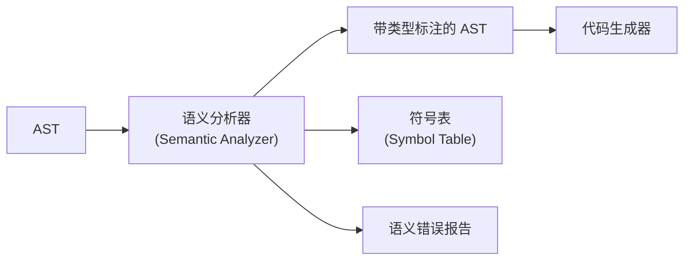
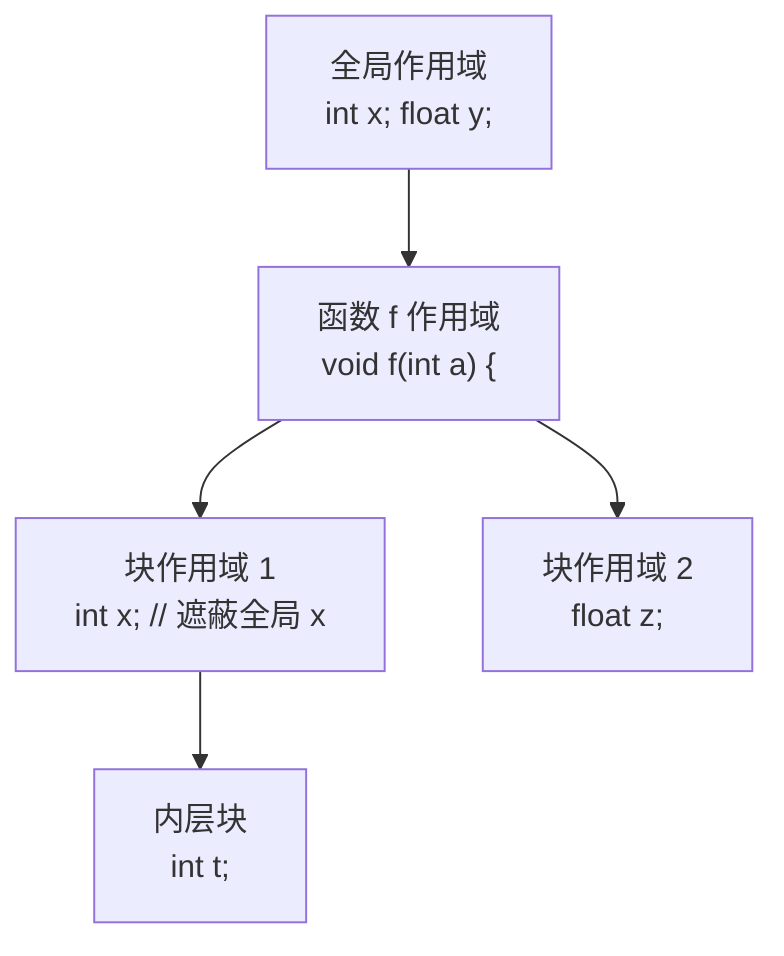
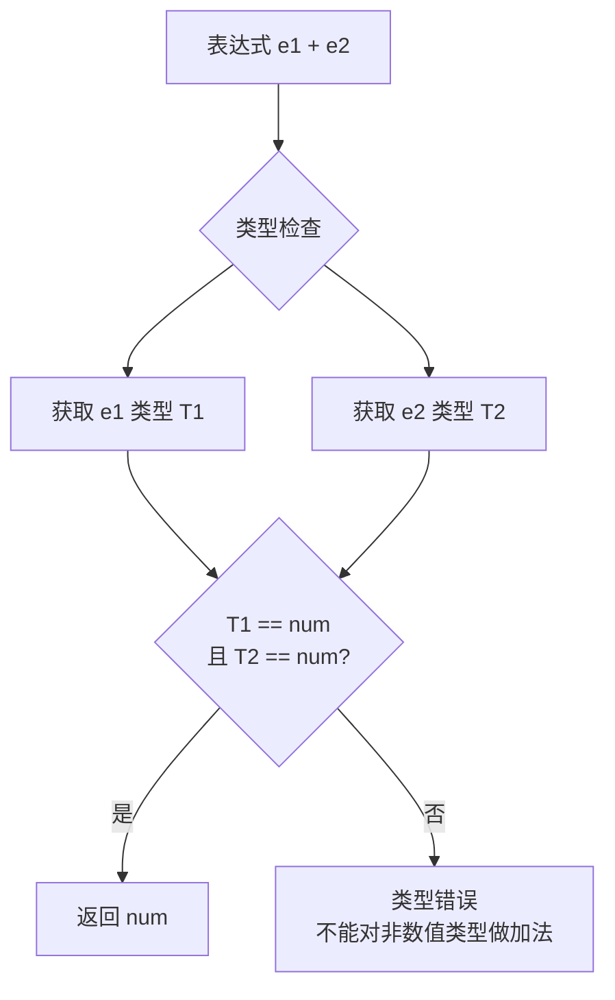
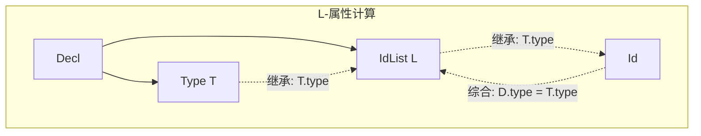

# 语义分析 (Semantic Analysis)

## 一、概述

语义分析是编译器的第三阶段，在语法分析的基础上检查程序的语义正确性，收集类型和绑定信息供后续阶段使用。

### 1.1 语义分析器定位

### 1.2 主要检查内容

| 检查类型 | 示例 | 错误信息 |
|----------|------|---------|
| 类型错误 | `"hello" + 42` | 类型不匹配 |
| 作用域错误 | 使用未声明变量 | 未定义的标识符 |
| 参数错误 | 函数参数数量/类型不符 | 参数不匹配 |
| 返回类型错误 | 函数缺少 return | 缺少返回值 |
| 重复声明 | 同一作用域同名变量 | 重复定义 |

## 二、符号表 (Symbol Table)

### 2.1 符号表结构

符号表记录标识符的属性信息：

| 属性 | 说明 | 示例 |
|------|------|------|
| name | 标识符名称 | "count" |
| type | 数据类型 | int, float, struct |
| scope | 作用域层级 | 全局/局部 |
| kind | 种类 | 变量/函数/类型 |
| address | 存储地址或偏移量 | 栈偏移 8 |

### 2.2 作用域管理

### 2.3 实现方式

| 数据结构 | 操作复杂度 | 适用场景 |
|----------|-----------|---------|
| 哈希表+栈 | 插入/查找 $O(1)$ | 通用 |
| 线性列表 | 插入 $O(1)$, 查找 $O(n)$ | 小型作用域 |
| 树结构 | $O(\log n)$ | 持久化符号表 |
| 嵌套表 | 分层查找 | 支持嵌套作用域 |

## 三、类型检查 (Type Checking)

### 3.1 类型系统

类型系统的维度：

| 维度 | 分类 | 说明 |
|------|------|------|
| 检查时机 | 静态/动态 | 编译时 vs 运行时 |
| 类型推断 | 显式/隐式 | 是否需要类型注解 |
| 安全性 | 强/弱 | 隐式类型转换限制 |
| 等价性 | 结构/名称 | 类型相等判定方式 |

### 3.2 类型检查规则

常见类型规则（类型推演系统）：

$$\frac{\Gamma \vdash e_1: \text{int}, \quad \Gamma \vdash e_2: \text{int}}{\Gamma \vdash e_1 + e_2: \text{int}}$$

$$\frac{\Gamma \vdash e: \text{type}, \quad \Gamma \vdash \text{stmt}_1, \; \text{stmt}_2}{\Gamma \vdash \text{if } (e) \; \text{stmt}_1 \; \text{else} \; \text{stmt}_2}$$

### 3.3 类型等价性

| 等价策略 | 含义 | 示例 |
|----------|------|------|
| 名称等价 | 只有同名类型等价 | `struct Point` 和 `struct Point` |
| 结构等价 | 相同字段即为等价 | `{x:int, y:int}` 与 `{a:int, b:int}` 不等价 |
| 声明等价 | 同一声明引入的类型等价 | `type T1 = int; type T2 = int;` 不等价 |

### 3.4 类型推导 (Type Inference)

Hindley-Milner 类型推导系统：
1. 为每个表达式生成类型变量
2. 建立类型约束方程
3. 通过合一 (Unification) 求解约束

$$\text{let } f = \lambda x. x + 1 $$
$$\Rightarrow f: \text{int} \to \text{int}$$

## 四、属性文法 (Attribute Grammar)

### 4.1 综合属性与继承属性

| 属性类型 | 计算方向 | 示例 |
|----------|---------|------|
| 综合 (Synthesized) | 子→父 | 表达式的类型 |
| 继承 (Inherited) | 父→子 | 变量的作用域 |

### 4.2 L-属性文法

属性文法用于语义分析的经典场景：
- 类型检查：综合属性传递类型信息
- 作用域管理：继承属性传递环境
- 翻译：属性值指导代码生成

## 五、语义错误处理

### 5.1 常见错误类型

| 错误类别 | 具体错误 | 检测方法 |
|----------|---------|---------|
| 类型不匹配 | 字符串赋值给整数 | 类型检查 |
| 未声明变量 | 使用未定义标识符 | 符号表查询 |
| 作用域违规 | 外部访问局部变量 | 作用域链检查 |
| 函数调用错误 | 参数个数/类型错误 | 函数签名比对 |
| 赋值左值错误 | 对常量赋值 | 左值分析 |

### 5.2 错误恢复策略

1. **错误类型纠正**：将错误类型替换为通用类型
2. **插入假符号**：为未声明变量插入假符号（继续分析）
3. **最小化错误传播**：避免单个错误产生大量连锁报告
4. **错误分级**：区分错误 (Error) 和警告 (Warning)

## 六、语义分析与编译优化

### 6.1 常量折叠 (Constant Folding)

在语义分析阶段评估常量表达式：
$$3 + 4 \times 2 \longrightarrow 11$$

### 6.2 冗余检查

| 检查项 | 说明 |
|--------|------|
| 不可达代码 | return 后的语句 |
| 无用赋值 | 被后续覆盖的变量赋值 |
| 空函数体 | 非虚函数的空实现 |

## 七、现代语言中的语义分析

| 语言 | 类型系统特性 | 语义分析实现 |
|------|------------|-------------|
| Haskell | 全局类型推导 | Hindley-Milner |
| Rust | 所有权+借用 | 借用检查器 |
| TypeScript | 渐进类型 | 结构化类型检查 |
| Go | 结构化类型 | 接口满足性检查 |
| Java | 声明类型 | JLS 规范检查 |

## 八、工具与实践

1. **AST 可视化**：使用树形结构展示分析结果
2. **增量语义分析**：IDE 中支持代码修改后快速重分析
3. **交互式类型查询**：Hover 时显示表达式类型
4. **语义补全**：基于符号表提供代码补全建议
5. **错误信息设计**：定位准确、提示明确的错误报告
6. **类型推断辅助**：减少冗余类型注解，提升开发效率
