# 渲染技术 (Rendering)

## 一、概述 (Overview)

渲染（Rendering）是将 3D 场景描述（几何、材质、光照、相机）转换为 2D 图像的过程，是计算机图形学的核心。渲染的质量和速度直接影响游戏、电影、VR/AR、CAD 等应用的体验。渲染算法需要在真实感（Realism）和性能（Performance）之间做出权衡。

### 渲染管线 (Rendering Pipeline)

```mermaid
graph LR
    subgraph "应用阶段"
        SCENE[场景数据] --> CULL[视锥裁剪 Frustum Culling]
        CULL --> LOD[LOD 选择 Level of Detail]
        LOD --> BD[批次处理 Batch]
    end
    subgraph "几何阶段 Geometry Stage"
        BD --> VS[顶点着色器 Vertex Shader<br/>MVP 变换、顶点属性]
        VS --> TESS[细分曲面 Tessellation<br/>Hull/Domain Shader]
        TESS --> GS[几何着色器 Geometry Shader<br/>点/线/三角扩展]
        GS --> RAST[光栅化 Rasterization<br/>三角形→片元]
    end
    subgraph "像素阶段 Pixel Stage"
        RAST --> FS[片元着色器 Fragment Shader<br/>光照、纹理、颜色]
        FS --> TEST[逐片元测试<br/>深度/模板/Alpha 测试]
        TEST --> BLEND[混合 Blending<br/>透明度、雾效]
        BLEND --> FB[帧缓冲 Frame Buffer<br/>颜色/深度/模板缓冲]
    end
    FB --> OUT[输出到屏幕 Display]
```



## 二、渲染方法分类 (Rendering Methods)

| 方法 | 原理 | 真实感 | 性能 | 典型帧率 | 应用 |
|------|------|--------|------|---------|------|
| **光栅化** | 三角形投影 → 逐像素着色 | 中 | 实时 | 60-240 FPS | 游戏、3D 编辑器 |
| **光线追踪** | 模拟光线物理传播 | 高 | 实时~离线 | 30-60 FPS (RTX) | 3A 游戏 VFX |
| **路径追踪** | 蒙特卡洛积分采样光路 | 最高 | 离线 | 帧/分钟~小时 | 电影 VFX |
| **辐射度 (Radiosity)** | 漫反射面能量传递 | 高（漫反射 GI）| 离线 | — | 室内灯光设计 |
| **体渲染 (Volume)** | 体数据采样/光线投射 | 中高 | 中 | — | CT/MRI 可视化 |
| **NeRF** | 神经网络隐式场景 | 高 | 慢 | 分钟/帧 | 3D 重建 |

### 渲染技术选择权衡

$$\text{渲染方程计算量} + \text{后处理} + \text{显示} \leq \frac{1}{\text{Target FPS}}$$

对于 60 FPS 实时渲染：每帧预算约 16.67 ms。

## 三、光栅化渲染管线细节 (Rasterization Pipeline Details)

### 顶点变换矩阵 (Vertex Transformation)

从局部坐标系到屏幕坐标系的完整变换序列：

$$M_{MVP} = M_{proj} \times M_{view} \times M_{model}$$

$$P_{clip} = M_{MVP} \times P_{local}$$

透视投影矩阵（OpenGL 惯用手）：
$$M_{proj} = \begin{bmatrix}
\frac{1}{r \cdot \tan(\frac{fov}{2})} & 0 & 0 & 0 \\
0 & \frac{1}{\tan(\frac{fov}{2})} & 0 & 0 \\
0 & 0 & -\frac{z_{far}+z_{near}}{z_{far}-z_{near}} & -\frac{2 z_{far} z_{near}}{z_{far} - z_{near}} \\
0 & 0 & -1 & 0
\end{bmatrix}$$

### 光栅化 (Rasterization)

三角形覆盖检测——边缘函数（Edge Function）：
$$E(P) = (P_x - V_{0x}) \times (V_{1y} - V_{0y}) - (P_y - V_{0y}) \times (V_{1x} - V_{0x})$$

当 $E_0(P)$、$E_1(P)$、$E_2(P)$ 全部 $\geq 0$ 或全部 $\leq 0$ 时，P 在三角形内部。

### 深度缓冲 (Z-Buffer / Depth Buffer)

```text
初始化: depth(x, y) = 1.0 (远平面，NDC 坐标)

foreach fragment (x, y):
    计算 fragment.depth
    if fragment.depth < depth(x, y):
        depth(x, y) = fragment.depth
        color(x, y) = fragment.color
```

深度冲突（Z-fighting）：两个表面深度精度相近时产生交替闪烁。
- 使用更高深度缓冲（32-bit float 替代 24-bit）
- 使用 Reverse-Z（近平面 z=1，远平面 z=0）
- 应用深度偏移（`glPolygonOffset`）

## 四、光照模型 (Lighting Models)

### Blinn-Phong 光照模型

$$I = I_a \cdot k_a + \sum_{i=1}^{n} \left[ I_{d,i} \cdot k_d \cdot \max(0, \mathbf{n} \cdot \mathbf{l}_i) + I_{s,i} \cdot k_s \cdot \max(0, \mathbf{n} \cdot \mathbf{h}_i)^p \right]$$

其中 $\mathbf{h} = \frac{\mathbf{l} + \mathbf{v}}{\|\mathbf{l} + \mathbf{v}\|}$ 是半角向量，$\mathbf{v}$ 是视线方向。

衰减（Attenuation）：
$$f_{att} = \frac{1}{k_c + k_l \cdot d + k_q \cdot d^2}$$

$k_c$ 常数项、$k_l$ 线性项、$k_q$ 二次项，$d$ 距离。

### PBR (Physically Based Rendering)

基于物理的渲染使用 Cook-Torrance BRDF：
$$f_r(\omega_i, \omega_o) = \frac{F(\omega_i, h) \cdot G(\omega_i, \omega_o, h) \cdot D(h)}{4(\omega_i \cdot n)(\omega_o \cdot n)}$$

- **Fresnel 项 (F)**：使用 Schlick 近似 $F(\theta) = F_0 + (1 - F_0)(1 - \cos\theta)^5$
- **几何项 (G)**：Smith 模型，考虑微面元之间的相互遮蔽
- **法线分布项 (D)**：GGX/Trowbridge-Reitz $D(h) = \frac{\alpha^2}{\pi((\mathbf{n}\cdot\mathbf{h})^2(\alpha^2-1)+1)^2}$

### 环境贴图 (Environment Mapping)

使用立方体贴图或球面谐波（Spherical Harmonics）表示环境光照。辐照度贴图（Irradiance Map）预计算漫反射，镜面 IBL 使用预过滤环境贴图 + BRDF LUT。

## 五、光线追踪与路径追踪 (Ray Tracing & Path Tracing)

### Whitted 风格光线追踪

$$I = I_{local} + k_r \cdot I_{reflected} + k_t \cdot I_{transmitted}$$

光线的反射和折射方向：
$$\mathbf{r} = \mathbf{d} - 2(\mathbf{d} \cdot \mathbf{n})\mathbf{n} \quad \text{（反射）}$$

Snell 定律和折射方向由 $\eta_i \sin\theta_i = \eta_t \sin\theta_t$ 计算。

### 路径追踪——渲染方程

$$L_o(p, \omega_o) = L_e(p, \omega_o) + \int_{\Omega} f_r(p, \omega_i, \omega_o) L_i(p, \omega_i) (\omega_i \cdot n) d\omega_i$$

使用蒙特卡洛积分近似：
$$\langle L_o(p, \omega_o) \rangle = \frac{1}{N} \sum_{j=1}^N \frac{f_r(p, \omega_j, \omega_o) L_i(p, \omega_j) (\omega_j \cdot n)}{p(\omega_j)}$$

重要性采样（Importance Sampling）降低方差——按照 BRDF 或光源分布采样光线方向。

## 六、实时渲染优化

| 技术 | 描述 | 效果 |
|------|------|------|
| LOD (Level of Detail) | 距离远用低面模型 | 顶点数 $\propto 1/d^2$ |
| Frustum Culling | 丢弃视锥外的物体 | 减少渲染对象 30-70% |
| Occlusion Culling | 丢弃被遮挡的物体 | 额外减少 10-30% |
| GPU Instancing | 一次绘制多个相同物体 | Draw Call 数降为 1 |
| Deferred Shading | 先渲染几何属性再光照 | 光照复杂度 $O(n \times m) \rightarrow O(n + m)$ |
| TAA (Temporal AA) | 复用前一帧样本 | 抗锯齿质量高 |
| FSR / DLSS | 升采样（低分辨率渲染） | 性能提升 50-100% |

## 七、后处理效果 (Post-Processing Effects)

| 效果 | 原理 | 计算量 | 常见实现 |
|------|------|--------|---------|
| **HDR Tone Mapping** | 将 HDR (高动态范围) 颜色映射到 LDR 显示 | 低 | Reinhard/ACES/Filmic |
| **Bloom (泛光)** | 提取高亮区域 -> 高斯模糊 -> 叠加回原图 | 中 | 多级降采样模糊 |
| **SSAO (环境光遮蔽)** | 屏幕空间采样的近似环境遮蔽 | 中 | GTAO, HBAO+ |
| **Motion Blur (运动模糊)** | 沿运动方向混合像素 | 中 | 速度缓冲 + 模糊 |
| **Depth of Field (景深)** | 模糊焦外部分 | 中高 | 高斯模糊 + Coc + Bokeh |
| **Anti-Aliasing (抗锯齿)** | 减少锯齿边缘 | 低-高 | MSAA, FXAA, SMAA, TAA |
| **Screen Space Reflections** | 屏幕空间反射 | 高 | 光线步进 + 降噪 |
| **Color Grading (调色)** | 改变颜色风格 | 极低 | LUT (3D 查色表) |

### Tone Mapping 公式

Reinhard 全局色调映射：
$$L_d = \frac{L}{L + 1}$$

ACES Filmic Tone Mapping：
$$L_d = \frac{L \times (2.51L + 0.03)}{L \times (2.43L + 0.59) + 0.14}$$

## 八、实时渲染性能预算 (Performance Budget)

对于 60 FPS 实时渲染，每帧总预算约 16.67 ms，典型分配：

```text
CPU 预算 (~6ms):
  物理模拟:    1-2ms
  碰撞检测:    1-2ms
  Frustum Culling: 0.5-1ms
  Draw Call 提交: 1-2ms

GPU 预算 (~10ms):
  顶点处理:    1-2ms
  光栅化:      1-3ms
  像素着色:    3-5ms
  后处理:      1-2ms
  VSync/空泡:  1-3ms
```

LOD (Level of Detail) 距离阈值决策：
$$D_{LOD} = \frac{\text{Screen Coverage Threshold}}{\text{Object Size}}$$

## 九、渲染 API 对比 (Rendering APIs)

| API | 厂商 | 平台 | 编程模型 | 调试工具 | 版本 |
|------|------|------|---------|---------|------|
| **DirectX 12** | Microsoft | Windows/Xbox | 底层、显式控制 | PIX | 12 Ultimate |
| **Vulkan** | Khronos | 跨平台 | 底层、显式控制 | RenderDoc, Vulkan SDK | 1.3 |
| **OpenGL** | Khronos | 跨平台 | 高级、状态机 | RenderDoc | 4.6 (冻结) |
| **Metal** | Apple | macOS/iOS | 底层、ARC 管理 | Xcode GPU Debugger | 3.1 |
| **WebGPU** | W3C | Web | 跨平台、安全 | Chrome DevTools | 1.0 (2024) |
| **CUDA** | NVIDIA | NVIDIA GPU | GPGPU 通用计算 | Nsight | 12.x |

### 渲染 API 抽象层

```text
应用层:
  Game Engine → Unity/Unreal/Godot/Custom

图形 API 抽象:
  → DirectX 12 / Vulkan / Metal / WebGPU

驱动层:
  → GPU 厂商驱动 (NVIDIA/AMD/Intel/Apple)

硬件层:
  → GPU 硬件 (Raster/RT Core/Tensor Core/SIMD)
```

### Vulkan 渲染管线配置

Vulkan 的显式设计允许精细控制 GPU 资源：
- **Pipeline State Object (PSO)**：预编译管线状态
- **Descriptor Set**：资源绑定（纹理/Sampler/Uniform）
- **Command Buffer**：预先录制 GPU 指令列表
- **Fence/Semaphore**：CPU-GPU 和 GPU-GPU 同步原语

## 十、渲染性能分析工具 (Performance Profiling)

| 工具 | 平台 | 关键功能 |
|------|------|---------|
| **RenderDoc** | 跨平台 | 逐帧捕获、Shader 调试、资源查看 |
| **NVIDIA Nsight** | Windows | GPU 占用率、Warp 调度、内存带宽 |
| **AMD Radeon GPU Profiler** | Windows | 流水线分析、Occupancy 热图 |
| **Intel GPA** | Windows | 帧分析、带宽利用率、瓶颈定位 |
| **Apple Xcode GPU Frame Debugger** | macOS | Metal 帧捕获、Shader 性能 |
| **Chrome DevTools (GPU)** | 跨平台 | WebGL/WebGPU 帧分析 |

### 性能分析关键指标

```text
GPU 占用率 (GPU Busy %):      > 95% 表示 GPU 充分利用
Shader Occupancy (%):          > 50% 避免延迟隐藏不足
显存带宽利用率:                   > 60% 可能存在带宽瓶颈
Draw Call 数:                   < 2000 (移动端) / < 5000 (桌面)
顶点数/帧:                      < 500K (移动) / < 2M (桌面)
像素填充率 (Pixels/Frame):      分辨率相关，与带宽成正比
```

## 相关条目
- [[UserInterfaceDesign]]
- [[ParallelArchitecture]]
- [[05_ComputerScience/ComputerGraphicsAndVision/INDEX]]
