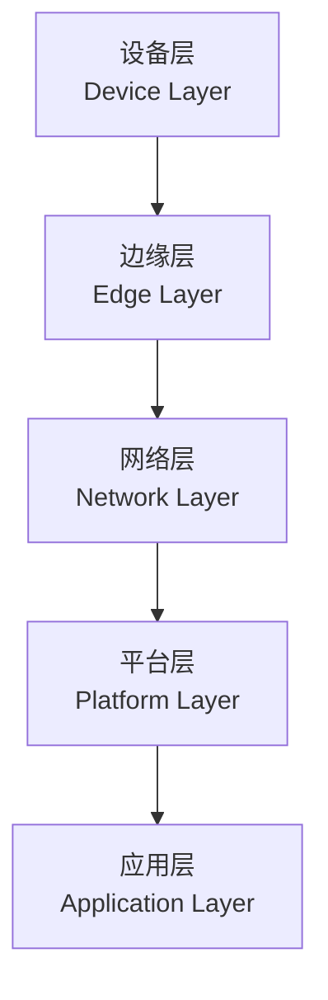
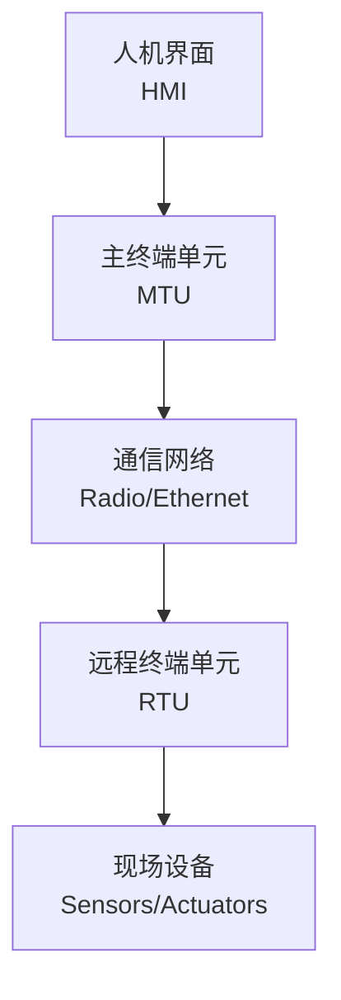
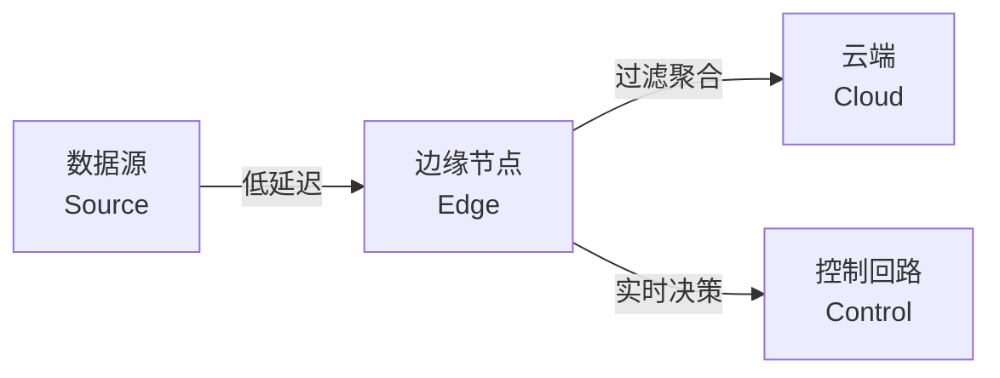
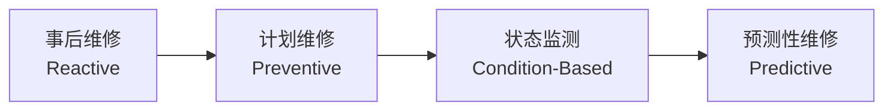

# 工业物联网 (Industrial IoT)

工业物联网（Industrial Internet of Things, IIoT）是将物联网技术应用于工业领域的高级形态，通过传感器、通信网络与数据分析技术的深度融合，实现生产设备的智能化互联与工业流程的数字化重塑。

## IIoT 的核心架构

工业物联网通常采用分层架构模型，从物理设备到云端应用逐层抽象：

### 各层功能概述

| 层级 | 核心组件 | 主要功能 |
|------|----------|----------|
| 设备层 | 传感器、执行器、PLC | 数据采集与物理控制 |
| 边缘层 | 边缘网关、边缘计算节点 | 本地预处理与实时响应 |
| 网络层 | 工业以太网、5G、TSN | 可靠低延迟数据传输 |
| 平台层 | IoT 平台、数据湖 | 设备管理、数据分析、AI 推理 |
| 应用层 | MES、ERP、数字孪生 | 业务逻辑与可视化呈现 |

## 传感器技术 (Sensor Technology)

传感器是 IIoT 的感知神经，负责将物理世界的模拟信号转换为数字数据。

### 常见工业传感器类型

| 传感器类型 | 测量对象 | 典型应用场景 |
|------------|----------|--------------|
| 温度传感器 | 温度（°C/°F） | 熔炉监控、冷链物流 |
| 压力传感器 | 压强（Pa/bar） | 液压系统、管道监测 |
| 振动传感器 | 加速度/位移 | 旋转机械健康监测 |
| 电流传感器 | 电流（A） | 电机负载监控 |
| 光电传感器 | 光强度/存在 | 生产线计数、质量检测 |
| 气体传感器 | 气体成分/浓度 | 环境监测、安全防护 |

### 信号处理基础

传感器采集的模拟信号需经过模数转换（ADC）才能进入数字系统。采样定理（Nyquist-Shannon Theorem）指出：

$$
f_s \\geq 2 \\cdot f_{max}
$$

其中 $f_s$ 为采样频率，$f_{max}$ 为信号最高频率分量。工业振动监测通常需要 kHz 级采样率以捕捉轴承故障特征。

## SCADA 与工业控制系统

监控与数据采集系统（SCADA, Supervisory Control And Data Acquisition）是 IIoT 的前身与重要组成部分。

### SCADA 架构

### OT 与 IT 的融合

运营技术（OT, Operational Technology）与信息技术（IT, Information Technology）的融合是 IIoT 的核心特征，但也带来了独特的安全挑战：

| 维度 | OT 环境 | IT 环境 |
|------|---------|---------|
| 首要目标 | 安全与可用性 | 机密性与完整性 |
| 系统寿命 | 10–20 年 | 3–5 年 |
| 更新频率 | 极少 | 频繁 |
| 网络隔离 | 物理隔离为主 | 高度互联 |
| 安全协议 | 多为专有协议 | 标准化协议 |

## 边缘计算 (Edge Computing)

边缘计算将计算能力下沉至数据源附近，解决云计算在实时性与带宽方面的瓶颈。

### 边缘计算的价值

边缘计算在工业场景中的关键优势：

- **毫秒级响应**：满足闭环控制的时间约束
- **带宽节约**：仅上传聚合后的特征数据
- **隐私保护**：敏感数据不出厂
- **离线运行**：网络中断时维持基本功能

### 边缘智能

边缘 AI（Edge AI）将机器学习模型部署至边缘设备，实现本地推理。模型压缩技术如量化（Quantization）与剪枝（Pruning）是关键：

$$
\\text{Quantized Weight} = \\text{round}\\left(\\frac{w - z}{s}\\right)
$$

其中 $s$ 为缩放因子，$z$ 为零点偏移。

## 工业 4.0 (Industry 4.0)

工业 4.0 是德国政府提出的制造业数字化战略，IIoT 是其技术基础。

### 九大技术支柱

| 技术领域 | 核心内涵 | IIoT 关联 |
|----------|----------|-----------|
| 自主机器人 | 协作机器人与人机协同 | 传感器反馈控制 |
| 增材制造 | 3D 打印与按需生产 | 工艺参数实时监控 |
| 增强现实 | AR 辅助装配与维修 | 视觉传感器融合 |
| 模拟仿真 | 数字孪生（Digital Twin） | 实时数据驱动模型 |
| 横向纵向集成 | 供应链全链路打通 | 跨企业数据互联 |
| 工业物联网 | 万物互联的工业网络 | 核心基础设施 |
| 云计算 | 弹性计算资源 | 海量数据存储分析 |
| 网络安全 | 零信任架构 | 设备身份认证 |
| 大数据分析 | 预测性洞察 | 机器学习平台 |

### 数字孪生 (Digital Twin)

数字孪生是物理实体在数字空间的实时映射，其数学本质为状态估计：

$$
\\hat{x}_{k|k} = \\hat{x}_{k|k-1} + K_k (z_k - H \\hat{x}_{k|k-1})
$$

这是卡尔曼滤波（Kalman Filter）的更新方程，$K_k$ 为卡尔曼增益，$z_k$ 为传感器观测值。

## 预测性维护 (Predictive Maintenance)

预测性维护是 IIoT 最具价值的应用场景之一，通过数据分析预测设备故障，实现「按需维护」。

### 维护策略演进

### 故障预测方法

| 方法 | 数据需求 | 适用场景 |
|------|----------|----------|
| 基于阈值 | 单变量实时数据 | 温度、压力超限报警 |
| 基于统计 | 历史故障记录 | 可靠性分析、MTBF 估算 |
| 基于信号处理 | 高频振动/电流 | 旋转机械轴承故障 |
| 基于机器学习 | 多传感器时序数据 | 复杂非线性退化模式 |

剩余使用寿命（RUL, Remaining Useful Life）预测是预测性维护的核心指标。基于退化模型的 RUL 估计：

$$
\\text{RUL}(t) = \\inf\\{\\tau > 0 \mid D(t + \\tau) \\geq D_{threshold}\\}
$$

其中 $D(t)$ 为时刻 $t$ 的退化指标。

工业物联网正在重塑全球制造业的竞争格局。从智能工厂到智慧供应链，从预测性维护到能源优化，IIoT 技术将物理世界的效率提升至前所未有的高度。然而，网络安全、数据主权与标准互操作性等挑战仍需产业界与学术界共同努力解决。
