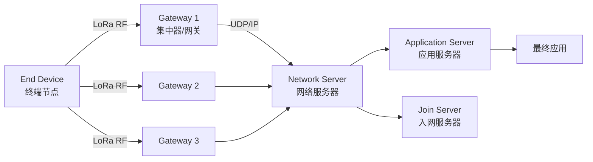
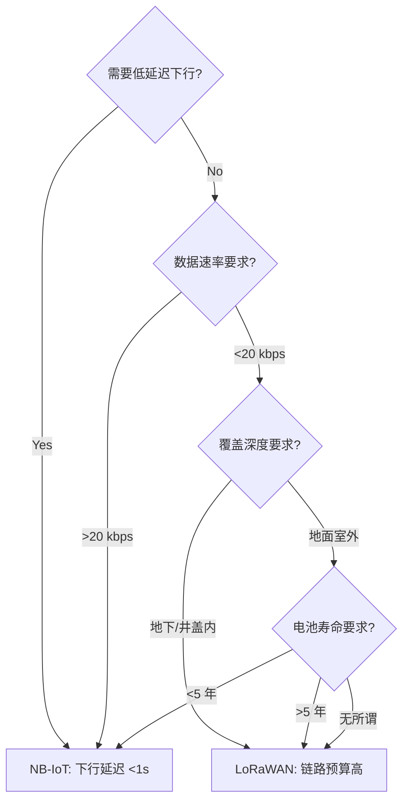

# LoRaWAN 协议 (Long Range Wide Area Network)

## 一、概述 (Overview)

LoRaWAN 是为广域物联网（LPWAN, Low Power Wide Area Network）设计的低功耗远距离无线通信协议，使用 LoRa 扩频调制技术（CSS, Chirp Spread Spectrum），由 LoRa Alliance 标准化。与 NB-IoT、Sigfox 并列为三大 LPWAN 主流技术。

### LPWAN 技术核心指标对比

| 特性 | LoRaWAN | NB-IoT | Sigfox |
|------|---------|--------|--------|
| 频段许可 | **免授权 ISM 频段** | 授权蜂窝频段（需运营商 SIM）| 免授权 ISM 频段 |
| 信道带宽 | 125/250/500 kHz | 200 kHz | 100 Hz（超窄带 UNB）|
| 最大数据速率 | 50 kbps（SF7/BW500）| 250 kbps | 100 bps（极低速）|
| 链路预算 | 157 dB（SF12）| 164 dB | 151 dB |
| 电池寿命 | 5-10 年（每天发送 10 次）| 5-10 年 | 5-10 年 |
| 模组成本 | $2-5 | $5-10 | $1-3 |
| 网络部署 | 私有/公有网关 | 运营商基站 | 公有 Sigfox 基站 |
| 下行能力 | 有限（Class A 需上行触发）| 好 | 极有限（每天最多 4 条下行）|
| 漫游 | LoRaWAN 漫游标准 | 蜂窝网络原生漫游 | 国际漫游受限 |

## 二、技术参数详解 (Technical Parameters)

| 参数 | 数值 |
|------|------|
| 工作频段 | EU868 (868 MHz), US915 (915 MHz), CN470 (470 MHz), AU915, AS923 等 |
| 调制方式 | CSS (Chirp Spread Spectrum) — 线性调频扩频 |
| 通信距离 | 2-5 km（密集城市）, 10-15 km（郊外/乡村）, 30+ km（海面/沙漠视距）|
| 数据速率范围 | 0.25 kbps (SF12/BW125) ~ 50 kbps (SF7/BW500) |
| 有效负载大小 | 51-242 字节（取决于数据速率 DR0-DR5 和频段规定）|
| 电池寿命 | 5-10 年（两节 AA 碱性电池，每天 10 次上行 Class A）|
| 终端容量 | 每网关可服务数千至上万个节点（取决于数据包大小和上报频率）|
| MAC 协议类型 | 纯 ALOHA（非时隙 ALOHA，无同步要求）|
| 空中激活 | OTAA（推荐安全方式）或 ABP |

### 扩频因子详解 (Spreading Factor, SF)

| SF | 码片/符号 | 扩频增益 | 所需 SNR | 灵敏度 (125kHz) | 空中时间/10 字节 |
|----|----------|---------|----------|----------------|----------------|
| SF7 | 128 | 21 dB | -7.5 dB | -123 dBm | 56 ms |
| SF8 | 256 | 24 dB | -10 dB | -126 dBm | 103 ms |
| SF9 | 512 | 27 dB | -12.5 dB | -129 dBm | 205 ms |
| SF10 | 1024 | 30 dB | -15 dB | -132 dBm | 371 ms |
| SF11 | 2048 | 33 dB | -17.5 dB | -134.5 dBm | 741 ms |
| SF12 | 4096 | 36 dB | -20 dB | -137 dBm | 1483 ms |

数据传输速率公式（LoRa 物理层）：$$R_b = \frac{SF \times \frac{4}{4+CR}}{\frac{2^{SF}}{BW}}$$

其中 $CR \in \{1,2,3,4\}$ 为编码率（4/5 到 4/8 纠错），$BW$ 为带宽。

空中时间（Time on Air, ToA）：
$$T_{preamble} = (n_{preamble} + 4.25) \times \frac{2^{SF}}{BW}$$
$$T_{payload} = \text{payload\_sym\_count} \times \frac{2^{SF}}{BW}$$
$$T_{ToA} = T_{preamble} + T_{payload}$$

## 三、LoRa 物理层 vs LoRaWAN MAC 层

- **LoRa (物理层)**：Semtech 公司的专利 Chirp Spread Spectrum 调制技术。发送端产生线性调频脉冲（Chirp），接收端通过相关检测恢复信号。具有极强的多径衰落抗性和多普勒频移抗性。
- **LoRaWAN (MAC 层)**：开放标准协议，定义网络拓扑（星型）、设备入网（Join Procedure）、安全加密（AES-128）、自适应数据速率（ADR）、确认机制和频段使用规划。

```text
协议栈:
┌────────────────────────┐    Application      ── 应用层（用户定义的数据格式）
├────────────────────────┤    LoRaWAN MAC       ── 网络层：入网、加密(NwkSKey/AppSKey)、确认、ADR
├────────────────────────┤    LoRa CSS PHY      ── 物理层：CSS 扩频调制、纠错编码、CRC
├────────────────────────┤    ISM Band Radio    ── 射频：SX1261/62/72xx、LLCC68
└────────────────────────┘
```

## 四、网络架构 (Network Architecture)



每个上行帧可被多个网关同时接收，网络服务器负责去重（Deduplication）并选择最佳信噪比的网关发送下行确认。

## 五、设备类别 (Device Classes)

### Class A（最低功耗，默认模式）

$$\text{功耗} < 10\mu\text{A} \text{（休眠），每次上行：} \approx 30\text{mA} \times 50\text{ms}$$

每次上行结束后，终端打开两个短暂的下行接收窗口（RX1 和 RX2）。下行必须在窗口内发送，否则需等待下一次上行。

### Class B（定时下行）

通过网关定期发送的信标（Beacon）同步终端时间隙，在额外接收窗口监听下行。功耗高于 Class A 但低于 Class C。

### Class C（最低延迟下行）

几乎持续监听（RX window = continuous），延迟 < 1 秒，但功耗 > 10mA。适用于有持续供电的场景。

## 六、安全机制 (Security)

LoRaWAN 提供网络层和应用层双重加密：
- **NwkSKey (128-bit AES)**：网络层完整性保护（MIC 计算）
- **AppSKey (128-bit AES)**：应用层数据加密（AES-128 CTR 模式）

OTAA 入网流程使用 AES-128 CMAC 认证和密钥派生。每个终端有唯一的 DevEUI 和 AppKey，入网时通过 Join-Request 和 Join-Accept 消息完成双向认证和会话密钥协商。

## 七、自适应数据速率 (ADR)

网络服务器基于历史 SNR 数据调整终端的 SF 和发射功率，目标是在保证通信质量的前提下最小化 ToA。终端通常在首次入网时使用 SF12（最大覆盖），随后网络服务器根据链路质量逐步降低 SF。

```
ADR 控制流程:
  1. 终端连续上报 uplink 帧
  2. 网络服务器计算 SNR 中位数
  3. 预算链路余量: margin = SNR_median - SNR_demod_min
  4. 根据余量决定是否增加 DR (降低 SF)
  5. 通过 MAC 命令 LinkADRReq 下发调整参数
```

## 八、频段使用与占空比

不同地区有不同限制：
- EU868: 3 个默认通道 (868.10/868.30/868.50 MHz)，每个子频段占空比 ≤ 1%
- US915: 64 个上行通道 (902.3-914.9 MHz) + 8 个下行通道 (923.3-927.5 MHz)
- CN470: 96 个上行 + 48 个下行通道

## 九、LoRaWAN 应用层协议 (Application Layer)

### Cayenne LPP (Low Power Payload)

MyDevices Cayenne 定义的压缩二进制数据格式，广泛应用于 LoRaWAN 数据上报：

```text
数据帧格式: [Data Channel | Data Type | Value]
示例: 温度 25.5°C
  0x01 (Channel=1) | 0x67 (Type=Temperature) | 0x00 0xFF (25.5°C * 10 = 255)
  总长度: 4 字节
```

| 数据类型 ID | 类型 | 数据长度 | 精度 |
|------------|------|---------|------|
| 0x00 | Digital Input | 1 byte | 1 |
| 0x01 | Digital Output | 1 byte | 1 |
| 0x02 | Analog Input | 2 bytes | 0.01 |
| 0x67 | Temperature | 2 bytes | 0.1°C |
| 0x68 | Humidity | 1 byte | 0.5% |
| 0x71 | Barometric Pressure | 2 bytes | 0.1 hPa |

## 十、LoRaWAN vs NB-IoT 场景选择决策



### 混合部署架构

大型 IoT 项目常同时使用两种技术：
```text
[传感器群] ──LoRaWAN──→ [LoRaWAN Gateway]
                             ↓ UDP/IP
    [NB-IoT 传感器] ──→ [NB-IoT Base Station]
                             ↓ S1-U
                       [IoT Platform / Network Server]
                             ↓ MQTT/CoAP
                       [Application Server]
```

## 十一、LoRaWAN 未来发展 (LoRaWAN 1.1 / TS 022)

| 特性 | 描述 | 状态 |
|------|------|------|
| **REL (Relay)** | 终端节点之间中继转发 | TS 022 草案 |
| **RTK (Real-Time Kinematic)** | 高精度定位（厘米级）| 实验性 |
| **LBT (Listen Before Talk)** | 频段侦听避免碰撞 | EU868 要求 |
| **FSK 模式** | 高速模式 (100-500 kbps) | 部分芯片支持 |
| **MU (Multi-User)** | 多用户同时接收 | Semtech LR-FHSS |
| **安全增强** | 支持安全固件更新 | LoRaWAN 1.1 |

LoRaWAN 持续演进以适应更多样化的 IoT 需求，包括组播固件升级、TS 中继扩展覆盖范围，以及位置跟踪等新业务。

## 十二、LoRaWAN 终端节点开发指南 (End Device Development)

### 硬件选型

| 模组/SoC | 厂商 | 频段 | 接口 | 特点 |
|----------|------|------|------|------|
| **SX1262** | Semtech | EU868/US915/CN470 | SPI | 主流 LoRa 芯片，低功耗 |
| **SX1276** | Semtech | 137-1020 MHz | SPI | 经典款，广泛验证 |
| **LR1110** | Semtech | 多频段 | SPI | 集成 GNSS + Wi-Fi 扫描定位 |
| **ASR6501** | ASR Micro | CN470 | SPI | 国产替代 |
| **ESP32 + LoRa** | Espressif | 取决于 LoRa 模块 | UART/SPI | WiFi + LoRa 双模 |

### 固件开发框架

| 框架 | 支持 MCU | MAC 版本 | 特点 |
|------|---------|---------|------|
| **LoRaMac-node** (Semtech) | STM32, PIC, SAM | 1.0.3/1.1 | 官方参考实现 |
| **Arduino-MCCI-LMIC** | AVR, SAMD, ESP32 | 1.0.3 | Arduino 用户友好 |
| **Mbed LoRaWAN** | ARM Mbed | 1.0.3 | Mbed OS 集成 |
| **RUI-3 (RAKwireless)** | RAK 模块 | 1.0.4 | RAK 生态，AT 指令 |

### 关键功耗优化配置

最低功耗需要同时优化硬件和软件：
```text
发送间隔 12 分钟 → 电池寿命约 10 年 (两节 AA)
发送间隔 5 分钟  → 电池寿命约 3.5 年
发送间隔 1 分钟  → 电池寿命约 0.7 年
Class A 休眠电流: < 1.5 μA (SX1262)
Class A 发送峰值: 27-125 mA (取决于发射功率和 SF)
Class A 平均电流: ~30-50 μA (每天 10 次发送)
```

## 相关条目
- [[MQTT]]
- [[IndustrialIoT]]
- [[SmartHome]]
- [[05_ComputerScience/ComputerNetworks/INDEX]]
