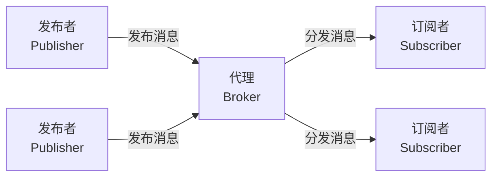
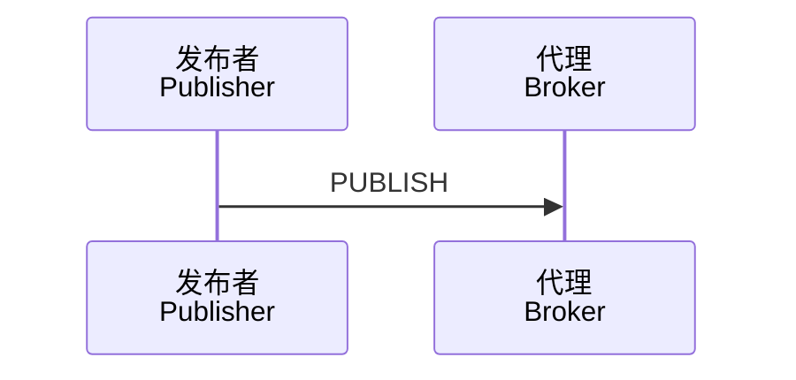
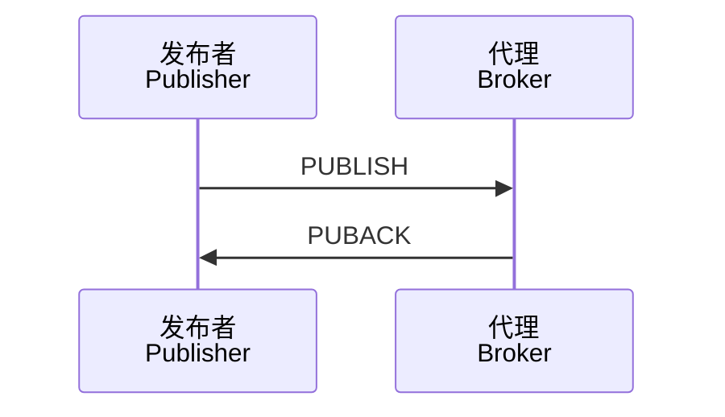
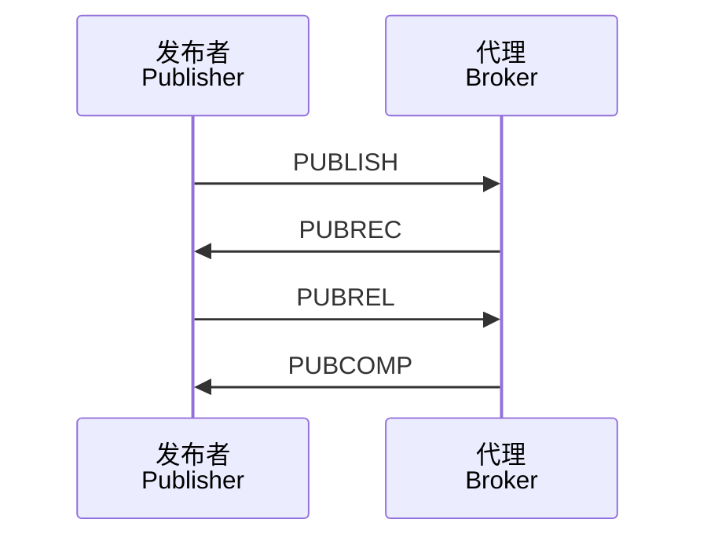

---
aliases:
  - MQTT协议
  - 消息队列遥测传输
tags:
  - network
  - protocol
  - IoT
  - messaging
---

# MQTT 协议 (MQTT Protocol)

MQTT（Message Queuing Telemetry Transport，消息队列遥测传输）是一种基于发布/订阅（Publish/Subscribe）模式的轻量级消息传输协议，专为低带宽、高延迟或不可靠网络环境设计，广泛应用于物联网（IoT, Internet of Things）通信场景。

## 概述 (Overview)

MQTT 由 IBM 于 1999 年提出，2014 年成为 OASIS 标准。其设计目标是简单、轻量、开放，适用于从低功耗传感器到大型服务器之间的消息传递。

核心特点：

- 轻量级（Lightweight）：协议头仅 2 字节，开销极小
- 发布/订阅（Pub/Sub）：解耦消息生产者和消费者
- 服务质量（QoS, Quality of Service）：三级消息传递保障
- 遗嘱消息（Last Will）：异常断开时自动通知
- 保留消息（Retained Message）：新订阅者立即获取最新状态

## 架构模型 (Architecture Model)

MQTT 采用典型的发布/订阅架构，包含三个核心角色：



### 代理 (Broker)

代理是 MQTT 架构的核心枢纽，负责接收发布者的消息并分发给匹配的订阅者。常见代理实现包括：

| 代理名称 | 开发语言 | 特点 |
|----------|----------|------|
| Eclipse Mosquitto | C | 轻量、开源、适合嵌入式 |
| EMQ X | Erlang | 高并发、企业级、分布式 |
| HiveMQ | Java | 商业支持、企业特性丰富 |
| RabbitMQ | Erlang | 多协议支持、功能全面 |

### 主题 (Topics)

主题是 MQTT 中消息路由的核心机制，采用层级结构，使用斜杠（`/`）分隔：

```
sensor/+/temperature
home/groundfloor/livingroom/light
$SYS/broker/clients/connected
```

主题通配符：

| 通配符 | 含义 | 示例 |
|--------|------|------|
| `+` | 单层匹配 | `sensor/+/temp` 匹配 `sensor/1/temp` |
| `#` | 多层匹配 | `home/#` 匹配 `home/room1/light` |

## 服务质量 (Quality of Service)

QoS 定义了消息传递的可靠性级别，共分三级：

$$QoS \in \{0, 1, 2\}$$

### QoS 0 - 最多一次 (At Most Once)

消息仅发送一次，不进行确认。适用于可容忍丢失的 telemetry 数据。



### QoS 1 - 至少一次 (At Least Once)

消息至少送达一次，可能重复。通过 PUBACK 确认机制实现。



### QoS 2 - 恰好一次 (Exactly Once)

通过四次握手确保消息仅送达一次，开销最大但可靠性最高。



## 协议报文 (Protocol Packets)

MQTT 定义了 15 种报文类型：

| 报文类型 | 值 | 方向 | 描述 |
|----------|-----|------|------|
| CONNECT | 1 | C→S | 客户端请求连接 |
| CONNACK | 2 | S→C | 连接确认 |
| PUBLISH | 3 | 双向 | 发布消息 |
| PUBACK | 4 | 双向 | QoS 1 发布确认 |
| PUBREC | 5 | 双向 | QoS 2 发布收到 |
| PUBREL | 6 | 双向 | QoS 2 发布释放 |
| PUBCOMP | 7 | 双向 | QoS 2 发布完成 |
| SUBSCRIBE | 8 | C→S | 订阅请求 |
| SUBACK | 9 | S→C | 订阅确认 |
| UNSUBSCRIBE | 10 | C→S | 取消订阅 |
| UNSUBACK | 11 | S→C | 取消订阅确认 |
| PINGREQ | 12 | C→S | 心跳请求 |
| PINGRESP | 13 | S→C | 心跳响应 |
| DISCONNECT | 14 | C→S | 断开连接 |
| AUTH | 15 | 双向 | 认证交换（MQTT 5.0）|

## MQTT 5.0 新特性 (New Features)

MQTT 5.0 于 2019 年发布，引入多项重要改进：

### 原因码 (Reason Codes)

所有响应报文包含原因码，明确指示操作结果：

| 原因码 | 名称 | 说明 |
|--------|------|------|
| 0 | Success | 成功 |
| 128 | Unspecified error | 未指明错误 |
| 135 | Not authorized | 未授权 |
| 144 | Topic Name invalid | 主题名无效 |

### 共享订阅 (Shared Subscriptions)

允许多个客户端共享同一个订阅，实现负载均衡：

```
$share/group1/sensor/temperature
```

### 消息过期 (Message Expiry)

发布时可设置消息过期时间（Message Expiry Interval），超时未送达则丢弃：

$$T_{expire} = T_{publish} + Interval$$

### 主题别名 (Topic Alias)

通过数字别名替代冗长主题名，减少传输开销。

## 安全机制 (Security Mechanisms)

### 传输层安全 (TLS/SSL)

MQTT 通常基于 TLS 加密传输，默认端口：

| 协议 | 端口 | 说明 |
|------|------|------|
| MQTT | 1883 | 明文传输 |
| MQTTS | 8883 | TLS 加密 |
| WebSocket | 80/443 | 浏览器端连接 |

### 认证与授权 (Authentication & Authorization)

- 用户名/密码认证
- TLS 客户端证书认证
- 基于主题的访问控制列表（ACL, Access Control List）

## 应用场景 (Application Scenarios)

MQTT 广泛应用于以下领域：

| 场景 | 描述 | 典型 QoS |
|------|------|----------|
| 智能家居 | 传感器数据采集、设备控制 | 0/1 |
| 工业物联网 | 设备监控、预测性维护 | 1/2 |
| 车联网 | 车辆 telemetry、远程诊断 | 1 |
| 消息推送 | 即时通知、实时更新 | 0/1 |
| 能源管理 | 智能电表、电网监控 | 1 |

## 与其他协议对比 (Protocol Comparison)

| 特性 | MQTT | HTTP | CoAP | WebSocket |
|------|------|------|------|-----------|
| 传输模式 | 发布/订阅 | 请求/响应 | 请求/响应 | 全双工 |
| 头部开销 | 2 字节 | 数百字节 | 4 字节 | 2-14 字节 |
| 实时性 | 高 | 低 | 中 | 高 |
| 适用场景 | IoT | Web | 受限设备 | 实时应用 |

## 最佳实践 (Best Practices)

1. **主题设计**：避免过多层级，控制主题深度在 3-5 层
2. **QoS 选择**：根据业务需求选择合适 QoS，避免滥用 QoS 2
3. **会话管理**：合理使用 Clean Session 和持久会话
4. **心跳机制**：根据网络状况调整 Keep Alive 间隔
5. **消息大小**：控制单条消息大小，建议不超过 256KB
6. **安全加固**：启用 TLS、配置强密码、实施最小权限原则

## 参考资源 (References)

- [MQTT Specification](https://mqtt.org/mqtt-specification/)
- [OASIS MQTT Version 5.0](https://docs.oasis-open.org/mqtt/mqtt/v5.0/mqtt-v5.0.html)
- [Eclipse Mosquitto Documentation](https://mosquitto.org/documentation/)
