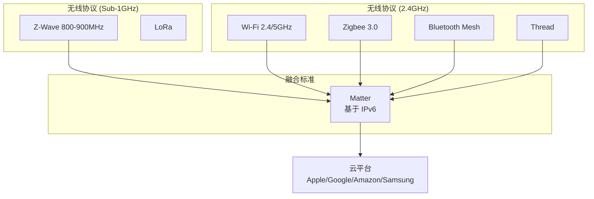

# 智能家居 (Smart Home)

## 一、概述 (Overview)

智能家居通过物联网技术将家居设备连接至网络，实现自动化控制（Automation）、远程管理（Remote Management）和智能场景联动（Scene Linkage），目标是提升居住舒适性（Comfort）、能源效率（Energy Efficiency）和安全性（Safety/Security）。

### 智能家居技术演进

| 阶段 | 时期 | 核心技术 | 典型设备 | 用户交互 | 智能化程度 |
|------|------|---------|---------|---------|-----------|
| 1.0 远程控制 | 2000s 初 | Wi-Fi, 红外转发 | 智能插座、红外遥控器 | 手机 App 点对点开关 | 低—手动控制 |
| 2.0 自动化 | 2010s | Zigbee, Z-Wave, 定时器 | 传感器 + 执行器联动 | 条件触发（时间/传感器）| 中—预设规则 |
| 3.0 场景化 | 2010s 末 | 场景引擎, 语音助手 | 智能音箱、安防套装 | 语音/一键场景模式 | 中高—场景联动 |
| 4.0 感知智能 | 2020s | AI/ML, 边缘计算 | AI 摄像头、学习恒温器 | 无感自适应 | 高—主动预测 |
| 5.0 全屋智能 | 2020s+ | Matter, Thread | 跨品牌统一生态 | 全平台统一体验 | 极高—真正的互操作 |

## 二、通信协议 (Communication Protocols)



| 协议 | 频段 | 功耗 (Tx) | 拓扑 | 最大速率 | 网络容量 | 穿墙能力 |
|------|------|-----------|------|---------|---------|---------|
| **Wi-Fi 6** | 2.4/5 GHz | ~300 mAh | 星型 | 1.2 Gbps | 50-200 设备 | 中 |
| **Zigbee 3.0** | 2.4 GHz | ~20 mAh | **Mesh** | 250 kbps | 100-1000 节点/网络 | 中 |
| **Z-Wave Plus** | 800-900 MHz | ~15 mAh | Mesh | 100 kbps | 232 节点/网络 | **好** |
| **Bluetooth Mesh** | 2.4 GHz | ~20 mAh | Mesh | 1 Mbps | 65535 节点 | 中 |
| **Thread** | 2.4 GHz | ~15 mAh | Mesh/IPv6 | 250 kbps | 250+ 节点 | 中 |
| **Matter (Wi-Fi)** | 2.4/5 GHz + ETH | 取决于底层 || IPv6 || 取决于底层 |

### Matter 协议详解

Matter（原 Project CHIP）由 CSA（Connectivity Standards Alliance）主导，Apple、Google、Amazon、Samsung 联合打造：

- **统一应用层**：一次认证，所有平台兼容
- **本地控制优先**：所有设备控制通过本地网络（LAN/Thread），无需云连接
- **IP 基础**：运行在 IPv6 上，通过 Wi-Fi/Thread/Ethernet 三种链路层
- **安全强制**：设备认证（DAC, Device Attestation Certificate）和分布式合规账本（DCL）
- **数据模型**：继承 Zigbee Cluster Library（ZCL），定义标准化设备类型（灯、锁、传感器、恒温器等）

Matter 配网流程：
1. 设备广播 QR Code / 配对码（含可选的 Passcode）
2. 控制器（如 iPhone/HomePod）扫码，通过 DCL 验证设备证书
3. 设备生成 CSR（Certificate Signing Request）
4. 控制器颁发运营证书（Operational Certificate）
5. 通过 CASE（Certificate Authentication Session Establishment）建立安全通道
6. 设备加入 IPv6 网络，数据使用 AES-CCM 加密

## 三、智能场景联动 (Smart Scene Scenarios)

| 场景 | 触发条件 | 执行动作序列 | 涉及设备类型 |
|------|---------|-------------|-------------|
| **离家模式** | 最后一人出门（门磁关+人感无人+30s 延迟）| 1. 关闭所有灯光 2. 空调调至节能 3. 关闭窗帘 4. 开启安防布防 5. 扫地机启动 | 门磁、人体感应、灯光、空调、窗帘、安防面板 |
| **回家模式** | 门锁开锁/手机到家地理围栏 | 1. 门锁开 2. 玄关灯亮 3. 解除安防 4. 空调调至舒适 5. 窗帘打开 | 智能锁、灯光、安防、空调、窗帘 |
| **睡眠模式** | 语音 "晚安" / 定时 23:00 / 卧室灯关 + 门磁关 | 1. 全屋灯关 2. 卧室窗帘关 3. 空调调至睡眠曲线 4. 安防布防（一二楼）5. 夜灯开 | 灯光、窗帘、空调、安防、夜灯 |
| **起床模式** | 定时 07:00 / 睡眠传感器检测清醒 | 1. 卧室灯渐亮（5 分钟）2. 窗帘拉开 3. 咖啡机启动 4. 播报天气/日程 | 灯光、窗帘、咖啡机、智能音箱 |
| **烟雾报警** | 烟雾探测器触发 | 1. 全屋灯亮红色 2. 报警推送手机 3. 开窗器开 4. 燃气阀门关 5. 门锁开（方便逃生）| 烟感、灯光、开窗器、燃气阀、门锁 |
| **漏水保护** | 水浸传感器触发 | 1. 关闭电磁水阀 2. 推送报警 3. 通知物业/家人 | 水浸传感器、电磁阀 |

## 四、智能家居系统架构

通常包含以下层级：

1. **感知层 (Sensors)**：温湿度、人体感应（PIR/mmWave）、光照、烟雾、气体（CO/CH4）、水浸、门磁、振动
2. **控制层 (Controllers/Actuators)**：智能灯（调光调色）、插座、窗帘电机、空调面板、地暖执行器
3. **网络层 (Network/Gateway)**：多协议网关（Zigbee/Wi-Fi/BLE 桥接）、边缘计算（规则引擎 IoT Rule Engine）
4. **平台层 (Cloud/Platform)**：设备管理、OTA、语音服务（Alexa/Google/Siri）、AI 分析（异常检测）
5. **交互层 (User Interface)**：App、语音、触摸面板、物理开关

### 本地场景引擎设计

边缘网关维护本地场景规则库（如 Node-RED 流或 JSON 规则），即使断网也保持核心功能：

```json
{
  "scene": "away_mode",
  "trigger": {
    "all_of": [{"device": "door_sensor", "state": "closed"},
               {"device": "motion_sensor", "state": "no_motion"}],
    "delay_ms": 30000
  },
  "actions": [
    {"device": "light_living", "command": "off"},
    {"device": "ac", "command": "set_temp", "params": {"temp": 28}},
    {"device": "alarm", "command": "arm"}
  ]
}
```

## 五、能源管理 (Energy Management)

智能家居的节能效益计算：
$$P_{saving} = \sum_{i} (P_{base,i} - P_{smart,i}) \times t_i$$

- 智能温控（学习算法 + 地磁检测）：节约空调能耗 15-25%
- 智能照明（人体感应 + 日光传感器）：节约照明能耗 30-60%
- 智能插座（待机零功耗切断）：消除"吸血鬼负载" 5-10%

## 五、智能家居安全与隐私 (Security & Privacy)

### 威胁模型 (Threat Model)

| 威胁 | 攻击向量 | 潜在后果 | 防护措施 |
|------|---------|---------|---------|
| **未经授权访问** | 弱密码、默认凭据 | 远程控制门锁/摄像头 | 强密码 + MFA + 本地认证 |
| **网络攻击** | 中间人攻击 (MITM) | 窃取敏感数据 | TLS 1.3 端到端加密 |
| **固件漏洞** | OTA 更新被篡改 | 植入后门 | 代码签名 + 安全启动 (Secure Boot) |
| **隐私泄露** | 设备收集用户行为 | 生活习惯被分析 | 本地化处理 + 差分隐私 |
| **设备劫持** | 僵尸网络 (Mirai) | DDoS 攻击源 | 定期更新 + 关闭不用的远程访问 |

### 智能家居数据隐私计算

隐私保护技术：
$$\text{差分隐私: } M(D) = f(D) + \text{Lap}(\frac{\Delta f}{\epsilon})$$

本地处理优先原则：语音关键词识别在本地完成，只上传匿名化后的文本。

## 六、智能家居开放标准进展

| 标准 | 领域 | 关键进展 | 生态支持 |
|------|------|---------|---------|
| **Matter 1.4** (2024) | 设备互操作 | 新增能源管理、恒温器、百叶窗 | Apple/Google/Amazon/Samsung |
| **Thread 1.4** | 网络层 | 增强低功耗和路由 | Matter 的首选网络层 |
| **PLC-IoT** (华为) | 电力线通信 | 无需布线，穿墙好 | 智能照明、电力猫 |
| **蓝牙 Mesh 1.1** | 短距 Mesh | 新增远程配置 | 信标、传感器网络 |

### 跨平台生态对比

```text
Apple HomeKit:
  - 硬件加密芯片 (HomeKit Accessory Protocol)
  - 本地化 Home Hub (Apple TV/HomePod)
  - Siri 语音控制
  - 优势: 隐私优先、零云依赖
  - 劣势: 设备认证严格、选择少

Google Home:
  - 强大的 AI 语音 (Google Assistant)
  - Nest 设备家族
  - 优势: 语音识别准确率最高
  - 劣势: 依赖云处理、隐私顾虑

Amazon Alexa:
  - 最大的 Skills 生态 (10 万+)
  - Fire TV / Echo 系列
  - 优势: 开发者友好、广泛第三方支持
  - 劣势: 技能质量参差不齐

小米米家 (Xiaomi Home):
  - 性价比最高的硬件生态
  - 中国市场份额第一
  - 优势: 价格低、设备种类最多
  - 劣势: 生态封闭（Zigbee 网关非标）
```

## 七、智能家居能源管理系统设计

智能家居中的能源管理功能可实现显著的节能效果：

```text
智能照明系统:
  - 日光感应 → 自动调节亮度，节约 30-60%
  - 人体感应 → 人走灯灭，节约 20-40%
  
智能温控系统:
  - 学习用户日程和偏好
  - 离家自动降低设置 (Setback)
  - 地磁检测 + 房间占用
  - 能耗节约 15-25%

智能插座:
  - 待机零功耗切断（解决"吸血鬼负载"）
  - 定时开关、远程控制
  - 能耗监测和报告
```

年节电潜力：
$$E_{savings} = \sum (P_{base,i} - P_{smart,i}) \times t_i \times 365$$

典型家庭节电量可达 800-1500 kWh/年，相当于减少 500-1000 公斤 CO₂ 排放。

## 相关条目
- [[MQTT]]
- [[LoRaWAN]]
- [[IndustrialIoT]]
- [[UserExperience]]
- [[InteractionDesign]]
- [[05_ComputerScience/ComputerNetworks/INDEX]]
