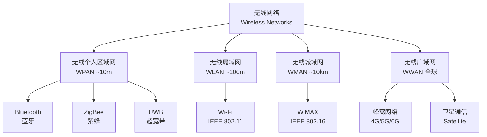

# 无线网络概述

## 概述

无线网络（Wireless Networks）
使用无线电波（Radio Waves）或红外线（Infrared）
等电磁波传输数据。
无需物理线缆连接。

无线网络提供移动性（Mobility）。
灵活性（Flexibility）。
支持从个人区域网络（PAN）
到广域网络（WAN）的多层次通信场景。

无线通信的基础是电磁波传播
（Electromagnetic Wave Propagation）。
信息通过调制（Modulation）
加载到载波信号上进行发射。

与有线通信不同，无线信道（Wireless Channel）具有：
开放共享（Open Shared Medium）。
时变衰落（Time-Varying Fading）。
多径传播（Multipath Propagation）。
这些是独特挑战。

## 无线网络分类体系



## 无线网络对比

| 类型 | 英文 | 覆盖范围 | 数据速率 | 标准 | 典型应用 |
|------|------|---------|---------|------|---------|
| 无线个人区域网 | WPAN | ~10 m | 1-50 Mbps | Bluetooth, ZigBee | 耳机、传感器 |
| 无线局域网 | WLAN | ~100 m | 100 Mbps-10 Gbps | IEEE 802.11 | 室内上网 |
| 无线城域网 | WMAN | ~10 km | 70 Mbps | IEEE 802.16 | 宽带接入 |
| 无线广域网 | WWAN | 全球 | 100 Mbps-20 Gbps | 3GPP (4G/5G) | 移动通信 |

## Wi-Fi 技术

### IEEE 802.11标准演进

| 标准 | 商用名 | 频段 | 最大速率 | 信道带宽 | 核心技术 |
|------|-------|------|---------|---------|---------|
| 802.11n | Wi-Fi 4 | 2.4/5 GHz | 600 Mbps | 20/40 MHz | MIMO, 帧聚合 |
| 802.11ac | Wi-Fi 5 | 5 GHz | 6.9 Gbps | 20/40/80/160 MHz | MU-MIMO, 波束成形 |
| 802.11ax | Wi-Fi 6 | 2.4/5/6 GHz | 9.6 Gbps | 最大160 MHz | OFDMA, TWT, 1024-QAM |
| 802.11be | Wi-Fi 7 | 2.4/5/6 GHz | 46 Gbps | 最大320 MHz | 4096-QAM, 多链路操作 |

**OFDMA**
正交频分多址接入
（Orthogonal Frequency Division Multiple Access）
是 Wi-Fi 6的核心改进。
将信道划分为更小的资源单元（Resource Unit, RU）。
允许多用户同时传输。
显著降低时延并提升密集场景的频谱效率。

**目标唤醒时间（Target Wake Time, TWT）**
使设备按预定时间唤醒和休眠。
大幅降低 IoT 设备的功耗。

Wi-Fi 6的引入也改进了空间复用技术。
BSS Color 机制减少同频干扰。
提高密集部署场景的性能。

**Wi-Fi 7亮点**
支持320MHz 超宽信道。
4096-QAM 调制每个符号承载12bits。
多链路操作（MLO）提高吞吐量和可靠性。

### Wi-Fi 网络拓扑

```mermaid
flowchart LR
  subgraph 基础设施模式<br/>Infrastructure Mode
    AP1[接入点1<br/>Access Point 1] --> RTR[路由器<br/>Router]
    AP2[接入点2<br/>Access Point 2] --> RTR
    STA1[站点1<br/>Station] --- AP1
    STA2[站点2<br/>Station] --- AP1
    STA3[站点3<br/>Station] --- AP2
  end
```

基础设施模式（Infrastructure Mode）中。
接入点（Access Point, AP）
充当有线与无线网络之间的桥接。
站点（Station, STA）通过 AP 发送和接收数据。

独立基本服务集（Independent BSS, IBSS）模式下。
站点可直接通信（Ad Hoc 模式）。

分布系统（Distribution System, DS）
通过 AP 之间的通信桥接扩展覆盖范围。

### 路径损耗

发射功率与距离的关系
遵循自由空间路径损耗
（Free Space Path Loss, FSPL）：

$$FSPL = \left(\frac{4\pi d f}{c}\right)^2$$

其中 $d$ 为距离。
$f$ 为载波频率。
$c$ 为光速。

以 dB 形式表示：
$FSPL(dB) = 20\log_{10}(d) + 20\log_{10}(f) + 32.44$
其中 $d$ 以 km 为单位。
$f$ 以 MHz 为单位。

频率翻倍或距离翻倍均导致路径损耗增加6dB。
实际场景中需考虑墙体和地形的额外衰减。

## 蜂窝网络

### 4G LTE 与5G NR 对比

蜂窝网络（Cellular Network）
通过基站（Base Station）将服务区域划分为小区（Cell）。
相邻小区使用不同频率以避免同频干扰。

5G 新空口（5G New Radio, 5G NR）
是3GPP Release 15及后续版本定义的全球5G 标准。

| 特性 | 4G LTE | 5G NR |
|------|--------|-------|
| 峰值速率 | 1 Gbps | 20 Gbps |
| 用户面时延 | 30-50 ms | 1-10 ms |
| 控制面时延 | 50-100 ms | 10-20 ms |
| 连接密度 | 10⁵ 设备/km² | 10⁶ 设备/km² |
| 频谱效率（vs LTE） | 1x | 3-4x |
| 载波聚合 | 最多32载波 | 最多16载波 |
| 波形 | OFDMA (下行) | OFDMA + DFT-s-OFDM |
| 帧结构 | 固定子帧 | 灵活可配参数集 |

### 5G 三大应用场景

**eMBB**（增强移动宽带
Enhanced Mobile Broadband）：
超高速率和大带宽场景。
峰值速率可达20 Gbps。
适用于超高清视频（4K/8K）。
增强现实（AR）。
虚拟现实（VR）。

**URLLC**（超高可靠低时延
Ultra-Reliable Low-Latency Communications）：
端到端时延低于1ms。
可靠性高达99.999%。
适用于工业自动化（Industrial Automation）。
远程手术（Remote Surgery）。
自动驾驶（Autonomous Driving）。

**mMTC**（海量机器类通信
Massive Machine-Type Communications）：
每平方公里100万设备的连接密度。
适用于大规模物联网（Massive IoT）。
智能城市（Smart City）。
传感器网络（Sensor Network）。

### OFDM 数学表示

OFDM 将宽带信道划分为多个正交子载波。
每个子载波以较低速率传输数据。
有效对抗频率选择性衰落。

时域 OFDM 符号表示为：

$$x(t) = \sum_{k=0}^{N-1} X_k \cdot e^{j2\pi k \Delta f t}, \quad 0 \leq t \leq T$$

其中 $N$ 为子载波总数。
$X_k$ 为第 $k$ 个子载波上的调制符号。
$\Delta f$ 为子载波间隔。
$T = 1/\Delta f$ 为 OFDM 符号周期。

循环前缀（Cyclic Prefix, CP）的插入
使 OFDM 对多径时延具有鲁棒性。
CP 长度应大于最大多径时延。

5G NR 使用可配置的子载波间隔。
支持15kHz、30kHz、60kHz、120kHz 等。
以适应不同频段和部署场景。

### 演进路线

蜂窝网络从1G 到5G 的演进：
1G：模拟语音，AMPS（1980s）。
2G：数字语音+短信，GSM（1990s）。
3G：移动数据，UMTS/CDMA2000（2000s）。
4G：全 IP 宽带，LTE（2010s）。
5G：万物互联，NR（2020s）。
6G：空天地一体化（2030s 展望）。

## 蓝牙技术

蓝牙（Bluetooth）
是一种短距离无线通信技术。
工作于2.4 GHz ISM 频段
（Industrial, Scientific and Medical Band）。
采用跳频扩频（Frequency Hopping Spread Spectrum, FHSS）。

| 版本 | 物理层速率 | 最大范围 | 核心特点 |
|------|-----------|---------|---------|
| Bluetooth 4.2 | 1 Mbps | 50-100 m | BLE 低功耗、IPv6支持 |
| Bluetooth 5.0 | 2 Mbps | 200 m | 广播容量8倍提升、定位 |
| Bluetooth 5.2+ | 2 Mbps | 200 m+ | LE Audio, LC3编码, 测距 |

经典蓝牙（BR/EDR）支持连续数据流（如音频传输）。
低功耗蓝牙（Bluetooth Low Energy, BLE）
针对周期性小数据包传输优化。
是 IoT 和可穿戴设备的主流选择。

## 无线安全协议

| 协议 | 加密算法 | 认证 | 推荐状态 | 安全性评级 |
|------|---------|------|---------|-----------|
| WEP | RC4-64/128 | 共享密钥 | 已废弃 | 极低——分钟级破解 |
| WPA | TKIP/RC4 | 802.1X | 不推荐 | 低——TKIP 已攻破 |
| WPA2 | AES-CCMP | 802.1X 或 PSK | 主流 | 高——KRACK 已修复 |
| WPA3 | AES-GCMP | SAE 握手 | 最新标准 | 极高——前向安全 |

## 无线通信的核心挑战

**衰落（Fading）**
多径效应（Multipath Effect）引起信号幅度和相位的随机波动。
小尺度衰落可用瑞利衰落（Rayleigh Fading）建模。
莱斯衰落（Rician Fading）适用于存在直射路径的场景。
大尺度衰落包括路径损耗和阴影效应。

**干扰（Interference）**
同频干扰（Co-Channel Interference, CCI）。
邻频干扰（Adjacent Channel Interference, ACI）。
干扰管理是蜂窝网络设计的关键问题。

**频谱稀缺（Spectrum Scarcity）**
推动了认知无线电（Cognitive Radio）。
动态频谱接入（Dynamic Spectrum Access, DSA）的研究。
毫米波和太赫兹频段是5G/6G 的重要发展方向。

**功耗（Power Consumption）**
是移动设备和 IoT 终端的首要设计约束。
能量收集（Energy Harvesting）技术正在研究中。

## 相关条目

- [[ComputerNetworks]]
- [[DigitalSignalProcessing]]
- [[MobileDevelopment]]
- [[EmbeddedSystems]]
- [[Cryptography]]
- [[OFDM]]
- [[AntennaTheory]]
