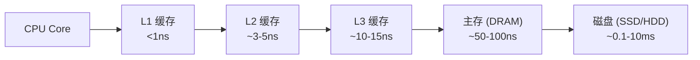
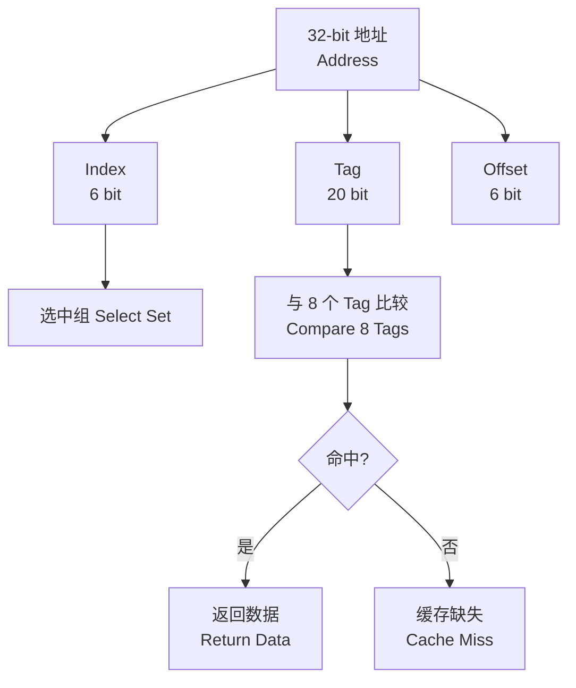

# 缓存内存 (Cache Memory)

## 概述 (Overview)

缓存内存（Cache Memory）是介于 CPU 和主存之间的小容量高速存储器，用于缓解处理器速度与内存访问延迟之间的差距。缓存在程序局部性原理的基础上工作：将频繁访问的数据副本保存在离处理器更近的位置。



## 缓存组织 (Cache Organization)

### 缓存行 (Cache Line)

缓存的最小操作单位，通常为 64 字节。当一个缓存行被加载时，其相邻数据也被载入（利用空间局部性）。

### 映射方式

**直接映射缓存 (Direct-Mapped Cache)**：

$$
\text{缓存索引} = \text{内存块地址} \bmod \text{缓存行数}
$$

```
内存地址: [Tag | Index | Block Offset]
                t      s         b
```

**组关联缓存 (Set-Associative Cache)**：

$$
\text{组数} = \frac{\text{缓存大小}}{\text{相联度} \times \text{行大小}}
$$

| 相联度 | 特点 | 硬件复杂度 | 冲突未命中 |
|--------|------|-----------|-----------|
| 直接映射 (1-way) | 每个地址唯一映射 | 最低 | 最高 |
| 2-way | 2 个候选位置 | 低 | 中 |
| 4-way | 4 个候选位置 | 中 | 较低 |
| 8-way | 8 个候选位置 | 较高 | 低 |
| 全关联 | 任意位置 | 最高 | 最低 |

### 缓存参数示例

```text
32KB L1 缓存, 64B 行, 8-way 组关联

行数   = 32KB / 64B = 512 行
组数   = 512 / 8 = 64 组
偏移位 = log2(64B) = 6 bits
索引位 = log2(64组) = 6 bits
标签位 = 32 - 6 - 6 = 20 bits (32位地址)
```



## 缓存缺失 (Cache Misses)

### 三种 C 类型缺失

| 类型 | 英文 | 原因 | 缓解方式 |
|------|------|------|----------|
| 强制缺失 | Compulsory Miss | 首次访问数据从未加载 | 预取 (Prefetching) |
| 容量缺失 | Capacity Miss | 工作集超出缓存容量 | 增大缓存、改善局部性 |
| 冲突缺失 | Conflict Miss | 多个地址映射到同一组 | 提高相联度 |

### 缺失率影响因素

- **缓存大小 (Cache Size)** — 越大缺失率越低（但延迟越高）
- **相联度 (Associativity)** — 越高冲突缺失越少
- **块大小 (Block Size)** — 过大增加污染，过小浪费空间局部性
- **程序工作集 (Working Set)** — 访问模式的相关性

## 替换策略 (Replacement Policies)

| 策略 | 英文 | 描述 | 硬件开销 |
|------|------|------|----------|
| 随机替换 | Random | 随机选择一个缓存行替换 | 最小 |
| LRU | Least Recently Used | 替换最久未访问的行 | 高（记录访问历史） |
| 近似 LRU | Pseudo-LRU | 使用二叉树近似 LRU | 中 |
| FIFO | First-In-First-Out | 替换最早加载的行 | 低 |
| LFU | Least Frequently Used | 替换访问次数最少的行 | 高（计数器） |
| MRU | Most Recently Used | 替换最近访问的行 | 低 |

### LRU 实现

组相联缓存中，为每组维护一个访问顺序：

```
4-way 组, 行 A/B/C/D
访问顺序: B → D → A → C
替换: B (LRU)
新顺序: D → A → C → B (新加载)
```

### Belady 最优算法

理论最优但不可实现：替换未来最长时间内不会被访问的行。用于评估实际策略的性能上界。

## 写入策略 (Write Policies)

### 写命中 (Write Hit)

| 策略 | 英文 | 行为 | 优点 | 缺点 |
|------|------|------|------|------|
| 写直达 | Write-Through | 同时写入缓存和主存 | 一致性简单 | 带宽浪费 |
| 写回 | Write-Back | 仅写缓存，标记脏位 | 节省带宽 | 一致性复杂 |

### 写缺失 (Write Miss)

| 策略 | 英文 | 行为 | 场景 |
|------|------|------|------|
| 写分配 | Write-Allocate | 先加载到缓存再写 | 搭配 Write-Back |
| 写不分配 | Write-Around | 直接写主存，不加载缓存 | 搭配 Write-Through |

### 策略组合

```text
Write-Through + Write-Around  → 大数据流写入
Write-Back    + Write-Allocate → 通用高性能组合
```

## 缓存性能 (Cache Performance)

### 平均内存访问时间

$$
\text{AMAT} = T_{\text{hit}} + P_{\text{miss}} \times P_{\text{penalty}}
$$

其中：
- $T_{\text{hit}}$ = 命中时间 (hit time)
- $P_{\text{miss}}$ = 缺失率 (miss rate)
- $P_{\text{penalty}}$ = 缺失惩罚 (miss penalty)

### 多层次 AMAT

$$
\text{AMAT}_{\text{L1}} = T_{\text{L1}} + P_{\text{L1}} \times (T_{\text{L2}} + P_{\text{L2}} \times T_{\text{mem}})
$$

### 性能优化技术

1. **多级缓存 (Multi-Level Cache)** — L1 快而小，L2/L3 大而缓
2. **硬件预取 (Hardware Prefetching)** — 检测模式提前加载
3. **软件预取 (Software Prefetching)** — 编译器插入预取指令
4. **缓存分割 (Cache Partitioning)** — 隔离不同应用的工作集
5. **非阻塞缓存 (Non-Blocking Cache)** — 未命中期间服务其他请求
6. **写缓冲 (Write Buffer)** — 解耦写入延迟

## Victim Cache

位于 L1 和 L2 之间的小型全关联缓存，缓存被 L1 驱逐的行。减少冲突缺失影响。

## 缓存一致性 (Cache Coherence)

多核系统中缓存一致性协议确保各核心缓存中的数据一致。详见 [ParallelArchitecture](./ParallelArchitecture.md)。

| 事件 | L1 操作 | L2/L3 操作 |
|------|---------|-----------|
| 读命中 | 直接返回 | 无操作 |
| 读缺失 | 从下级加载 | 提供数据 |
| 写命中 (WB) | 写缓存，标记脏 | 无立即操作 |
| 写缺失 | 加载 + 写入 | 一致性询问 |

## 缓存友好的编程 (Cache-Friendly Programming)

### 矩阵乘法示例

**坏访问模式**（行优先遍历列-step 大跨步）：

```c
for (int i = 0; i < N; i++)
    for (int j = 0; j < N; j++)
        sum += A[j][i];  // 按列访问 → 缓存频繁缺失
```

**好访问模式**（行优先遍历行）：

```c
for (int i = 0; i < N; i++)
    for (int j = 0; j < N; j++)
        sum += A[i][j];  // 按行访问 → 空间局部性好
```

### 循环分块 (Loop Tiling)

通过分块使子矩阵适应缓存大小：

```c
for (int ii = 0; ii < N; ii += B)
    for (int jj = 0; jj < N; jj += B)
        for (int kk = 0; kk < N; kk += B)
            for (int i = ii; i < ii+B; i++)
                for (int j = jj; j < jj+B; j++)
                    for (int k = kk; k < kk+B; k++)
                        C[i][j] += A[i][k] * B[k][j];
```

## 参考文献 (References)

- Hennessy, J. L., & Patterson, D. A. (2019). *Computer Architecture: A Quantitative Approach* (6th ed.). Morgan Kaufmann.
- Jacob, B., Ng, S., & Wang, D. (2007). *Memory Systems: Cache, DRAM, Disk*. Morgan Kaufmann.
- Smith, A. J. (1982). "Cache Memories." *ACM Computing Surveys*, 14(3), 473-530.
- Patterson, D. A., & Hennessy, J. L. (2020). *Computer Organization and Design* (RISC-V ed.). Morgan Kaufmann.
