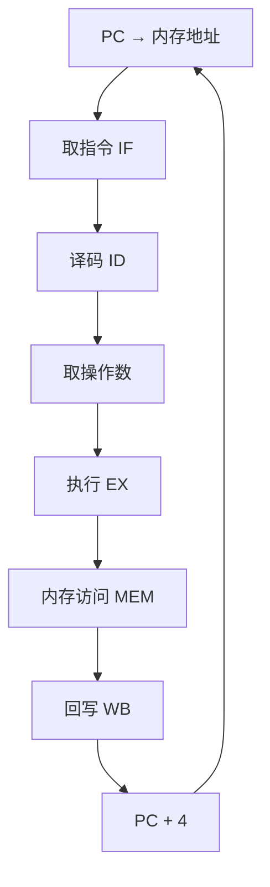
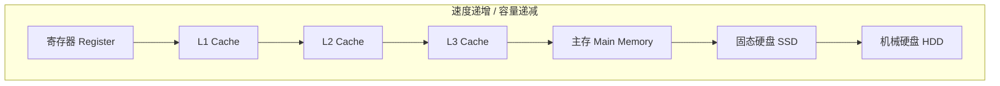

---
aliases:
  - 计算机体系结构
  - 计算机组成
  - 冯·诺依曼结构
  - CPU 架构
tags:
created: 2026-05-17
updated: 2026-05-16
  - computer-architecture
  - cpu
  - memory-hierarchy
  - pipelining
  - parallelism
  - von-neumann
---

# 计算机体系结构概论

## 概述

**计算机体系结构（Computer Architecture）** 是计算机科学与工程的核心领域，研究计算机系统的**结构组织**、**功能设计**和**实现技术**。它连接了**指令集架构（ISA）** 和**微架构（Microarchitecture）** 两个层次。

## 冯·诺依曼结构

### 基本组成

John von Neumann 在 1945 年提出的存储程序概念至今仍是绝大多数计算机的基础：

```mermaid
graph LR;
    subgraph 冯·诺依曼结构
        CPU --> CU[控制单元 Control Unit];
        CPU --> ALU[算术逻辑单元 ALU];
        CPU --> REG[寄存器组 Registers];
        MEM[(主存储器 Memory)];
        I1[输入设备 Input];
        O1[输出设备 Output];
    end
    CPU <-->|数据/地址/控制总线| MEM;
    I1 --> MEM;
    MEM --> O1;
```

### 五大部件

| 部件 | 英文 | 功能 |
|------|------|------|
| 运算器 | ALU | 算术运算和逻辑运算 |
| 控制器 | Control Unit | 指令译码与控制信号 |
| 存储器 | Memory | 存储程序和数据 |
| 输入设备 | Input | 接收外部信息 |
| 输出设备 | Output | 输出计算结果 |

### 存储程序概念

**存储程序（Stored-Program）** 是冯·诺依曼结构的核心思想：

- 指令和数据以**相同格式**存储在内存中
- 程序可通过修改内存来说明自己被修改
- 指令按**顺序执行**，但可通过跳转改变流程

### 冯·诺依曼瓶颈

$$
\text{Performance} \propto \frac{1}{\text{Bandwidth}(\text{CPU} \leftrightarrow \text{Memory})}
$$

CPU 与存储器之间的带宽限制被称为 **冯·诺依曼瓶颈（von Neumann Bottleneck）**。

## 指令集架构

### CISC vs RISC

| 特征 | CISC | RISC |
|------|------|------|
| 指令复杂度 | 复杂、可变长度 | 简单、固定长度 |
| 指令数量 | 多（200+） | 少（50—100） |
| 寻址方式 | 多 | 少 |
| 寄存器 | 少（8—16） | 多（32+） |
| 内存访问 | 指令可直接操作内存 | Load/Store 架构 |
| 代表 | x86 | ARM, RISC-V, MIPS |

### 指令格式

一条指令通常包含：

$$
\text{Instruction} = \underbrace{\text{OPCODE}}_{\text{操作码}} + \underbrace{\text{Operand}_1 + \text{Operand}_2}_{\text{操作数}}
$$

#### 常见指令类型

- **数据传输**：MOV, LOAD, STORE
- **算术运算**：ADD, SUB, MUL, DIV
- **逻辑运算**：AND, OR, XOR, NOT
- **控制转移**：JMP, BEQ, BNE, CALL, RET
- **系统指令**：INT, HLT, NOP

## 中央处理器

### CPU 执行周期

CPU 的执行遵循 **取指—译码—执行—回写（Fetch—Decode—Execute—Writeback）** 循环：



### 流水线技术

**流水线（Pipelining）** 通过指令重叠执行提高吞吐量：

| 时钟周期 | 指令 1 | 指令 2 | 指令 3 | 指令 4 |
|----------|--------|--------|--------|--------|
| 1 | IF | - | - | - |
| 2 | ID | IF | - | - |
| 3 | EX | ID | IF | - |
| 4 | MEM | EX | ID | IF |
| 5 | WB | MEM | EX | ID |

#### 流水线冒险

- **结构冒险**（Structural Hazard）：硬件资源冲突
- **数据冒险**（Data Hazard）：指令间数据依赖
- **控制冒险**（Control Hazard）：分支预测失误

#### 冒险解决方法

$$
\text{Speedup} = \frac{\text{CPI}_{\text{ideal}}}{\text{CPI}_{\text{actual}}} \times \frac{f_{\text{new}}}{f_{\text{old}}}
$$

| 冒险类型 | 解决技术 |
|----------|----------|
| 结构冒险 | 硬件复制（分离指令/数据缓存） |
| 数据冒险 | 转发（Forwarding）/ 插入气泡 |
| 控制冒险 | 分支预测（Branch Prediction） |

## 存储层次

### 层次结构

计算机通过分层存储系统平衡**速度、容量**和**成本**：



### 各层级参数

| 层级 | 容量 | 速度 | 管理方式 |
|------|------|------|----------|
| 寄存器 | ~1 KB | < 1 ns | 编译器分配 |
| L1 Cache | 32—64 KB | ~1 ns | 硬件管理 |
| L2 Cache | 256—512 KB | ~3—5 ns | 硬件管理 |
| L3 Cache | 4—32 MB | ~10—20 ns | 硬件管理 |
| 主存 | 8—64 GB | ~50—100 ns | OS + 硬件 |
| SSD | 256 GB—2 TB | ~10—100 μs | OS 文件系统 |
| HDD | 1—20 TB | ~5—10 ms | OS 文件系统 |

### 局部性原理

- **时间局部性**（Temporal Locality）：最近访问的数据很可能再次访问
- **空间局部性**（Spatial Locality）：某个地址附近的数据很可能被访问

$$
\text{Cache Hit Rate} \propto \text{Locality} \times \text{Cache Size} \times \text{Block Size}
$$

## 并行处理

### Flynn 分类法

| 类别 | 含义 | 示例 |
|------|------|------|
| SISD | 单指令单数据 | 传统单核 CPU |
| SIMD | 单指令多数据 | GPU, SSE/AVX |
| MISD | 多指令单数据 | 容错系统（罕见） |
| MIMD | 多指令多数据 | 多核 CPU, 集群 |

### 多核架构

现代 CPU 普遍采用**多核（Multi-core）**设计：

$$
\text{Performance} \approx n \cdot f \cdot \text{IPC} \cdot \text{efficiency}
$$

其中 $n$ 为核心数，$f$ 为频率，IPC 为每周期指令数。

### 线程级并行

- **超线程（Hyper-Threading）**：一个物理核心模拟两个逻辑核心
- **多线程（Multithreading）**：OS 层面的并发执行
- **向量化（Vectorization）**：SIMD 指令并行处理

## 重要设计指标

### 性能公式

$$
\text{CPU Time} = \frac{\text{Instructions}}{\text{Program}} \times \frac{\text{Cycles}}{\text{Instruction}} \times \frac{\text{Seconds}}{\text{Cycle}}
$$

即：

$$
T = IC \times CPI \times \text{Cycle Time}
$$

### Amdahl 定律

**Amdahl's Law** 描述并行化的理论加速上限：

$$
S = \frac{1}{(1 - p) + \frac{p}{n}}
$$

其中 $p$ 为可并行化比例，$n$ 为处理器数。

### 功耗

$$
P \propto C \cdot V^2 \cdot f
$$

$C$ = 电容，$V$ = 电压，$f$ = 频率。这也是**暗硅（Dark Silicon）** 问题的根源。

## 新兴方向

| 方向 | 描述 |
|------|------|
| 异构计算 | CPU + GPU + NPU 协同 |
| 量子计算 | 量子比特叠加与纠缠 |
| 近存计算 | 计算与存储融合 |
| 可重构架构 | FPGA 动态配置 |
| 神经形态计算 | 类脑计算模型 |

## 推荐教材

- Patterson, D. A., & Hennessy, J. L. (2020). *Computer Organization and Design: The Hardware/Software Interface* (RISC-V Edition)
- Hennessy, J. L., & Patterson, D. A. (2019). *Computer Architecture: A Quantitative Approach* (6th ed.)
- 袁春风. (2018). *计算机组成与系统结构*
