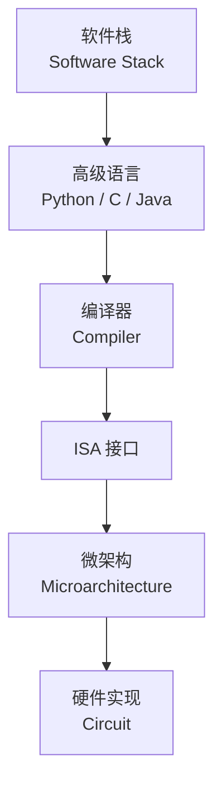
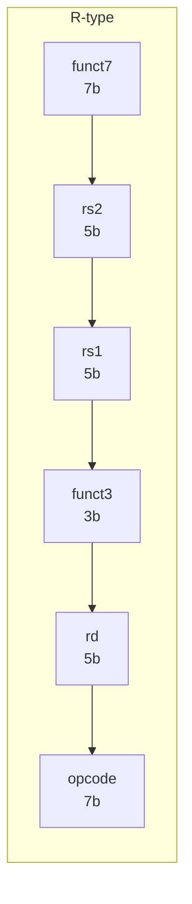
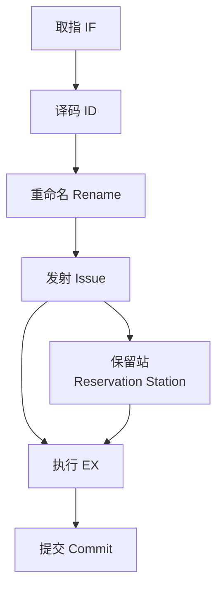

# 指令集体系结构 (Instruction Set Architecture)

## 概述 (Overview)

指令集体系结构（Instruction Set Architecture, ISA）是软件与硬件之间的接口契约。ISA 定义了处理器可执行的指令、寄存器、内存寻址方式、数据类型以及异常处理机制。作为计算机抽象层的基石，ISA 决定了编译器和操作系统的设计边界。



## RISC vs CISC

### 对比

| 特性 | RISC | CISC |
|------|------|------|
| 全称 | Reduced Instruction Set Computer | Complex Instruction Set Computer |
| 指令长度 | 固定 (通常 32-bit) | 可变 (1-15 字节) |
| 指令数量 | 少 (~50-200) | 多 (~300-1000+) |
| 寻址模式 | 少 (1-3 种) | 多 (5-10+ 种) |
| 寄存器数量 | 多 (16-32 通用) | 少 (8-16 通用) |
| 内存操作 | 仅 Load/Store | 任意指令可访问内存 |
| 典型代表 | ARM, RISC-V, MIPS | x86, x86-64 |

### 设计哲学

$$
\text{RISC 宗旨: Keep It Simple, Stupid (KISS)}
$$

RISC 通过简化每条指令使硬件更高效，让编译器负责复杂优化。CISC 将复杂操作编码为单条指令以节省代码空间。

## 指令格式 (Instruction Formats)

### 典型 RISC-V 格式

RISC-V 将指令分为六种基本格式，每种 32 位：

| 格式 | 用途 | 字段布局 |
|------|------|----------|
| R-type | 寄存器-寄存器运算 | `funct7 | rs2 | rs1 | funct3 | rd | opcode` |
| I-type | 立即数运算 / 加载 | `imm[11:0] | rs1 | funct3 | rd | opcode` |
| S-type | 存储 | `imm[11:5] | rs2 | rs1 | funct3 | imm[4:0] | opcode` |
| B-type | 条件分支 | `imm[12|10:5] | rs2 | rs1 | funct3 | imm[4:1|11] | opcode` |
| U-type | 高位立即数 | `imm[31:12] | rd | opcode` |
| J-type | 无条件跳转 | `imm[20|10:1|11|19:12] | rd | opcode` |



### x86 指令编码

x86 指令可变长度，结构如下：

```
[Prefix] [REX] [Opcode] [ModR/M] [SIB] [Displacement] [Immediate]
  0-4B    1B     1-3B      1B      1B       0-8B          0-8B
```

## 寻址模式 (Addressing Modes)

| 模式 | 英文 | 有效地址计算 | 示例（RISC-V） |
|------|------|-------------|---------------|
| 寄存器寻址 | Register | `EA = R[rs1]` | `add x1, x2, x3` |
| 立即数寻址 | Immediate | 值编码在指令中 | `addi x1, x2, 42` |
| 基址寻址 | Base | `EA = R[rs1] + imm` | `lw x1, 8(x2)` |
| PC 相对寻址 | PC-Relative | `EA = PC + imm` | `beq x1, x2, label` |
| 寄存器间接 | Register Indirect | `EA = R[rs1]` | `jalr x0, x1, 0` |
| 绝对寻址 | Absolute/Direct | `EA = addr` | `j label` (UJ-type) |

## 流水线 (Pipelining)

### 五级流水线 (RISC-V Classic 5-Stage)

```
IF → ID → EX → MEM → WB
取指  译码  执行  访存  写回
```

### 流水线冒险 (Hazards)

| 冒险类型 | 英文 | 描述 | 解决方案 |
|---------|------|------|----------|
| 结构冒险 | Structural | 硬件资源冲突 | 资源分离、停顿 |
| 数据冒险 | Data | 指令依赖上条结果 | 转发、旁路、停顿 |
| 控制冒险 | Control | 分支预测错误 | 分支预测、延迟槽 |


## 条件码与分支 (Condition Codes & Branching)

### 条件标志位

常见条件码寄存器（如 x86 FLAGS）：

| 标志 | 英文 | 含义 |
|------|------|------|
| ZF | Zero Flag | 运算结果为 0 |
| SF | Sign Flag | 结果为负 |
| CF | Carry Flag | 进位/借位 |
| OF | Overflow Flag | 有符号溢出 |

### 分支预测 (Branch Prediction)

- **静态预测** — 向后跳转预测为 taken，向前为 not taken
- **两位饱和计数器** — 2-bit saturating counter (Smith predictor)
- **BTB (Branch Target Buffer)** — 缓存分支目标地址
- **TAGE 预测器** — 基于历史表的多级预测

## 子程序调用 (Subroutine Calls)

### 调用约定 (Calling Convention)

RISC-V 调用约定寄存器分配：

```
x1  (ra)   → 返回地址
x5-x7      → 临时寄存器 (t0-t2)
x8  (s0/fp)→ 帧指针
x9  (s1)   → 保存寄存器
x10-x11(a0-a1)→ 函数参数 / 返回值
x12-x17(a2-a7)→ 更多参数
x18-x27(s2-s11)→ 保存寄存器
x28-x31(t3-t6)→ 临时寄存器
```

### 栈帧布局

```
高地址
┌──────────────┐ ← 栈顶指针 (sp)
│ 局部变量      │
├──────────────┤
│ 保存的寄存器  │
├──────────────┤
│ 返回地址      │
├──────────────┤
│ 参数溢出区域  │
└──────────────┘ ← 帧指针 (fp)
低地址
```

## 微架构 (Microarchitecture)

微架构是 ISA 的硬件实现方式。相同 ISA（如 x86）可由截然不同的微架构实现（如 Intel Core 与 AMD Zen）。



## 参考文献 (References)

- Patterson, D. A., & Hennessy, J. L. (2020). *Computer Organization and Design: The Hardware/Software Interface* (RISC-V ed.). Morgan Kaufmann.
- Waterman, A., & Asanović, K. (2019). *The RISC-V Instruction Set Manual, Volume I: User-Level ISA*.
- Intel. (2024). *Intel 64 and IA-32 Architectures Software Developer's Manual*.
- Hennessy, J. L., & Patterson, D. A. (2019). *Computer Architecture: A Quantitative Approach* (6th ed.). Morgan Kaufmann.
