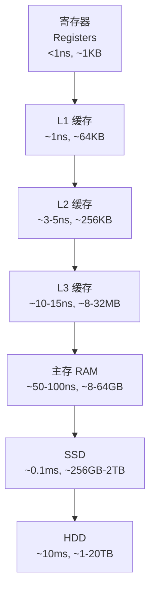
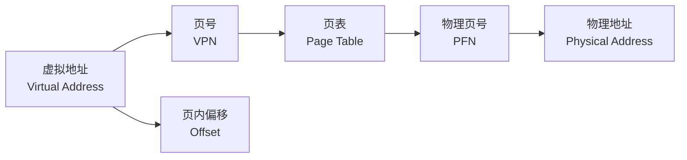

# 内存模型 (Memory Model)

## 概述 (Overview)

内存模型定义了计算机系统中数据的存储、访问与管理方式。它覆盖从处理器寄存器到磁盘存储的完整层级，以及多处理器环境下内存一致性的协议。理解内存模型是优化程序性能和正确性——尤其在并发场景下——的关键。

## 存储层次 (Memory Hierarchy)

### 层级结构



### 延迟对比

| 层 | 典型延迟 | 相对 CPU 周期 |
|----|----------|---------------|
| 寄存器 | 0.3 ns | ~1 cycle |
| L1 缓存 | 0.5-1 ns | ~2-4 cycles |
| L2 缓存 | 3-5 ns | ~10-15 cycles |
| L3 缓存 | 10-15 ns | ~30-45 cycles |
| 主存 (DRAM) | 50-100 ns | ~150-300 cycles |
| NVMe SSD | 50-100 μs | ~150K-300K cycles |
| 磁盘 (HDD) | 5-10 ms | ~15M-30M cycles |

### 局部性原理 (Locality Principle)

- **时间局部性 (Temporal Locality)** — 最近访问的数据很可能再次访问
- **空间局部性 (Spatial Locality)** — 访问地址附近的地址很可能被访问

## 缓存组织 (Cache Organization)

### 地址映射

缓存将内存地址映射到缓存行（Cache Line），常见映射方式：

| 映射方式 | 描述 | 优点 | 缺点 |
|---------|------|------|------|
| 直接映射 | 每个地址映射到唯一缓存行 | 实现简单 | 冲突未命中高 |
| 全关联 | 任意地址映射到任意行 | 命中率高 | 比较器代价大 |
| 组关联 | 组间直接映射，组内全关联 | 折中方案 | 复杂度适中 |

### 现代缓存参数

$$
\text{缓存容量} = \text{组数} \times \text{相联度} \times \text{行大小}
$$

```
例: 32KB L1, 8-way, 64B 行
组数 = 32KB / (8 × 64B) = 64 组
```

## 虚拟内存 (Virtual Memory)

### 分页机制 (Paging)

虚拟地址通过页表转换为物理地址：



### 多级页表 (Multi-Level Page Table)

x86-64 四级页表结构：

| 层级 | 名称 | 每项位宽 | 每级覆盖范围 |
|------|------|----------|-------------|
| L4 | PML4 (Page Map Level 4) | 9 bit | 512 GB |
| L3 | PDP (Page Directory Pointer) | 9 bit | 1 GB |
| L2 | PD (Page Directory) | 9 bit | 2 MB |
| L1 | PT (Page Table) | 9 bit | 4 KB |

## TLB (Translation Lookaside Buffer)

TLB 是页表的硬件缓存，加速地址转换。

### TLB 结构

- **指令 TLB (ITLB)** — 缓存指令页转换
- **数据 TLB (DTLB)** — 缓存数据页转换
- **统一 TLB (Unified TLB)** — 共享指令和数据
- **二级 TLB (L2 TLB)** — 更大的统一 TLB，缓 L1 TLB 未命中

### TLB 缺失惩罚

$$
\text{有效访问时间 (EAT)} = \text{TLB 命中率} \times T_{\text{TLB}} + \text{TLB 缺失率} \times (T_{\text{TLB}} + T_{\text{mem}})
$$

## NUMA 架构 (Non-Uniform Memory Access)

在 NUMA 系统中，处理器访问本地内存快于远程内存。

```text
Socket 0                   Socket 1
┌──────────────┐          ┌──────────────┐
│ Core 0 Core 1│          │ Core 2 Core 3│
│   L1   L1    │          │   L1   L1    │
│   L2   L2    │          │   L2   L2    │
│  L3 (Shared) │          │  L3 (Shared) │
├──────────────┤          ├──────────────┤
│ Memory Ctrl  │───QPI────│ Memory Ctrl  │
└──────────────┘          └──────────────┘
       │                         │
   Local Mem               Remote Mem
  (Low Latency)          (High Latency)
```

### NUMA 感知编程

- 线程绑定到特定核心与内存节点（`numactl --membind`）
- 优先使用本地内存分配（`mbind()`、`alloc_local()`）
- 避免跨节点频繁数据共享

## 内存一致性 (Memory Consistency)

### 一致性模型

| 模型 | 描述 | 性能 | 编程难度 |
|------|------|------|---------|
| 顺序一致性 (SC) | 所有操作按程序顺序执行 | 低 | 易 |
| 完全存储排序 (TSO) | 允许读绕过已发出的写 | 中 | 中 |
| 部分存储排序 (PSO) | 允许写重排序 | 高 | 难 |
| 宽松模型 (Relaxed) | 几乎所有操作可重排 | 最高 | 最难 |

### x86 TSO 模型

x86 架构采用 TSO (Total Store Order) 模型：

```
写入: 先进入写缓冲 (Store Buffer)，再提交到缓存
读取: 优先读写缓冲中的值 (Store Forwarding)
屏障: MFENCE / SFENCE / LFENCE
```

### ARM/Power Relaxed 模型

ARM 和 Power 架构使用宽松内存模型，需要显式内存屏障：

```
DMB (Data Memory Barrier)     → 确保屏障前后内存访问有序
DSB (Data Synchronization)    → 等待所有内存访问完成
ISB (Instruction Synchronization) → 刷新指令流水线
```

## 内存带宽与时延 (Bandwidth & Latency)

### 带宽计算

$$
\text{内存带宽} = \text{总线频率} \times \text{数据宽度} \times \text{传输次数/周期}
$$

```
DDR4-3200: 3200 MT/s × 8 Byte = 25.6 GB/s
DDR5-6400: 6400 MT/s × 8 Byte = 51.2 GB/s
```

### 延迟隐藏技术

- **预取 (Prefetching)** — 硬件/软件提前加载数据
- **乱序执行 (Out-of-Order Execution)** — 在等待内存时执行其他指令
- **多线程交错 (Multithreading)** — 一线程等待时运行另一线程
- **非阻塞缓存 (Non-Blocking Cache)** — 未命中时仍可处理后续命中

## 参考文献 (References)

- Hennessy, J. L., & Patterson, D. A. (2019). *Computer Architecture: A Quantitative Approach* (6th ed.). Morgan Kaufmann.
- Sorin, D. J., Hill, M. D., & Wood, D. A. (2011). *A Primer on Memory Consistency and Cache Coherence*. Morgan & Claypool.
- Jacob, B., Ng, S., & Wang, D. (2007). *Memory Systems: Cache, DRAM, Disk*. Morgan Kaufmann.
- Intel. (2024). *Intel 64 and IA-32 Architectures Software Developer's Manual*.
