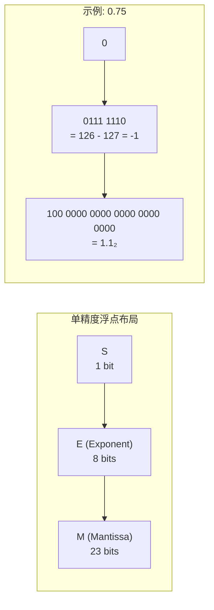

# 数字系统 (Number Systems)

## 概述 (Overview)

数字系统定义了计算机中数值的表示与运算方式。从最基本的二进制到浮点数标准 IEEE 754，每层抽象都影响着计算的精度、范围和效率。理解数字系统是学习计算机体系结构、编译器和数字电路的基础。

## 进制表示 (Base Representation)

### 常用进制

| 进制 | 基数 | 数字符号 | 前缀/后缀 | 用途 |
|------|------|----------|-----------|------|
| 二进制 | 2 | 0,1 | `0b` 或 `b` | 数字电路、位操作 |
| 八进制 | 8 | 0-7 | `0` 或 `o` | Unix 权限、历史 |
| 十进制 | 10 | 0-9 | 无 | 人类日常使用 |
| 十六进制 | 16 | 0-9, A-F | `0x` 或 `h` | 内存地址、颜色值 |

### 进制转换

**二进制 → 十进制**：

$$
1011_2 = 1 \times 2^3 + 0 \times 2^2 + 1 \times 2^1 + 1 \times 2^0 = 8 + 0 + 2 + 1 = 11_{10}
$$

**十进制 → 二进制**（整除取余法）：

```
13 ÷ 2 = 6 余 1  → LSB
6  ÷ 2 = 3 余 0
3  ÷ 2 = 1 余 1
1  ÷ 2 = 0 余 1  → MSB
结果: 13₁₀ = 1101₂
```

**十六进制 ↔ 二进制**：

| 十六进制 | 二进制 | 十六进制 | 二进制 |
|---------|--------|---------|--------|
| 0 | 0000 | 8 | 1000 |
| 1 | 0001 | 9 | 1001 |
| 2 | 0010 | A | 1010 |
| 3 | 0011 | B | 1011 |
| 4 | 0100 | C | 1100 |
| 5 | 0101 | D | 1101 |
| 6 | 0110 | E | 1110 |
| 7 | 0111 | F | 1111 |

## 补码 (Two's Complement)

### 有符号整数表示

计算机中最广泛使用的有符号整数编码。正数高位为 0，负数高位为 1。

**转换规则**：

$$
-N = \sim N + 1
$$

```
示例: 求 -5 的 8 位补码
+5 = 0000 0101
取反 = 1111 1010
+1  = 1111 1011  ← -5 的补码表示
```

### 补码范围

$$
\text{范围} = [-2^{n-1}, 2^{n-1} - 1]
$$

| 位数 | 最小值 | 最大值 |
|------|--------|--------|
| 8 | -128 | 127 |
| 16 | -32,768 | 32,767 |
| 32 | -2,147,483,648 | 2,147,483,647 |
| 64 | $-2^{63}$ | $2^{63} - 1$ |

### 符号扩展 (Sign Extension)

将 n 位补码扩展为 m 位 (m > n)，高位填充符号位：

```
0110 (+6)  →  0000 0110 (+6)
1010 (-6)  →  1111 1010 (-6)
```

## 浮点数 (Floating-Point Numbers)

### IEEE 754 标准

浮点数由三部分组成：

$$
\text{Value} = (-1)^S \times M \times 2^E
$$

| 精度 | 全称 | 总位宽 | 符号 S | 指数 E | 尾数 M | 偏置 |
|------|------|--------|--------|--------|--------|------|
| 单精度 | binary32 (float) | 32 | 1 | 8 | 23 | 127 |
| 双精度 | binary64 (double) | 64 | 1 | 11 | 52 | 1023 |
| 半精度 | binary16 | 16 | 1 | 5 | 10 | 15 |



### 特殊值

| 指数 E | 尾数 M | 含义 |
|--------|--------|------|
| 0xFF (全1) | 0 | $\pm \infty$ |
| 0xFF (全1) | $\neq$ 0 | NaN (Not a Number) |
| 0x00 (全0) | 0 | $\pm 0$ |
| 0x00 (全0) | $\neq$ 0 | 非规格化数 (Subnormal) |

### 舍入模式 (Rounding Modes)

IEEE 754 定义四种舍入模式：

1. **向最近偶数舍入 (Round to Nearest, Ties to Even)** — 默认模式
2. **向零舍入 (Round Toward Zero)** — 截断
3. **向 $+\infty$ 舍入 (Round Up)** — 天花板
4. **向 $-\infty$ 舍入 (Round Down)** — 地板

### 浮点运算误差

$$
0.1_{10} = 0.00011001100110011001100\ldots_2 \text{ （无限循环）}
$$

因此浮点比较应使用容差而非相等：

```c
if (fabs(a - b) < 1e-9) { /* a ≈ b */ }
```

## 算术电路 (Arithmetic Circuits)

### 加法器

**半加器 (Half Adder)**：

| A | B | Sum | Carry |
|---|---|-----|-------|
| 0 | 0 | 0 | 0 |
| 0 | 1 | 1 | 0 |
| 1 | 0 | 1 | 0 |
| 1 | 1 | 0 | 1 |

**全加器 (Full Adder)**：

$$
S = A \oplus B \oplus C_{\text{in}}
$$
$$
C_{\text{out}} = (A \cdot B) + (B \cdot C_{\text{in}}) + (A \cdot C_{\text{in}})
$$

### 进位方式

| 加法器类型 | 英文 | 延迟 | 面积 |
|-----------|------|------|------|
| 行波进位 | Ripple Carry | $O(n)$ | 小 |
| 进位前瞻 | Carry Lookahead (CLA) | $O(\log n)$ | 大 |
| 选择进位 | Carry Select | $O(\sqrt{n})$ | 中 |
| 前缀加法器 | Prefix Adder (Kogge-Stone) | $O(\log n)$ | 最大 |

### 乘法器

**Booth 算法** — 减少部分积数量：

$$
\text{扫描 2 位} \rightarrow \text{操作: } 0, +M, -M, \text{操作码}
$$

**Wallace 树** — 并行走位压缩，$O(\log n)$ 延迟：

```text
部分积 (4 个)
↓ 3:2 压缩器
2 行部分积
↓ 3:2 压缩器
1 行部分积
↓ 进位传播加法器
最终乘积
```

## 进制运算技巧

### 快速幂运算

$$
2^{10} = 1024 \approx 10^3
$$

常用 2 的幂：

| $2^n$ | 十进制 |
|-------|--------|
| $2^{10}$ | 1,024 (K) |
| $2^{20}$ | 1,048,576 (M) |
| $2^{30}$ | 1,073,741,824 (G) |
| $2^{40}$ | 1,099,511,627,776 (T) |

### 位操作技巧

| 操作 | 表达式 | 用途 |
|------|--------|------|
| 置位 | `x \| (1 << n)` | 设置第 n 位为 1 |
| 清零 | `x & ~(1 << n)` | 设置第 n 位为 0 |
| 翻转 | `x ^ (1 << n)` | 第 n 位取反 |
| 最低位 1 | `x & -x` | 取最低位的 1 |
| 清除最低位 1 | `x & (x - 1)` | 去掉最低位的 1 |
| 奇偶判断 | `x & 1` | 1 为奇数，0 为偶数 |

## 参考文献 (References)

- Patterson, D. A., & Hennessy, J. L. (2020). *Computer Organization and Design* (RISC-V ed.). Morgan Kaufmann.
- IEEE. (2019). *IEEE Standard for Floating-Point Arithmetic (IEEE 754-2019)*.
- Koren, I. (2018). *Computer Arithmetic Algorithms* (2nd ed.). CRC Press.
- Warren, H. S. (2012). *Hacker's Delight* (2nd ed.). Addison-Wesley.
