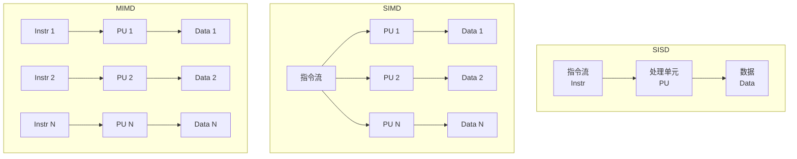
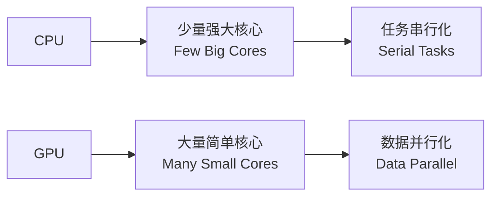
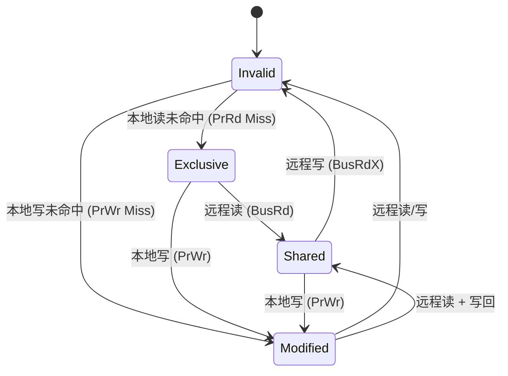

# 并行体系结构 (Parallel Architecture)

## 概述 (Overview)

并行体系结构利用多个计算单元同时执行任务以提高性能。从现代 CPU 的多核设计到大规模 GPU 集群，并行性已成为计算机系统性能提升的主要驱动力。随着摩尔定律在单核频率上的放缓，并行架构成为延续性能增长的关键路径。

## Flynn 分类法 (Flynn's Taxonomy)

Michael Flynn 按指令流和数据流的数量分类并行架构：

| 分类 | 全称 | 含义 | 示例 |
|------|------|------|------|
| SISD | Single Instruction, Single Data | 单指令单数据 | 传统单核 CPU |
| SIMD | Single Instruction, Multiple Data | 单指令多数据 | 向量处理器、GPU |
| MISD | Multiple Instruction, Single Data | 多指令单数据 | 容错系统（罕见） |
| MIMD | Multiple Instruction, Multiple Data | 多指令多数据 | 多核 CPU、集群 |



## 并行粒度 (Parallel Granularity)

并行度可按粒度大小分级：

1. **位级并行 (Bit-Level Parallelism)** — 增加字长（8→16→32→64 位）
2. **指令级并行 (ILP)** — 流水线、超标量、乱序执行
3. **线程级并行 (TLP)** — 多线程、超线程（Hyper-Threading）
4. **数据级并行 (DLP)** — SIMD 向量化
5. **任务级并行 (TLP)** — 多核、多处理器
6. **作业级并行 (Job-Level)** — 分布式计算、MapReduce

## SIMD 架构

### 向量处理器 (Vector Processors)

向量处理器将单条指令应用于整个向量数据：

$$
\vec{C} = \vec{A} + \vec{B} \quad \Rightarrow \quad c_i = a_i + b_i \quad (i = 0, \dots, N-1)
$$

### 现代 SIMD 扩展

| 指令集 | 位宽 | 平台 |
|--------|------|------|
| MMX | 64-bit | x86 |
| SSE (Streaming SIMD Extensions) | 128-bit | x86 |
| AVX/AVX2 (Advanced Vector Extensions) | 256-bit | x86 |
| AVX-512 | 512-bit | x86 (Xeon) |
| NEON | 128-bit | ARM |
| SVE (Scalable Vector Extension) | 128-2048-bit | ARM (AArch64) |

## GPU 架构

### GPU 与 CPU 对比

| 特性 | CPU | GPU |
|------|-----|-----|
| 核心数量 | 4-16 (大核) | 数千 (小核) |
| 控制逻辑 | 复杂 (分支预测、乱序) | 简单 (顺序执行) |
| 缓存 | 大 (MB 级) | 小 (KB 级) |
| 内存带宽 | 中 (50-100 GB/s) | 高 (500-1000+ GB/s) |
| 吞吐量 | 低延迟优化 | 高吞吐优化 |
| 典型功耗 | 65-150W | 150-450W |



### CUDA 编程模型

```
Host (CPU)          Device (GPU)
┌──────────┐       ┌──────────────┐
│ Data Prep│ ───→  │ Global Mem   │
│ Kernel   │ ───→  │ Grid of Blocks│
│ Launch   │       │ └─ Block(0,0) │
└──────────┘       │   └─ Threads  │
      ↑            │ └─ Block(0,1) │
      └────────────│   └─ Threads  │
    Result Copy    └──────────────┘
```

## 多核架构 (Multi-Core Architecture)

### 缓存一致性 (Cache Coherence)

多核系统中每个核心有私有缓存，需保证数据一致性：

- **MSI 协议** — Modified, Shared, Invalid
- **MESI 协议** — Modified, Exclusive, Shared, Invalid
- **MOESI 协议** — Modified, Owner, Exclusive, Shared, Invalid
- **目录协议 (Directory Protocol)** — 可扩展至多处理器

### 一致性协议状态转换



## 并行编程模型 (Parallel Programming Models)

| 模型 | 描述 | 适用 |
|------|------|------|
| Shared Memory | 线程共享地址空间 | OpenMP、Pthreads |
| Message Passing | 进程间显式通信 | MPI |
| Data Parallel | 数据分解并行操作 | CUDA、OpenCL、SYCL |
| Task Graph | 任务依赖图驱动执行 | TBB、Cilk |

### Amdahl 定律

$$
S = \frac{1}{(1-P) + \frac{P}{N}}
$$

其中 $S$ 为加速比，$P$ 为可并行化比例，$N$ 为处理器数量。该定律指出可并行化的比例决定了理论最大加速比。

### Gustafson 定律

$$
S = (1-P) + N \times P
$$

Gustafson 定律从问题规模可扩展的角度出发：当问题规模随处理器数量增长时，加速比线性增长。

## 内存架构 (Memory Architecture)

### 共享内存系统

- **UMA (Uniform Memory Access)** — 所有核心访问内存延迟一致
- **NUMA (Non-Uniform Memory Access)** — 延迟取决于内存与控制器的物理距离
- **COMA (Cache-Only Memory Architecture)** — 主存作为大缓存

## 参考文献 (References)

- Hennessy, J. L., & Patterson, D. A. (2019). *Computer Architecture: A Quantitative Approach* (6th ed.). Morgan Kaufmann.
- Flynn, M. J. (1972). "Some Computer Organizations and Their Effectiveness." *IEEE Transactions on Computers*.
- Kirk, D. B., & Hwu, W. W. (2016). *Programming Massively Parallel Processors* (3rd ed.). Morgan Kaufmann.
- Patterson, D. A., & Hennessy, J. L. (2020). *Computer Organization and Design* (RISC-V ed.). Morgan Kaufmann.
