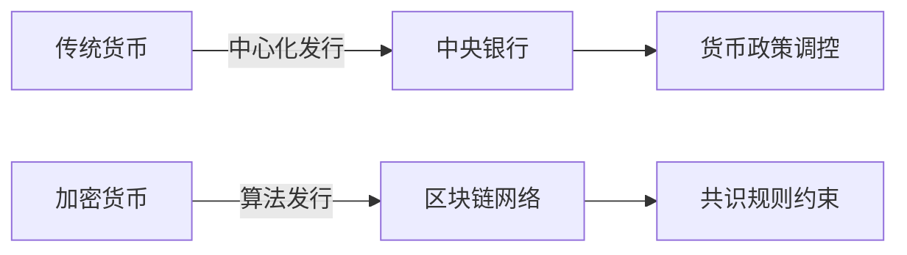
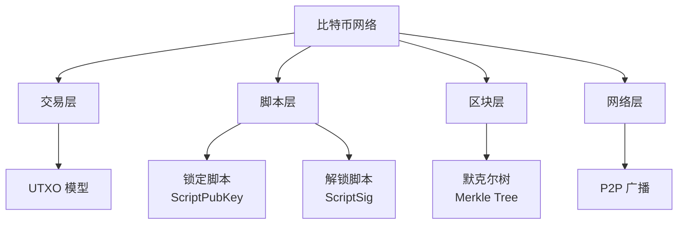
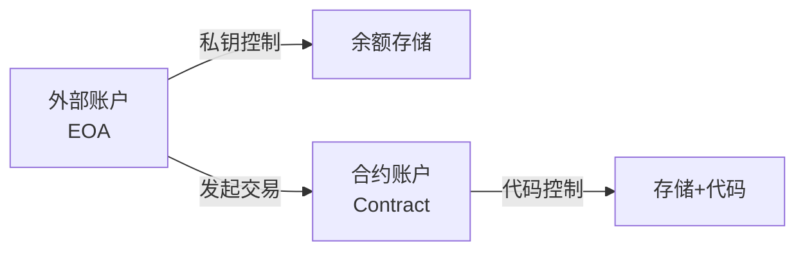
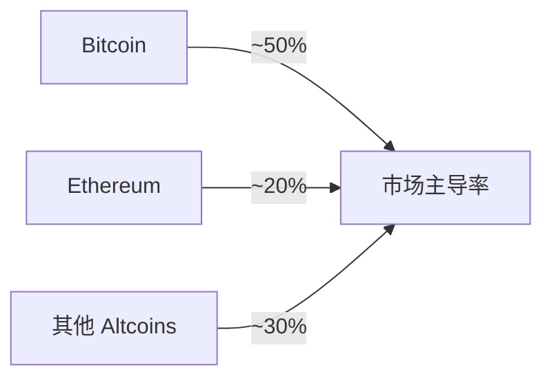
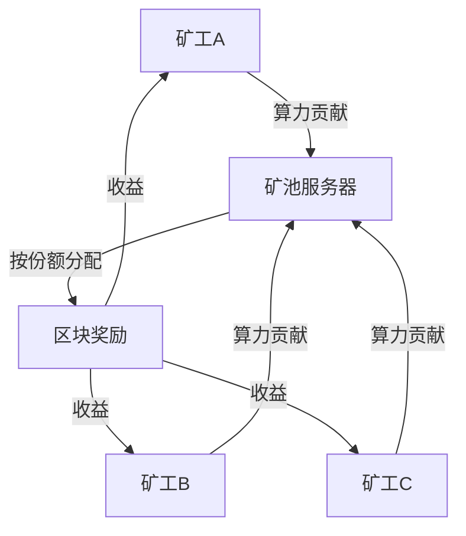
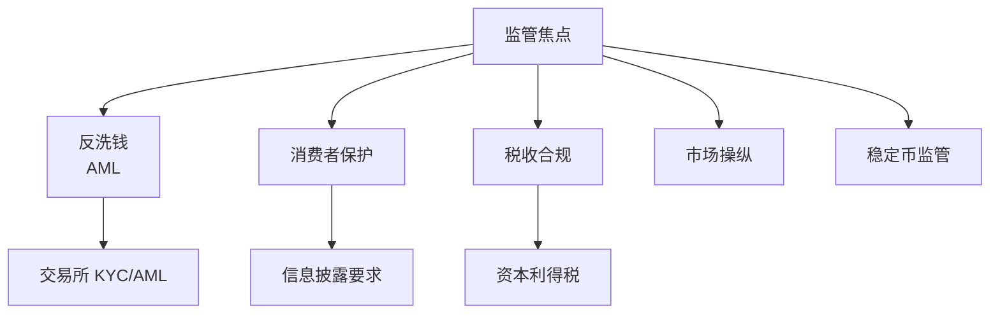
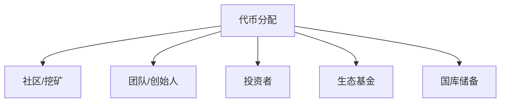

---
aliases:
  - 加密货币
  - 数字货币
  - Virtual Currency
tags:
  - blockchain
  - cryptocurrency
  - bitcoin
  - ethereum
  - mining
---

# 加密货币 (Cryptocurrency)

加密货币（Cryptocurrency）是基于密码学原理、运行在区块链（Blockchain）网络上的数字化货币，具有去中心化、不可伪造、透明可追溯等特性。

## 概述 (Overview)

加密货币通过分布式账本技术实现点对点价值转移，无需依赖中央银行或金融机构。其安全性建立在密码学哈希函数、数字签名和共识机制之上。

## 比特币 (Bitcoin)

比特币（Bitcoin, BTC）由中本聪（Satoshi Nakamoto）于 2008 年提出，是首个去中心化加密货币。

### 技术架构

### UTXO 模型

比特币使用未花费交易输出（UTXO, Unspent Transaction Output）模型：

$$Balance_{address} = \sum_{i} UTXO_i$$

### 货币政策

| 参数 | 数值 |
|------|------|
| 总量上限 | 21,000,000 BTC |
| 出块奖励 | 每 210,000 区块减半 |
| 当前减半周期 | 约 4 年 |
| 最小单位 | 1 聪（Satoshi）= $10^{-8}$ BTC |

### 挖矿难度调整

$$NewDifficulty = OldDifficulty \times \frac{ActualTime}{ExpectedTime}$$

目标：维持平均 10 分钟出块间隔

## 以太坊 (Ethereum)

以太坊（Ethereum, ETH）由 Vitalik Buterin 于 2015 年推出，引入智能合约（Smart Contracts）功能，支持可编程的去中心化应用（DApps）。

### 账户模型

以太坊采用账户余额模型：

### Gas 机制

以太坊使用 Gas 计量计算资源消耗：

$$TransactionFee = GasUsed \times GasPrice$$

| 操作 | Gas 消耗 |
|------|----------|
| 简单转账 | 21,000 |
| ERC-20 转账 | ~65,000 |
| NFT 铸造 | ~150,000 |
| 智能合约部署 | 可变，通常百万级 |

### 以太坊 2.0 升级

| 阶段 | 特性 |
|------|------|
| Phase 0 | 信标链启动，PoS 共识 |
| Phase 1 | 分片链部署 |
| Phase 2 | 状态执行、跨分片通信 |
| 合并（The Merge）| 主网与信标链合并，PoW→PoS |

## 替代币 (Altcoins)

除比特币外的其他加密货币统称替代币（Altcoins）。

### 主要类别

| 类别 | 代表 | 特点 |
|------|------|------|
| 平台币 | ETH, SOL, AVAX | 智能合约平台 |
| 稳定币 | USDT, USDC, DAI | 锚定法币价值 |
| 隐私币 | XMR, ZEC | 交易隐私保护 |
|  meme 币 | DOGE, SHIB | 社区驱动 |
| 治理代币 | UNI, AAVE | DeFi 协议治理 |

### 市值排名（示例）

## 挖矿 (Mining)

挖矿（Mining）是通过计算竞争获得区块记账权和代币奖励的过程。

### 挖矿算法

| 算法 | 原理 | 代表币种 | 硬件 |
|------|------|----------|------|
| SHA-256 | 哈希计算 | Bitcoin | ASIC |
| Ethash | 内存密集型 | Ethereum（前）| GPU |
| Scrypt | 内存密集型 | Litecoin | ASIC/GPU |
| RandomX | CPU 优化 | Monero | CPU |
| Proof of Stake | 质押权益 | Ethereum 2.0 | 服务器 |

### 挖矿收益计算

$$DailyRevenue = \frac{HashRate \times BlockReward \times Price \times 86400}{NetworkDifficulty \times 2^{32}}$$

### 矿池机制

## 钱包 (Wallets)

加密货币钱包管理私钥和地址，不实际存储代币。

### 钱包类型

| 类型 | 私钥存储 | 安全性 | 便利性 |
|------|----------|--------|--------|
| 硬件钱包 | 离线设备 | 极高 | 中 |
| 软件钱包 | 本地加密 | 高 | 高 |
| 网页钱包 | 服务商 | 中 | 极高 |
| 纸钱包 | 物理介质 | 高 | 低 |
| 脑钱包 | 记忆助记词 | 中 | 中 |

### 分层确定性钱包 (HD Wallet)

基于 BIP-32/BIP-39 标准，通过种子派生多组密钥对：

$$ChildKey = HMACSHA512(ParentKey, Index)$$

助记词通常为 12 或 24 个英文单词。

## 监管环境 (Regulation)

### 全球监管态度

| 地区 | 态度 | 关键法规 |
|------|------|----------|
| 美国 | 审慎监管 | SEC、CFTC 分权 |
| 欧盟 | 规范发展 | MiCA 法规 |
| 中国 | 严格禁止 | 挖矿、交易禁令 |
| 日本 | 合法化 | 支付服务法 |
| 新加坡 | 友好 | 支付法案 |

### 监管焦点

## 加密货币经济学 (Tokenomics)

### 供需模型

$$Price = f(Demand, Supply, Utility, Speculation)$$

### 代币分配

### 关键指标

| 指标 | 说明 |
|------|------|
| 市值（Market Cap） | $Price \times CirculatingSupply$ |
| 完全稀释估值（FDV） | $Price \times TotalSupply$ |
| 交易量（Volume） | 24 小时交易总额 |
| 流通量（Circulating Supply） | 市场可交易数量 |

## 安全风险 (Security Risks)

| 风险类型 | 描述 | 案例 |
|----------|------|------|
| 交易所被盗 | 平台安全漏洞 | Mt. Gox, FTX |
| 智能合约漏洞 | 代码缺陷 | The DAO, Poly Network |
| 私钥丢失 | 无恢复机制 | 大量比特币永久丢失 |
| 钓鱼诈骗 | 社会工程 | 假钱包、假网站 |
| 勒索软件 | 加密文件索要比特币 | WannaCry |
| 51% 攻击 | 算力 majority | ETC 多次遭攻击 |

## 未来展望 (Future Outlook)

- 央行数字货币（CBDC, Central Bank Digital Currency）发展
- 加密货币与传统金融融合（ETF、托管服务）
- 隐私技术与合规的平衡
- 跨链互操作性提升
- 能源效率改进（PoS 普及）

## 参考资源 (References)

- [Bitcoin Whitepaper](https://bitcoin.org/bitcoin.pdf)
- [Ethereum Documentation](https://ethereum.org/en/developers/docs/)
- [CoinMarketCap](https://coinmarketcap.com/)
- [Glassnode Insights](https://insights.glassnode.com/)
