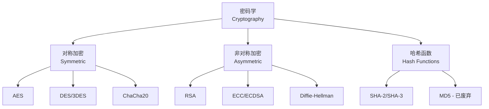
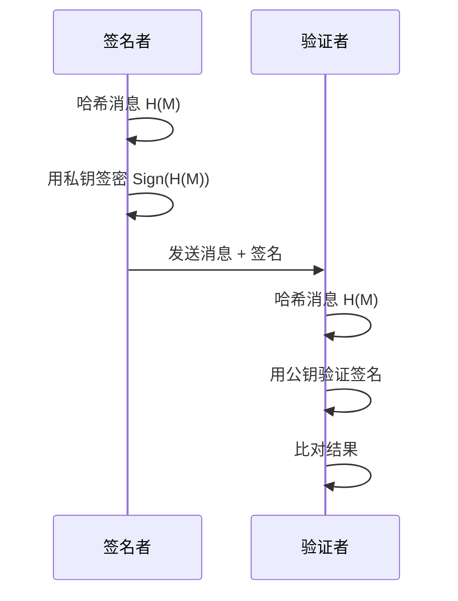

# 密码学 (Cryptography)

## 概述 (Overview)

密码学是研究如何在不安全信道上实现安全通信的学科，涉及加密（Encryption）、解密（Decryption）、哈希函数（Hash Functions）和数字签名（Digital Signatures）等技术。密码学是信息安全的核心基础，保护数据的机密性、完整性、真实性和不可否认性。

## 密码学分类

## 对称加密 (Symmetric Encryption)

对称加密使用相同密钥进行加密和解密：

$$
C = E_K(P)
$$

$$
P = D_K(C)
$$

其中 $P$ 为明文（Plaintext），$C$ 为密文（Ciphertext），$K$ 为密钥（Key）。

| 算法 | 密钥长度 | 分组大小 | 安全性 |
|------|---------|---------|--------|
| AES-128 | 128 bit | 128 bit | 安全 |
| AES-256 | 256 bit | 128 bit | 最高安全 |
| ChaCha20 | 256 bit | 流密码 | 安全（移动端优选） |
| DES | 56 bit | 64 bit | 不安全 |
| 3DES | 112/168 bit | 64 bit | 不推荐 |

### 工作模式 (Modes of Operation)

| 模式 | 名称 | 特点 |
|------|------|------|
| ECB | Electronic Codebook | 简单，相同明文块产生相同密文 |
| CBC | Cipher Block Chaining | 需要 IV，前后依赖 |
| GCM | Galois/Counter Mode | 认证加密，推荐使用 |
| CTR | Counter | 可并行加密，流密码模式 |

## 非对称加密 (Asymmetric Encryption)

非对称加密使用公钥（Public Key）和私钥（Private Key）对：

$$
C = E_{K_{pub}}(P)
$$

$$
P = D_{K_{priv}}(C)
$$

| 算法 | 安全性基础 | 密钥长度 | 强度对比 |
|------|-----------|---------|---------|
| RSA | 大整数分解 | 2048+ bit | 基准 |
| ECC | 椭圆曲线离散对数 | 256 bit ~= RSA 3072 | 更高效率 |
| Ed25519 | Edwards 曲线 | 256 bit | 高性能签名 |
| Dilithium | 格密码 (Lattice) | - | 后量子安全 |
| Kyber | 格密码 (ML-KEM) | - | 后量子密钥封装 |

### 密钥强度对比

$$
\text{ECC-256 安全性} \approx \text{RSA-3072 安全性}
$$

$$
\text{RSA 密钥长度} = \Omega(\text{ECC 密钥长度}^3)
$$

## 哈希函数 (Hash Functions)

哈希函数将任意长度数据映射为固定长度摘要：

$$
h = H(M), \quad |h| = \text{const}
$$

### 安全哈希属性

| 属性 | 定义 |
|------|------|
| 抗原像性 (Preimage Resistance) | 给定 $h$，无法找到 $M$ 使得 $H(M) = h$ |
| 抗第二原像性 (2nd Preimage) | 给定 $M_1$，无法找到 $M_2 \neq M_1$ 使得 $H(M_1) = H(M_2)$ |
| 抗碰撞性 (Collision Resistance) | 无法找到任意 $M_1 \neq M_2$ 使得 $H(M_1) = H(M_2)$ |

| 算法 | 摘要长度 | 安全性状态 |
|------|---------|-----------|
| MD5 | 128 bit | 已破解，不推荐 |
| SHA-1 | 160 bit | 已破解，不推荐 |
| SHA-256 | 256 bit | 安全 |
| SHA-3 | 可变 | 安全 |
| BLAKE3 | 可变 | 安全，高速 |

## 数字签名 (Digital Signature)

数字签名流程：

## 密钥交换 (Key Exchange)

### Diffie-Hellman 密钥交换

$$
A = g^a \mod p
$$

$$
B = g^b \mod p
$$

$$
K = B^a \mod p = A^b \mod p = g^{ab} \mod p
$$

### 椭圆曲线 Diffie-Hellman (ECDH)

$$
Q_A = d_A \cdot G
$$

$$
Q_B = d_B \cdot G
$$

$$
S = d_A \cdot Q_B = d_B \cdot Q_A
$$

## 密码协议 (Cryptographic Protocols)

| 协议 | 用途 | 核心机制 |
|------|------|---------|
| TLS 1.3 | Web 安全通信 | ECDHE + AEAD |
| SSH | 远程安全登录 | 密钥交换 + 主机验证 |
| IPsec | 网络层加密 | ESP/AH + IKE |
| Signal Protocol | 即时通信加密 | X3DH + Double Ratchet |
| WireGuard | VPN | Noise Protocol + Curve25519 |

## 后量子密码学 (Post-Quantum Cryptography)

NIST 标准化进展：

| 算法 | 类型 | 用途 |
|------|------|------|
| CRYSTALS-Kyber (ML-KEM) | 格密码 | 密钥封装机制 (KEM) |
| CRYSTALS-Dilithium (ML-DSA) | 格密码 | 数字签名 |
| SPHINCS+ | 哈希签名 | 无状态数字签名 |
| FALCON | 格密码 | 紧凑数字签名 |

## 相关条目

- [[CybersecurityOverview]]
- [[NetworkSecurity]]
- [[SecurityFrameworks]]
- [[WebSecurity]]
- [[Cryptocurrency]]
