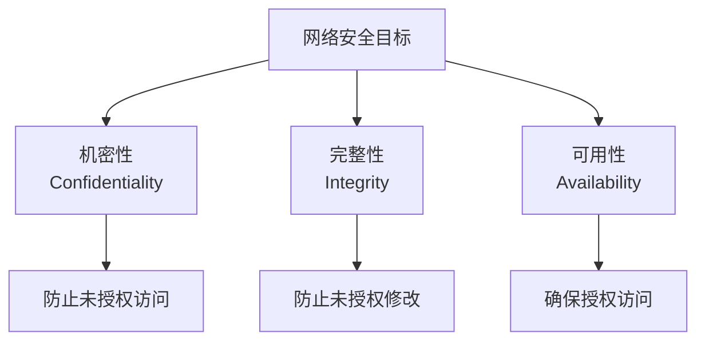
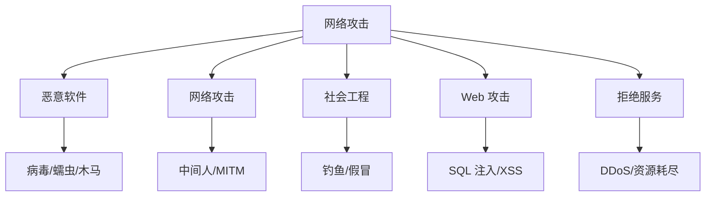
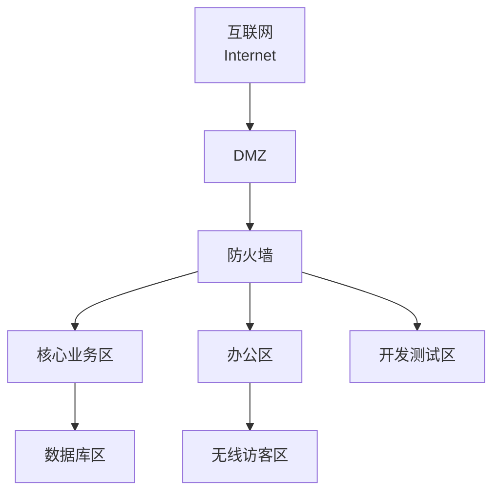
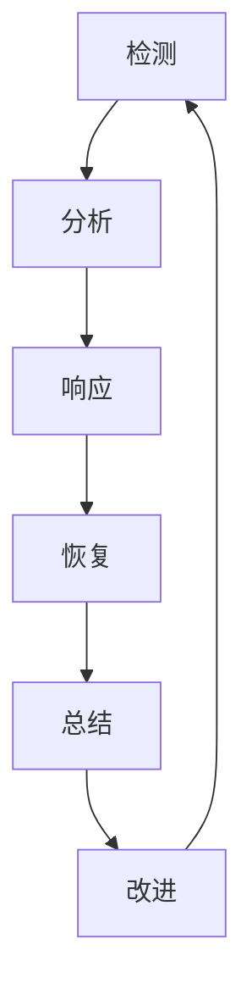
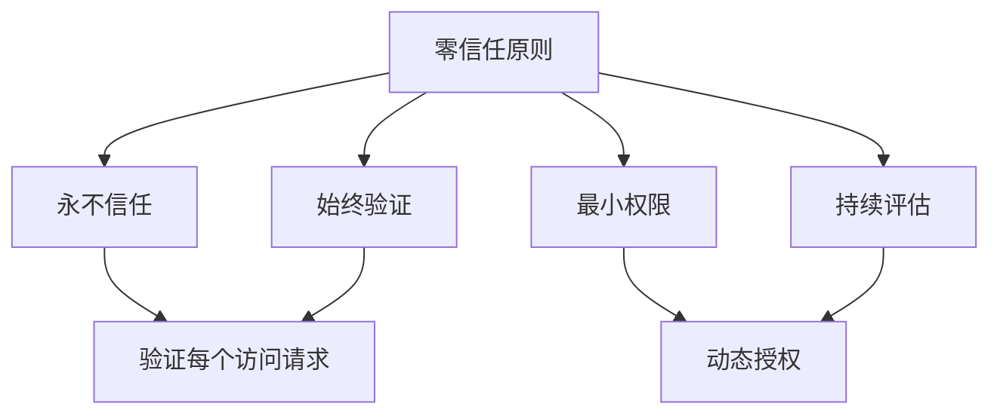

---
aliases:
  - 网络安全
  - 信息安全
  - Cybersecurity Overview
tags:
  - cybersecurity
  - security
  - network
  - cryptography
  - defense
---

# 网络安全概论 (Cybersecurity Overview)

网络安全（Cybersecurity）是保护计算机系统、网络和数据免受数字攻击、窃取或损坏的实践与技术集合。在数字化时代，网络安全已成为国家安全、企业运营和个人隐私的重要保障。

## 概述 (Overview)

网络安全的核心目标是确保信息的机密性（Confidentiality）、完整性（Integrity）和可用性（Availability），即 CIA 三元组：

$$Security\ Goals = \{Confidentiality, Integrity, Availability\}$$

## 威胁 landscape (Threat Landscape)

### 威胁参与者 (Threat Actors)

| 类型 | 动机 | 能力 |
|------|------|------|
| 国家支持（APT） | 政治、军事、经济情报 | 极高 |
| 有组织犯罪 | 经济利益 | 高 |
| 黑客活动家 | 政治主张、社会议题 | 中 |
| 内部威胁 | 报复、利益、疏忽 | 中高 |
| 脚本小子 | 炫耀、学习 | 低 |

### 常见攻击类型

## 防御体系 (Defense in Depth)

纵深防御（Defense in Depth）策略通过多层安全控制建立冗余保护：

### 安全控制分类

| 层级 | 控制类型 | 示例 |
|------|----------|------|
| 物理层 | 门禁、监控 | 生物识别、保安 |
| 网络层 | 防火墙、VPN | 下一代防火墙、零信任 |
| 主机层 | EDR、补丁 | CrowdStrike、WSUS |
| 应用层 | WAF、RASP | ModSecurity、免疫墙 |
| 数据层 | 加密、DLP | AES-256、Symantec DLP |

## 密码学 (Cryptography)

密码学是网络安全的数学基础，提供机密性和完整性保障。

### 对称加密

$$C = E_K(P), \quad P = D_K(C)$$

| 算法 | 密钥长度 | 用途 |
|------|----------|------|
| AES | 128/192/256 bit | 通用加密 |
| ChaCha20 | 256 bit | 移动/嵌入式 |
| SM4 | 128 bit | 国密标准 |

### 非对称加密

$$C = E_{PK}(P), \quad P = D_{SK}(C)$$

| 算法 | 基于问题 | 用途 |
|------|----------|------|
| RSA | 大数分解 | 密钥交换、签名 |
| ECC | 椭圆曲线离散对数 | 高效加密、TLS |
| SM2 | 椭圆曲线 | 国密标准 |

### 哈希函数

$$H: \{0,1\}^* \rightarrow \{0,1\}^n$$

| 算法 | 输出长度 | 安全性 |
|------|----------|--------|
| SHA-256 | 256 bit | 安全 |
| SHA-3 | 可变 | 安全 |
| SM3 | 256 bit | 国密标准 |
| MD5 | 128 bit | 已破解 |

## 网络安全 (Network Security)

### 网络分段 (Network Segmentation)

通过网络分段限制攻击横向移动：

### 安全协议

| 协议 | 功能 | 应用 |
|------|------|------|
| TLS/SSL | 传输层加密 | HTTPS、VPN |
| IPsec | 网络层加密 | Site-to-Site VPN |
| SSH | 安全远程登录 | 服务器管理 |
| DNSSEC | DNS 安全扩展 | 防 DNS 劫持 |

### 入侵检测与防御

| 系统 | 部署位置 | 工作模式 |
|------|----------|----------|
| NIDS | 网络边界 | 被动检测 |
| NIPS | 网络边界 | 主动阻断 |
| HIDS | 主机内部 | 日志/行为分析 |
| HIPS | 主机内部 | 主动防御 |

## 应用安全 (Application Security)

### OWASP Top 10 (2021)

| 排名 | 漏洞类型 | 风险 |
|------|----------|------|
| A01 | 访问控制失效 | 未授权访问 |
| A02 | 加密机制失效 | 数据泄露 |
| A03 | 注入攻击 | 数据篡改/RCE |
| A04 | 不安全设计 | 架构缺陷 |
| A05 | 安全配置错误 | 系统暴露 |
| A06 | 易受攻击组件 | 供应链攻击 |
| A07 | 身份认证失效 | 账户接管 |
| A08 | 软件数据完整性 | 恶意更新 |
| A09 | 安全日志缺失 | 无法溯源 |
| A10 | SSRF | 内网探测 |

### 安全开发生命周期 (SDLC)

## 安全运营 (Security Operations)

### SOC 运营流程

### 关键指标

| 指标 | 缩写 | 说明 |
|------|------|------|
| 平均检测时间 | MTTD | 从入侵到检测的时间 |
| 平均响应时间 | MTTR | 从检测到遏制的时间 |
| 误报率 | FPR | 误报占总告警比例 |
| 漏洞修复时间 | - | 漏洞披露到修复时间 |

## 身份与访问管理 (IAM)

### 核心概念

| 概念 | 描述 |
|------|------|
| 身份认证（Authentication） | 验证用户身份 |
| 授权（Authorization） | 确定访问权限 |
| 审计（Accounting） | 记录访问行为 |
| 单点登录（SSO） | 一次登录多系统 |
| 多因素认证（MFA） | 多维度身份验证 |

### 零信任架构 (Zero Trust)

核心公式：

$$Trust = f(Identity, DeviceHealth, Behavior, Context)$$

## 云安全 (Cloud Security)

### 责任共担模型

| 模式 | 云服务商责任 | 客户责任 |
|------|--------------|----------|
| IaaS | 基础设施 | OS 及以上 |
| PaaS | 平台 | 应用和数据 |
| SaaS | 全部服务 | 数据访问 |

### 云原生安全

- 容器安全：镜像扫描、运行时防护
- Kubernetes 安全：RBAC、网络策略
- 无服务器安全：函数权限、注入防护

## 法规与合规 (Regulations and Compliance)

| 法规 | 地区 | 核心要求 |
|------|------|----------|
| 网络安全法 | 中国 | 等级保护、数据本地化 |
| 数据安全法 | 中国 | 数据分类分级 |
| 个人信息保护法 | 中国 | 隐私保护、用户权利 |
| GDPR | 欧盟 | 数据主体权利、跨境传输 |
| HIPAA | 美国 | 医疗数据保护 |
| PCI DSS | 国际 | 支付卡数据安全 |

## 未来趋势 (Future Trends)

- **AI 驱动的安全**：机器学习威胁检测与响应
- **扩展检测与响应（XDR）**：跨域威胁关联分析
- **安全访问服务边缘（SASE）**：网络与安全融合
- **量子安全密码**：抗量子计算加密算法
- **威胁情报共享**：行业协同防御

## 参考资源 (References)

- [NIST Cybersecurity Framework](https://www.nist.gov/cyberframework)
- [OWASP](https://owasp.org/)
- [SANS Reading Room](https://www.sans.org/reading-room/)
- [CIS Controls](https://www.cisecurity.org/controls)
