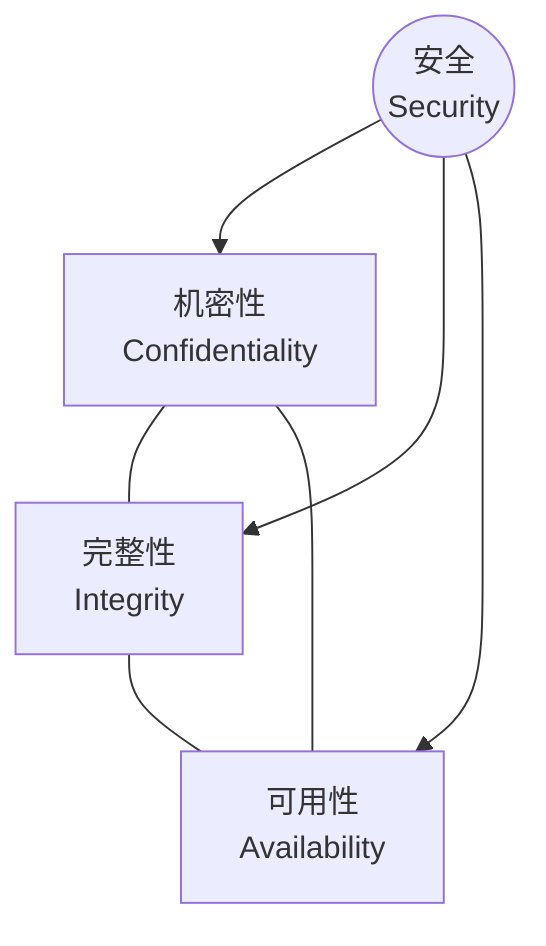
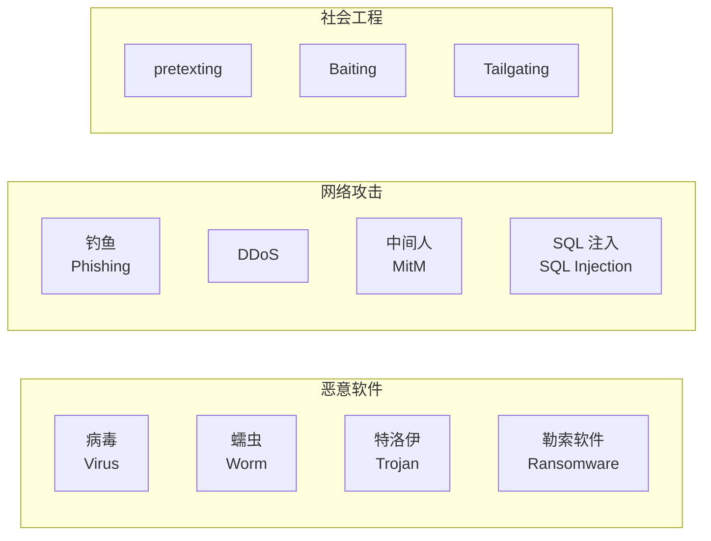
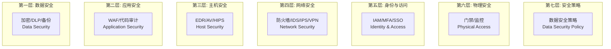

---
aliases: [Cybersecurity, 网络安全概述]
tags: ['05_ComputerScience', 'Cybersecurity', 'Overview']
created: 2026-05-17
updated: 2026-05-17
---

# 网络安全概述 (Cybersecurity Overview)

## 定义与核心目标

网络安全（Cybersecurity）是保护计算机系统、网络、程序和数据免受数字攻击的实践与技术领域。其核心目标由 **CIA 三元组**（CIA Triad）概括：

| 要素 | 英文 | 定义 |
|------|------|------|
| 机密性 | Confidentiality | 确保信息不被未授权访问或泄露 |
| 完整性 | Integrity | 保证数据未被篡改，来源可信 |
| 可用性 | Availability | 确保授权用户能及时访问资源 |

## 安全三要素关系

## 扩展安全模型

### Parkerian Hexad

在 CIA 基础上增加了三个要素：

| 要素 | 描述 |
|------|------|
| 持有 (Possession) | 数据的物理或逻辑控制 |
| 真实性 (Authenticity) | 数据来源的合法性验证 |
| 效用性 (Utility) | 数据的可用性与价值 |

### STRIDE 威胁分类

| 威胁类型 | 英文 | 破坏目标 |
|---------|------|---------|
| 欺骗 (Spoofing) | Spoofing | 真实性 |
| 篡改 (Tampering) | Tampering | 完整性 |
| 抵赖 (Repudiation) | Repudiation | 不可否认性 |
| 信息泄露 (Info Disclosure) | Information Disclosure | 机密性 |
| 拒绝服务 (DoS) | Denial of Service | 可用性 |
| 权限提升 (Elevation) | Elevation of Privilege | 授权 |

## 常见威胁类型 (Common Threats)

### 威胁分类表

| 类别 | 示例 | 影响 |
|------|------|------|
| 恶意软件 (Malware) | 病毒、蠕虫、木马、勒索软件 | 数据破坏、加密勒索 |
| 网络钓鱼 (Phishing) | 鱼叉钓鱼、鲸钓 | 凭证窃取 |
| DDoS 攻击 | 应用层/网络层泛洪 | 服务不可用 |
| 中间人攻击 (MitM) | HTTPS 降级、WiFi 嗅探 | 数据窃取 |
| 内部威胁 (Insider) | 恶意/无意泄露 | 数据泄露 |
| APT 攻击 | 国家支持的高级持续威胁 | 长期潜伏窃密 |

## 防御体系 (Defense in Depth)

分层防御（Layered Defense）模型：

## 关键防御技术

| 技术 | 英文 | 功能 |
|------|------|------|
| 防火墙 | Firewall | 基于规则的数据包过滤 |
| 入侵检测系统 | IDS | 网络流量异常检测与告警 |
| 入侵防御系统 | IPS | 实时阻断恶意流量 |
| 虚拟专用网络 | VPN | 加密远程通信隧道 |
| 多因素认证 | MFA | 多因子身份验证 |
| 端点检测与响应 | EDR | 端点威胁实时监控 |
| 数据防泄漏 | DLP | 敏感数据流出监控 |
| 安全信息和事件管理 | SIEM | 日志聚合与分析 |

## 安全的数学基础

熵（Entropy）衡量信息的不确定性：

$$
H(X) = -\sum_{i=1}^{n} P(x_i) \log_2 P(x_i)
$$

在密码学中，密钥强度通常用比特表示：$k$ 位密钥的密钥空间为 $2^k$。

## 安全成熟度模型

| 级别 | 名称 | 特征 |
|------|------|------|
| 1 | 初始级 (Initial) | 反应式、无流程 |
| 2 | 可重复级 (Repeatable) | 基本流程建立 |
| 3 | 定义级 (Defined) | 标准化流程 |
| 4 | 管理级 (Managed) | 量化度量 |
| 5 | 优化级 (Optimizing) | 持续改进 |

## 趋势与发展

- **零信任架构 (Zero Trust)**：从不信任，始终验证
- **AI 驱动的安全分析**：机器学习辅助威胁检测
- **云安全 (Cloud Security)**：CASB、CSPM、CIEM
- **量子安全密码学 (Post-Quantum Cryptography)**：抗量子攻击算法
- **安全即代码 (Security as Code)**：DevSecOps 实践

## 相关条目

- [[SecurityFrameworks]]
- [[NetworkSecurity]]
- [[Cryptography]]
- [[MalwareAnalysis]]
- [[PenetrationTesting]]
- [[WebSecurity]]

