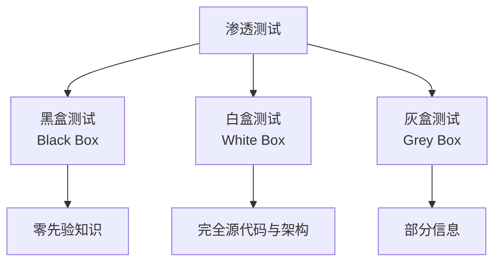
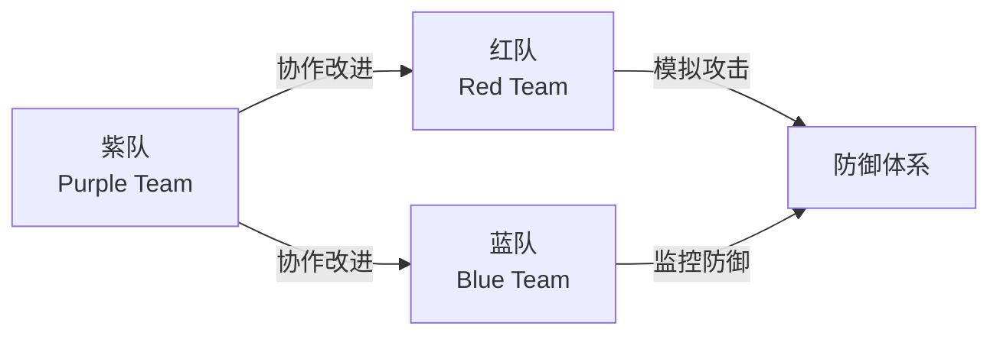
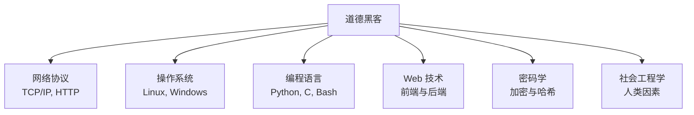

# 道德黑客 (Ethical Hacking)

道德黑客（Ethical Hacking），又称白帽黑客（White Hat Hacking），是指在获得授权的前提下，以攻击者视角评估系统安全性的专业实践。其核心目标不是破坏，而是发现漏洞、验证防御措施并提供改进建议。

## 道德黑客与恶意黑客的区别

| 维度 | 道德黑客（白帽） | 恶意黑客（黑帽） | 灰帽黑客 |
|------|------------------|------------------|----------|
| 授权 | 明确授权 | 未授权 | 未授权但无恶意 |
| 目的 | 提升安全 | 窃取数据或破坏 | 公开漏洞 |
| 法律 | 合法合规 | 违法犯罪 | 法律灰色地带 |
| 披露 | 负责任披露 | 非法贩卖 | 部分披露 |

道德黑客活动必须遵循严格的法律与伦理边界，通常以书面合同明确测试范围、时间窗口与数据处理方式。

## 渗透测试 (Penetration Testing)

渗透测试（Penetration Testing, Pen Test）是道德黑客的核心方法论，模拟真实攻击以评估系统防御能力。

### 测试类型

### 渗透测试流程

遵循业界标准框架（如 PTES、OWASP Testing Guide），渗透测试通常包括以下阶段：

1. **前期交互（Pre-engagement）**：定义范围、规则与目标
2. **情报收集（Intelligence Gathering）**：被动与主动信息收集
3. **威胁建模（Threat Modeling）**：识别潜在攻击向量
4. **漏洞分析（Vulnerability Analysis）**：自动化扫描与手动验证
5. **漏洞利用（Exploitation）**：获取系统访问权限
6. **后渗透（Post-exploitation）**：权限提升与横向移动
7. **报告（Reporting）**：风险评级与修复建议

### 常用工具

| 类别 | 工具 | 用途 |
|------|------|------|
| 信息收集 | Nmap, Recon-ng, theHarvester | 端口扫描与信息收集 |
| 漏洞扫描 | Nessus, OpenVAS, Qualys | 自动化漏洞检测 |
| Web 测试 | Burp Suite, OWASP ZAP | Web 应用安全测试 |
| 漏洞利用 | Metasploit, Cobalt Strike | 漏洞利用框架 |
| 无线测试 | Aircrack-ng, Kismet | 无线网络评估 |

## 漏洞评估 (Vulnerability Assessment)

漏洞评估是系统性的安全弱点识别过程，与渗透测试的区别在于不实际利用漏洞。

### 漏洞分类

通用漏洞评分系统（CVSS, Common Vulnerability Scoring System）提供标准化的漏洞严重程度量化：

$$
\\text{Base Score} = f(\\text{AV}, \\text{AC}, \\text{PR}, \\text{UI}, \\text{S}, \\text{C}, \\text{I}, \\text{A})
$$

其中：
- AV（Attack Vector）：攻击向量
- AC（Attack Complexity）：攻击复杂度
- PR（Privileges Required）：所需权限
- UI（User Interaction）：用户交互
- S（Scope）：作用域
- C/I/A（Confidentiality/Integrity/Availability）：三性影响

| 评分范围 | 严重程度 |
|----------|----------|
| 0.0 | 无 |
| 0.1–3.9 | 低危 |
| 4.0–6.9 | 中危 |
| 7.0–8.9 | 高危 |
| 9.0–10.0 | 严重 |

## 红队演练 (Red Teaming)

红队演练（Red Teaming）是模拟高级持续威胁（APT, Advanced Persistent Threat）的全方位攻击演练，相较于传统渗透测试更具真实性与对抗性。

### 红蓝对抗模型

红队的战术遵循 MITRE ATT&CK 框架，这是一个基于真实攻击行为的战术与技术知识库：

| 战术阶段 | 技术示例 |
|----------|----------|
| 初始访问（Initial Access） | 钓鱼邮件、供应链攻击 |
| 执行（Execution） | PowerShell、WMI |
| 持久化（Persistence） | 注册表运行键、计划任务 |
| 权限提升（Privilege Escalation） | UAC 绕过、Sudo 滥用 |
| 防御规避（Defense Evasion） | 进程注入、清除日志 |
| 凭证访问（Credential Access） | 哈希传递、Kerberoasting |
| 发现（Discovery） | 网络扫描、账户发现 |
| 横向移动（Lateral Movement） | PsExec、远程桌面 |
| 收集（Collection） | 剪贴板数据、屏幕截图 |
| 渗出（Exfiltration） | C2 通道、DNS 隧道 |

## 安全框架与合规

道德黑客实践需遵循多项安全框架与法律法规：

| 框架/标准 | 适用范围 | 核心内容 |
|-----------|----------|----------|
| NIST SP 800-115 | 美国 | 信息安全测试指南 |
| OWASP ASVS | 全球 | 应用安全验证标准 |
| PTES | 全球 | 渗透测试执行标准 |
| ISO/IEC 27001 | 国际 | 信息安全管理体系 |
| 网络安全法 | 中国 | 关键信息基础设施保护 |

### 漏洞披露政策

负责任的漏洞披露（Responsible Disclosure）遵循以下原则：

1. 发现漏洞后首先通知受影响厂商
2. 给予合理修复期限（通常 90 天）
3. 在修复完成后公开披露细节
4. 不利用漏洞从事违法活动

## 道德黑客的技能体系

成为一名合格的道德黑客需要掌握跨学科知识与技能：

### 认证体系

| 认证 | 颁发机构 | 侧重点 |
|------|----------|--------|
| CEH | EC-Council | 基础渗透测试 |
| OSCP | Offensive Security | 实战漏洞利用 |
| GPEN | GIAC | 网络渗透测试 |
| GWAPT | GIAC | Web 应用渗透 |
| OSCE | Offensive Security | 高级 exploit 开发 |

道德黑客的本质是以攻促防。在数字化威胁日益复杂的今天，道德黑客不仅是技术专家，更是数字世界的守护者。他们的工作帮助组织在真正的攻击发生前修复弱点，保护用户隐私与财产安全，维护网络空间的可信与稳定。
