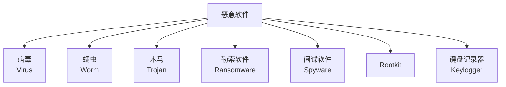
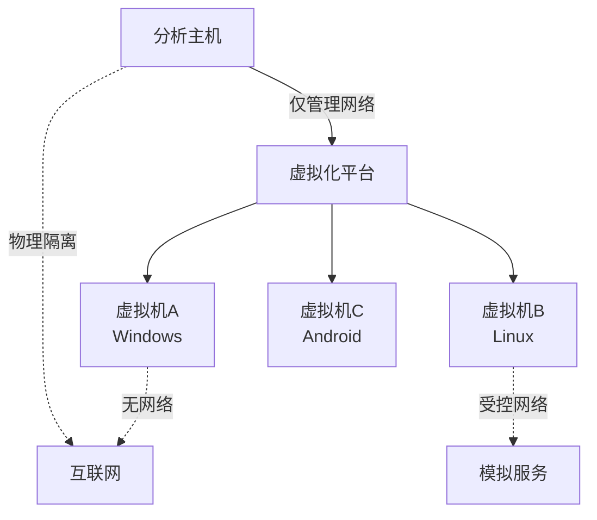
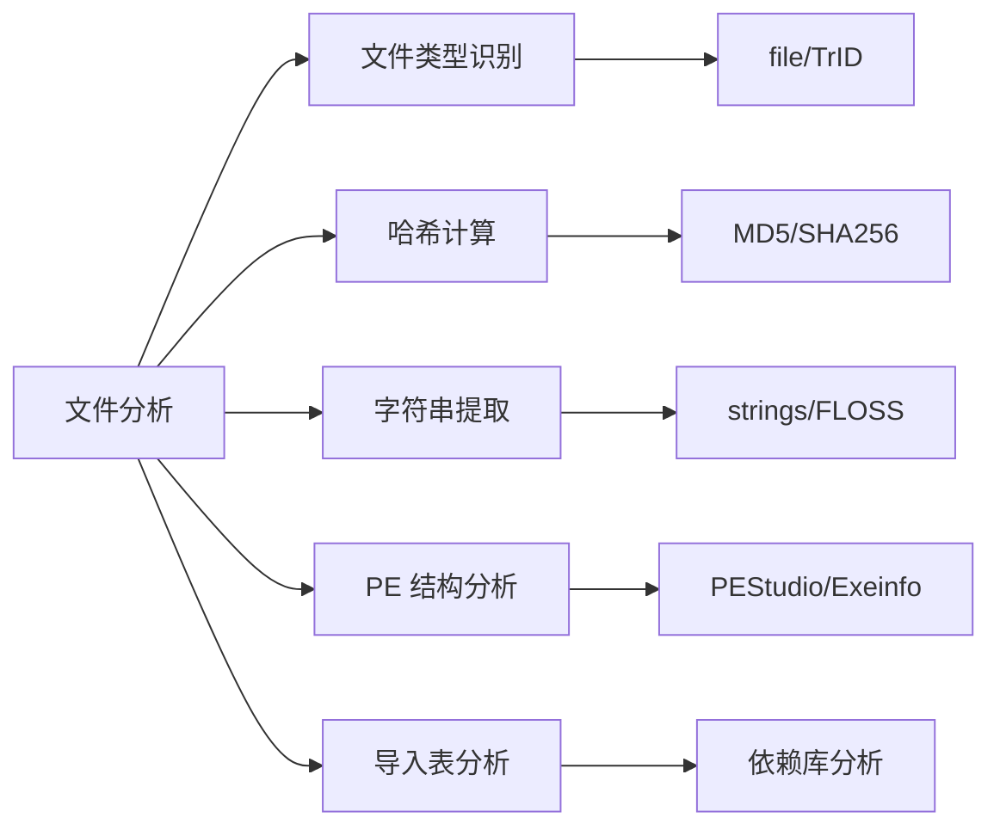
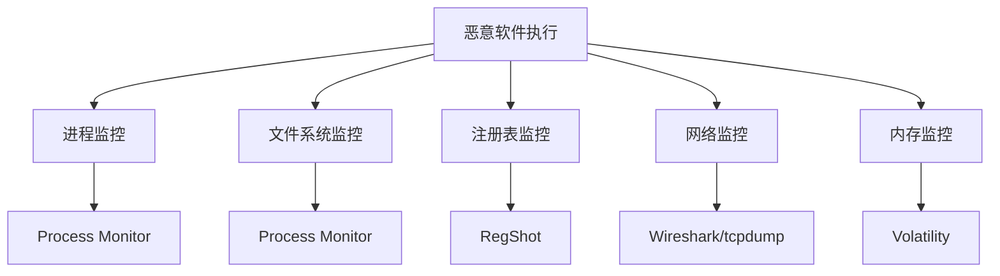
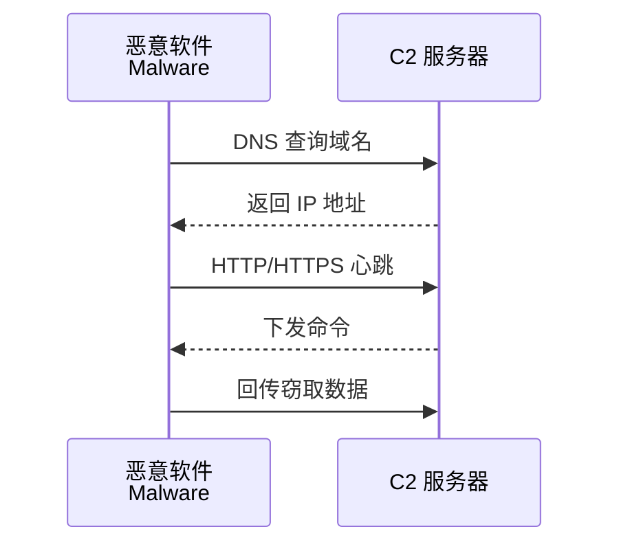
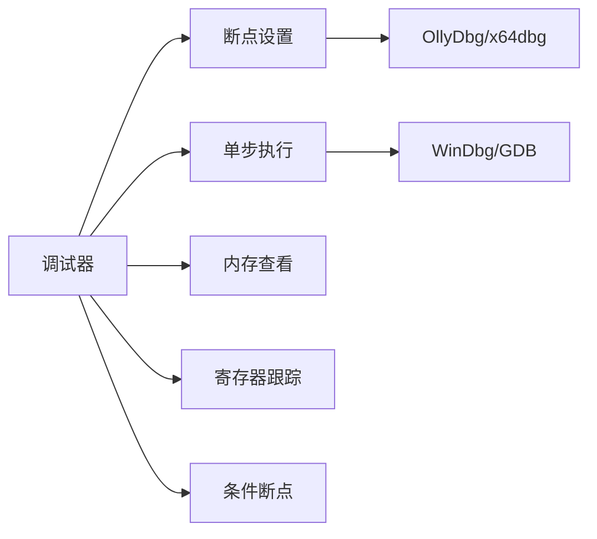
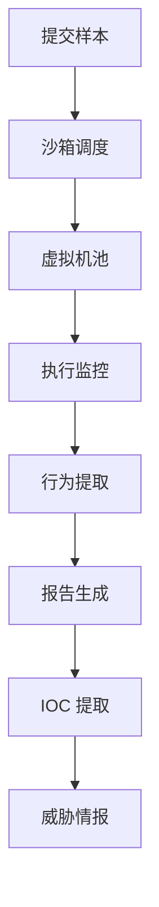
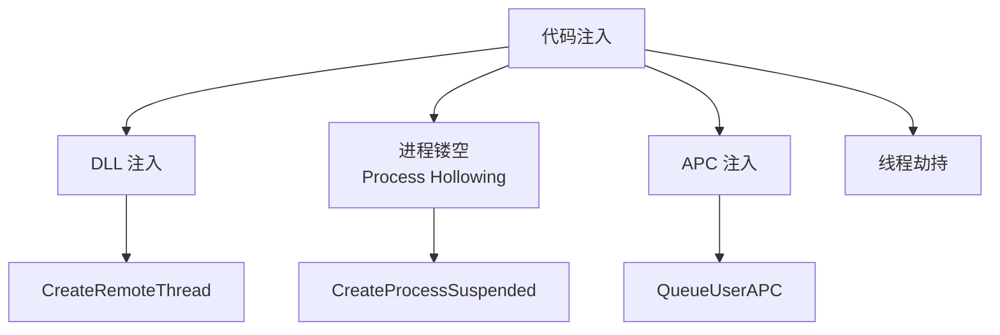
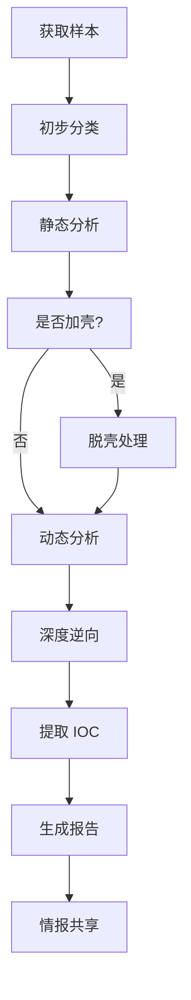

---
aliases:
  - 恶意软件分析
  - Malware Reverse Engineering
  - 病毒分析
tags:
  - cybersecurity
  - malware
  - reverse-engineering
  - forensics
  - sandbox
---

# 恶意软件分析 (Malware Analysis)

恶意软件分析（Malware Analysis）是研究恶意程序行为、功能、传播机制的技术过程，为检测、清除和防御提供依据。

## 概述 (Overview)

恶意软件（Malware, Malicious Software）泛指任何以破坏、窃取或干扰为目的的软件。分析恶意软件需要深厚的系统底层知识、逆向工程能力和安全研究经验。



## 分析环境 (Analysis Environment)

### 隔离实验室



### 关键工具

| 类别 | 工具 | 用途 |
|------|------|------|
| 虚拟化 | VMware, VirtualBox | 隔离分析环境 |
| 快照 | 虚拟机快照 | 快速恢复干净状态 |
| 网络模拟 | INetSim, FakeNet-NG | 模拟网络服务 |
| 内存取证 | Volatility, Rekall | 内存镜像分析 |

## 静态分析 (Static Analysis)

静态分析在不执行代码的前提下研究程序特征。

### 文件基本信息



### 文件哈希与查杀

$$FileFingerprint = SHA256(FileContent)$$

通过哈希查询 VirusTotal、MalwareBazaar 等数据库：

| 平台 | 功能 |
|------|------|
| VirusTotal | 多引擎扫描、行为报告 |
| MalwareBazaar | 恶意软件样本库 |
| Any.Run | 在线沙箱分析 |
| Hybrid Analysis | 静态+动态报告 |

### 代码反汇编

将机器码转换为汇编语言分析：

```asm
; 示例：API 调用序列
push    offset aWininet_dll    ; "wininet.dll"
call    LoadLibraryA
mov     [hModule], eax
push    offset aInternetopena  ; "InternetOpenA"
push    [hModule]
call    GetProcAddress
```

### 静态分析工具

| 工具 | 类型 | 特点 |
|------|------|------|
| IDA Pro | 商业反汇编 | 功能最全面 |
| Ghidra | 开源免费 | NSA 发布，功能强大 |
| Binary Ninja | 商业 | 现代 UI，分析速度快 |
| Radare2 | 开源 | 命令行，轻量 |
| Cutter | 开源 | Radare2 图形界面 |

### 加壳与脱壳

恶意软件常使用加壳（Packing）技术逃避检测：

| 壳类型 | 特征 | 工具 |
|--------|------|------|
| UPX | 开源、常见 | upx -d |
| Themida | 强保护 | 手动脱壳 |
| VMProtect | 虚拟化 | 动态调试 |
| 自定义 | 独特算法 | 通用脱壳器 |

## 动态分析 (Dynamic Analysis)

动态分析在受控环境中执行恶意软件，观察其实际行为。

### 行为监控



### 系统调用追踪

监控系统 API 调用序列：

| 工具 | 平台 | 能力 |
|------|------|------|
| API Monitor | Windows | API 调用参数 |
| Sysmon | Windows | 系统活动日志 |
| strace | Linux | 系统调用追踪 |
| ltrace | Linux | 库调用追踪 |

### 网络行为分析

恶意软件常见的网络通信模式：



### 动态分析工具

| 工具 | 用途 |
|------|------|
| Process Monitor | 文件、注册表、进程监控 |
| Process Hacker | 高级进程分析 |
| Autoruns | 启动项分析 |
| Wireshark | 网络抓包分析 |
| Regshot | 注册表差异比较 |

## 逆向工程 (Reverse Engineering)

逆向工程是从二进制代码还原程序逻辑的高级分析技术。

### 反编译

将汇编/字节码还原为高级语言：

| 工具 | 语言支持 |
|------|----------|
| Hex-Rays (IDA插件) | x86/x64/ARM |
| Ghidra Decompiler | 多架构 |
| JEB Decompiler | Android/Java |
| dnSpy/dnSpyEx | .NET |

### 调试技术



#### 调试器选择

| 调试器 | 平台 | 特点 |
|--------|------|------|
| x64dbg | Windows | 现代开源调试器 |
| OllyDbg | Windows | 经典 32 位调试器 |
| WinDbg | Windows | 微软官方，内核调试 |
| GDB | Linux | GNU 标准调试器 |
| LLDB | 跨平台 | LLVM 项目 |

### 反调试对抗

恶意软件常采用反调试技术对抗分析：

| 技术 | 原理 | 绕过方法 |
|------|------|----------|
| IsDebuggerPresent | 检测调试器标志 | 内存补丁 |
| 时间检测 | 执行时间差 | 调试器减速 |
| 异常处理 | 自定义异常陷阱 | 忽略异常 |
| 代码校验 | 完整性检查 | 动态修补 |
| 虚拟机检测 | 检测 VM 特征 | 硬件环境 |

## 沙箱分析 (Sandbox Analysis)

沙箱（Sandbox）提供自动化动态分析环境。

### 沙箱架构



### 开源沙箱

| 沙箱 | 特点 |
|------|------|
| Cuckoo Sandbox | 经典开源，可定制 |
| CAPEv2 | Cuckoo 分支，针对恶意软件优化 |
| DRAKVUF | 基于 Xen，无代理监控 |
| Intezer | 基因分析，代码重用检测 |

### 沙箱逃逸检测

恶意软件可能检测沙箱环境以规避分析：

| 检测向量 | 沙箱特征 |
|----------|----------|
| 硬件信息 | CPU 核心数、内存大小 |
| 人机交互 | 鼠标移动、窗口操作 |
| 系统时间 | 加速执行的时间异常 |
| 进程/文件 | 沙箱特有工具痕迹 |

## 内存取证 (Memory Forensics)

分析系统内存镜像以发现恶意进程和注入代码。

### Volatility 框架

| 插件 | 功能 |
|------|------|
| pslist | 进程列表 |
| psscan | 扫描隐藏进程 |
| dlllist | 加载的 DLL |
| malfind | 查找注入代码 |
| netscan | 网络连接 |
| cmdscan | 命令行历史 |

### 内存注入技术



## 威胁情报与 IOC (Indicators of Compromise)

从恶意软件中提取入侵指标用于检测和防御。

### IOC 类型

| 类型 | 示例 | 用途 |
|------|------|------|
| 文件哈希 | SHA256 | 精确匹配 |
| IP 地址 | C2 服务器 | 网络阻断 |
| 域名 | DGA 域名 | DNS 过滤 |
| URL | 下载地址 | 代理阻断 |
| 注册表键 | 持久化位置 | EDR 检测 |
| 互斥体 | 单实例标志 | 行为检测 |
| YARA 规则 | 代码特征 | 文件扫描 |

### YARA 规则示例

```yara
rule apt_malware_example {
    meta:
        author = "Analyst"
        description = "Detects APT malware family"
    strings:
        $s1 = "Mozilla/5.0 (compatible)" ascii
        $s2 = { 4D 5A 90 00 03 00 00 00 }
        $c1 = /https?:\/\/[a-z0-9]{20,30}\.com/
    condition:
        uint16(0) == 0x5A4D and
        filesize < 500KB and
        all of ($s*) and $c1
}
```

## 分析流程总结 (Analysis Workflow)



## 参考资源 (References)

- [Malware Analysis Tutorials - MalwareTech](https://malwaretech.com/)
- [Practical Malware Analysis](https://nostarch.com/malware)
- [REMnux Distribution](https://remnux.org/)
- [FLARE On Challenges](https://flare-on.com/)
- [TheZoo - Malware DB](https://github.com/ytisf/theZoo)
