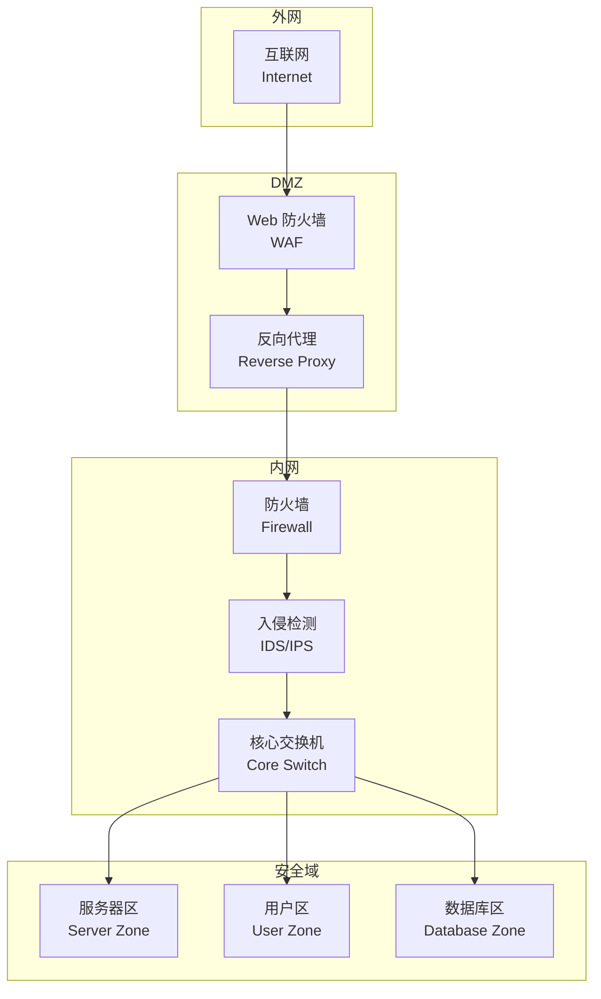
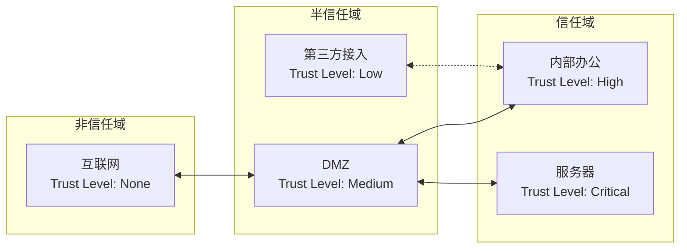

# 网络安全技术 (Network Security)

## 概述 (Overview)

网络安全技术是保护网络基础设施、通信和数据免受未经授权访问、攻击和破坏的各类技术手段的总称。其核心目标是确保网络服务的机密性（Confidentiality）、完整性（Integrity）和可用性（Availability）。

## 网络安全架构

## 关键安全技术

### 防火墙 (Firewall)

防火墙类型及特点：

| 类型 | 工作层次 | 特点 |
|------|---------|------|
| 包过滤防火墙 | 网络层 (L3) | 基于 IP/端口规则，速度快 |
| 状态检测防火墙 | 网络层+传输层 | 跟踪连接状态，安全性更好 |
| 应用层防火墙 | 应用层 (L7) | 深度包检测 (DPI)，最安全但开销大 |
| 下一代防火墙 (NGFW) | L3-L7 | 集成 IPS、应用识别、威胁情报 |

### 入侵检测与防御 (IDS/IPS)

| 特性 | IDS | IPS |
|------|-----|-----|
| 工作模式 | 旁路 (Passive) | 串联 (Inline) |
| 动作 | 告警、日志 | 阻断、重置连接 |
| 误报影响 | 低 | 可能导致业务中断 |
| 延迟 | 无 | 引入微延迟 |

检测方法：

- **基于签名 (Signature-based)**：匹配已知攻击模式
- **基于异常 (Anomaly-based)**：偏离基线行为检测
- **基于信誉 (Reputation-based)**：威胁情报集成

### 虚拟专用网络 (VPN)

VPN 协议对比：

| 协议 | 加密 | 端口 | 优势 |
|------|------|------|------|
| IPsec | AES/3DES | UDP 500/4500 | 最安全，广泛兼容 |
| OpenVPN | OpenSSL | UDP 1194/TCP 443 | 灵活开源 |
| WireGuard | ChaCha20 | UDP 51820 | 极简高速 |
| L2TP/IPsec | AES | UDP 1701 | 系统内置支持 |
| SSTP | SSL/TLS | TCP 443 | 穿透防火墙 |

## 网络分段与隔离 (Network Segmentation)

### 微隔离技术 (Micro-Segmentation)

| 维度 | 传统分段 | 微隔离 |
|------|---------|--------|
| 粒度 | 子网/VLAN 级别 | 工作负载级别 |
| 策略 | 基于 IP | 基于身份/标签 |
| 动态性 | 静态 | 动态适应 |
| 可视化 | 有限 | 细粒度流量可见 |

## 流量监控与异常检测

### NetFlow/IPFIX 分析

流量监控关键指标：

$$
\text{Baseline}_{\text{normal}} = \mu \pm k\sigma
$$

其中 $\mu$ 为平均流量，$\sigma$ 为标准差，$k$ 为阈值系数。

| 指标 | 描述 | 异常特征 |
|------|------|---------|
| 吞吐量 (Throughput) | bps 速率 | 突增/突降 |
| 包速率 (PPS) | 每秒包数 | DDoS 泛洪 |
| 连接数 (Connections) | 并发连接数 | 扫描/蠕虫 |
| 延迟 (Latency) | RTT 时间 | 网络拥塞 |

## 安全协议详解

| 协议 | 全称 | 端口 | 用途 |
|------|------|------|------|
| TLS/SSL | Transport Layer Security | TCP 443 | Web 通信加密 |
| IPsec | Internet Protocol Security | UDP 500/4500 | VPN 加密 |
| SSH | Secure Shell | TCP 22 | 远程安全登录 |
| DNSSEC | DNS Security Extensions | UDP 53 | DNS 安全扩展 |
| S/MIME | Secure/Multipurpose Internet Mail Extensions | - | 邮件加密签名 |
| Kerberos | - | UDP 88 | 网络认证协议 |

## 攻击面分析 (Attack Surface)

$$
\text{Attack Surface} = \sum_{i=1}^{n} (\text{Network Interfaces}_i + \text{Open Ports}_i + \text{Services}_i)
$$

减少攻击面的策略：

1. **最小化暴露**：关闭不必要的服务与端口
2. **服务收敛**：统一出口与入口
3. **补丁管理**：及时修复已知漏洞
4. **默认拒绝**：白名单策略

## 最佳实践

- **纵深防御 (Defense in Depth)**：多层防护叠加
- **最小权限 (Least Privilege)**：按需授权
- **默认拒绝 (Default Deny)**：白名单模式
- **持续监控 (Continuous Monitoring)**：7×24 态势感知
- **假设入侵 (Assume Breach)**：零信任思维

## 相关条目

- [[CybersecurityOverview]]
- [[Cryptography]]
- [[SecurityFrameworks]]
- [[PenetrationTesting]]
- [[WebSecurity]]
