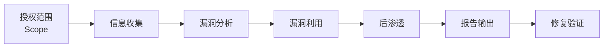
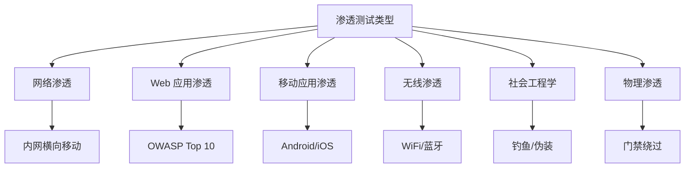
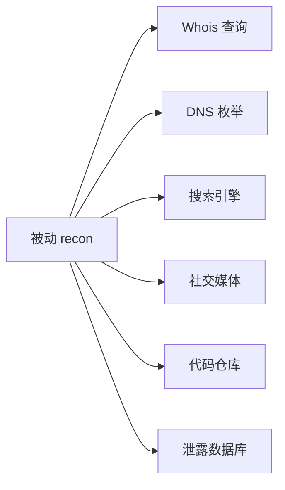
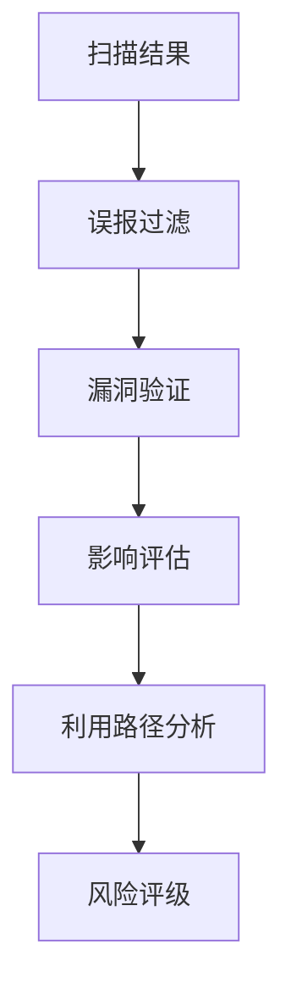
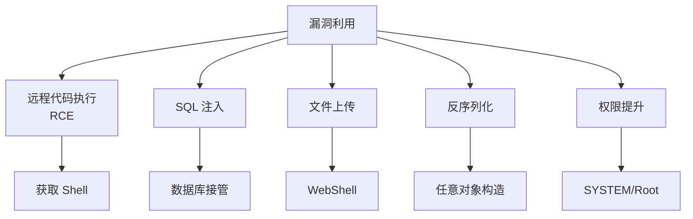
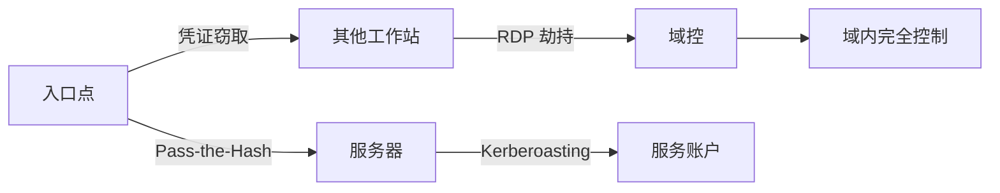
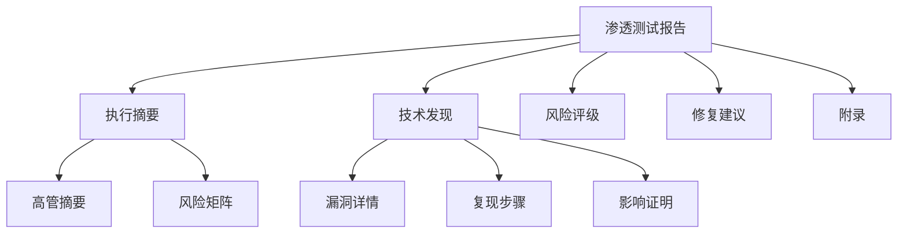

---
aliases:
  - 渗透测试
  - Pentest
  - 红队测试
tags:
created: 2026-05-17
updated: 2026-05-13
  - cybersecurity
  - pentest
  - red-team
  - vulnerability
  - offensive-security
---

# 渗透测试 (Penetration Testing)

渗透测试（Penetration Testing 或 Ethical Hacking）是通过模拟真实攻击者行为，评估信息系统安全性的授权安全评估活动。

## 概述 (Overview)

渗透测试的核心目标是发现系统中存在的安全漏洞（Vulnerabilities），验证漏洞的可利用性，并提供修复建议。与漏洞扫描不同，渗透测试强调人工参与的深度分析和实际攻击链路的构建。

## 测试类型 (Types of Penetration Testing)

### 按知识范围分类

| 类型 | 英文名 | 特点 | 适用场景 |
|------|--------|------|----------|
| 黑盒测试 | Black Box | 零先验知识 | 模拟外部攻击者 |
| 灰盒测试 | Gray Box | 部分信息 | 模拟内部人员 |
| 白盒测试 | White Box | 完整信息 | 深度代码审计 |

### 按目标系统分类

## 方法论框架 (Methodology Framework)

### PTES 框架

渗透测试执行标准（PTES, Penetration Testing Execution Standards）定义了七个阶段：

1. 前期交互（Pre-engagement Interactions）
2. 情报收集（Intelligence Gathering）
3. 威胁建模（Threat Modeling）
4. 漏洞分析（Vulnerability Analysis）
5. 漏洞利用（Exploitation）
6. 后渗透测试（Post Exploitation）
7. 报告（Reporting）

### OWASP Testing Guide

Web 应用安全测试框架，涵盖：

| 类别 | 测试内容 |
|------|----------|
| 信息收集 | 指纹、目录枚举 |
| 配置管理 | 平台配置错误 |
| 身份管理 | 认证绕过、会话管理 |
| 业务逻辑 | 工作流程绕过 |
| 客户端 | XSS、CSRF、DOM 操作 |
| API 测试 | 端点安全、速率限制 |

## 信息收集 (Reconnaissance)

信息收集是渗透测试的基础阶段，分为被动和主动两种方式。

### 被动信息收集

不直接与目标交互，通过公开渠道获取信息：

常用工具：

| 工具 | 功能 | 类型 |
|------|------|------|
| theHarvester | 邮箱、子域名收集 | 开源 |
| Maltego | 关系可视化 | 商业 |
| Shodan | 联网设备搜索 | 商业 |
| Censys | 互联网资产测绘 | 商业 |

### 主动信息收集

直接与目标交互以获取更多细节：

$$Scan\ Range = \bigcup_{i=1}^{n} (IP_i, PortRange_i)$$

#### 端口扫描技术

| 技术 | 原理 | 隐蔽性 |
|------|------|--------|
| TCP Connect | 完整三次握手 | 低 |
| SYN Scan | 半开扫描 | 中 |
| FIN/NULL/Xmas | 异常包探测 | 高 |
| UDP Scan | UDP 包探测 | 中 |

#### 工具

| 工具 | 特点 |
|------|------|
| Nmap | 最全面的端口扫描器 |
| Masscan | 异步高速扫描 |
| Zmap | 互联网级扫描 |

## 漏洞分析 (Vulnerability Analysis)

### 自动化扫描

| 工具 | 适用场景 | 特点 |
|------|----------|------|
| Nessus | 网络漏洞 | 漏洞库全面 |
| OpenVAS | 网络漏洞 | 开源免费 |
| Burp Suite | Web 应用 | 代理拦截、主动扫描 |
| Acunetix | Web 应用 | 爬虫能力强 |
| Metasploit | 综合框架 | 漏洞利用一体化 |

### 手动分析

自动化扫描后需人工验证和深入分析：

## 漏洞利用 (Exploitation)

在授权前提下，验证漏洞的实际可利用性。

### 利用框架

| 框架 | 特点 |
|------|------|
| Metasploit | 最全面的利用框架 |
| Cobalt Strike | 红队工具，C2 控制 |
| Sliver | 开源 C2 框架 |
| SQLMap | SQL 注入自动化 |

### 常见漏洞利用

### 权限提升 (Privilege Escalation)

$$Target\ Privilege = \max(Privilege_{current}, Exploit_{privesc})$$

#### Windows 权限提升

| 向量 | 描述 |
|------|------|
| 内核漏洞 | 未修补的系统漏洞 |
| 服务配置 | 不安全的服务权限 |
| DLL 劫持 | 搜索顺序劫持 |
| 注册表 | AlwaysInstallElevated |

#### Linux 权限提升

| 向量 | 描述 |
|------|------|
| SUID/SGID | 特殊权限文件滥用 |
| Sudo 配置 | sudoers 配置错误 |
| 内核漏洞 | 本地提权漏洞 |
| 计划任务 | cron 配置不当 |

## 后渗透测试 (Post-Exploitation)

获取初始访问后的活动，评估实际影响范围。

### 内网横向移动

### 持久化技术

| 技术 | 描述 | 检测难度 |
|------|------|----------|
| 后门账户 | 创建隐藏用户 | 低 |
| 计划任务 | 定时执行 payload | 中 |
| 服务注册 | 系统服务后门 | 中 |
| WMI 事件 | 无文件持久化 | 高 |
| 注册表 Run 键 | 登录自启动 | 低 |

### 数据收集

- 密码哈希和明文凭证
- 敏感配置文件
- 数据库访问权限
- 网络拓扑信息
- 业务系统数据

## 报告输出 (Reporting)

渗透测试报告是交付成果，需清晰传达风险和修复建议。

### 报告结构

### 风险评级标准

| 等级 | CVSS 分数 | 描述 |
|------|-----------|------|
| 严重 | 9.0-10.0 | 可直接导致系统完全失控 |
| 高危 | 7.0-8.9 | 可获取高级权限或大量数据 |
| 中危 | 4.0-6.9 | 有限影响，需配合其他漏洞 |
| 低危 | 0.1-3.9 | 信息泄露或轻微配置问题 |
| 信息 | 0.0 | 非安全问题，仅供参考 |

## 合规与道德 (Compliance and Ethics)

### 法律框架

| 法规 | 适用范围 | 要求 |
|------|----------|------|
| 网络安全法 | 中国 | 等级保护、安全评估 |
| GDPR | 欧盟 | 数据保护影响评估 |
| PCI DSS | 支付行业 | 年度渗透测试 |
| HIPAA | 医疗行业 | 安全风险评估 |

### 道德准则

- 始终获得书面授权
- 严格限定在约定范围内
- 保护测试过程中接触的数据
- 及时报告高危漏洞
- 不造成实际业务损害

## 参考资源 (References)

- [OWASP Testing Guide](https://owasp.org/www-project-web-security-testing-guide/)
- [PTES Technical Guidelines](http://www.pentest-standard.org/)
- [Metasploit Unleashed](https://www.offensive-security.com/metasploit-unleashed/)
- [Hack The Box](https://www.hackthebox.com/)
