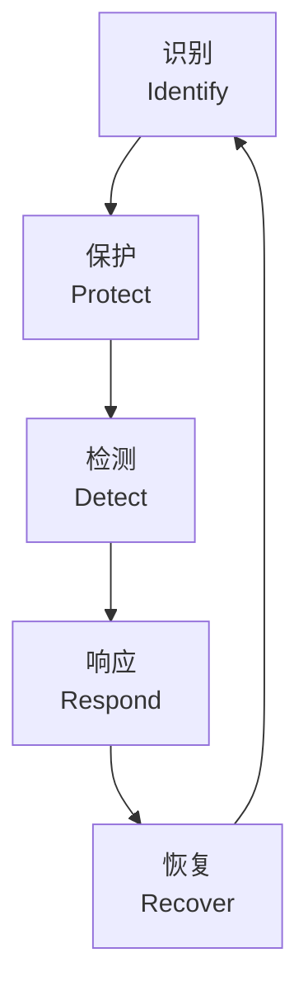
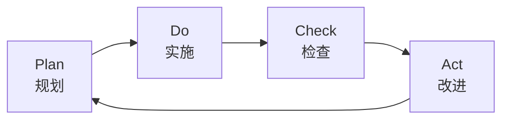

# 安全框架 (Security Frameworks)

## 概述 (Overview)

安全框架（Security Framework）是组织为管理网络安全风险而采用的政策、流程和技术控制的系统化指南。框架提供标准化的方法论来评估、实施和维护安全控制，帮助企业满足合规要求并提升整体安全 posture。

## 核心安全框架对比

| 框架 | 发布机构 | 核心功能 | 适用场景 |
|------|---------|---------|---------|
| NIST CSF | NIST（美国） | 识别、保护、检测、响应、恢复 | 通用企业风险管理 |
| ISO 27001 | ISO | ISMS 建立与认证 | 国际合规认证 |
| CIS Controls | CIS | 18个关键安全控制 | 技术实施优先级 |
| COBIT | ISACA | IT 治理与风险管理 | 企业 IT 治理 |
| PCI DSS | PCI SSC | 支付数据安全标准 | 金融支付行业 |

## NIST 网络安全框架 (NIST CSF)

NIST CSF 定义了五大核心功能（Core Functions）：



- **识别 (Identify)**：资产管理、风险评估、治理策略
- **保护 (Protect)**：访问控制、数据安全、维护培训
- **检测 (Detect)**：异常检测、持续监控、告警流程
- **响应 (Respond)**：事件响应计划、通信、分析
- **恢复 (Recover)**：恢复计划、改进、通信

## ISO 27001 信息安全管理体系

ISO 27001 是基于 PDCA（Plan-Do-Check-Act）循环的 ISMS 标准：



### Annex A 控制域（部分）

| 控制域 | 控制目标 | 控制措施数量 |
|-------|---------|------------|
| 信息安全策略 | 提供管理方向 | 2 |
| 组织信息安全 | 治理内部/外部方 | 11 |
| 人力资源安全 | 雇佣前/中/后 | 6 |
| 资产管理 | 资产责任与分类 | 10 |
| 访问控制 | 业务与用户访问 | 14 |
| 密码学 | 加密与密钥管理 | 2 |
| 物理安全 | 安全区域与设备 | 15 |
| 运营安全 | 流程与第三方交付 | 14 |

## 零信任架构 (Zero Trust Architecture)

零信任基于"永不信任，始终验证"（Never Trust, Always Verify）原则：

```
核心原则：
1. 明确验证 —— 始终基于所有可用数据点进行身份验证和授权
2. 最小权限 —— 使用 JIT（Just-In-Time）和 JEA（Just-Enough-Access）
3. 假设入侵 —— 分段网络、端到端加密、持续监控
```

### 零信任支柱 (NIST SP 800-207)

| 支柱 | 描述 | 关键技术 |
|------|------|---------|
| 身份 (Identity) | 用户与实体验证 | MFA、IAM、SSO |
| 设备 (Device) | 端点健康与合规 | MDM、端点检测 |
| 网络 (Network) | 微隔离与分段 | SDN、微分段 |
| 应用 (Application) | 应用层保护 | WAF、API 安全 |
| 数据 (Data) | 数据分类与保护 | DL P、加密、标记化 |

## 风险管理框架 (Risk Management Framework)

风险管理是安全框架的核心组成部分：

$$
\text{Risk} = f(\text{Threat}, \text{Vulnerability}, \text{Impact})
$$

| 阶段 | 活动 | 输出 |
|------|------|------|
| 风险评估 | 识别资产、威胁、漏洞 | 风险登记册 |
| 风险分析 | 定性/定量分析 | 风险等级 |
| 风险评价 | 与风险准则比较 | 优先级列表 |
| 风险处置 | 缓解、转移、接受、规避 | 处置计划 |
| 风险监控 | 持续跟踪与审查 | 风险报告 |

## 框架选择指南

- **企业全面风险管理**：ISO 27001 + NIST CSF 结合
- **云安全**：CIS Benchmarks + CSA CCM
- **合规驱动**：根据行业监管要求（如 GDPR、HIPAA、PCI DSS）
- **技术优先**：CIS Controls 提供明确实施步骤

## 合规与审计 (Compliance & Audit)

合规要求通常驱动框架选择：

| 行业 | 典型合规标准 | 推荐框架 |
|------|-------------|---------|
| 金融 | PCI DSS, SOX | COBIT, NIST CSF |
| 医疗 | HIPAA, HITRUST | NIST CSF, ISO 27001 |
| 政务 | FedRAMP, 等保 | NIST SP 800-53 |
| 云服务 | SOC 2, ISO 27017 | CSA CCM, NIST CSF |

## 关键公式与指标

安全态势评分：

$$
S = \frac{\sum_{i=1}^{n} w_i \cdot c_i}{\sum_{i=1}^{n} w_i} \times 100
$$

其中 $w_i$ 为控制权重，$c_i$ 为控制实施评分（0-1）。

## 相关条目

- [[CybersecurityOverview]]
- [[NetworkSecurity]]
- [[Cryptography]]
- [[PenetrationTesting]]
- [[MalwareAnalysis]]
