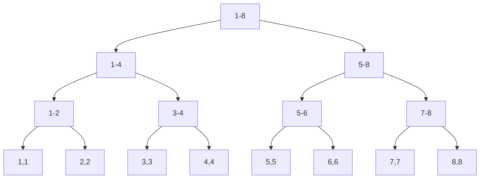
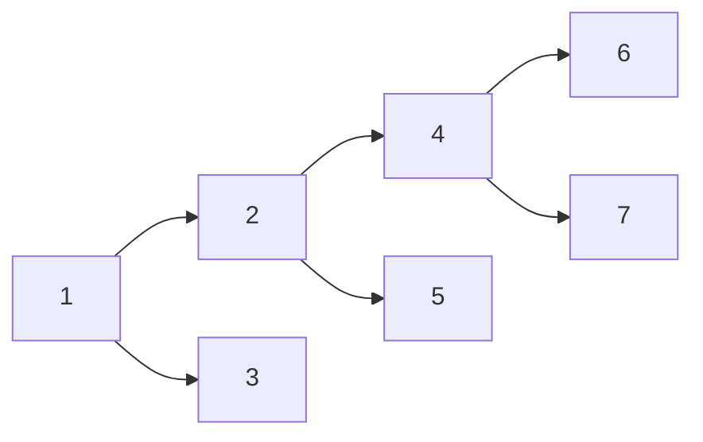
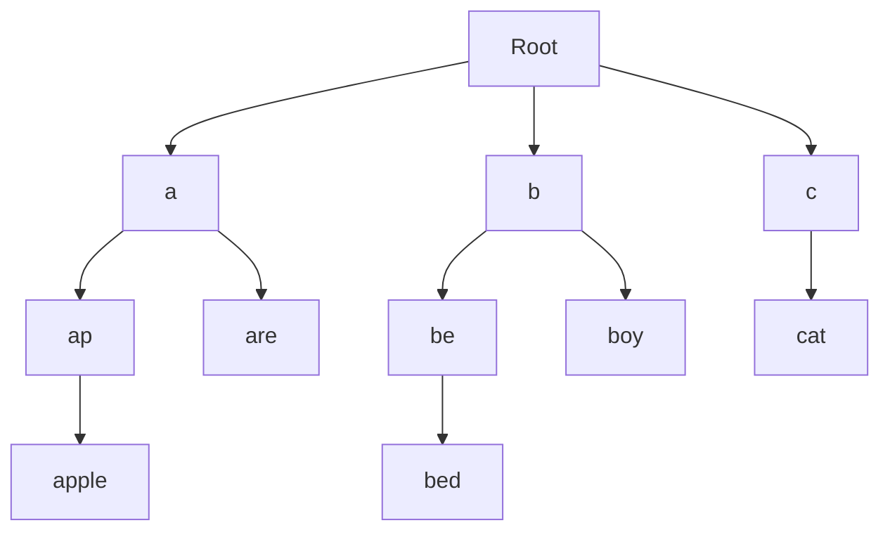
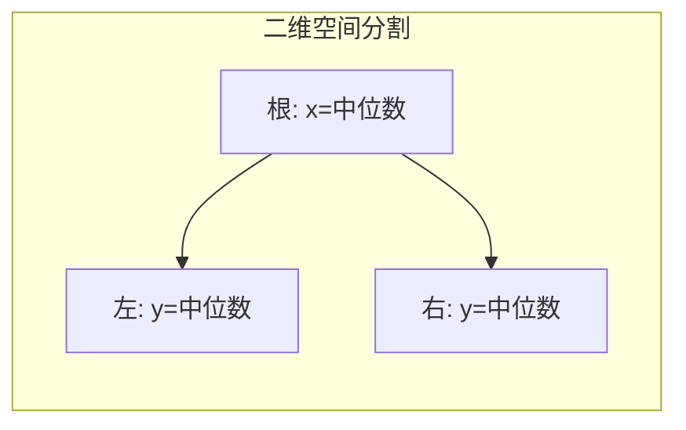
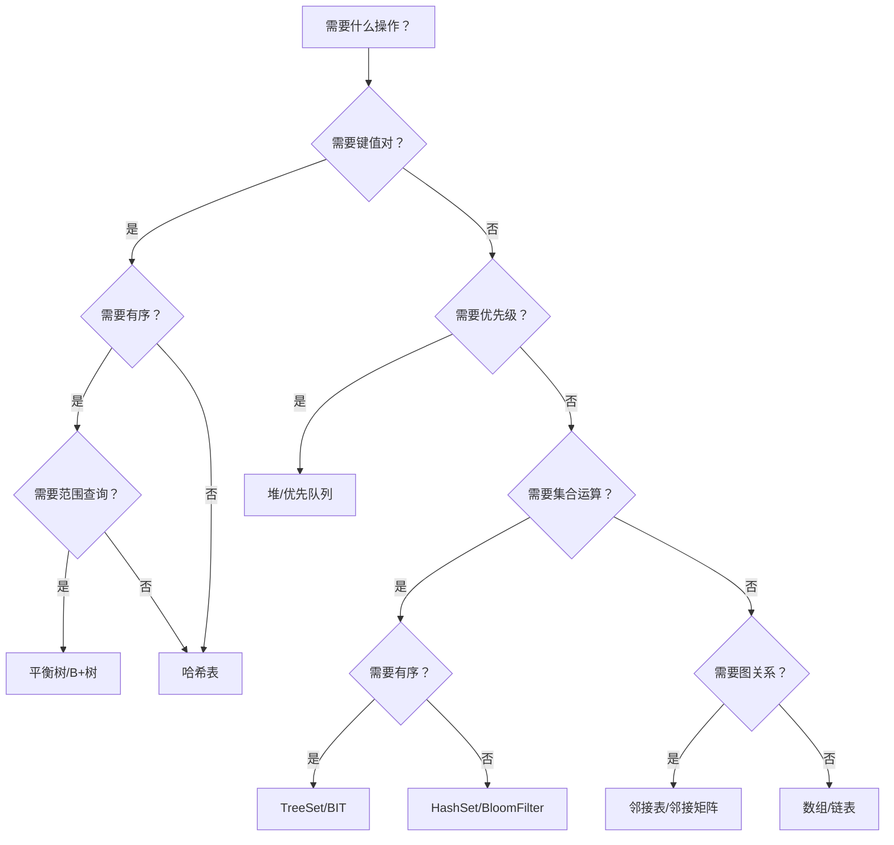

# 高级数据结构 (Advanced Data Structures)

## 一、概述 (Overview)

高级数据结构是在基础数据结构之上设计的专用结构，用于解决特定场景下的高效操作问题。本文涵盖线段树、树状数组、Trie、并查集、后缀数组、Treap、K-D Tree、Link-Cut Tree 等。

## 二、线段树 (Segment Tree)

### 2.1 基本原理

线段树是一种二叉树，每个节点代表一个区间 $[l, r]$，叶节点为单点。用于区间查询和区间修改。



### 2.2 操作复杂度

| 操作 | 时间复杂度 | 说明 |
|------|-----------|------|
| 建树 | $O(n)$ | 递归构建 |
| 区间查询 | $O(\log n)$ | 合并子区间结果 |
| 单点修改 | $O(\log n)$ | 更新叶节点后回溯 |
| 区间修改 | $O(\log n)$ | 使用懒标记 (Lazy Tag) |

### 2.3 懒标记 (Lazy Propagation)

区间修改时，若当前节点区间完全被覆盖，不递归到叶节点，而是标记延迟更新：

$$update(node) =
\begin{cases}
mark\ lazy & [l, r] \subseteq [L, R] \\
push\_down + recurse & 部分覆盖
\end{cases}$$

```cpp
void updateRange(int node, int l, int r, int ql, int qr, int val) {
    if (ql <= l && r <= qr) {
        tree[node] += (r - l + 1) * val;
        lazy[node] += val;
        return;
    }
    pushDown(node, l, r);
    int mid = (l + r) / 2;
    if (ql <= mid) updateRange(node*2, l, mid, ql, qr, val);
    if (qr > mid) updateRange(node*2+1, mid+1, r, ql, qr, val);
    tree[node] = tree[node*2] + tree[node*2+1];
}
```

### 2.4 线段树变体

| 变体 | 用途 | 空间 |
|------|------|------|
| 权值线段树 | 维护值域而非位置 | $O(n\log V)$ |
| 可持久化线段树 | 历史版本回退 | $O(n\log n)$ |
| 线段树合并 | 合并多棵树 | $O(n\log n)$ 均摊 |
| 动态开点线段树 | 值域极大时节省空间 | $O(q\log V)$ |
| ZKW 线段树 | 非递归实现 | $O(n)$ 空间 |

可持久化线段树（主席树）支持查询区间 $[l, r]$ 内第 $k$ 小值，时间复杂度 $O(\log n)$。

## 三、树状数组 (Fenwick Tree / BIT)

### 3.1 原理

利用 $lowbit$ 实现前缀和维护：

$$lowbit(x) = x \ \&\ (-x)$$

$$C[i] = \sum_{k=i-lowbit(i)+1}^{i} A[k]$$



### 3.2 操作

| 操作 | 代码 | 复杂度 |
|------|------|--------|
| 单点加 | `i += lowbit(i)` 更新 | $O(\log n)$ |
| 前缀和 | `i -= lowbit(i)` 累加 | $O(\log n)$ |
| 区间和 | `sum(r) - sum(l-1)` | $O(\log n)$ |
| 建树 | 逐个 add 或前缀和推导 | $O(n\log n)$ / $O(n)$ |

```python
def add(i, delta):
    while i <= n:
        bit[i] += delta
        i += i & -i
```

树状数组相比线段树：常数更小、实现更简单，但不支持区间修改（可通过差分数组间接支持）。

### 3.3 扩展应用

- 逆序对计数：`BIT` + 离散化，$O(n\log n)$
- 二维 BIT：$O(\log^2 n)$
- 区间加+区间和：维护两个 BIT

## 四、Trie（前缀树/字典树）

### 4.1 结构

Trie 是 $k$ 叉树，每个节点代表一个字符，路径代表字符串前缀。



### 4.2 操作复杂度

| 操作 | 时间复杂度 | 说明 |
|------|-----------|------|
| 插入 | $O(L)$ | $L$ 为字符串长度 |
| 查找 | $O(L)$ | 逐字符遍历 |
| 前缀查询 | $O(L)$ | 返回以该前缀开头的字符串数 |
| 删除 | $O(L)$ | 通常标记删除而非物理删除 |

### 4.3 变体

| 变体 | 说明 |
|------|------|
| 压缩 Trie (Radix Tree) | 合并路径中的单链节点 |
| 后缀 Trie / 后缀树 | 所有后缀的 Trie，构建后缀数组的预处理 |
| 双数组 Trie | 使用两个数组压缩存储，用于 AC 自动机 |
| 持久化 Trie | 支持历史版本查询，如可持久化异或最大匹配 |

## 五、并查集 (Union-Find / Disjoint Set)

### 5.1 基本操作

```cpp
int find(int x) {
    return parent[x] == x ? x : (parent[x] = find(parent[x]));
}
void union_(int x, int y) {
    int rx = find(x), ry = find(y);
    if (rx == ry) return;
    if (rank[rx] < rank[ry]) parent[rx] = ry;
    else if (rank[rx] > rank[ry]) parent[ry] = rx;
    else { parent[ry] = rx; rank[rx]++; }
}
```

### 5.2 复杂度

路径压缩 + 按秩合并：$O(\alpha(n))$ 均摊，其中 $\alpha$ 为反阿克曼函数。

$$\alpha(n) \leq 4\ \text{for}\ n \leq 2^{2^{2^{2^{16}}}}$$

### 5.3 扩展

| 扩展 | 功能 |
|------|------|
| 带权并查集 | 维护节点到根的权值（用于区间关系） |
| 种类并查集 | 维护对立/相等关系，开 $k$ 倍空间 |
| 可撤销并查集 | 支持回退操作（按栈记录） |

## 六、Treap（树堆）

组合了 BST 和 Heap 的性质，每个节点带随机优先级，通过旋转维护堆性质。

$$BST: key_{left} < key_{root} < key_{right}$$
$$Heap: priority_{root} > priority_{children}$$

操作 $O(\log n)$ 期望。

| 操作 | 实现 |
|------|------|
| 插入 | 按 BST 规则插入，不满足堆性质时旋转 |
| 删除 | 旋转至叶节点后删除 |
| 前驱后继 | BST 查找 |
| 第 k 大 | 维护子树大小 |

## 七、K-D Tree

用于 $k$ 维空间中的点数据管理和范围查询。
建树：按各维交替分割，取中位数作节点。



| 操作 | 复杂度 |
|------|--------|
| 建树 | $O(n\log n)$ |
| 最近邻搜索 | $O(\log n)$ 平均，$O(n)$ 最差 |
| 范围查询 | $O(n^{1-1/k} + m)$ |

用于图像检索、粒子模拟、KNN 算法。

## 八、Link-Cut Tree (LCT)

动态树结构，支持树的连接、断开和路径查询。

$$T(n) = O(\log n) \text{ 均摊}$$

核心操作：`access(x)` 将 $x$ 到根的路径设为实边，`makeroot(x)` 切换根。

```python
def access(x):
    last = None
    while x:
        splay(x)
        x.right = last
        update(x)
        last = x
        x = x.parent
```

## 九、其他高级结构

| 结构 | 主要操作 | 复杂度 |
|------|----------|--------|
| 跳表 (Skip List) | 查找/插入/删除 | $O(\log n)$ 期望 |
| 笛卡尔树 | 构建 | $O(n)$ |
| 舞蹈链 (DLX) | 精确覆盖问题 | 搜索剪枝 |
| 树套树 | 多维区间查询 | $O(\log^2 n)$ |
| 块状链表 | 插入+随机访问 | $O(\sqrt{n})$ |
| 分块 (Sqrt Decomposition) | 区间加/区间和 | $O(\sqrt{n})$ |

## 十、数据结构选择决策树

选择合适的数据结构是算法设计的核心。以下决策树帮助选择：



## 十一、高级数据的应用领域

| 应用领域 | 常用高级结构 | 解决的问题 |
|----------|-------------|-----------|
| 地理信息系统 | R-Tree, K-D Tree | 空间邻近搜索 |
| 搜索引擎 | 倒排索引、Trie、后缀树 | 全文检索 |
| 编译器 | 符号表 (Hash)、DAG | 名称解析 |
| 操作系统 | 位图、红黑树 | 内存/进程管理 |
| 区块链 | Merkle Tree | 交易验证 |
| 密码学 | 椭圆曲线群 | 公钥加密 |
| 网络路由 | Trie (Patricia Trie) | IP 前缀匹配 |
| 数据库引擎 | B+ 树、LSM-Tree | 存储与索引 |
| 图像处理 | Quadtree, Octree | 空间分割 |
| 推荐系统 | 协同过滤矩阵 | Top-N 推荐 |

## 相关条目
- [[Trees]]
- [[Graphs]]
- [[HashTables]]
- [[HeapsAndPriorityQueues]]
- [[INDEX|当前目录索引]]
