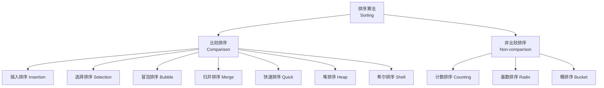
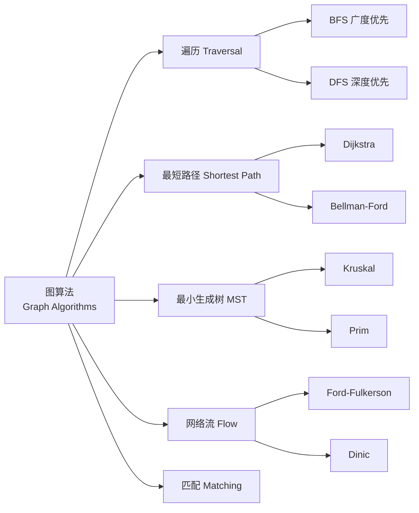
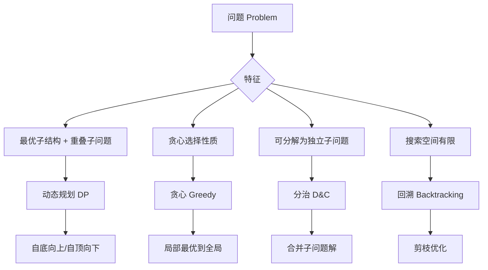

---
aliases: [Algorithms, 算法]
tags: ['05_ComputerScience', 'DataStructuresAndAlgorithms', 'Algorithms', 'ComputationalThinking']
created: 2026-05-17
updated: 2026-05-17
---

# 算法 Algorithms

## 概述 Overview

算法（Algorithm）是求解问题的明确定义的有限步骤序列。算法的五大特性：有穷性（Finiteness）、确定性（Definiteness）、输入（Input）、输出（Output）和可行性（Effectiveness）。

$$ \text{Algorithm} = \{\text{Input}\} \xrightarrow{\text{Steps}} \{\text{Output}\} $$

## 算法分析 Algorithm Analysis

### 时间复杂度 Time Complexity

使用大 O 符号（Big-O Notation）描述算法运行时间随输入规模增长的渐近增长率。

$$ O(g(n)) = \{ f(n) \mid \exists c > 0, n_0 > 0 \text{ s.t. } 0 \leq f(n) \leq cg(n), \forall n \geq n_0 \} $$

| 符号 | 名称 | 示例 | 描述 |
|------|------|------|------|
| $O(1)$ | 常数阶 | 数组随机访问 | 与输入规模无关 |
| $O(\log n)$ | 对数阶 | 二分查找 | 每次减半 |
| $O(n)$ | 线性阶 | 数组遍历 | 与输入成正比 |
| $O(n \log n)$ | 线性对数阶 | 归并排序 | 分治类算法 |
| $O(n^2)$ | 平方阶 | 冒泡排序 | 双层循环 |
| $O(2^n)$ | 指数阶 | 暴力子集搜索 | NP-hard 问题 |

### 空间复杂度 Space Complexity

$$ S(n) = S_{\text{fixed}} + S_{\text{variable}} $$

- **原地算法 (In-place)**：$O(1)$ 额外空间
- **递归空间**：栈深度 $\times$ 每帧空间

## 排序算法 Sorting Algorithms

### 比较排序对比

| 算法 | 最好 | 平均 | 最差 | 空间 | 稳定性 | 原地 |
|------|------|------|------|------|--------|------|
| 冒泡排序 Bubble | $O(n)$ | $O(n^2)$ | $O(n^2)$ | $O(1)$ | 稳定 | ✓ |
| 选择排序 Selection | $O(n^2)$ | $O(n^2)$ | $O(n^2)$ | $O(1)$ | 不稳定 | ✓ |
| 插入排序 Insertion | $O(n)$ | $O(n^2)$ | $O(n^2)$ | $O(1)$ | 稳定 | ✓ |
| 希尔排序 Shell | $O(n)$ | $O(n^{4/3})$ | $O(n^2)$ | $O(1)$ | 不稳定 | ✓ |
| 归并排序 Merge | $O(n\log n)$ | $O(n\log n)$ | $O(n\log n)$ | $O(n)$ | 稳定 | ✗ |
| 快速排序 Quick | $O(n\log n)$ | $O(n\log n)$ | $O(n^2)$ | $O(\log n)$ | 不稳定 | ✓ |
| 堆排序 Heap | $O(n\log n)$ | $O(n\log n)$ | $O(n\log n)$ | $O(1)$ | 不稳定 | ✓ |

### 非比较排序

| 算法 | 时间复杂度 | 空间复杂度 | 条件限制 |
|------|-----------|-----------|---------|
| 计数排序 Counting | $O(n+k)$ | $O(k)$ | 整数、范围小 |
| 基数排序 Radix | $O(d(n+k))$ | $O(n+k)$ | 整数、固定位数 |
| 桶排序 Bucket | $O(n)$ | $O(n)$ | 均匀分布 |

## 搜索算法 Searching Algorithms

### 线性搜索 Linear Search

$$ T(n) = O(n) $$

遍历每个元素，适用于无序数据。

### 二分搜索 Binary Search

$$ T(n) = O(\log n), \quad S(n) = O(1) \text{ (iterative)} / O(\log n) \text{ (recursive)} $$

要求数据已排序，每次将搜索范围减半。

### 搜索对比

| 算法 | 前提 | 时间复杂度 | 空间复杂度 |
|------|------|-----------|-----------|
| 线性搜索 | 无限制 | $O(n)$ | $O(1)$ |
| 二分搜索 | 有序 | $O(\log n)$ | $O(1)$ |
| 跳表搜索 | 有序 + 索引 | $O(\log n)$ | $O(n)$ |
| 哈希搜索 | 哈希函数 | $O(1)$ avg | $O(n)$ |
| 插值搜索 | 均匀分布有序 | $O(\log\log n)$ | $O(1)$ |
| 指数搜索 | 有序 | $O(\log n)$ | $O(1)$ |

## 图算法 Graph Algorithms

### 图的表示 Graph Representation

$$ \text{Adjacency Matrix: } A_{ij} = \begin{cases} w_{ij} & \text{if edge } i \to j \\ 0 & \text{otherwise} \end{cases} $$

### 最短路径 Shortest Path

| 算法 | 时间复杂度 | 限制 |
|------|-----------|------|
| Dijkstra | $O(V^2)$ / $O(E \log V)$ | 无负权边 |
| Bellman-Ford | $O(VE)$ | 允许负权 |
| Floyd-Warshall | $O(V^3)$ | 全源最短 |
| SPFA | $O(VE)$ avg | 稀疏图优化 |
| A* | $O(E)$ | 启发式搜索 |

### 最小生成树 Minimum Spanning Tree

- **Kruskal**：按边权重排序，使用并查集（Union-Find）避免环
- **Prim**：从单点出发，每次扩展最小权重边

$$ T_{\text{Kruskal}} = O(E \log E), \quad T_{\text{Prim}} = O(E \log V) $$

### 网络流 Network Flow

最大流问题（Max Flow）求解从源点到汇点的最大流量，最小割定理指出最大流等于最小割容量：

$$ \text{Max Flow} = \text{Min Cut} $$

## 动态规划 Dynamic Programming

### 核心思想

动态规划通过拆解子问题、记录子问题解来避免重复计算，适用于具有最优子结构（Optimal Substructure）和重叠子问题（Overlapping Subproblems）的问题。

$$ DP[i] = \text{opt}(DP[j] + \text{cost}(j, i)), \quad j < i $$

### 经典 DP 问题

| 问题 | 状态定义 | 递推关系 | 时间复杂度 |
|------|---------|---------|-----------|
| 斐波那契 | $DP[n]$ 第 n 项 | $DP[n] = DP[n-1] + DP[n-2]$ | $O(n)$ |
| 背包问题 | $DP[i][w]$ 前 i 个物品容量 w | $DP[i][w] = \max(DP[i-1][w], DP[i-1][w-w_i] + v_i)$ | $O(nW)$ |
| LCS | $DP[i][j]$ 前缀长度 | $DP[i][j] = DP[i-1][j-1] + 1 \text{ if match}$ | $O(nm)$ |
| LIS | $DP[i]$ 以 i 结尾的 LIS | $DP[i] = \max_{j < i, a_j < a_i} DP[j] + 1$ | $O(n^2)$ |
| 编辑距离 | $DP[i][j]$ 编辑距离 | min(insert, delete, replace) | $O(nm)$ |
| 矩阵链乘 | $DP[i][j]$ 最小乘法 | $DP[i][j] = \min_{k}(DP[i][k] + DP[k+1][j] + p_{i-1}p_kp_j)$ | $O(n^3)$ |

### 状态压缩技巧

$$ DP[S] = \min/\max(DP[S\setminus\{j\}] + \text{cost}(i, j)), \quad S \subseteq \{1, \ldots, n\} $$

## 贪心算法 Greedy Algorithms

### 贪心选择性质

贪心算法每一步做出当前最优选择，期望最终产生全局最优解。

| 问题 | 贪心策略 | 正确性 |
|------|---------|--------|
| 活动选择 | 最早结束优先 | 最优 |
| 哈夫曼编码 | 最低频率合并 | 最优 |
| 找零（某些币制） | 最大面额优先 | 最优 |
| 最小生成树 Kruskal | 最小权重优先 | 最优 |
| Dijkstra | 最短距离优先 | 最优 |
| 分数背包 | 价值密度优先 | 最优 |
| 0-1 背包 | 价值密度优先 | 非最优 |

## 分治算法 Divide and Conquer

### 分治三步法

$$ T(n) = aT(n/b) + f(n) $$

1. **分解 (Divide)**：将问题拆分为子问题
2. **解决 (Conquer)**：递归求解子问题
3. **合并 (Combine)**：将子问题解合并为原问题解

### 主定理 Master Theorem

$$ T(n) = aT(n/b) + O(n^d) \implies
\begin{cases}
O(n^d) & \text{if } a < b^d \\
O(n^d \log n) & \text{if } a = b^d \\
O(n^{\log_b a}) & \text{if } a > b^d
\end{cases} $$

## 回溯与分支限界 Backtracking & Branch & Bound

适用于组合搜索问题，在解空间中通过剪枝减少搜索量。

| 算法 | 问题 |
|------|------|
| N 皇后 | 回溯 |
| 数独求解 | 回溯 |
| 旅行商问题 TSP | 分支限界 |
| 图着色 | 回溯 |
| 子集和 | 剪枝搜索 |

## 字符串算法 String Algorithms

| 算法 | 功能 | 时间复杂度 |
|------|------|-----------|
| KMP | 子串匹配 | $O(n+m)$ |
| Rabin-Karp | 哈希匹配 | $O(n+m)$ avg |
| Boyer-Moore | 跳跃匹配 | $O(n/m)$ best |
| Z 算法 | Z 数组计算 | $O(n)$ |
| Manacher | 回文子串 | $O(n)$ |
| Trie 树 | 前缀匹配 | $O(\|S\|)$ per insert |

## 算法设计技巧总结

## 算法复杂度分类

### P vs NP

$$
\begin{aligned}
P &: \text{多项式时间内可解} \\
NP &: \text{多项式时间内可验证} \\
NP\text{-complete} &: \text{NP 中最难的问题} \\
NP\text{-hard} &: \text{至少与 NP 一样难}
\end{aligned}
$$

### 常见的 NP-Complete 问题

- 旅行商问题 (TSP)
- 布尔可满足性问题 (SAT)
- 顶点覆盖 (Vertex Cover)
- 图着色 (Graph Coloring)
- 背包问题 (0-1 Knapsack)

## 并行算法 Parallel Algorithms

| 问题 | 并行策略 | 加速比 |
|------|---------|--------|
| 数组求和 | 分治规约 | $O(\log n)$ |
| 矩阵乘法 | 分块并行 | $O(\log n)$ |
| 排序 | 双调排序 | $O(\log^2 n)$ |
| 前缀和 | 并行扫描 | $O(\log n)$ |
| 图遍历 | 层次并行 | $O(\text{diam})$ |

## 相关条目

- [[05_ComputerScience/DataStructuresAndAlgorithms/DataStructures/DataStructures|DataStructures]]
- [[05_ComputerScience/DataStructuresAndAlgorithms/SortingAlgorithms|SortingAlgorithms]]
- [[GraphTheory]]
- [[05_ComputerScience/DataStructuresAndAlgorithms/Algorithms/DynamicProgramming/DynamicProgramming|DynamicProgramming]]
- [[05_ComputerScience/TheoryOfComputation/ComputationalComplexity|ComputationalComplexity]]

