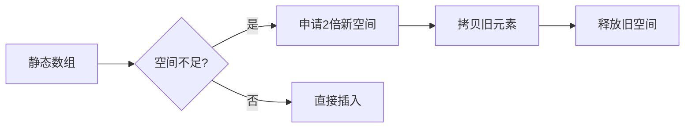

# 数组与字符串 (Arrays and Strings)

## 一、数组 (Array)

数组是最基础的数据结构，将相同类型的元素存储在连续内存空间中。可通过下标 $O(1)$ 随机访问。

### 1.1 基本特性

| 特性 | 说明 |
|------|------|
| 内存 | 连续分配 |
| 访问 | $O(1)$ 随机访问 |
| 插入/删除 | $O(n)$（需移动元素）|
| 缓存友好 | 空间局部性好 |
| 维度 | 一维/二维/多维 |

一维数组 $A[i]$ 的地址计算：
$$addr(A[i]) = base + i \times size$$

二维数组 $A[i][j]$（行优先）：
$$addr(A[i][j]) = base + (i \times n + j) \times size$$

### 1.2 动态数组 (Dynamic Array)



均摊分析 (Amortized Analysis)：动态数组插入的均摊时间复杂度为 $O(1)$。

| 操作 | 静态数组 | 动态数组 (ArrayList) |
|------|----------|---------------------|
| 访问 | $O(1)$ | $O(1)$ |
| 末尾插入 | $O(1)$ | $O(1)$ 均摊 |
| 中间插入 | $O(n)$ | $O(n)$ |
| 删除 | $O(n)$ | $O(n)$ |

### 1.3 常用算法与技巧

#### 双指针 (Two Pointers)

双指针常用于有序数组的查找与合并。典型场景：两数之和、三数之和、合并有序数组。

```python
def two_sum_sorted(nums, target):
    left, right = 0, len(nums) - 1
    while left < right:
        s = nums[left] + nums[right]
        if s == target:
            return [left, right]
        elif s < target:
            left += 1
        else:
            right -= 1
    return []
```

#### 滑动窗口 (Sliding Window)

滑动窗口用于处理子数组/子串问题，维护窗口的左右边界。

| 问题 | 窗口特征 | 时间复杂度 |
|------|----------|-----------|
| 无重复字符最长子串 | 动态大小 | $O(n)$ |
| 最小覆盖子串 | 动态大小 | $O(n)$ |
| 长度为 k 的最大平均值 | 固定大小 | $O(n)$ |

滑动窗口通用模板：
$$窗口右移 \to 更新状态 \to 收缩左边界 \to 更新答案$$

## 二、字符串 (String)

### 2.1 字符串存储与编码

字符串在内存中以字符数组形式存储。常见编码：

| 编码 | 字节数 | 特点 |
|------|--------|------|
| ASCII | 1字节 | 128个字符 |
| UTF-8 | 1-4字节 | 变长，向后兼容 ASCII |
| UTF-16 | 2或4字节 | Java/C#内部使用 |
| UTF-32 | 4字节 | 定长，空间占用大 |

### 2.2 字符串匹配算法 (String Matching)

#### KMP 算法 (Knuth-Morris-Pratt)

KMP 算法通过前缀函数 $\pi$ 避免重复比较：
$$\pi[i] = \max\{k < i \mid pattern[0..k-1] = pattern[i-k+1..i]\}$$

```mermaid
flowchart LR
    subgraph 主串遍历
        A[主串指针 i] --> B{匹配 pattern[j]?}
    end
    B -->|是| C[i++, j++]
    B -->|否| D[j = pi[j-1]]
    D --> B
    C --> E{j == m?}
    E -->|是| F[找到匹配]
    E -->|否| A
```

#### Boyer-Moore 算法

利用坏字符规则和好后缀规则，从右向左匹配，平均时间复杂度 $O(n/m)$。

### 2.3 字符串哈希 (String Hashing/Rolling Hash)

Rabin-Karp 算法使用滚动哈希：
$$hash(s) = \sum_{i=0}^{n-1} s[i] \times base^{n-1-i} \mod mod$$

滚动更新：
$$hash(s_{i+1}) = (hash(s_i) - s[i] \times base^{n-1}) \times base + s[i+n]$$

### 2.4 回文子串 (Palindromic Substrings)

#### Manacher 算法

Manacher 算法在 $O(n)$ 时间内找到所有回文子串，核心是维护最右回文边界。

```
预处理：在字符间插入 # 统一奇偶回文
中心扩展：利用对称性加速
回文半径数组：d[i] 记录以 i 为中心的回文半径
```

## 三、LeetCode 经典题型

### 3.1 数组类

| 题号 | 题目 | 技巧 |
|------|------|------|
| 1 | 两数之和 (Two Sum) | 哈希表 |
| 15 | 三数之和 (3Sum) | 排序+双指针 |
| 53 | 最大子序和 (Maximum Subarray) | Kadane 算法 |
| 56 | 合并区间 (Merge Intervals) | 排序+贪心 |
| 88 | 合并有序数组 (Merge Sorted Array) | 双指针从后 |

### 3.2 字符串类

| 题号 | 题目 | 技巧 |
|------|------|------|
| 3 | 无重复字符最长子串 | 滑动窗口 |
| 5 | 最长回文子串 | 中心扩展/DP |
| 14 | 最长公共前缀 | 纵向扫描 |
| 28 | 实现 strStr() | KMP |
| 76 | 最小覆盖子串 | 滑动窗口+哈希表 |

## 四、时间复杂度总结

| 数据结构 | 访问 | 搜索 | 插入 | 删除 |
|----------|------|------|------|------|
| 静态数组 | $O(1)$ | $O(n)$ | $O(n)$ | $O(n)$ |
| 动态数组 | $O(1)$ | $O(n)$ | $O(n)$ 均摊 | $O(n)$ |
| 有序数组 | $O(1)$ | $O(\log n)$ 二分 | $O(n)$ | $O(n)$ |

## 五、竞赛与面试技巧

1. **数组**：注意边界条件、空数组、单个元素
2. **字符串**：注意编码、大小写、空串、空格
3. **双指针**：常用于有序数组，相向或同向移动
4. **滑动窗口**：窗口内元素满足某种性质，维护左右指针
5. **原地操作**：利用数组本身存储额外信息，如原地哈希

### 5.1 前缀和技巧 (Prefix Sum)

一维前缀和：
$$prefix[i] = prefix[i-1] + nums[i-1]$$
$$sum[l..r] = prefix[r+1] - prefix[l]$$

二维前缀和：
$$prefix[i][j] = prefix[i-1][j] + prefix[i][j-1] - prefix[i-1][j-1] + matrix[i-1][j-1]$$

### 5.2 差分数组 (Difference Array)

差分数组 $diff[i] = nums[i] - nums[i-1]$，用于区间增减操作：
$$nums[l..r] + val \implies diff[l] += val,\; diff[r+1] -= val$$

## 六、扩展话题

### 6.1 数组与缓存的局部性

- **时间局部性** (Temporal Locality)：最近访问的数据可能被再次访问
- **空间局部性** (Spatial Locality)：相邻内存地址可能被访问
- 数组遍历行优先比列优先更高效（C/C++）

### 6.2 字符串的不可变性 (Immutability)

| 语言 | 字符串类型 | 可变性 | 性能影响 |
|------|-----------|--------|---------|
| Python | str | 不可变 | 拼接需新建 |
| Java | String | 不可变 | 使用 StringBuilder |
| C++ | string | 可变 | $O(1)$ 修改 |
| JavaScript | string | 不可变 | 使用数组或 += |

### 6.3 字符串编码处理

在 UTF-8 编码下，字符串的长度不等于字节数：
$$实际字符数 \neq byte\; count$$

处理多字节字符时需注意：
- Python 的 `len()` 返回 Unicode 字符数
- 按字节切割可能破坏字符完整性
- 正则表达式默认以 Unicode 字符为单位
