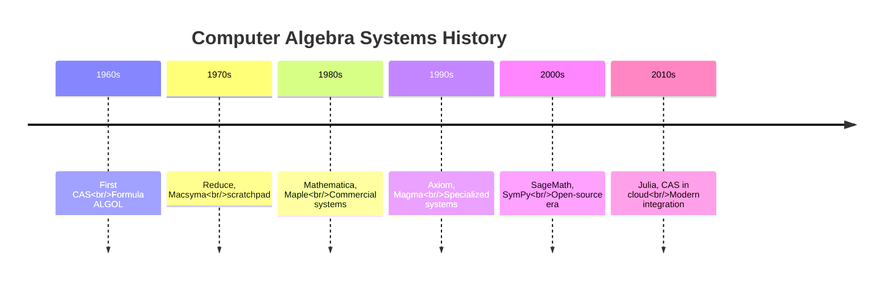
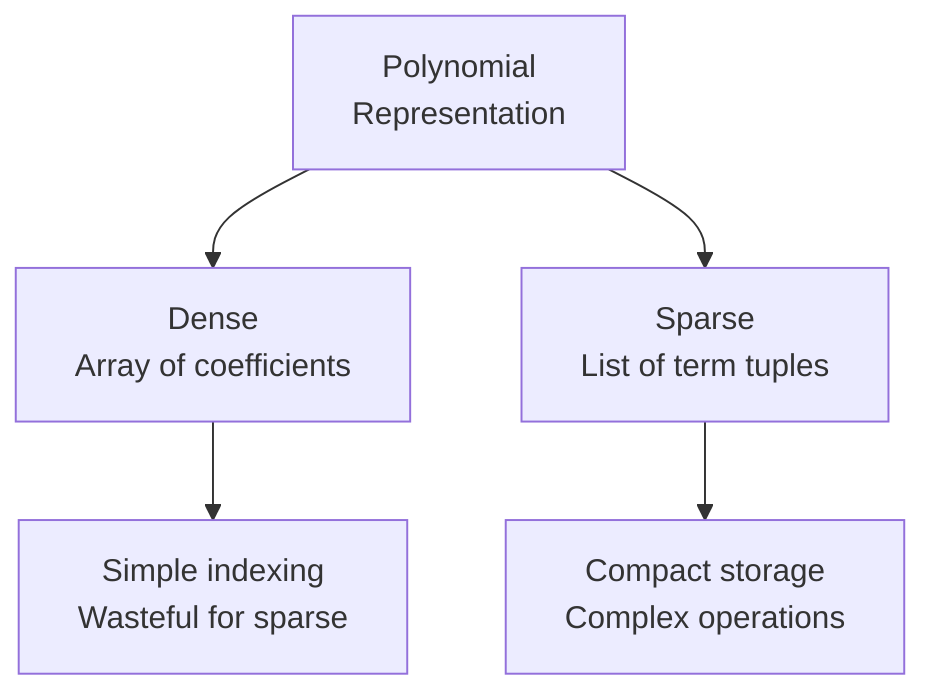
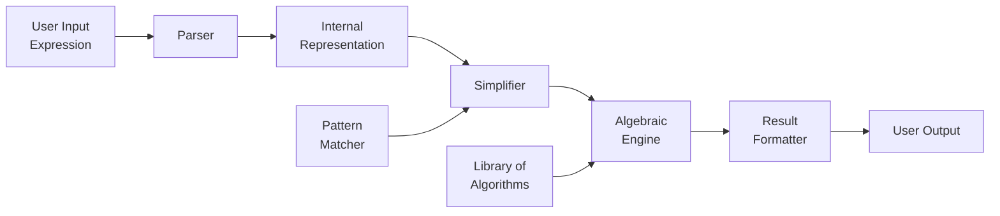
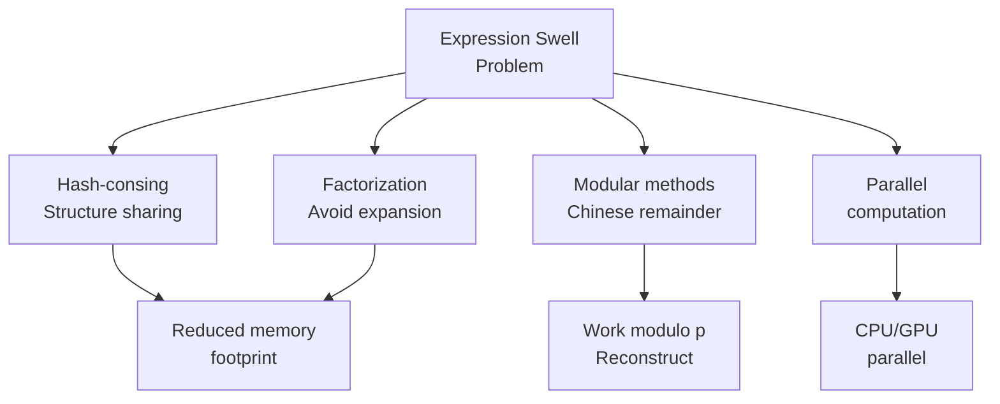

# Computer Algebra（计算机代数）

## 一、概述

**Computer Algebra（计算机代数）** 是计算机科学的一个分支，研究**符号计算（Symbolic Computation）** 的算法与实现。与数值计算（Numerical Computation）不同，计算机代数处理的是精确的数学表达式而非近似值。

### 1.1 核心能力

| 功能 | 说明 | 典型系统 |
|------|------|---------|
| 多项式运算 | 展开、因式分解、GCD | Mathematica, SymPy |
| 符号积分 | Risch 算法 | Maple, Maxima |
| 方程求解 | 符号/解析解 | Reduce, Axiom |
| Gröbner 基 | 理想论、多项式系统 | Singular, CoCoA |
| 矩阵代数 | 符号矩阵运算 | SageMath |

### 1.2 与数值计算的对比

| 特性 | 符号计算 | 数值计算 |
|------|---------|---------|
| 精度 | 精确（任意精度） | 浮点近似 |
| 表达式 | $\frac{1}{3}$ 保留为分数 | 0.333333 |
| 积分 | $\int x^2 dx = \frac{x^3}{3}+C$ | 数值近似 |
| 复杂度 | 高（中间表达式膨胀） | 低 |
| 适用场景 | 理论推导 | 工程仿真 |

## 二、历史发展

### 2.1 关键里程碑



### 2.2 重大突破

1. **Buchberger 算法（1965）**：Gröbner 基的诞生，将多项式理想论转化为可计算的算法
2. **Risch 算法（1969）**：初等函数符号积分的决定性算法
3. **Gosper 算法（1978）**：超几何项求和
4. **Wilf-Zeilberger 方法（1990）**：组合恒等式的机械化证明

## 三、多项式操作

### 3.1 基本运算

多项式（Polynomial）的表示是 CAS 的基础：

$$ P(x) = a_n x^n + a_{n-1} x^{n-1} + \cdots + a_1 x + a_0 $$

**表示方式**：
- **稠密表示（Dense Representation）**：所有系数（包括零系数）按指数降序排列
- **稀疏表示（Sparse Representation）**：仅存储非零系数及其对应指数



### 3.2 多项式 GCD

最大公因式（Greatest Common Divisor）的计算是 CAS 的核心操作之一。

**Euclidean 算法**的扩展：

$$ \gcd(f, g) = \gcd(g, f \bmod g) $$

**子结式算法（Subresultant PRS）**：避免分数系数，保持整数运算。

### 3.3 因式分解

多项式因式分解（Polynomial Factorization）是 CAS 的重要功能：

$$ x^4 - 1 = (x-1)(x+1)(x^2+1) $$

**主要算法**：
- Kronecker 方法（经典但效率低）
- Berlekamp 算法（有限域上的因式分解）
- Zassenhaus 算法（Hensel 提升 + 组合搜索）
- LLL 算法（Lenstra-Lenstra-Lovász，整系数多项式的多项式时间分解）

## 四、符号积分与微分

### 4.1 自动微分 vs 符号微分

| 方法 | 原理 | 优点 | 缺点 |
|------|------|------|------|
| 数值微分 | $\frac{f(x+h)-f(x)}{h}$ | 简单 | 截断误差 |
| 符号微分 | 链式法则符号展开 | 精确 | 表达式膨胀 |
| 自动微分 | 计算图分解 | 高效精确 | 需要代码变换 |

### 4.2 Risch 算法

Risch 算法是符号积分（Symbolic Integration）的里程碑，它能够判定一个初等函数是否存在初等原函数。

对于 $f(x)e^{g(x)}$ 形式的积分：

$$ \int f(x) e^{g(x)} dx = h(x) e^{g(x)} $$

其中 $h(x)$ 是待定有理函数，可以通过求解线性方程组确定。

### 4.3 特殊函数积分

许多积分结果涉及特殊函数（Special Functions）：

$$ \int e^{-x^2} dx = \frac{\sqrt{\pi}}{2} \operatorname{erf}(x) $$

$$ \int \frac{\sin x}{x} dx = \operatorname{Si}(x) $$

## 五、Gröbner 基

### 5.1 基本概念

Gröbner 基（Gröbner Basis）是计算机代数中最深刻的概念之一，由 Bruno Buchberger 在其博士论文中提出，以导师 W. Gröbner 命名。

给定多元多项式环 $k[x_1, \ldots, x_n]$ 中的理想 $I$，其 Gröbner 基 $G$ 满足：

$$ \langle G \rangle = I, \quad \text{且} \quad \operatorname{LT}(G) \text{ 生成 } \operatorname{LT}(I) $$

其中 $\operatorname{LT}$ 表示首项（Leading Term）。

```mermaid
flowchart TD
    A[Polynomial System<br/>F = {f1, f2, ...}] --> B[Buchberger<br/>Algorithm]
    B --> C[Gröbner Basis<br/>G = {g1, g2, ...}]
    C --> D{Elimination?}
    D -->|Yes| E[Elimination Ideal<br/>G ∩ k[x₃, ..., xₙ]]
    D -->|No| F[Intersection<br/>with other ideals]
```

### 5.2 单序（Monomial Ordering）

Gröbner 基的计算依赖于单项式的序：

- **Lexicographic Order（字典序）**：$x^a > x^b$ 如果 $a$ 的第一个非零分量大于 $b$
- **Graded Lex Order（全次数字典序）**：先比较总次数，再按字典序
- **Graded Reverse Lex Order**（Grevlex）：一般效率最高的序

### 5.3 Buchberger 算法

**核心思想**：计算所有 S-多项式（S-polynomial）对 $S(f_i, f_j)$ 的余式，若全为零则得到 Gröbner 基。

$$ S(f, g) = \frac{\operatorname{lcm}(\operatorname{LT}(f), \operatorname{LT}(g))}{\operatorname{LT}(f)} \cdot f - \frac{\operatorname{lcm}(\operatorname{LT}(f), \operatorname{LT}(g))}{\operatorname{LT}(g)} \cdot g $$

### 5.4 应用场景

1. **多项式方程组求解**：消元后得到三角化形式
2. **隐式化（Implicitization）**：参数曲线/曲面的隐式方程
3. **理想成员判定**：$f \in I$ 当且仅当 $f$ 对 $G$ 的余式为零
4. **整数规划**：整数格点计数与优化

## 六、CAS 系统架构

### 6.1 典型架构



### 6.2 主流系统对比

| 系统 | 开源 | 语言 | 特点 |
|------|------|------|------|
| Mathematica | 否 | Wolfram | 功能最全面 |
| Maple | 否 | Maple | 符号积分最强 |
| SageMath | 是 | Python | 统一前端 |
| SymPy | 是 | Python | 轻量级嵌入 |
| Singular | 是 | C++ | 多项式专用 |
| Macaulay2 | 是 | C++ | 代数几何专用 |

## 七、算法复杂度

### 7.1 中间表达式膨胀

符号计算的核心挑战是 **Expression Swell（表达式膨胀）**——中间结果可能 exponentially 增长。

$$ \det \begin{pmatrix} a & b \\ c & d \end{pmatrix} = ad - bc $$

对于 $n \times n$ 符号矩阵，$\det$ 展开有 $n!$ 项。

### 7.2 常用优化策略



## 八、现代发展趋势

1. **Cloud CAS**：Mathematica Online, SymPy Live
2. **机器学习 + CAS**：Pattern matching with neural networks
3. **形式化验证**：CAS 与定理证明器（Coq, Isabelle）的结合
4. **量子计算**：量子电路中的符号张量收缩

## 九、学习资源

- **Buchberger, B.** — Gröbner Bases: An Algorithmic Method in Polynomial Ideal Theory
- **von zur Gathen, J. & Gerhard, J.** — Modern Computer Algebra
- **Davenport, J. et al.** — Computer Algebra: Systems and Algorithms for Algebraic Computation
- **Cohen, H.** — A Course in Computational Algebraic Number Theory

---

[[05_ComputerScience/DataStructuresAndAlgorithms/INDEX|当前目录索引]]
