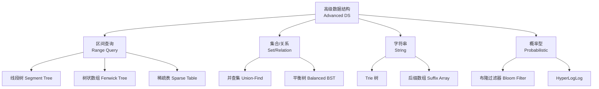

---
aliases: [AdvancedDataStructures, 高级数据结构]
tags: ['05_ComputerScience', 'DataStructuresAndAlgorithms', 'DataStructures']
created: 2026-05-17
updated: 2026-05-17
---

# 高级数据结构 (Advanced Data Structures)

## 概述 (Overview)

高级数据结构建立在基础数据结构之上，解决复杂问题，广泛应用于竞赛编程、数据库系统和系统设计中。

## 分类概览



## 线段树 (Segment Tree)

用于区间查询（和、最大值、最小值等）和区间更新。

```
性质：
- 完全二叉树结构
- 每个节点代表一个区间 [l, r]
- 叶子节点代表单个元素
- 非叶子节点合并子节点信息
```

**时间复杂度**：建树 $O(n)$，查询 $O(\log n)$，更新 $O(\log n)$

**区间和公式**：

$$
\text{Query}(l, r) = \text{Query}(l, mid) + \text{Query}(mid+1, r)
$$

## 树状数组 / 二叉索引树 (Fenwick Tree / BIT)

用于维护前缀和与单点更新，比线段树更省空间。

| 操作 | 代码 | 复杂度 |
|:----|:-----|:------|
| 单点加 | `add(i, delta)` | $O(\log n)$ |
| 前缀和 | `sum(i)` | $O(\log n)$ |
| 区间和 | `sum(r) - sum(l-1)` | $O(\log n)$ |

核心思想：$i$ 的二进制最低位 `lowbit(i) = i & (-i)`

## 并查集 (Union-Find / Disjoint Set Union, DSU)

维护不相交集合的合并与查询。

**操作**：
- `find(x)` — 查找 x 所在集合的根（路径压缩 Path Compression）
- `union(x, y)` — 合并 x 和 y 所在的集合（按秩合并 Union by Rank）

**时间复杂度**：$O(\alpha(n))$，其中 $\alpha$ 为阿克曼反函数，近似常数。

```mermaid
graph TD
  A[起始状态<br/>每个元素独立] --> B[union(1,2)]
  B --> C[union(2,3)]
  C --> D[find(3)=1<br/>路径压缩后]
```

## Trie 树 / 前缀树 (Prefix Tree)

用于高效存储和检索字符串集合中的键。

- 插入：$O(k)$，$k$ 为键长度
- 查找：$O(k)$
- 应用：自动补全、拼写检查、IP 路由、词频统计

## 布隆过滤器 (Bloom Filter)

概率型数据结构，用于判断元素是否在集合中。

**特性**：
- 不会漏报 (No False Negatives)：如果不存在，一定正确
- 可能误报 (May False Positives)：判断存在时可能不准确
- 不可删除 (No Deletion)：标准版本不支持删除元素

**误报率公式**：

$$
P \approx \left(1 - e^{-kn/m}\right)^k
$$

其中 $m$ 为位数组大小，$k$ 为哈希函数个数，$n$ 为插入元素数量。最优哈希数量：

$$
k_{\text{opt}} = \frac{m}{n} \ln 2
$$

## 高级数据结构对比

| 结构 | 空间 | 查询 | 更新 | 典型应用 |
|:----|:----|:----|:----|:--------|
| 线段树 | $O(4n)$ | $O(\log n)$ | $O(\log n)$ | 区间最值、区间和 |
| 树状数组 | $O(n)$ | $O(\log n)$ | $O(\log n)$ | 前缀和、逆序对 |
| 并查集 | $O(n)$ | $O(\alpha(n))$ | $O(\alpha(n))$ | 连通分量、Kruskal |
| Trie | $O(nk)$ | $O(k)$ | $O(k)$ | 字符串检索 |
| 稀疏表 | $O(n\log n)$ | $O(1)$ | $O(n\log n)$ | RMQ 静态查询 |
| 布隆过滤器 | $O(m)$ | $O(k)$ | $O(k)$ | 缓存穿透防护 |
| 后缀数组 | $O(n)$ | $O(m\log n)$ | $O(n\log n)$ | 模式匹配 |

## 持久化数据结构 (Persistent Data Structures)

持久化数据结构在更新时保留其历史版本，支持回溯。常见实现：

- 持久化线段树（主席树 / Chairman Tree）
- 持久化 Trie
- 持久化并查集

## 相关条目

- [[SegmentTree]]
- [[Trie]]
- [[UnionFind]]
- [[BinarySearchTree]]
- [[AVL]]
- [[HashTable]]
- [[Array]]
- [[INDEX]]

