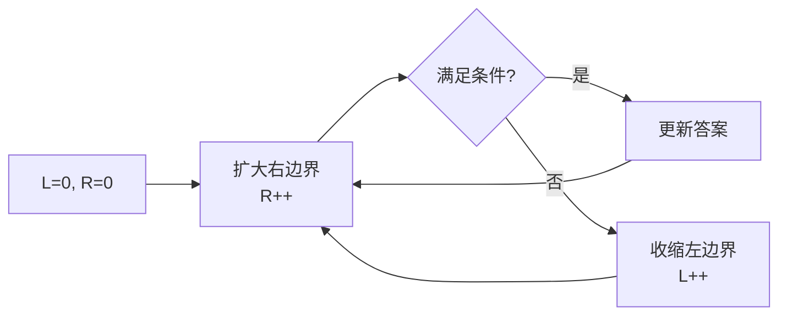

# 数组与字符串 (Arrays and Strings)

## 概述 (Overview)

数组 (Array) 是连续内存中存储的同类型元素集合，字符串 (String) 是字符序列。二者是计算机科学中最基础的数据结构，几乎所有算法都建立在其之上。

## 数组 (Array)

### 基本特性

- 随机访问：$O(1)$ 访问任意索引元素
- 连续内存：缓存友好，空间局部性优异
- 静态 vs 动态：静态数组大小固定，动态数组（如 `std::vector`， `ArrayList`）自动扩容

### 常见操作

| 操作 | 时间复杂度 | 说明 |
|:----|:----------|:-----|
| 访问 Access | $O(1)$ | 通过索引直接读取 |
| 插入 Insert | $O(n)$ | 需移动后续元素 |
| 删除 Delete | $O(n)$ | 需移动后续元素 |
| 搜索 Search | $O(n)$ | 线性扫描 |
| 二分搜索 Binary Search | $O(\log n)$ | 需有序数组 |

### 数组常用算法

#### 双指针 (Two Pointers)

使用两个指针相向或同向移动，常用于有序数组。典型应用：

- 两数之和 (Two Sum) — 有序数组，头尾指针逼近
- 三数之和 (Three Sum) — 固定一个，双指针找另外两个
- 盛水最多的容器 (Container With Most Water)

#### 滑动窗口 (Sliding Window)

维护一个窗口，在数组上滑动，用于处理子数组问题。



典型应用：
- 最长无重复子串
- 最小覆盖子串
- 长度最小的子数组

#### 前缀和 (Prefix Sum)

$$
\text{prefix}[i] = \sum_{k=0}^{i} \text{arr}[k]
$$

区间和可通过前缀和在 $O(1)$ 内计算：
$$
\text{sum}(l, r) = \text{prefix}[r] - \text{prefix}[l-1]
$$

## 字符串 (String)

### 字符串基础

字符串本质上是一个字符数组，但有额外约束（不可变性、编码问题等）。

| 语言 | 字符串类型 | 特点 |
|:----|:---------|:-----|
| C | `char[]` | 以 `\0` 结尾，可变 |
| Python | `str` | 不可变 (Immutable) |
| Java | `String` | 不可变，常量池 |
| C++ | `std::string` | 可变，值语义 |
| Rust | `String` / `&str` | 所有权系统控制内存 |

### 模式匹配算法 (Pattern Matching)

| 算法 | 预处理 | 匹配 | 说明 |
|:----|:------|:----|:-----|
| Naive | $O(1)$ | $O(nm)$ | 暴力匹配 |
| KMP | $O(m)$ | $O(n)$ | 利用失配前缀函数 |
| Boyer-Moore | $O(m + \Sigma)$ | $O(n/m)$ best | 坏字符 + 好后缀 |
| Rabin-Karp | $O(m)$ | $O(n+m)$ avg | 滚动哈希 (Rolling Hash) |
| Z 算法 | $O(n)$ | $O(n)$ | 求每个位置与字符串前缀的最长公共长度 |

#### KMP 算法 (Knuth-Morris-Pratt)

核心是 next 数组（部分匹配表）：

$$
\text{next}[i] = \max\{k < i \mid \text{pat}[0:k] = \text{pat}[i-k:i]\}
$$

即模式串前缀的前缀函数 (Prefix Function)。

#### 字符串哈希 (String Hashing / Rolling Hash)

$$
H(s) = \sum_{i=0}^{n-1} s[i] \cdot p^{i} \mod M
$$

可 $O(1)$ 计算子串哈希值，用于快速字符串比较。
双哈希 (Double Hash) 使用两个不同模数降低冲突概率。

### 字符串经典问题

| 问题 | 解法 |
|:----|:-----|
| 最长回文子串 | Manacher 算法 $O(n)$ |
| 最长公共子序列 LCS | 动态规划 $O(nm)$ |
| 最长公共子串 | 后缀数组 / DP |
| 编辑距离 Edit Distance | DP $O(nm)$ |
| 字符串排列 | 滑动窗口 + 哈希 |

### 字符编码 (Character Encoding)

| 编码 | 字节数 | 说明 |
|:----|:------|:-----|
| ASCII | 1 byte | 128 个字符 |
| UTF-8 | 1-4 bytes | 变长编码，兼容 ASCII |
| UTF-16 | 2 or 4 bytes | Java/C# 默认编码 |
| UTF-32 | 4 bytes | 定长编码，空间浪费 |

## 数组与字符串的相互转换

```python
# 数组转字符串
s = "".join(arr)

# 字符串转数组
arr = list(s)
```

## 相关条目

- [[LinkedList]]
- [[HashTable]]
- [[Trie]]
- [[Stack]]
- [[Queue]]
- [[Algorithms/Sorting]]
- [[Algorithms/Searching]]
- [[Algorithms/TwoPointers]]
- [[Algorithms/SlidingWindow]]
