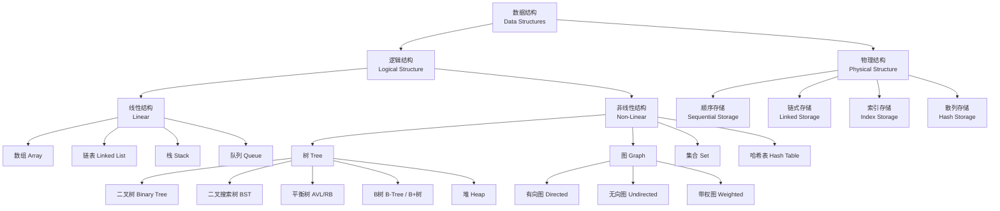

# 数据结构 (Data Structures)

## 概述 (Overview)

数据结构（Data Structures）是计算机科学中研究数据组织、存储和管理方式的学科。合理选择数据结构可以显著提升算法的时间效率和空间利用率。数据结构研究包括三个层次：逻辑结构（Logical Structure）定义数据元素间的逻辑关系，物理存储结构（Physical Storage Structure）定义数据在内存中的组织方式，以及定义在数据结构上的操作（Operations）。经典的数据结构分为线性结构（线性表、栈、队列、哈希表）和非线性结构（树、图、堆、并查集）。数据结构与算法共同构成程序设计的核心，"程序 = 数据结构 + 算法"是计算机科学的基本思想。

## 数据结构分类 (Classification)

## 时间复杂度对比 (Time Complexity Comparison)

| 数据结构 | 访问 Access | 查找 Search | 插入 Insert | 删除 Delete | 空间复杂度 |
|:---------|:-----------|:-----------|:-----------|:-----------|:-----------|
| 数组 Array | O(1) | O(n) | O(n) | O(n) | O(n) |
| 栈 Stack | O(n) | O(n) | O(1) | O(1) | O(n) |
| 队列 Queue | O(n) | O(n) | O(1) | O(1) | O(n) |
| 单向链表 Singly Linked List | O(n) | O(n) | O(1) | O(1) | O(n) |
| 双向链表 Doubly Linked List | O(n) | O(n) | O(1) | O(1) | O(n) |
| 哈希表 Hash Table | O(1) avg | O(1) avg | O(1) avg | O(1) avg | O(n) |
| 二叉搜索树 BST | O(log n) avg | O(log n) avg | O(log n) avg | O(log n) avg | O(n) |
| AVL 树 | O(log n) | O(log n) | O(log n) | O(log n) | O(n) |
| 红黑树 Red-Black Tree | O(log n) | O(log n) | O(log n) | O(log n) | O(n) |
| 堆 Heap (二叉堆) | O(1) max/min | O(n) | O(log n) | O(log n) | O(n) |
| 跳表 Skip List | O(log n) avg | O(log n) avg | O(log n) avg | O(log n) avg | O(n log n) |
| Trie 字典树 | O(L) | O(L) | O(L) | O(L) | O(n x L) |
| 并查集 Union-Find | — | O(α(n)) | O(α(n)) | — | O(n) |
| B-树 B-Tree | O(log n) | O(log n) | O(log n) | O(log n) | O(n) |

## 线性数据结构 (Linear Data Structures)

### 数组 (Array)

数组是最基本的数据结构，元素在内存中连续存储，通过下标索引实现 O(1) 的随机访问。数组的静态性导致插入和删除需要移动后续元素，最坏情况时间复杂度为 O(n)。多维数组存储方式包括行优先（Row-major，C/C++/Python 使用）和列优先（Column-major，Fortran 使用）。

**动态数组（Dynamic Array）**：如 C++ 的 `std::vector` 和 Python 的 `list`，在容量不足时倍增扩容（通常 1.5x 或 2x），均摊时间复杂度为 O(1)。

**应用场景**：矩阵运算和向量计算、内存池管理、缓存友好型数据密集操作、采样信号存储、C/C++ 底层系统编程。

### 链表 (Linked List)

链表通过指针链接分散在堆内存中的节点，支持动态容量和高效的插入与删除。

| 链表类型 | 结构特点 | 空间开销 | 典型操作复杂度 | 应用场景 |
|:---------|:---------|:---------|:-------------|:---------|
| 单向链表 | 每个节点仅含 next 指针 | 1 个指针/节点 | 头部 O(1)，尾部 O(n) | 邻接表、栈 |
| 双向链表 | 含 prev 和 next 指针 | 2 个指针/节点 | 两端均为 O(1) | LRU Cache, Deque |
| 循环链表 | 尾节点 next 指向头节点 | 1 个指针/节点 | 循环处理方便 | 循环队列、约瑟夫环 |
| 跳表 | 多层有序链表的概率索引 | O(n log n) | 全部 O(log n) avg | Redis ZSET |

### 栈 (Stack)

栈是后进先出（Last In First Out, LIFO）结构。基本操作 push（入栈）和 pop（出栈）的时间复杂度均为 O(1)。

**经典应用**：
- 函数调用栈：保存调用上下文和局部变量
- 括号匹配与语法分析：编译器前端
- 表达式求值：中缀转后缀（逆波兰式）
- 深度优先搜索（DFS）的实现
- 撤销操作（Undo）：编辑器历史记录

### 队列 (Queue)

队列是先进先出（First In First Out, FIFO）结构。

**四种队列变体**：
- 普通队列：FIFO 顺序，可用循环数组实现，避免假溢出
- 双端队列（Deque, Double-ended Queue）：两端均可 O(1) 插入和删除，C++ `std::deque`，Python `collections.deque`
- 优先队列（Priority Queue）：元素按优先级大小出队，通常使用二叉堆（Binary Heap）实现，插入和删除均为 O(log n)
- 阻塞队列（Blocking Queue）：支持多线程安全的生产者-消费者模式，如 Java `BlockingQueue`

## 非线性数据结构 (Non-Linear Data Structures)

### 树 (Tree)

树由节点（Node）和边（Edge）组成，无环连通。用于表示具有层次关系的数据。

**二叉树（Binary Tree）**：
- 满二叉树（Full Binary Tree）：每个节点有 0 或 2 个子节点
- 完全二叉树（Complete Binary Tree）：除最后一层外全部填满，最后一层左对齐
- 完美二叉树（Perfect Binary Tree）：所有叶节点在同一深度

$$ \text{二叉树深度为 } h \text{ 时的最大节点数} = 2^{h+1} - 1 $$

**二叉树遍历（Binary Tree Traversal）**：
| 遍历方式 | 顺序 | 递归模板 |
|:---------|:-----|:---------|
| 前序遍历 (Pre-order) | 根 → 左 → 右 | traverse(node); traverse(left); traverse(right) |
| 中序遍历 (In-order) | 左 → 根 → 右 | traverse(left); traverse(node); traverse(right) |
| 后序遍历 (Post-order) | 左 → 右 → 根 | traverse(left); traverse(right); traverse(node) |
| 层序遍历 (Level-order) | 逐层从左到右 | 使用队列 BFS |

**二叉搜索树（Binary Search Tree, BST）**：对任意节点，左子树所有节点 < 根节点 < 右子树所有节点。中序遍历得到有序序列。

$$ \text{BST 操作时间复杂度} = O(h), \quad h \in [\log n, n] $$

BST 在极端情况下退化为链表（$h = n$），因此引入平衡树机制。

**平衡二叉搜索树**：
- AVL 树：每个节点的左右子树高度差不超过 1，通过 LL、RR、LR、RL 四种旋转恢复平衡
- 红黑树（Red-Black Tree）：根黑、叶黑、红子黑、黑高相等，C++ `std::map`、Java `TreeMap` 的实现基础

**B 树与 B+ 树**：多路平衡搜索树，广泛应用于数据库索引和文件系统。B+ 树的特点：
- 内部节点仅存储键值，不存储数据
- 叶节点存储所有数据，并通过指针形成有序链表
- 范围查询效率高，可减少磁盘 I/O

**堆（Heap）**：完全二叉树实现，大根堆（Max-heap）的根节点为最大值。堆排序：建堆 O(n)，每次提取 O(log n)：
$$ \text{堆排序} = O(n \log n) $$

### 图 (Graph)

图由顶点集 $V$ 和边集 $E$ 组成，记为 $G = (V, E)$。按边有无方向分为有向图（Directed Graph/Digraph）和无向图（Undirected Graph），按边有无权重分为无权图和带权图（Weighted Graph）。

**图的存储方式**：

| 存储方式 | 空间复杂度 | 判断边存在 | 遍历邻接节点 | 适用场景 |
|:---------|:-----------|:-----------|:-------------|:---------|
| 邻接矩阵 | O(V²) | O(1) | O(V) | 稠密图 |
| 邻接表 | O(V + E) | O(degree) | O(degree) | 稀疏图 |
| 边列表 | O(E) | O(E) | O(E) | 最小生成树算法 |
| 邻接多重表 | O(V + E) | O(degree) | O(degree) | 无向图高效操作 |

**核心图算法**：
- 深度优先搜索（DFS）：递归或栈实现，$O(V + E)$
- 广度优先搜索（BFS）：队列实现，$O(V + E)$，无权图最短路径
- Dijkstra 单源最短路径：$O((V + E)\log V)$，要求无负边
- Bellman-Ford 算法：$O(VE)$，允许负边，检测负环
- Floyd-Warshall 全源最短路径：$O(V^3)$
- Kruskal 算法（最小生成树）：$O(E \log E)$，并查集实现
- Prim 算法（最小生成树）：$O(E \log V)$，优先队列实现
- 拓扑排序（Topological Sort）：仅适用于 DAG，$O(V + E)$
- 强连通分量（SCC）：Kosaraju 或 Tarjan 算法，$O(V + E)$

### 哈希表 (Hash Table)

哈希表通过哈希函数 $h(k)$ 将键映射到数组下标，实现接近 O(1) 的查找、插入和删除。

**哈希函数设计原则**：均匀性（Uniformity）、确定性（Determinism）、高效率（Efficiency）。

常见哈希函数：
- 除留余数法：$h(k) = k \bmod m$，$m$ 通常取素数
- 乘法散列：$h(k) = \lfloor m (kA \bmod 1) \rfloor$，$A = (\sqrt{5}-1)/2 \approx 0.618$

**冲突解决**：

| 方法 | 原理 | 优点 | 缺点 |
|:-----|:-----|:-----|:-----|
| 拉链法 (Chaining) | 同义词用链表链接 | 实现简单，负载因子可 > 1 | 指针占用额外空间，缓存不友好 |
| 线性探测 (Linear Probing) | $h(k,i) = (h(k) + i) \bmod m$ | 空间连续，缓存友好 | 容易产生聚集 (Clustering) |
| 二次探测 (Quadratic Probing) | $h(k,i) = (h(k) + i^2) \bmod m$ | 减少聚集 | 不能遍历所有槽位 |
| 双重哈希 (Double Hashing) | $h(k,i) = (h(k) + i \cdot h_2(k)) \bmod m$ | 分布最均匀 | 计算量略大 |
| 开放寻址 + Robin Hood | 偏移小的置换偏移大的 | 均衡查找时间 | 实现复杂 |

负载因子 $\alpha = n/m$，拉链法建议 $\alpha < 2.0$，开放寻址建议 $\alpha < 0.7$。哈希表扩容时需 rehash 所有元素，时间复杂度 O(n)。

## 抽象数据类型 (ADT)

| ADT | 特性 | 核心操作集 | 典型实现 |
|:----|:-----|:-----------|:---------|
| 列表 List | 有序可重复 | insert, delete, get, size | 动态数组、链表 |
| 栈 Stack | LIFO | push, pop, top, isEmpty | 数组、链表 |
| 队列 Queue | FIFO | enqueue, dequeue, peek | 循环数组、链表 |
| 双端队列 Deque | 两端操作 | addFirst/Last, removeFirst/Last | 循环数组、双向链表 |
| 优先队列 PQueue | 按优先级 | insert, extractMin/ extractMax | 二叉堆、二项堆 |
| 集合 Set | 无序不重复 | add, remove, contains, union, intersect | 哈希表、BST |
| 映射 Map | 键值对 | put, get, remove, containsKey | 哈希表、BST |
| 多重集 Multiset | 可重复 | add, remove, count | 哈希表 + 计数 |

## 性能权衡与工程选择 (Performance Trade-offs)

| 场景特征 | 推荐数据结构 | 原因 |
|:---------|:-------------|:-----|
| 读密集、随机访问频繁 | 数组 (Array) | O(1) 随机访问，缓存友好 |
| 写密集、频繁插入删除 | 链表 (Linked List) | O(1) 插入/删除 |
| 需要 LIFO 语义 | 栈 (Stack) | 简单高效，O(1) 两端操作 |
| 需要 FIFO 语义 | 队列 (Queue) | 简单高效，O(1) 两端操作 |
| 快速查找 (无顺序要求) | 哈希表 (Hash Table) | 近似 O(1) 查找 |
| 有序数据 + 范围查询 | 平衡 BST / B+树 | O(log n) 操作，支持范围遍历 |
| 优先级调度 | 堆 (Heap) | O(log n) 插入/提取 |
| 字符串前缀查询 | Trie | O(L) 按 key 长度查询 |
| 动态连通性 | 并查集 (Union-Find) | 近乎 O(1) 操作 |
| 键有序 + 持久化 | B+ 树 | 磁盘友好，扇出高 |

## 相关条目

- [[Array]]
- [[LinkedList]]
- [[Stack]]
- [[Queue]]
- [[Tree]]
- [[Graph]]
- [[HashTable]]
- [[Heap]]
- [[BinarySearchTree]]
- [[AVL]]
- [[RedBlackTree]]
- [[Trie]]
- [[UnionFind]]
- [[SegmentTree]]
- [[BTree]]
- [[SkipList]]
- [[BloomFilter]]
- [[INDEX]]
