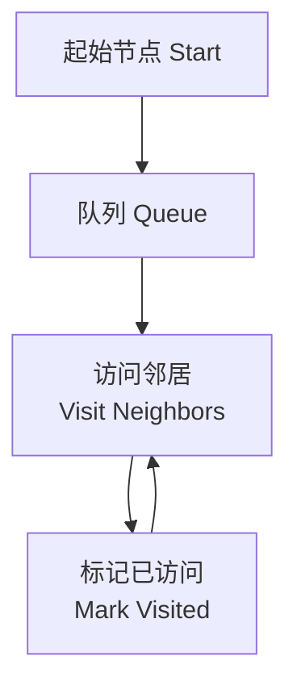

# 图论 (Graph Theory)

## 概述 (Overview)

图 $G = (V, E)$ 由顶点集合 $V$ (Vertices) 和边集合 $E$ (Edges) 组成。图是计算机科学中最强大的抽象工具之一，用于表示实体间的关系。

## 图的类型 (Graph Types)

| 类型 | 说明 | 示例 |
|:----|:-----|:-----|
| 有向图 Digraph | 边有方向 $(u \to v)$ | 网页链接、关注关系 |
| 无向图 Undirected | 边无方向 $(u - v)$ | 社交网络好友 |
| 加权图 Weighted | 边有权重 $w(u,v)$ | 交通网络距离 |
| DAG | 有向无环图 | 任务依赖、拓扑结构 |
| 连通图 Connected | 任意两点有路径 | 通信网络 |
| 二分图 Bipartite | 顶点可分成两组，边仅在组间 | 匹配问题 |

## 图的表示 (Graph Representation)

```mermaid
graph LR
  A[图 Graph] --> B[邻接矩阵<br/>Adjacency Matrix]
  A --> C[邻接表<br/>Adjacency List]
  A --> D[边列表<br/>Edge List]
  B --> E[空间 O(V²)<br/>适合稠密图]
  C --> F[空间 O(V+E)<br/>适合稀疏图]
```

| 表示法 | 空间 Space | 查边 Edge Query | 遍历所有邻居 |
|:------|:----------|:---------------|:------------|
| 邻接矩阵 | $O(\|V\|^2)$ | $O(1)$ | $O(\|V\|)$ |
| 邻接表 | $O(\|V\| + \|E\|)$ | $O(d)$ | $O(d)$ |
| 边列表 | $O(\|E\|)$ | $O(\|E\|)$ | $O(\|E\|)$ |

## 图的遍历 (Graph Traversal)

### 广度优先搜索 (BFS - Breadth-First Search)



- 使用队列 (Queue)，按层逐层扩展
- 时间复杂度：$O(V + E)$
- 应用：最短路径（无权图）、连通分量、二分图检测

### 深度优先搜索 (DFS - Depth-First Search)

- 使用栈 (Stack) 或递归，沿着一条路径深入
- 时间复杂度：$O(V + E)$
- 应用：拓扑排序、连通分量、强连通分量、环检测

## 最短路径算法 (Shortest Path)

| 算法 | 适用场景 | 时间复杂度 |
|:----|:--------|:----------|
| Dijkstra | 非负权单源 | $O((V+E)\log V)$ |
| Bellman-Ford | 含负权单源 | $O(VE)$ |
| Floyd-Warshall | 全源 | $O(V^3)$ |
| SPFA | 负权边（优化） | $O(VE)$ worst |

### Dijkstra 算法核心思想

$dist[v] = \min(dist[v], dist[u] + w(u, v))$

使用优先队列 (Priority Queue) 每次取出距离最小的未访问节点进行松弛操作 (Relaxation)。

## 最小生成树 (Minimum Spanning Tree, MST)

| 算法 | 策略 | 时间复杂度 |
|:----|:-----|:----------|
| Kruskal | 按边权排序 + 并查集 | $O(E\log E)$ |
| Prim | 从节点扩展 + 优先队列 | $O((V+E)\log V)$ |

Kruskal 算法使用并查集 (Union-Find) 检测环，Prim 算法类似 Dijkstra 但维护的是到树的最小距离。

## 拓扑排序 (Topological Sort)

仅适用于 DAG。两种实现方式：

1. **Kahn 算法** — 统计入度，不断删除入度为 0 的节点
2. **DFS 后序** — 按完成时间逆序排列

应用：任务调度、编译依赖解析、课程安排

## 强连通分量 (Strongly Connected Components, SCC)

- **Kosaraju 算法**：两次 DFS，第一次记录完成顺序，第二次在反向图上按完成顺序逆序 DFS
- **Tarjan 算法**：一次 DFS，利用 lowlink 值和栈

## 图论核心公式 (Key Formulas)

$$
\deg(v) = \text{顶点 } v \text{ 的度数}
$$

$$
\sum_{v \in V} \deg(v) = 2|E| \quad (\text{握手定理 Handshaking Lemma})
$$

$$
\chi(G) \leq \Delta(G) + 1 \quad (\text{图染色上界})
$$

其中 $\chi(G)$ 为色数 (Chromatic Number)，$\Delta(G)$ 为最大度。

## 应用场景 (Applications)

- 社交网络分析 (Social Network Analysis)
- 路径规划 (Route Planning)
- 网络流 (Network Flow)
- 推荐系统 (Recommendation Systems)
- 知识图谱 (Knowledge Graphs)
- 编译器优化 (Compiler Optimization)

## 相关条目

- [[Tree]]
- [[UnionFind]]
- [[Heap]]
- [[Algorithms/GraphAlgorithms]]
- [[Algorithms/BFS]]
- [[Algorithms/DFS]]
