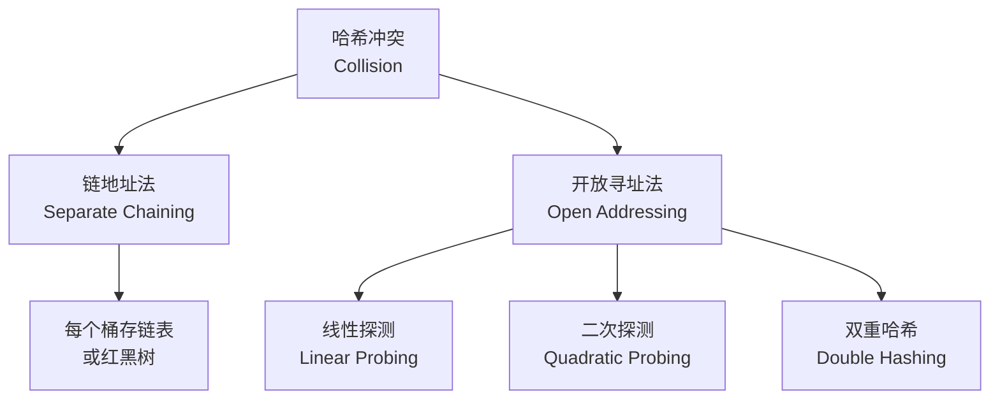
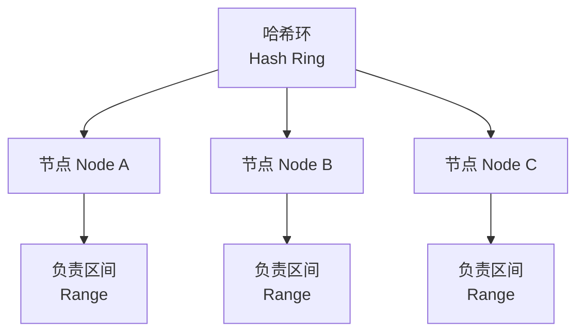

---
aliases: [HashTables, 哈希表, Hash Table, Hash Map, 散列表]
tags: ['05_ComputerScience', 'DataStructuresAndAlgorithms', 'DataStructures', 'HashTable']
created: 2026-05-17
updated: 2026-05-17
---

# 哈希表 (Hash Table)

## 概述 (Overview)

哈希表通过哈希函数将键 (Key) 映射到数组位置，实现平均 $O(1)$ 的插入、删除和查找操作，是空间换时间的经典体现。

## 核心概念 (Core Concepts)

### 哈希函数 (Hash Function)

哈希函数 $h(k)$ 将任意大小的键 $k$ 映射到固定范围的索引 $[0, m-1]$。

**常见哈希函数**：

| 类型 | 公式 | 特点 |
|:----|:-----|:-----|
| 除留余数法 | $h(k) = k \mod m$ | 简单，$m$ 选质数效果好 |
| 乘法哈希 | $h(k) = \lfloor m(kA \mod 1) \rfloor$ | 与 $m$ 无关 |
| 一致性哈希 | $h(k) = \text{hash}(k) \mod 2^{32}$ | 分布式系统适用 |
| 多项式哈希 | $h(s) = \sum s[i] \cdot p^i \mod M$ | 字符串哈希 |

### 负载因子 (Load Factor)

$$
\alpha = \frac{n}{m}
$$

其中 $n$ 为元素数量，$m$ 为桶数量。$\alpha$ 超过阈值时触发扩容 (Rehashing)。

### 冲突解决 (Collision Resolution)

#### 链地址法 (Separate Chaining)

每个桶存储一个链表（或红黑树）。当链表长度超过阈值（如 8）时转换为红黑树以优化性能。

- 插入：$O(1)$
- 查找：$O(\alpha)$
- 删除：$O(\alpha)$

#### 开放寻址法 (Open Addressing)

所有元素直接存储在表中，通过探测序列寻找空位。

| 方法 | 探测序列 | 问题 |
|:----|:---------|:-----|
| 线性探测 | $h(k,i) = (h(k) + i) \mod m$ | 主聚类 |
| 二次探测 | $h(k,i) = (h(k) + c_1i + c_2i^2) \mod m$ | 次聚类 |
| 双重哈希 | $h(k,i) = (h_1(k) + i \cdot h_2(k)) \mod m$ | 效果好 |

**聚类现象 (Clustering)**：连续元素聚集形成长块，显著降低插入和查找性能。

## 哈希表操作

| 操作 | 平均 | 最坏 |
|:----|:----|:----|
| 查找 Search | $O(1)$ | $O(n)$ |
| 插入 Insert | $O(1)$ | $O(n)$ |
| 删除 Delete | $O(1)$ | $O(n)$ |

## 扩容与 Rehash (Rehashing)

当 $\alpha$ 超过阈值（通常 0.75），哈希表扩容为原大小的 2 倍（通常使用 2 的幂或质数），将所有元素重新哈希到新表。

**均摊分析 (Amortized Analysis)**：虽然单次插入可能触发 $O(n)$ 的 Rehash，但均摊后每个插入仍是 $O(1)$。

## 一致性哈希 (Consistent Hashing)

分布式哈希中，一致性哈希将哈希值空间组织成环，使添加/移除节点时只影响少量键。

## 安全哈希 (Secure Hashing)

密码学哈希函数用于哈希表的场景：

- **SipHash**：抵御哈希洪水攻击 (Hash DoS)，Rust/ Python 中使用
- **SHA-256**：安全性高但慢，不适合作普通哈希表函数

## 应用场景 (Applications)

- 数据库索引 (Database Indexing)
- 缓存系统 (Memcached, Redis)
- 编译器的符号表 (Symbol Table)
- 集合与字典 (Set / Dictionary)
- 计数和去重 (Counting / Deduplication)
- 路由表 (Routing Table)

## 与其它数据结构的比较

| 结构 | 有序性 | 查找 | 范围查询 | 存储 |
|:----|:------|:----|:--------|:----|
| 哈希表 | 无序 | $O(1)$ avg | 不支持 | 键值对 |
| 二叉搜索树 | 有序 | $O(\log n)$ | 支持 | 键值对 |
| 数组 | 索引有序 | $O(1)$ by index | 支持 | 任意 |
| 跳表 Skip List | 有序 | $O(\log n)$ | 支持 | 有序集合 |

## 相关条目

- [[Array]]
- [[LinkedList]]
- [[Trie]]
- [[Tree]]
- [[Bloom Filter]]
- [[INDEX]]

