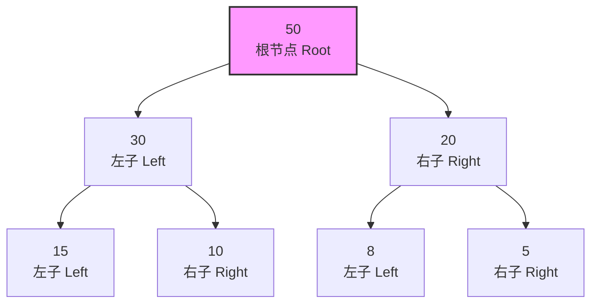
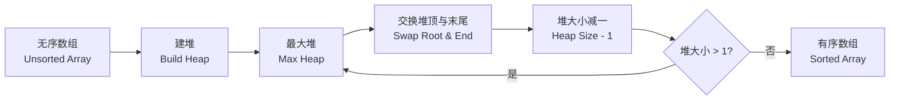
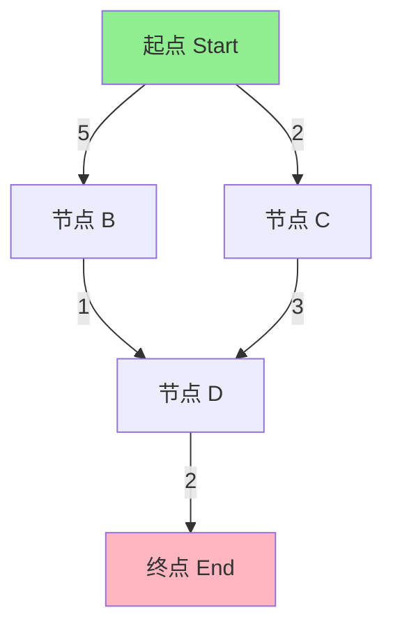

# 堆与优先队列 (Heaps and Priority Queues)

## 概述 (Overview)

堆（Heap）是一种特殊的完全二叉树（Complete Binary Tree），满足堆性质（Heap Property）：最大堆（Max Heap）中父节点值 ≥ 子节点值，最小堆（Min Heap）中父节点值 ≤ 子节点值。优先队列（Priority Queue）通常基于堆实现，能够在 $O(\log n)$ 时间内完成插入和删除最值操作。

堆在算法设计中具有核心地位，广泛应用于排序、图算法、调度系统等领域。

## 堆的结构与性质 (Heap Structure)

### 完全二叉树表示

堆使用数组（Array）存储，对于索引 $i$ 的节点：

- 父节点索引：$\lfloor (i-1)/2 \rfloor$
- 左子节点索引：$2i + 1$
- 右子节点索引：$2i + 2$

### 堆的高度

含 $n$ 个元素的堆高度为 $h = \lfloor \log_2 n \rfloor$，叶子节点集中在最下层和次下层。



## 堆操作 (Heap Operations)

### 上浮操作 (Heapify Up / Sift Up)

当新元素插入堆底时，若违反堆性质，则与父节点交换，直至恢复堆性质。

时间复杂度：$O(\log n)$

### 下沉操作 (Heapify Down / Sift Down)

当堆顶元素被移除后，将堆底元素移至堆顶，若违反堆性质，则与较大的子节点交换，直至恢复堆性质。

时间复杂度：$O(\log n)$

### 建堆 (Build Heap)

通过自底向上的下沉操作，将无序数组转化为堆。时间复杂度为 $O(n)$，而非 $O(n \log n)$。

$$T(n) = \sum_{h=0}^{\lfloor \log n \rfloor} \lceil \frac{n}{2^{h+1}} \rceil \cdot O(h) = O(n)$$

## 操作复杂度分析 (Complexity Analysis)

| 操作 | 时间复杂度 | 空间复杂度 |

|------|-----------|-----------|

| 插入 (Insert) | $O(\log n)$ | $O(1)$ |

| 删除最值 (Extract Max/Min) | $O(\log n)$ | $O(1)$ |

| 查看最值 (Peek) | $O(1)$ | $O(1)$ |

| 建堆 (Build Heap) | $O(n)$ | $O(1)$ |

| 堆排序 (Heap Sort) | $O(n \log n)$ | $O(1)$ |

| 合并两个堆 (Merge) | $O(n)$ | $O(n)$ |

## 堆排序 (Heap Sort)

堆排序是一种基于比较的排序算法，分为两个阶段：

1. **建堆阶段**：将无序数组构建为最大堆，时间复杂度 $O(n)$
2. **排序阶段**：反复将堆顶元素（最大值）与末尾元素交换，并对剩余元素重新堆化，时间复杂度 $O(n \log n)$

总时间复杂度：

$$T(n) = O(n) + O(n \log n) = O(n \log n)$$

空间复杂度：$O(1)$（原地排序）



## 优先队列 (Priority Queue)

优先队列是一种抽象数据类型（ADT），每个元素关联一个优先级，出队顺序按优先级而非入队顺序决定。

### 实现方式对比

| 实现方式 | 插入 | 删除最高优先级 | 查看最高优先级 |

|----------|------|--------------|--------------|

| 无序数组 (Unsorted Array) | $O(1)$ | $O(n)$ | $O(n)$ |

| 有序数组 (Sorted Array) | $O(n)$ | $O(1)$ | $O(1)$ |

| 二叉堆 (Binary Heap) | $O(\log n)$ | $O(\log n)$ | $O(1)$ |

| 二叉搜索树 (BST) | $O(\log n)$ | $O(\log n)$ | $O(\log n)$ |

| 斐波那契堆 (Fibonacci Heap) | $O(1)$ | $O(\log n)$ | $O(1)$ |

### 优先队列的应用场景

- **任务调度（Task Scheduling）**：操作系统进程调度、线程池任务管理
- **Dijkstra 最短路径算法**：优先队列优化可将时间复杂度降至 $O((V+E)\log V)$
- **Huffman 编码**：构建最优前缀编码树
- **Top K 问题**：查找数组中第 K 大或第 K 小的元素
- **中位数查找（Median Finding）**：使用双堆维护动态数据流的中位数
- **合并 K 个有序链表**：每次从各链表头节点中取最小值

## 高级堆结构 (Advanced Heap Structures)

### 二项堆 (Binomial Heap)

由一组二项树（Binomial Tree）组成的森林，支持高效的合并操作，合并时间复杂度为 $O(\log n)$。

### 斐波那契堆 (Fibonacci Heap)

在 Dijkstra 和 Prim 算法中使用的堆结构，摊还时间复杂度：

- 插入：$O(1)$
- 删除最小值：$O(\log n)$
- 减小键值：$O(1)$（摊还）

### 索引堆 (Indexed Heap)

维护元素到堆索引的映射，支持 $O(\log n)$ 时间内的任意元素值修改，在图算法中尤为重要。

## 堆的实际应用代码实现

### 最大堆的数组实现

最大堆的核心操作伪代码：

```
function heapify(A, n, i):
    largest = i
    left = 2*i + 1
    right = 2*i + 2
    if left < n and A[left] > A[largest]:
        largest = left
    if right < n and A[right] > A[largest]:
        largest = right
    if largest != i:
        swap(A[i], A[largest])
        heapify(A, n, largest)
```

### 优先队列接口设计

| 方法 | 功能 | 时间复杂度 |

|------|------|-----------|

| `insert(key, value)` | 插入元素 | $O(\log n)$ |

| `extractMax()` / `extractMin()` | 移除并返回最值 | $O(\log n)$ |

| `peek()` | 查看最值 | $O(1)$ |

| `increaseKey(i, newKey)` | 增加键值 | $O(\log n)$ |

| `decreaseKey(i, newKey)` | 减小键值 | $O(\log n)$ |

| `size()` | 返回元素个数 | $O(1)$ |

## Dijkstra 算法中的优先队列

Dijkstra 算法使用优先队列实现时的时间复杂度：

$$T(V, E) = O(E \log V)$$

其中 $V$ 为顶点数，$E$ 为边数。使用斐波那契堆可进一步优化至 $O(V \log V + E)$。



## 常见问题与优化 (FAQ and Optimization)

### 堆 vs 平衡二叉搜索树

| 特性 | 二叉堆 | 平衡 BST |

|------|--------|----------|

| 查找任意元素 | $O(n)$ | $O(\log n)$ |

| 查找最值 | $O(1)$ | $O(\log n)$ |

| 插入 | $O(\log n)$ | $O(\log n)$ |

| 删除最值 | $O(\log n)$ | $O(\log n)$ |

| 合并 | $O(n)$ | $O(n \log n)$ |

| 实现复杂度 | 低 | 高 |

### 堆的优化技巧

- **d 叉堆**：减少树高，适合缓存友好的场景
- **软堆**：允许一定误差，用于近似算法
- **配对堆**：实现简单，实际性能优异

## 经典教材与参考资料

- 《算法导论》(Introduction to Algorithms) — Cormen 等，第6章 堆排序
- 《数据结构与算法分析》(Data Structures and Algorithm Analysis) — Mark Allen Weiss
- 《算法》(Algorithms) — Robert Sedgewick
- LeetCode 堆相关题目：215. 数组中的第 K 个最大元素，23. 合并 K 个升序链表

## 相关条目

- [[Heap|堆 (Heap)]]
- [[Tree|树 (Tree)]]
- [[Queue|队列 (Queue)]]
- [[SegmentTree|线段树 (Segment Tree)]]
- [[DijkstraAlgorithm|Dijkstra 算法]]
- [[SortingAlgorithms|排序算法 (Sorting Algorithms)]]
- [[INDEX|DataStructures 索引]]
