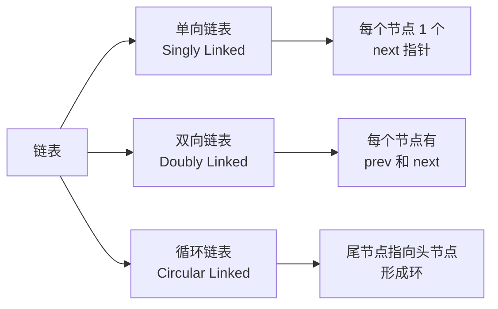

# 链表 (Linked List)

## 概述 (Overview)

链表由一系列节点 (Node) 组成，每个节点包含数据域和指针域。链表支持高效的插入和删除操作，但不支持随机访问。

## 链表类型 (Types of Linked Lists)



### 单向链表 (Singly Linked List)

```
[data|next] -> [data|next] -> [data|null]
```

- 只支持正向遍历
- 删除已知节点需要前驱节点

### 双向链表 (Doubly Linked List)

```
null <- [prev|data|next] <-> [prev|data|next] -> null
```

- 支持双向遍历
- 删除已知节点 $O(1)$
- 比单向链表多存储一个指针（空间翻倍）

### 循环链表 (Circular Linked List)

- 单向或双向版本均可
- 尾节点的 next 指向头节点
- 适用场景：轮询调度 (Round-Robin)、约瑟夫环

## 操作复杂度 (Operation Complexity)

| 操作 | 单向链表 | 双向链表 |
|:----|:--------|:--------|
| 头插 Insert at Head | $O(1)$ | $O(1)$ |
| 尾插 Insert at Tail | $O(n)$ | $O(1)$ |
| 中间插入 Insert at Position | $O(n)$ | $O(n)$ |
| 头删 Delete Head | $O(1)$ | $O(1)$ |
| 尾删 Delete Tail | $O(n)$ | $O(1)$ |
| 按值查找 Search by Value | $O(n)$ | $O(n)$ |
| 按索引访问 Access by Index | $O(n)$ | $O(n)$ |

## 常见操作 (Common Operations)

### 反转链表 (Reverse Linked List)

```python
def reverse(head):
    prev = None
    curr = head
    while curr:
        next_temp = curr.next
        curr.next = prev
        prev = curr
        curr = next_temp
    return prev
```

### 合并有序链表 (Merge Sorted Lists)

使用双指针，比较两个链表当前节点，取较小者接入结果链表。

### 快慢指针技术 (Fast & Slow Pointers)

| 问题 | 解法 |
|:----|:-----|
| 检测环 | 快指针每次 2 步，慢指针每次 1 步 |
| 找到环入口 | 相遇后，快指针回头部步长改为 1 |
| 寻找中点 | 快指针结束，慢指针在中点 |
| 找倒数第 k 个 | 快指针先走 k 步，然后同步前进 |

### 约瑟夫环 (Josephus Problem)

$n$ 个人围成一圈，从第 1 个开始报数，每报到 $m$ 的人出局，求最后剩下的人。

递推公式：
$$
J(n, k) = (J(n-1, k) + k) \mod n
$$

其中 $J(1, k) = 0$。

## 边界处理 (Edge Cases)

| 场景 | 处理方式 |
|:----|:--------|
| 空链表 | head = null |
| 单节点 | next = null |
| 头节点操作 | 更新 head 指针 |
| 尾节点操作 | 更新 tail 指针 |
| 删除唯一节点 | head = tail = null |

## 数组 vs 链表 (Array vs Linked List)

| 特性 | 数组 | 链表 |
|:----|:----|:----|
| 内存分配 | 连续内存 | 离散内存 |
| 访问 | $O(1)$ 随机访问 | $O(n)$ 顺序访问 |
| 插入/删除 | $O(n)$（需移动元素） | $O(1)$（已知位置） |
| 缓存友好 | 高（空间局部性） | 低 |
| 额外内存 | 每个元素固定大小 | 额外指针开销 |
| 大小调整 | 需扩容复制 | 动态增长 |

## 应用场景 (Applications)

- 实现栈和队列 (Stack, Queue)
- 哈希表中的链地址冲突解决
- 浏览器前进/后退（双向链表）
- 音乐播放列表（循环链表）
- LRU 缓存（双向链表 + 哈希表）
- 图的邻接表表示
- 操作系统的进程调度队列

## 相关条目

- [[Array]]
- [[Stack]]
- [[Queue]]
- [[HashTable]]
- [[ArrayVsLinkedList]]
- [[INDEX]]
