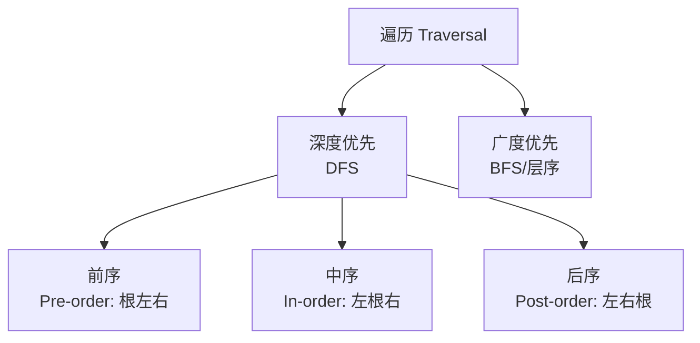

---
aliases: [Trees, 树, Tree Structure]
tags: ['05_ComputerScience', 'DataStructuresAndAlgorithms', 'DataStructures', 'Tree']
created: 2026-05-17
updated: 2026-05-17
---

# 树 (Tree)

## 概述 (Overview)

树 $T = (V, E)$ 是一种分层数据结构，由节点 (Node) 和边 (Edge) 组成。树是图的一种特例——无环连通图。

## 基本概念 (Basic Concepts)

| 术语 | 定义 |
|:----|:-----|
| 根 Root | 没有父节点的顶层节点 |
| 叶 Leaf | 没有子节点的节点 |
| 高度 Height | 从根到最远叶子路径上的边数 |
| 深度 Depth | 从根到当前节点路径上的边数 |
| 度 Degree | 节点的子节点数量 |
| 层 Level | 根在第 0 层，子节点层数 = 父节点层数 + 1 |

## 二叉树 (Binary Tree)

每个节点最多有两个子节点：左孩子 (Left Child) 和右孩子 (Right Child)。

**性质**：
- 第 $i$ 层最多有 $2^i$ 个节点
- 高度为 $h$ 的二叉树最多有 $2^{h+1} - 1$ 个节点
- $n_0 = n_2 + 1$（叶节点数 = 度为 2 的节点数 + 1）

### 特殊二叉树

| 类型 | 性质 |
|:----|:-----|
| 满二叉树 Full BT | 所有非叶节点都有两个子节点 |
| 完全二叉树 Complete BT | 除最后一层外全满，最后一层左对齐 |
| 完美二叉树 Perfect BT | 所有层完全填满 |

### 树的遍历 (Tree Traversal)

**遍历复杂度**：$O(n)$，空间 $O(h)$ 其中 $h$ 为树高。

**Morris 遍历**：使用线索二叉树实现 $O(1)$ 空间的遍历。

## 二叉搜索树 (Binary Search Tree, BST)

**性质**：左子树所有节点 < 根节点 < 右子树所有节点

| 操作 | 平均 | 最坏（退化为链表） |
|:----|:----|:-----------------|
| 查找 Search | $O(\log n)$ | $O(n)$ |
| 插入 Insert | $O(\log n)$ | $O(n)$ |
| 删除 Delete | $O(\log n)$ | $O(n)$ |

**前驱 (Predecessor)**：左子树中的最大值
**后继 (Successor)**：右子树中的最小值

## 平衡二叉搜索树 (Balanced BST)

### AVL 树

严格平衡：任意节点左右子树高度差 $\leq 1$

**旋转操作**：LL / RR / LR / RL

旋转后平衡公式：
$$
\text{平衡因子} = \text{Height}(\text{left}) - \text{Height}(\text{right}) \in \{-1, 0, 1\}
$$

### 红黑树 (Red-Black Tree)

近似平衡：最长路径 $\leq 2 \times$ 最短路径

**性质**：
1. 每个节点红色或黑色
2. 根是黑色
3. 叶节点 (NIL) 是黑色
4. 红色节点不能有红色子节点
5. 任意节点到后代叶节点的路径包含相同数量的黑色节点

**应用**：C++ `std::map` / `std::set`、Java `TreeMap`、Linux CFG 调度器

## 多路搜索树 (Multi-way Search Tree)

### B 树 / B+ 树

用于磁盘存储的平衡多路搜索树。

| 特性 | B 树 | B+ 树 |
|:----|:-----|:------|
| 数据存储 | 所有节点 | 仅叶节点 |
| 叶节点链接 | 无 | 有（范围查询快） |
| 内部节点 | 存键和数据 | 仅存键（作为路由） |
| 应用 | 文件系统 | 数据库索引 |

**阶数 $m$**：每个节点最多 $m$ 个子节点，$\lceil m/2 \rceil$ 到 $m$ 个。

## 堆 (Heap)

### 二叉堆 (Binary Heap)

完全二叉树，满足堆性质：
- **最大堆**：父节点 $\geq$ 子节点
- **最小堆**：父节点 $\leq$ 子节点

| 操作 | 复杂度 |
|:----|:------|
| 建堆 Build-Heap | $O(n)$ |
| 插入 Insert | $O(\log n)$ |
| 删除最大/小 Extract | $O(\log n)$ |
| 查看最大/小 Peek | $O(1)$ |

### 其他堆

- 斐波那契堆 (Fibonacci Heap)：$O(1)$ 插入，$O(\log n)$ 删除
- 左偏堆 (Leftist Heap)：支持合并操作
- 二项堆 (Binomial Heap)：支持高效合并

## 树的常见应用 (Applications)

- 文件系统目录结构
- DOM / XML / JSON 解析
- 编译器抽象语法树 (AST)
- 数据库索引（B+ 树）
- 路由协议（OSPF 使用树计算最短路径）
- 搜索与排序算法

## 相关条目

- [[BinarySearchTree]]
- [[AVL]]
- [[SegmentTree]]
- [[Trie]]
- [[Heap]]
- [[Graph]]
- [[Queue]]
- [[Stack]]

