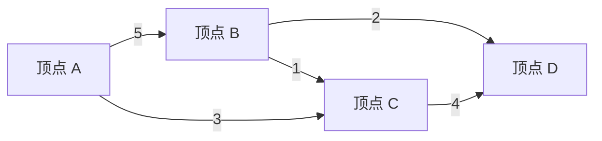
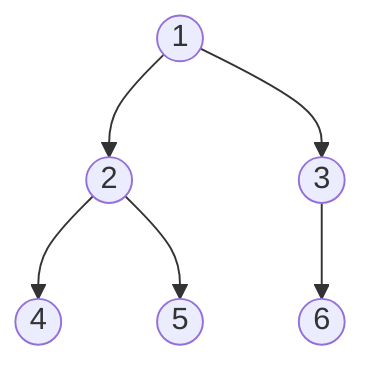
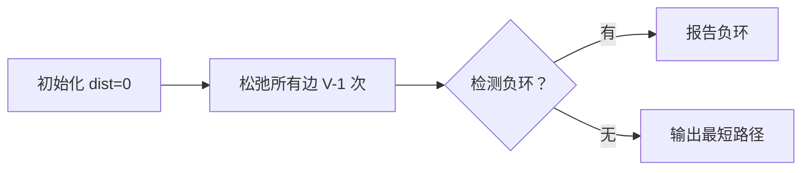
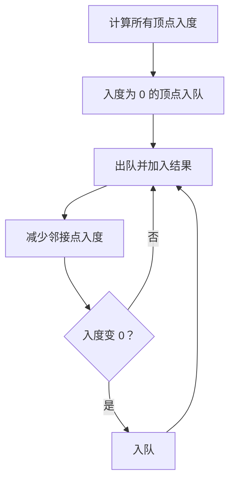

# 图 (Graphs)

## 一、概述 (Overview)

图是一种由顶点 (Vertex/Node) 集合 $V$ 和边 (Edge) 集合 $E$ 组成的数据结构，记作 $G = (V, E)$。图可用于建模任意二元关系。

### 1.1 基本分类

| 类型 | 英文 | 定义 |
|------|------|------|
| 无向图 | Undirected Graph | 边无方向，$(u,v) = (v,u)$ |
| 有向图 | Directed Graph (Digraph) | 边有方向，$u \to v \neq v \to u$ |
| 加权图 | Weighted Graph | 边带权重 $w(u,v)$ |
| 无权图 | Unweighted Graph | 边无权重 |
| 完全图 | Complete Graph | 任意两顶点间都有边 |
| 稀疏图 | Sparse Graph | $\|E\| \ll \|V\|^2$ |
| 稠密图 | Dense Graph | $\|E\| \approx \|V\|^2$ |

完全图 $K_n$ 的边数：无向图为 $\frac{n(n-1)}{2}$，有向图为 $n(n-1)$。

### 1.2 图的基本术语

- **路径** (Path)：顶点序列 $v_1, v_2, ..., v_k$，相邻顶点间有边
- **环/回路** (Cycle)：起点与终点相同的路径
- **连通图** (Connected Graph)：任意两顶点间有路径
- **连通分量** (Connected Component)：极大连通子图
- **强连通** (Strongly Connected)：有向图中任意两顶点双向可达
- **度** (Degree)：顶点关联的边数；有向图中分为入度 (In-degree) 和出度 (Out-degree)



## 二、图的表示 (Graph Representation)

### 2.1 邻接矩阵 (Adjacency Matrix)

用二维数组 $A[n][n]$ 表示，$A[i][j] = 1$（或权重）表示存在边 $i \to j$。

$$A = \begin{bmatrix}
0 & 1 & 1 & 0 \\
1 & 0 & 0 & 1 \\
1 & 0 & 0 & 1 \\
0 & 1 & 1 & 0
\end{bmatrix}$$

优点：判断边是否存在为 $O(1)$；缺点：空间 $O(V^2)$。

### 2.2 邻接表 (Adjacency List)

每个顶点维护一个链表或动态数组，存储其邻接顶点。
优点：空间 $O(V + E)$，适合稀疏图；缺点：查找边 $O(\text{degree}(v))$。

| 表示法 | 空间 | 查边 | 遍历邻接点 |
|--------|------|------|-----------|
| 邻接矩阵 | $O(V^2)$ | $O(1)$ | $O(V)$ |
| 邻接表 | $O(V+E)$ | $O(\deg(v))$ | $O(\deg(v))$ |
| 边列表 | $O(E)$ | $O(E)$ | $O(E)$ |

## 三、图的遍历 (Graph Traversal)

### 3.1 深度优先搜索 (DFS)

从起始顶点出发，沿着一条路径尽可能深入，回溯后继续探索。



DFS 递归实现的时间复杂度 $O(V + E)$。应用：连通分量检测、拓扑排序、Kosaraju 强连通分量算法、环检测。

```python
def dfs(graph, v, visited):
    visited[v] = True
    for neighbor in graph[v]:
        if not visited[neighbor]:
            dfs(graph, neighbor, visited)
```

### 3.2 广度优先搜索 (BFS)

按距离逐层访问，使用队列实现。

BFS 时间复杂度 $O(V + E)$，空间 $O(V)$。应用：无权图最短路径、最小生成树 Prim 算法、二分图检测。

```python
def bfs(graph, start):
    visited = set([start])
    queue = collections.deque([start])
    while queue:
        v = queue.popleft()
        for neighbor in graph[v]:
            if neighbor not in visited:
                visited.add(neighbor)
                queue.append(neighbor)
```

## 四、最短路径 (Shortest Path)

### 4.1 Dijkstra 算法

适用于加权有向/无向图，要求边权非负。使用优先队列优化：

$$dist[v] = \min(dist[v], dist[u] + w(u,v))$$

时间复杂度：$O((V+E)\log V) = O(E\log V)$（稀疏图）。

### 4.2 Bellman-Ford 算法

允许负权边，能检测负环：



$$dist^{(k)}[v] = \min(dist^{(k-1)}[v], \min_{u \in N(v)} (dist^{(k-1)}[u] + w(u,v)))$$

时间复杂度 $O(VE)$。

### 4.3 Floyd-Warshall 算法

全源最短路径，动态规划：

$$d_{ij}^{(k)} = \min(d_{ij}^{(k-1)}, d_{ik}^{(k-1)} + d_{kj}^{(k-1)})$$

时间复杂度 $O(V^3)$，空间 $O(V^2)$。

| 算法 | 时间复杂度 | 限制 | 场景 |
|------|-----------|------|------|
| Dijkstra | $O(E\log V)$ | 无负权边 | 单源最短路径 |
| Bellman-Ford | $O(VE)$ | 无负环 | 含负权图 |
| Floyd-Warshall | $O(V^3)$ | 无负环 | 全源最短路径 |
| SPFA | $O(kE)$ | 无负环 | 稀疏图 |

## 五、最小生成树 (MST)

### 5.1 Kruskal 算法

按边权重排序，贪心选择不形成环的边，使用并查集判断环。
时间复杂度 $O(E\log E)$。

### 5.2 Prim 算法

从一个顶点开始，每次选择连接已选集合和未选集合的最小权边。
时间复杂度：$O((V+E)\log V)$（使用优先队列）。

$$MST\text{-}weight = \min_{T \subseteq E} \sum_{(u,v) \in T} w(u,v)$$

其中 $T$ 是连接所有顶点的无环子图。

## 六、拓扑排序 (Topological Sort)

有向无环图 (DAG) 的线性排序，若存在边 $u \to v$，则 $u$ 排在 $v$ 前。

### Kahn 算法（基于入度）



应用：任务调度、依赖解析、编译器中符号依赖处理。

## 七、强连通分量 (SCC)

Kosaraju 算法：两次 DFS，第一次记录完成时间，第二次在反向图上按完成时间降序 DFS。
Tarjan 算法：一次 DFS，基于 lowlink 值。每个 SCC 内任意两顶点互相可达。

$$low[v] = \min\left(disc[v], \min_{u \in children} low[u], \min_{v \to u \text{ cross}} disc[u]\right)$$

## 八、图的应用 (Applications)

| 领域 | 应用 | 图模型 |
|------|------|--------|
| 社交网络 | 好友推荐 | 无向图 |
| 导航系统 | 最短路径 | 加权有向图 |
| 搜索引擎 | PageRank | 有向图 |
| 电路设计 | 布线 | 无向图 |
| 网络流 | 最大流 | 加权有向图 |
| 编译器 | 寄存器分配 | 干扰图 |
| 机器学习 | 知识图谱 | 异构图 |

### 网络流 (Network Flow)

最大流问题：在容量限制下，最大化从源点到汇点的流量。
- Ford-Fulkerson 算法：$O(E \cdot |f|)$
- Edmonds-Karp 算法：$O(VE^2)$
- Dinic 算法：$O(V^2E)$

$$|f| = \sum_{v \in V} f(s, v) = \sum_{v \in V} f(v, t)$$

最大流最小割定理 (Max-Flow Min-Cut Theorem)：最大流的值等于最小割的容量。

### 二分图 (Bipartite Graph)

二分图的顶点可划分为两个不相交集合 $U$ 和 $V$，所有边连接 $U$ 与 $V$ 间的顶点。等价定义：图中不含奇环。

**二分图判定**：使用 BFS 染色法，相邻顶点染不同色。若出现同色相邻则为非二分图。

$$\text{chromatic\_number}(G) \leq 2 \iff G \text{ 是二分图}$$

**匈牙利算法 (Hungarian Algorithm)** 求二分图最大匹配：

$$augment(u) = \begin{cases}
true & u \text{ 有未匹配邻接点} \\
\exists v: match[v] \text{ 可通过 } u \text{ 增广} & \text{递归寻找}
\end{cases}$$

时间复杂度 $O(VE)$，可用 Hopcroft-Karp 优化到 $O(\sqrt{V}E)$。

### 欧拉路径与哈密顿路径

| 路径类型 | 定义 | 判定条件 | 求解 |
|----------|------|----------|------|
| 欧拉路径 | 经过每条边恰好一次 | 恰 0 或 2 个奇度顶点 | Hierholzer 算法 $O(E)$ |
| 欧拉回路 | 欧拉路径 + 起点等于终点 | 所有顶点偶度 | Hierholzer 算法 $O(E)$ |
| 哈密顿路径 | 经过每个顶点恰好一次 | NP-完全 | 回溯/DP (Held-Karp $O(2^n n^2)$) |
| 哈密顿回路 | 哈密顿路径 + 回路 | NP-完全 | 同上 |

### 图论中的 NP-完全问题

许多图论问题是 NP-完全的，包括：哈密顿回路、旅行商问题 (TSP)、图着色问题（>2色）、团问题 (Clique)、顶点覆盖 (Vertex Cover)、独立集 (Independent Set)、支配集 (Dominating Set)。

### 图论在机器学习中的应用

图神经网络 (Graph Neural Network, GNN) 是深度学习的前沿方向：
- **GCN** (Graph Convolutional Network)：谱域卷积
- **GAT** (Graph Attention Network)：注意力机制聚合邻居
- **GraphSAGE**：采样邻居 + 聚合函数
- **Node2Vec**：随机游走 + Skip-gram 节点嵌入

$$h_v^{(k)} = \sigma\left(W^{(k)} \cdot \text{AGGREGATE}\left(\{h_u^{(k-1)} : u \in N(v)\} \cup \{h_v^{(k-1)}\}\right)\right)$$

## 相关条目
- [[Trees]]
- [[HeapsAndPriorityQueues]]
- [[SearchAlgorithms]]
- [[AdvancedDataStructures]]
- [[INDEX|当前目录索引]]
