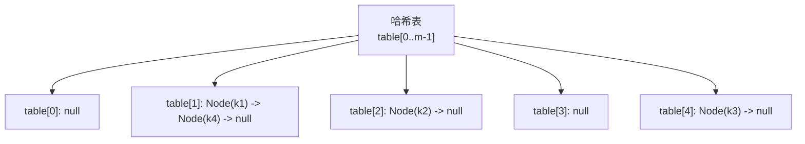
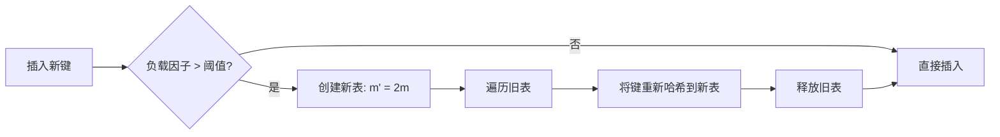

# 哈希表 (Hash Tables)

## 一、概述

哈希表是实现字典 (Dictionary) 和集合 (Set) 抽象数据类型的基础结构，通过哈希函数将键 (Key) 映射到数组索引，实现近似 $O(1)$ 的查找、插入和删除。

### 1.1 核心思想

哈希表的目标是解决直接地址表 (Direct-address Table) 的空间浪费问题。对于键空间 $U$ 和表大小 $m \ll |U|$，哈希函数 $h: U \to \{0, 1, ..., m-1\}$ 将键映射到桶 (Bucket)。
$$h: Key \to Index$$

理想哈希函数应满足：计算简单、分布均匀、冲突最少。

### 1.2 基本操作

| 操作 | 平均 | 最差 |
|------|------|------|
| 查找 | $O(1)$ | $O(n)$ |
| 插入 | $O(1)$ | $O(n)$ |
| 删除 | $O(1)$ | $O(n)$ |

## 二、哈希函数 (Hash Function)

### 2.1 常用哈希方法

#### 除法哈希 (Division Method)
$$h(k) = k \bmod m$$
选择 $m$ 为素数（不接近 $2^p$）可减少冲突。

#### 乘法哈希 (Multiplication Method)
$$h(k) = \lfloor m \cdot (k \cdot A \bmod 1) \rfloor$$
其中 $A \in (0, 1)$，通常取黄金分割比例 $A \approx (\sqrt{5} - 1) / 2 \approx 0.618$。

#### 全域哈希 (Universal Hashing)
$$h_{a,b}(k) = ((a \cdot k + b) \bmod p) \bmod m$$
随机选择 $a, b$，保证任意两个不同键冲突概率 $\leq 1/m$。

### 2.2 各种数据类型的哈希策略

| 数据类型 | 策略 | 示例 |
|----------|------|------|
| 整数 | 直接映射或取模 | $h(k) = k \bmod m$ |
| 字符串 | 多项式哈希 | $h(s) = \sum s[i] \cdot p^i \bmod m$ |
| 对象 | 组合多个域 | 各域哈希值异或或求和 |

字符串哈希的典型实现（Java `hashCode` 中的多项式哈希）：
$$hash = s[0] \cdot 31^{n-1} + s[1] \cdot 31^{n-2} + \cdots + s[n-1]$$

## 三、冲突解决 (Collision Resolution)

### 3.1 链地址法 (Chaining)

每个桶维护一个链表，插入时冲突键追加到链表末尾。查找需遍历链表。

| 指标 | 值 |
|------|-----|
| 插入复杂度 | $O(1)$（头插） |
| 查找复杂度 | $O(1 + \alpha)$ |
| 空间开销 | 额外指针存储 |

其中 $\alpha = n/m$ 为负载因子 (Load Factor)。

### 3.2 开放地址法 (Open Addressing)

所有元素存储在表内，通过探测序列寻找空闲槽。

#### 线性探测 (Linear Probing)
$$h(k, i) = (h'(k) + i) \bmod m$$

缺点：**一次群集** (Primary Clustering)——连续占用的槽形成长块。

#### 二次探测 (Quadratic Probing)
$$h(k, i) = (h'(k) + c_1 i + c_2 i^2) \bmod m$$

缓解群集问题，但存在**二次群集** (Secondary Clustering)。

#### 双重哈希 (Double Hashing)
$$h(k, i) = (h_1(k) + i \cdot h_2(k)) \bmod m$$

最佳方法，探测序列 $\Theta(m^2)$ 种，$h_2(k)$ 需与 $m$ 互质。

### 3.3 三种开放地址法对比

| 方法 | 探测序列数 | 群集问题 | 删除处理 |
|------|-----------|---------|---------|
| 线性探测 | $m$ | 一次群集 | 懒惰删除 |
| 二次探测 | $m$ | 二次群集 | 懒惰删除 |
| 双重哈希 | $\Theta(m^2)$ | 轻微 | 懒惰删除 |

## 四、负载因子与重哈希 (Load Factor & Rehashing)

### 4.1 负载因子

$$\alpha = \frac{n}{m}$$

- 链地址法：$\alpha$ 可大于 1，推荐 $\alpha \leq 1$
- 开放地址法：$\alpha < 1$，推荐 $\alpha \leq 0.5$

### 4.2 重哈希过程

重哈希的均摊成本为 $O(1)$。

## 五、哈希表的应用

### 5.1 缓存系统 (Cache)

| 组件 | 作用 |
|------|------|
| Memcached | 分布式内存哈希表 |
| Redis | 字典存储键值对 |
| CPU TLB | 地址翻译缓存 |
| 浏览器缓存 | URL 到资源的映射 |

### 5.2 集合运算 (Set Operations)

- **去重**：利用哈希集合记录已出现元素
- **交集/并集/差集**：遍历小集合查询大集合
- **两数之和**：遍历时检查 $target - nums[i]$ 是否在哈希表中

### 5.3 布隆过滤器 (Bloom Filter)

布隆过滤器是空间高效的概率性数据结构：
$$P(\text{假阳性}) \approx \left(1 - e^{-kn/m}\right)^k$$

| 元素数 $n$ | 位数组大小 $m$ | 哈希函数数 $k$ | 假阳性率 |
|-----------|---------------|---------------|---------|
| 10⁶ | 8 MB | 5 | ~0.02 |
| 10⁷ | 80 MB | 5 | ~0.02 |

### 5.4 哈希表在数据库索引中的应用

- 哈希索引：等值查询 $O(1)$，不支持范围查询
- 相比 B+ 树，哈希索引更适用于等值匹配场景
- MySQL Memory 引擎默认使用哈希索引

## 六、语言实现差异

| 语言 | 实现 | 冲突策略 | 扩容阈值 |
|------|------|---------|---------|
| Java HashMap | 数组+链表/红黑树 | 链地址法 | 0.75 |
| Python dict | 开放地址 | 伪随机探测 | 2/3 |
| C++ unordered_map | 桶+链表 | 链地址法 | 1 |
| Go map | 桶+溢出桶 | 链地址法 | 6.5 |

## 七、设计哈希表的要点

1. **哈希函数选择**：均匀分布、计算效率高
2. **冲突策略选择**：链地址法更适合频繁删除
3. **负载因子控制**：平衡空间和时间
4. **扩容策略**：容量倍增、渐进式 rehash
5. **并发安全**：分段锁、无锁哈希表
6. **内存优化**：紧凑存储、对象池

## 八、LeetCode 经典题型

| 题号 | 题目 | 思路 |
|------|------|------|
| 1 | 两数之和 | 哈希表记录已访问元素 |
| 49 | 字母异位词分组 | 排序后作为键 |
| 128 | 最长连续序列 | 哈希集合查找相邻元素 |
| 146 | LRU 缓存 | 哈希表+双向链表 |
| 347 | 前 K 个高频元素 | 哈希表统计+堆排序 |
| 380 | O(1)时间插入/删除/随机 | 哈希表+数组 |

## 九、竞赛优化技巧

1. **自定义哈希函数**：避免被恶意的哈希冲突攻击
2. **使用数组替代哈希表**：当键范围有限时，直接用数组代替
3. **原地哈希** (In-place Hashing)：利用输入数组本身记录状态
4. **计数排序思想**：用数组统计频率，适用于小范围整数
5. **滚动哈希** (Rolling Hash)：字符串匹配中的 Rabin-Karp
