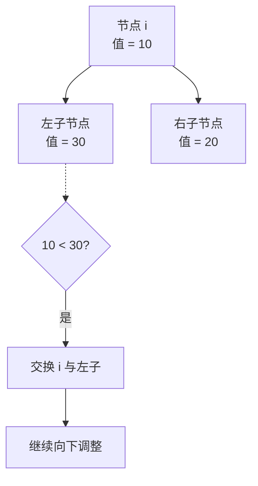
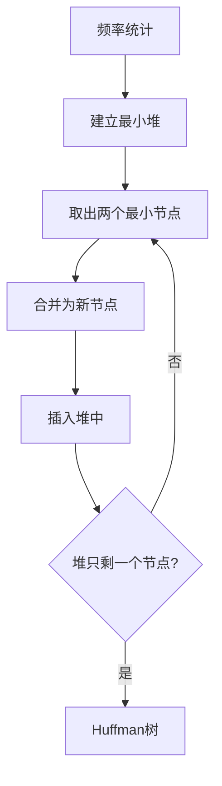

# 堆与优先队列 (Heaps and Priority Queues)

## 一、概述

优先队列 (Priority Queue) 是一种抽象数据类型 (ADT)，每个元素具有优先级，出队时总是返回优先级最高的元素。堆 (Heap) 是优先队列最常用的实现方式。

### 1.1 堆的定义

堆是一种完全二叉树 (Complete Binary Tree)，可使用数组紧凑存储：
- **最大堆** (Max-Heap)：父节点值 $\geq$ 子节点值，根为最大值
- **最小堆** (Min-Heap)：父节点值 $\leq$ 子节点值，根为最小值

### 1.2 堆的数组表示

对于数组下标 $i$（通常从 1 开始）：
$$parent(i) = \left\lfloor \frac{i}{2} \right\rfloor$$
$$left(i) = 2i$$
$$right(i) = 2i + 1$$

## 二、堆的基本操作

### 2.1 向下调整 (Heapify / Sift Down)



对以 $i$ 为根的子树调整，时间复杂度 $O(\log n)$：
$$T(n) = T(2n/3) + O(1) \implies O(\log n)$$

### 2.2 建堆 (Build Heap)

两种方法：

| 方法 | 时间复杂度 | 做法 |
|------|-----------|------|
| 自底向上 (Bottom-up) | $O(n)$ | 从最后一个非叶节点开始向下调整 |
| 自顶向下 (Top-down) | $O(n \log n)$ | 逐个插入元素 |

自底向上的数学分析：
$$\sum_{h=0}^{\lfloor \log n \rfloor} \frac{n}{2^{h+1}} \cdot O(h) = O(n)$$

### 2.3 插入 (Insert)

```python
def insert(heap, val):
    heap.append(val)
    i = len(heap) - 1
    while i > 0 and heap[parent(i)] < heap[i]:
        swap(heap, i, parent(i))
        i = parent(i)
```

时间复杂度 $O(\log n)$。

### 2.4 删除最大/最小值 (Extract)

| 步骤 | 时间复杂度 |
|------|-----------|
| 1. 保存根节点值 | $O(1)$ |
| 2. 将最后一个元素移到根 | $O(1)$ |
| 3. 向下调整 | $O(\log n)$ |
| **总计** | $O(\log n)$ |

### 2.5 操作复杂度汇总

| 操作 | 时间复杂度 | 说明 |
|------|-----------|------|
| 建堆 (Build) | $O(n)$ | 自底向上 Floyd 算法 |
| 插入 (Insert) | $O(\log n)$ | 上浮操作 |
| 提取最值 (Extract) | $O(\log n)$ | 下沉操作 |
| 查看最值 (Peek) | $O(1)$ | 返回根 |
| 修改优先级 (Decrease Key) | $O(\log n)$ | 上浮/下沉 |
| 合并 (Merge) | $O(n)$ | 朴素方法 |

## 三、堆排序 (Heap Sort)

### 3.1 算法流程


### 3.2 时间复杂度

| 阶段 | 复杂度 |
|------|--------|
| 建堆 | $O(n)$ |
| n-1 次提取 | $O(n \log n)$ |
| 总计 | $O(n \log n)$ |

- 空间复杂度：$O(1)$（原地排序）
- 不稳定排序 (Unstable)

## 四、优先队列的应用

### 4.1 Dijkstra 最短路径算法

Dijkstra 算法使用优先队列选择当前距离最小的节点：
$$dist[v] = \min(dist[v], dist[u] + w(u, v))$$

使用二叉堆实现的复杂度：
$$O((V + E) \log V)$$

### 4.2 Huffman 编码



### 4.3 Top K 问题

| 场景 | 方法 | 复杂度 |
|------|------|--------|
| 求Top K最大 | 最小堆保留K个 | $O(n \log K)$ |
| 求Top K最小 | 最大堆保留K个 | $O(n \log K)$ |
| 求中位数 | 最大堆+最小堆 | $O(\log n)$ |

### 4.4 多路归并 (Merge K Sorted Lists)

将 K 个有序列表的头节点放入最小堆，每次弹出一个，将下一个元素入堆。

## 五、堆的变种

### 5.1 二项堆 (Binomial Heap)

| 特性 | 二项堆 | 二叉堆 |
|------|--------|--------|
| 合并 | $O(\log n)$ | $O(n)$ |
| 插入 | $O(\log n)$ | $O(\log n)$ |
| 提取最小 | $O(\log n)$ | $O(\log n)$ |

二项堆由一组二项树组成，每个 $2^k$ 大小的树最多一棵。

### 5.2 斐波那契堆 (Fibonacci Heap)

| 操作 | 均摊复杂度 |
|------|-----------|
| 插入 | $O(1)$ |
| 合并 | $O(1)$ |
| 提取最小 | $O(\log n)$ |
| Decrease Key | $O(1)$ |

理论上更适合 Dijkstra 等需要大量 Decrease Key 操作的算法。

### 5.3 左式堆 (Leftist Heap) 与斜堆 (Skew Heap)

左式堆是支持 $O(\log n)$ 合并的堆结构，维护 null path length (NPL) 属性：
$$npl(x) = 1 + \min(npl(left(x)), npl(right(x)))$$

### 5.4 堆类型对比

| 类型 | 建堆 | 插入 | 提取 | 合并 | 特点 |
|------|------|------|------|------|------|
| 二叉堆 | $O(n)$ | $O(\log n)$ | $O(\log n)$ | $O(n)$ | 简单紧凑 |
| 二项堆 | $O(n)$ | $O(\log n)$ | $O(\log n)$ | $O(\log n)$ | 高效合并 |
| 斐波那契堆 | $O(n)$ | $O(1)$ | $O(\log n)$ | $O(1)$ | 理论最优 |
| 左式堆 | $O(n)$ | $O(\log n)$ | $O(\log n)$ | $O(\log n)$ | 左倾性质 |
| 配对堆 | $O(n)$ | $O(1)$ | $O(\log n)$ | $O(1)$ | 实用高效 |

## 六、LeetCode 经典题型

| 题号 | 题目 | 思路 |
|------|------|------|
| 23 | 合并K个升序链表 | 最小堆存储每个链表头 |
| 215 | 数组中的第K个最大元素 | 大小为K的最小堆 |
| 295 | 数据流的中位数 | 最大堆+最小堆 |
| 347 | 前K个高频元素 | 哈希表+最小堆 |
| 378 | 有序矩阵中第K小的元素 | 最小堆多路归并 |
| 451 | 根据字符出现频率排序 | 哈希表+最大堆 |
| 703 | 数据流中的第K大元素 | 大小为K的最小堆 |

## 七、实现细节与优化

1. **使用0索引还是1索引**：0索引时 $left = 2i+1$, $right = 2i+2$
2. **内联函数**：将比较器作为模板参数减少虚函数开销
3. **内存布局**：使用连续数组提高缓存命中率
4. **延迟删除** (Lazy Deletion)：标记删除而非立即移除
5. **索引堆** (Index Heap)：支持快速更新任意位置元素
6. **对顶堆**：一大一小两个堆配合，解决中位数、第K大等问题
