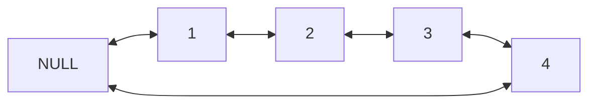
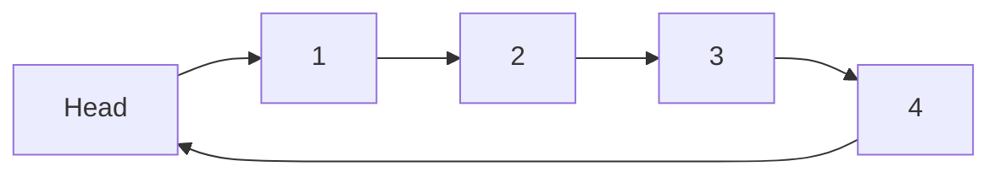
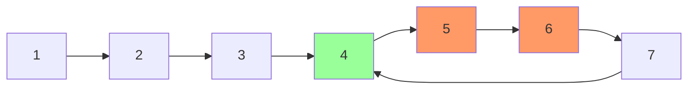
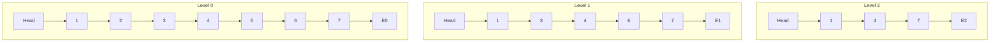
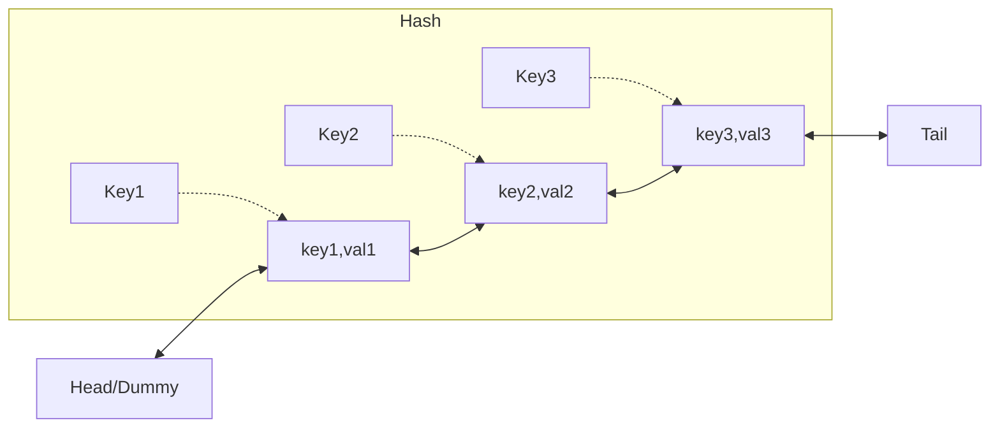
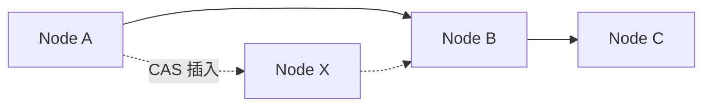

# 链表 (Linked Lists)

## 一、概述

链表是一种线性数据结构，元素不存储在连续的物理内存中，每个节点 (Node) 包含数据 (Data) 和指向下一个节点的指针 (Pointer)。

链表的核心优势在于插入和删除操作不需要移动其他元素，代价是失去随机访问能力。

### 1.1 节点定义

```cpp
struct ListNode {
    int val;
    ListNode* next;
    ListNode(int x) : val(x), next(nullptr) {}
};
```

### 1.2 与数组对比

| 特性 | 数组 (Array) | 链表 (Linked List) |
|------|-------------|-------------------|
| 内存布局 | 连续内存 | 离散节点 |
| 随机访问 | $O(1)$ | $O(n)$ |
| 头部插入 | $O(n)$ | $O(1)$ |
| 尾部插入 | $O(1)$ 均摊 | 有尾指针 $O(1)$，无 $O(n)$ |
| 中间插入 | $O(n)$ | $O(1)$（已知位置）|
| 空间开销 | 无额外 | 每个节点额外 $O(1)$ 指针 |
| 缓存友好 | 是 | 否 |

## 二、链表类型

### 2.1 单向链表 (Singly Linked List)

每个节点只有指向下一个节点的指针，遍历只能单向进行。


遍历方式：从头节点开始，通过 `next` 指针依次访问。

```python
def traverse(head):
    cur = head
    while cur:
        print(cur.val)
        cur = cur.next
```

### 2.2 双向链表 (Doubly Linked List)

每个节点有两个指针：`prev` 指向前驱，`next` 指向后继。



优势：可从任意方向遍历，删除操作更高效（无需查找前驱）。

```cpp
struct DoublyListNode {
    int val;
    DoublyListNode *prev, *next;
    DoublyListNode(int x) : val(x), prev(nullptr), next(nullptr) {}
};
```

### 2.3 循环链表 (Circular Linked List)

尾节点指向头节点，形成环。



常用于循环队列、约瑟夫环问题、操作系统的进程调度轮转。

### 2.4 静态链表 (Static Linked List)

使用数组模拟链表，每个数组元素包含数据和下一个元素的下标（游标）。

```text
下标:  0    1    2    3    4    5
数据:  -    A    B    C    D    -
游标:  1    2    3    4    0    -1
```

适用于没有指针的早期语言（如 FORTRAN），如 LISP 语言的早期实现。

## 三、基本操作

### 3.1 插入操作

| 位置 | 单向链表 | 双向链表 |
|------|----------|----------|
| 头插 | 更新新节点.next = head, head = 新节点 | 同左 + 更新原 head.prev |
| 尾插 | 遍历到尾部或使用尾指针 | 同左 |
| 中间插 | 找到前驱节点，更新指针 | 更新四个指针 |

头插时间复杂度 $O(1)$，已知位置的中间插入也只需 $O(1)$：

```cpp
// 在节点 prev 后插入新节点
void insertAfter(ListNode* prev, ListNode* newNode) {
    newNode->next = prev->next;
    prev->next = newNode;
}
```

### 3.2 删除操作

```cpp
// 删除节点 prev 的后继节点
void deleteAfter(ListNode* prev) {
    ListNode* toDelete = prev->next;
    prev->next = toDelete->next;
    delete toDelete;
}
```

删除操作需注意内存释放（C/C++）或依赖 GC（Java/Python）。

### 3.3 反转链表

```python
def reverseList(head):
    prev = None
    curr = head
    while curr:
        next_temp = curr.next
        curr.next = prev
        prev = curr
        curr = next_temp
    return prev
```

时间复杂度 $O(n)$，空间复杂度 $O(1)$。

## 四、典型算法

### 4.1 快慢指针 (Two Pointers)

**检测环 (Floyd's Cycle Detection)**：

两个指针，快指针每次走两步，慢指针每次走一步。若有环，则两指针必相遇。

$$fast = slow + k \cdot cycle\_length$$

相遇后，将慢指针重置到头节点，快慢指针都每次走一步，再次相遇点即为环入口。



**找到中间节点**：快指针到末尾时，慢指针恰在中间。

**找到倒数第 k 个节点**：快指针先走 k 步，然后两指针同步移动。

### 4.2 归并两个有序链表

```python
def mergeTwoLists(l1, l2):
    dummy = ListNode()
    cur = dummy
    while l1 and l2:
        if l1.val < l2.val:
            cur.next = l1
            l1 = l1.next
        else:
            cur.next = l2
            l2 = l2.next
        cur = cur.next
    cur.next = l1 or l2
    return dummy.next
```

时间复杂度 $O(n+m)$，空间 $O(1)$。

### 4.3 链表排序

归并排序在链表上的实现非常自然：用快慢指针找到中点，递归排序两半，然后合并。

$$T(n) = 2T(n/2) + O(n) = O(n\log n)$$

空间复杂度 $O(\log n)$（递归栈空间）。

## 五、跳表 (Skip List)

跳表在有序链表基础上增加多层索引，实现 $O(\log n)$ 的查找。



每层概率晋升（$p=1/2$），期望层数 $\log_{1/p} n$，查找复杂度 $O(\log n)$。

Redis 的 ZSET 使用跳表实现有序集合。

## 六、LRU 缓存

LRU (Least Recently Used) 缓存使用双向链表 + 哈希表实现。



| 操作 | 实现 | 复杂度 |
|------|------|--------|
| get | 哈希表查节点，移动到头部 | $O(1)$ |
| put | 存在则更新并移动，不存在则插入头部 | $O(1)$ |
| 淘汰 | 删除尾部节点 | $O(1)$ |

## 七、应用场景

| 场景 | 使用的链表类型 | 原因 |
|------|---------------|------|
| 内存管理 | 空闲块链表 | 频繁插入删除 |
| 文件系统 FAT | 链表 | 非连续存储 |
| 哈希表链地址 | 单向链表 | 冲突处理 |
| 浏览器历史 | 双向链表 | 前进后退 |
| 音乐播放列表 | 循环链表 | 循环播放 |
| 内核任务调度 | 双向循环链表 | 轮转调度 |
| 撤销/重做 | 双向链表 | 历史记录 |
| 多项式运算 | 单向链表 | 稀疏表示 |

在多项式表示中，每个节点存储系数 $a_i$ 和指数 $i$，稀疏多项式使用链表可极大节省空间。

## 八、链表常见面试题

| 题目类型 | 核心思路 | 时间复杂度 |
|----------|----------|-----------|
| 反转链表 | 迭代三指针 / 递归 | $O(n)$ |
| 检测环 | 快慢指针 (Floyd 判圈) | $O(n)$ |
| 找环入口 | 快慢相遇后重置慢指针 | $O(n)$ |
| 相交链表 | 对齐尾部走差 / 双指针交替遍历 | $O(n+m)$ |
| 删除倒数第 k 个 | 快慢指针差 k 步 | $O(n)$ |
| 排序链表 | 归并排序 + 快慢找中点 | $O(n\log n)$ |
| 奇偶链表 | 分离奇偶索引节点后拼接 | $O(n)$ |
| 回文链表 | 快慢找中点 + 反转后半 | $O(n)$ |
| 两数相加 | 链表模拟加法（处理进位）| $O(\max(m,n))$ |
| LRU Cache | 双向链表 + 哈希表 | $O(1)$ |

## 九、链表的无锁并发实现

在高并发场景下，传统加锁方式成为瓶颈。无锁链表 (Lock-Free Linked List) 使用 CAS (Compare-And-Swap) 操作：



插入操作原子性地更新指针：

1. 创建新节点 `newNode`，将其 `next` 指向目标位置
2. 使用 CAS 将前驱节点的 `next` 从原值更新为 `newNode`

```cpp
bool CAS(Node*& ptr, Node* expected, Node* desired) {
    return atomic_compare_exchange_strong(&ptr, &expected, desired);
}
// 无锁插入
Node* cur = prev->next;
newNode->next = cur;
if (CAS(prev->next, cur, newNode)) { /* 成功 */ }
```

Michael-Scott 队列是无锁链表在 FIFO 队列上的经典应用。

## 十、链表的内存管理

| 技术 | 说明 | 优势 |
|------|------|------|
| 内存池 (Memory Pool) | 预分配节点块，减少 malloc 调用 | 避免内存碎片 |
| 标记-清除 (GC) | 自动回收不可达节点 | Java/Python/Go |
| 引用计数 | 记录引用次数 | C++ shared_ptr |
| 侵入式链表 | 节点本身包含链表指针 | Linux 内核链表 |

Linux 内核使用侵入式链表 (Intrusive Linked List) `list_head`，节点嵌入数据结构本身而非包含数据：

```c
struct list_head {
    struct list_head *next, *prev;
};
#define list_entry(ptr, type, member) container_of(ptr, type, member)
```

## 相关条目
- [[ArraysAndStrings]]
- [[HashTables]]
- [[SortingAlgorithms]]
- [[SearchAlgorithms]]
- [[INDEX|当前目录索引]]
